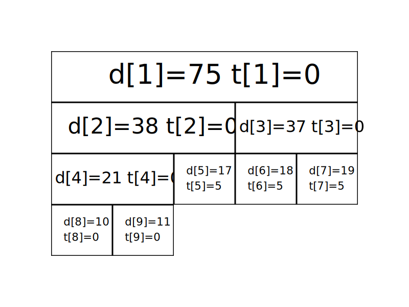

author: Marcythm, Ir1d, Ycrpro, Xeonacid, konnyakuxzy, CJSoft, HeRaNO, ethan-enhe, ChungZH, Chrogeek, hsfzLZH1, billchenchina, orzAtalod, luoguojie, Early0v0, wy-luke

## 引入

线段树是算法竞赛中常用的用来维护 **区间信息** 的数据结构。

线段树可以在 $O(\log N)$ 的时间复杂度内实现单点修改、区间修改、区间查询（区间求和，求区间最大值，求区间最小值）等操作。

## 线段树的基本结构与建树

### 过程

线段树将每个长度不为 $1$ 的区间划分成左右两个区间递归求解，把整个线段划分为一个树形结构，通过合并左右两区间信息来求得该区间的信息。这种数据结构可以方便的进行大部分的区间操作。

有个大小为 $5$ 的数组 $a=\{10,11,12,13,14\}$，要将其转化为线段树，有以下做法：设线段树的根节点编号为 $1$，用数组 $d$ 来保存我们的线段树，$d_i$ 用来保存线段树上编号为 $i$ 的节点的值（这里每个节点所维护的值就是这个节点所表示的区间总和）。

我们先给出这棵线段树的形态，如图所示：


图中每个节点中用红色字体标明的区间，表示该节点管辖的 $a$ 数组上的位置区间。如 $d_1$ 所管辖的区间就是 $[1,5]$（$a_1,a_2, \cdots ,a_5$），即 $d_1$ 所保存的值是 $a_1+a_2+ \cdots +a_5$，$d_1=60$ 表示的是 $a_1+a_2+ \cdots +a_5=60$。

通过观察不难发现，$d_i$ 的左儿子节点就是 $d_{2\times i}$，$d_i$ 的右儿子节点就是 $d_{2\times i+1}$。如果 $d_i$ 表示的是区间 $[s,t]$（即 $d_i=a_s+a_{s+1}+ \cdots +a_t$）的话，那么 $d_i$ 的左儿子节点表示的是区间 $[ s, \frac{s+t}{2} ]$，$d_i$ 的右儿子表示的是区间 $[ \frac{s+t}{2} +1,t ]$。

在实现时，我们考虑递归建树。设当前的根节点为 $p$，如果根节点管辖的区间长度已经是 $1$，则可以直接根据 $a$ 数组上相应位置的值初始化该节点。否则我们将该区间从中点处分割为两个子区间，分别进入左右子节点递归建树，最后合并两个子节点的信息。

### 实现

此处给出代码实现，可参考注释理解：

=== "C++"
    ```cpp
    void build(int s, int t, int p) {
      // 对 [s,t] 区间建立线段树,当前根的编号为 p
      if (s == t) {
        d[p] = a[s];
        return;
      }
      int m = s + ((t - s) >> 1);
      // 移位运算符的优先级小于加减法，所以加上括号
      // 如果写成 (s + t) >> 1 可能会超出 int 范围
      build(s, m, p * 2), build(m + 1, t, p * 2 + 1);
      // 递归对左右区间建树
      d[p] = d[p * 2] + d[(p * 2) + 1];
    }
    ```

=== "Python"
    ```python
    def build(s, t, p):
        # 对 [s,t] 区间建立线段树,当前根的编号为 p
        if s == t:
            d[p] = a[s]
            return
        m = s + ((t - s) >> 1)
        # 移位运算符的优先级小于加减法，所以加上括号
        # 如果写成 (s + t) >> 1 可能会超出 int 范围
        build(s, m, p * 2)
        build(m + 1, t, p * 2 + 1)
        # 递归对左右区间建树
        d[p] = d[p * 2] + d[(p * 2) + 1]
    ```

关于线段树的空间：如果采用堆式存储（$2p$ 是 $p$ 的左儿子，$2p+1$ 是 $p$ 的右儿子），若有 $n$ 个叶子结点，则 d 数组的范围最大为 $2^{\left\lceil\log{n}\right\rceil+1}$。

分析：容易知道线段树的深度是 $\left\lceil\log{n}\right\rceil$ 的，则在堆式储存情况下叶子节点（包括无用的叶子节点）数量为 $2^{\left\lceil\log{n}\right\rceil}$ 个，又由于其为一棵完全二叉树，则其总节点个数 $2^{\left\lceil\log{n}\right\rceil+1}-1$。当然如果你懒得计算的话可以直接把数组长度设为 $4n$，因为 $\frac{2^{\left\lceil\log{n}\right\rceil+1}-1}{n}$ 的最大值在 $n=2^{x}+1(x\in N_{+})$ 时取到，此时节点数为 $2^{\left\lceil\log{n}\right\rceil+1}-1=2^{x+2}-1=4n-5$。

而堆式存储存在无用的叶子节点，可以考虑使用内存池管理线段树节点，每当需要新建节点时从池中获取。自底向上考虑，必有每两个底层节点合并为一个上层节点，因此可以类似哈夫曼树地证明，如果有 $n$ 个叶子节点，这样的线段树总共有 $2n-1$ 个节点。其空间效率优于堆式存储，并且是可能的最优情况。

这样的线段树可以自底向上维护，参考「[统计的力量 - 张昆玮](https://github.com/hzwer/shareOI/blob/master/%E6%95%B0%E6%8D%AE%E7%BB%93%E6%9E%84/%E7%BB%9F%E8%AE%A1%E7%9A%84%E5%8A%9B%E9%87%8F%E2%80%94%E2%80%94%E7%BA%BF%E6%AE%B5%E6%A0%91%E5%85%A8%E6%8E%A5%E8%A7%A6_%E5%BC%A0%E6%98%86%E7%8E%AE.pptx)」。

## 线段树的区间查询

### 过程

区间查询，比如求区间 $[l,r]$ 的总和（即 $a_l+a_{l+1}+ \cdots +a_r$）、求区间最大值/最小值等操作。


仍然以最开始的图为例，如果要查询区间 $[1,5]$ 的和，那直接获取 $d_1$ 的值（$60$）即可。

如果要查询的区间为 $[3,5]$，此时就不能直接获取区间的值，但是 $[3,5]$ 可以拆成 $[3,3]$ 和 $[4,5]$，可以通过合并这两个区间的答案来求得这个区间的答案。

一般地，如果要查询的区间是 $[l,r]$，则可以将其拆成最多为 $O(\log n)$ 个 **极大** 的区间，合并这些区间即可求出 $[l,r]$ 的答案。

### 实现

此处给出代码实现，可参考注释理解：

=== "C++"
    ```cpp
    int getsum(int l, int r, int s, int t, int p) {
      // [l, r] 为查询区间, [s, t] 为当前节点包含的区间, p 为当前节点的编号
      if (l <= s && t <= r)
        return d[p];  // 当前区间为询问区间的子集时直接返回当前区间的和
      int m = s + ((t - s) >> 1), sum = 0;
      if (l <= m) sum += getsum(l, r, s, m, p * 2);
      // 如果左儿子代表的区间 [s, m] 与询问区间有交集, 则递归查询左儿子
      if (r > m) sum += getsum(l, r, m + 1, t, p * 2 + 1);
      // 如果右儿子代表的区间 [m + 1, t] 与询问区间有交集, 则递归查询右儿子
      return sum;
    }
    ```

=== "Python"
    ```python
    def getsum(l, r, s, t, p):
        # [l, r] 为查询区间, [s, t] 为当前节点包含的区间, p 为当前节点的编号
        if l <= s and t <= r:
            return d[p]  # 当前区间为询问区间的子集时直接返回当前区间的和
        m = s + ((t - s) >> 1)
        sum = 0
        if l <= m:
            sum = sum + getsum(l, r, s, m, p * 2)
        # 如果左儿子代表的区间 [s, m] 与询问区间有交集, 则递归查询左儿子
        if r > m:
            sum = sum + getsum(l, r, m + 1, t, p * 2 + 1)
        # 如果右儿子代表的区间 [m + 1, t] 与询问区间有交集, 则递归查询右儿子
        return sum
    ```

## 线段树的区间修改与懒惰标记

### 过程

如果要求修改区间 $[l,r]$，把所有包含在区间 $[l,r]$ 中的节点都遍历一次、修改一次，时间复杂度无法承受。我们这里要引入一个叫做 **「懒惰标记」** 的东西。

懒惰标记，简单来说，就是通过延迟对节点信息的更改，从而减少可能不必要的操作次数。每次执行修改时，我们通过打标记的方法表明该节点对应的区间在某一次操作中被更改，但不更新该节点的子节点的信息。实质性的修改则在下一次访问带有标记的节点时才进行。

仍然以最开始的图为例，我们将执行若干次给区间内的数加上一个值的操作。我们现在给每个节点增加一个 $t_i$，表示该节点带的标记值。

最开始时的情况是这样的（为了节省空间，这里不再展示每个节点管辖的区间）：


现在我们准备给 $[3,5]$ 上的每个数都加上 $5$。根据前面区间查询的经验，我们很快找到了两个极大区间 $[3,3]$ 和 $[4,5]$（分别对应线段树上的 $5$ 号点和 $3$ 号点）。

我们直接在这两个节点上进行修改，并给它们打上标记：


我们发现，$3$ 号节点的信息虽然被修改了（因为该区间管辖两个数，所以 $d_3$ 加上的数是 $5 \times 2=10$），但它的两个子节点却还没更新，仍然保留着修改之前的信息。不过不用担心，虽然修改目前还没进行，但当我们要查询这两个子节点的信息时，我们会利用标记修改这两个子节点的信息，使查询的结果依旧准确。

接下来我们查询一下 $[4,4]$ 区间上各数字的和。

我们通过递归找到 $[4,5]$ 区间，发现该区间并非我们的目标区间，且该区间上还存在标记。这时候就到标记下放的时间了。我们将该区间的两个子区间的信息更新，并清除该区间上的标记。



现在 $6$、$7$ 两个节点的值变成了最新的值，查询的结果也是准确的。

### 实现

接下来给出在存在标记的情况下，区间修改和查询操作的参考实现。

区间修改（区间加上某个值）：

=== "C++"
    ```cpp
    // [l, r] 为修改区间, c 为被修改的元素的变化量, [s, t] 为当前节点包含的区间, p
    // 为当前节点的编号
    void update(int l, int r, int c, int s, int t, int p) {
      // 当前区间为修改区间的子集时直接修改当前节点的值,然后打标记,结束修改
      if (l <= s && t <= r) {
        d[p] += (t - s + 1) * c, b[p] += c;
        return;
      }
      int m = s + ((t - s) >> 1);
      if (b[p] && s != t) {
        // 如果当前节点的懒标记非空,则更新当前节点两个子节点的值和懒标记值
        d[p * 2] += b[p] * (m - s + 1), d[p * 2 + 1] += b[p] * (t - m);
        b[p * 2] += b[p], b[p * 2 + 1] += b[p];  // 将标记下传给子节点
        b[p] = 0;                                // 清空当前节点的标记
      }
      if (l <= m) update(l, r, c, s, m, p * 2);
      if (r > m) update(l, r, c, m + 1, t, p * 2 + 1);
      d[p] = d[p * 2] + d[p * 2 + 1];
    }
    ```

=== "Python"
    ```python
    def update(l, r, c, s, t, p):
        # [l, r] 为修改区间, c 为被修改的元素的变化量, [s, t] 为当前节点包含的区间, p
        # 为当前节点的编号
        if l <= s and t <= r:
            d[p] = d[p] + (t - s + 1) * c
            b[p] = b[p] + c
            return
        # 当前区间为修改区间的子集时直接修改当前节点的值, 然后打标记, 结束修改
        m = s + ((t - s) >> 1)
        if b[p] and s != t:
            # 如果当前节点的懒标记非空, 则更新当前节点两个子节点的值和懒标记值
            d[p * 2] = d[p * 2] + b[p] * (m - s + 1)
            d[p * 2 + 1] = d[p * 2 + 1] + b[p] * (t - m)
            # 将标记下传给子节点
            b[p * 2] = b[p * 2] + b[p]
            b[p * 2 + 1] = b[p * 2 + 1] + b[p]
            # 清空当前节点的标记
            b[p] = 0
        if l <= m:
            update(l, r, c, s, m, p * 2)
        if r > m:
            update(l, r, c, m + 1, t, p * 2 + 1)
        d[p] = d[p * 2] + d[p * 2 + 1]
    ```

区间查询（区间求和）：

=== "C++"
    ```cpp
    int getsum(int l, int r, int s, int t, int p) {
      // [l, r] 为查询区间, [s, t] 为当前节点包含的区间, p 为当前节点的编号
      if (l <= s && t <= r) return d[p];
      // 当前区间为询问区间的子集时直接返回当前区间的和
      int m = s + ((t - s) >> 1);
      if (b[p]) {
        // 如果当前节点的懒标记非空,则更新当前节点两个子节点的值和懒标记值
        d[p * 2] += b[p] * (m - s + 1), d[p * 2 + 1] += b[p] * (t - m);
        b[p * 2] += b[p], b[p * 2 + 1] += b[p];  // 将标记下传给子节点
        b[p] = 0;                                // 清空当前节点的标记
      }
      int sum = 0;
      if (l <= m) sum = getsum(l, r, s, m, p * 2);
      if (r > m) sum += getsum(l, r, m + 1, t, p * 2 + 1);
      return sum;
    }
    ```

=== "Python"
    ```python
    def getsum(l, r, s, t, p):
        # [l, r] 为查询区间, [s, t] 为当前节点包含的区间, p为当前节点的编号
        if l <= s and t <= r:
            return d[p]
        # 当前区间为询问区间的子集时直接返回当前区间的和
        m = s + ((t - s) >> 1)
        if b[p]:
            # 如果当前节点的懒标记非空, 则更新当前节点两个子节点的值和懒标记值
            d[p * 2] = d[p * 2] + b[p] * (m - s + 1)
            d[p * 2 + 1] = d[p * 2 + 1] + b[p] * (t - m)
            # 将标记下传给子节点
            b[p * 2] = b[p * 2] + b[p]
            b[p * 2 + 1] = b[p * 2 + 1] + b[p]
            # 清空当前节点的标记
            b[p] = 0
        sum = 0
        if l <= m:
            sum = getsum(l, r, s, m, p * 2)
        if r > m:
            sum = sum + getsum(l, r, m + 1, t, p * 2 + 1)
        return sum
    ```

如果你是要实现区间修改为某一个值而不是加上某一个值的话，代码如下：

=== "C++"
    ```cpp
    void update(int l, int r, int c, int s, int t, int p) {
      if (l <= s && t <= r) {
        d[p] = (t - s + 1) * c, b[p] = c, v[p] = 1;
        return;
      }
      int m = s + ((t - s) >> 1);
      // 额外数组储存是否修改值
      if (v[p]) {
        d[p * 2] = b[p] * (m - s + 1), d[p * 2 + 1] = b[p] * (t - m);
        b[p * 2] = b[p * 2 + 1] = b[p];
        v[p * 2] = v[p * 2 + 1] = 1;
        v[p] = 0;
      }
      if (l <= m) update(l, r, c, s, m, p * 2);
      if (r > m) update(l, r, c, m + 1, t, p * 2 + 1);
      d[p] = d[p * 2] + d[p * 2 + 1];
    }
    
    int getsum(int l, int r, int s, int t, int p) {
      if (l <= s && t <= r) return d[p];
      int m = s + ((t - s) >> 1);
      if (v[p]) {
        d[p * 2] = b[p] * (m - s + 1), d[p * 2 + 1] = b[p] * (t - m);
        b[p * 2] = b[p * 2 + 1] = b[p];
        v[p * 2] = v[p * 2 + 1] = 1;
        v[p] = 0;
      }
      int sum = 0;
      if (l <= m) sum = getsum(l, r, s, m, p * 2);
      if (r > m) sum += getsum(l, r, m + 1, t, p * 2 + 1);
      return sum;
    }
    ```

=== "Python"
    ```python
    def update(l, r, c, s, t, p):
        if l <= s and t <= r:
            d[p] = (t - s + 1) * c
            b[p] = c
            v[p] = 1
            return
        m = s + ((t - s) >> 1)
        if v[p]:
            d[p * 2] = b[p] * (m - s + 1)
            d[p * 2 + 1] = b[p] * (t - m)
            b[p * 2] = b[p * 2 + 1] = b[p]
            v[p * 2] = v[p * 2 + 1] = 1
            v[p] = 0
        if l <= m:
            update(l, r, c, s, m, p * 2)
        if r > m:
            update(l, r, c, m + 1, t, p * 2 + 1)
        d[p] = d[p * 2] + d[p * 2 + 1]
    
    
    def getsum(l, r, s, t, p):
        if l <= s and t <= r:
            return d[p]
        m = s + ((t - s) >> 1)
        if v[p]:
            d[p * 2] = b[p] * (m - s + 1)
            d[p * 2 + 1] = b[p] * (t - m)
            b[p * 2] = b[p * 2 + 1] = b[p]
            v[p * 2] = v[p * 2 + 1] = 1
            v[p] = 0
        sum = 0
        if l <= m:
            sum = getsum(l, r, s, m, p * 2)
        if r > m:
            sum = sum + getsum(l, r, m + 1, t, p * 2 + 1)
        return sum
    ```

## 动态开点线段树

前面讲到堆式储存的情况下，需要给线段树开 $4n$ 大小的数组。为了节省空间，我们可以不一次性建好树，而是在最初只建立一个根结点代表整个区间。当我们需要访问某个子区间时，才建立代表这个区间的子结点。这样我们不再使用 $2p$ 和 $2p+1$ 代表 $p$ 结点的儿子，而是用 $\text{ls}$ 和 $\text{rs}$ 记录儿子的编号。总之，动态开点线段树的核心思想就是：**结点只有在有需要的时候才被创建**。

单次操作的时间复杂度是不变的，为 $O(\log n)$。由于每次操作都有可能创建并访问全新的一系列结点，因此 $m$ 次单点操作后结点的数量规模是 $O(m\log n)$。最多也只需要 $2n-1$ 个结点，没有浪费。

单点修改：

```cpp
// root 表示整棵线段树的根结点；cnt 表示当前结点个数
int n, cnt, root;
int sum[n * 2], ls[n * 2], rs[n * 2];

// 用法：update(root, 1, n, x, f); 其中 x 为待修改节点的编号
void update(int& p, int s, int t, int x, int f) {  // 引用传参
  if (!p) p = ++cnt;  // 当结点为空时，创建一个新的结点
  if (s == t) {
    sum[p] += f;
    return;
  }
  int m = s + ((t - s) >> 1);
  if (x <= m)
    update(ls[p], s, m, x, f);
  else
    update(rs[p], m + 1, t, x, f);
  sum[p] = sum[ls[p]] + sum[rs[p]];  // pushup
}
```

区间询问：

```cpp
// 用法：query(root, 1, n, l, r);
int query(int p, int s, int t, int l, int r) {
  if (!p) return 0;  // 如果结点为空，返回 0
  if (s >= l && t <= r) return sum[p];
  int m = s + ((t - s) >> 1), ans = 0;
  if (l <= m) ans += query(ls[p], s, m, l, r);
  if (r > m) ans += query(rs[p], m + 1, t, l, r);
  return ans;
}
```

区间修改也是一样的，不过下放标记时要注意如果缺少孩子，就直接创建一个新的孩子。或者使用标记永久化技巧。

## 一些优化

这里总结几个线段树的优化：

-   在叶子节点处无需下放懒惰标记，所以懒惰标记可以不下传到叶子节点。

-   下放懒惰标记可以写一个专门的函数 `pushdown`，从儿子节点更新当前节点也可以写一个专门的函数 `maintain`（或者对称地用 `pushup`），降低代码编写难度。

-   标记永久化：如果确定懒惰标记不会在中途被加到溢出（即超过了该类型数据所能表示的最大范围），那么就可以将标记永久化。标记永久化可以避免下传懒惰标记，只需在进行询问时把标记的影响加到答案当中，从而降低程序常数。具体如何处理与题目特性相关，需结合题目来写。这也是树套树和可持久化数据结构中会用到的一种技巧。

## C++ 模板

??? "SegTreeLazyRangeAdd 可以区间加/求和的线段树模板"
    ```cpp
    --8<-- "docs/ds/code/seg/seg_4.hpp"
    ```

??? "SegTreeLazyRangeSet 可以区间修改/求和的线段树模板"
    ```cpp
    --8<-- "docs/ds/code/seg/seg_5.hpp"
    ```

## 例题

???+ note "[luogu P3372【模板】线段树 1](https://www.luogu.com.cn/problem/P3372)"
    已知一个数列，你需要进行下面两种操作：
    
    -   将某区间每一个数加上 $k$。
    -   求出某区间每一个数的和。
    
    ??? "参考代码"
        ```cpp
        --8<-- "docs/ds/code/seg/seg_1.cpp"
        ```

???+ note "[luogu P3373【模板】线段树 2](https://www.luogu.com.cn/problem/P3373)"
    已知一个数列，你需要进行下面三种操作：
    
    -   将某区间每一个数乘上 $x$。
    -   将某区间每一个数加上 $x$。
    -   求出某区间每一个数的和。
    
    ??? "参考代码"
        ```cpp
        --8<-- "docs/ds/code/seg/seg_2.cpp"
        ```

???+ note "[HihoCoder 1078 线段树的区间修改](https://vjudge.net/problem/HihoCoder-1078)"
    假设货架上从左到右摆放了 $N$ 种商品，并且依次标号为 $1$ 到 $N$，其中标号为 $i$ 的商品的价格为 $Pi$。小 Hi 的每次操作分为两种可能，第一种是修改价格：小 Hi 给出一段区间 $[L, R]$ 和一个新的价格 $\textit{NewP}$，所有标号在这段区间中的商品的价格都变成 $\textit{NewP}$。第二种操作是询问：小 Hi 给出一段区间 $[L, R]$，而小 Ho 要做的便是计算出所有标号在这段区间中的商品的总价格，然后告诉小 Hi。
    
    ??? "参考代码"
        ```cpp
        --8<-- "docs/ds/code/seg/seg_3.cpp"
        ```

???+ note "[2018 Multi-University Training Contest 5 Problem G. Glad You Came](https://acm.hdu.edu.cn/showproblem.php?pid=6356)"
    ??? "解题思路"
        维护一下每个区间的永久标记就可以了，最后在线段树上跑一边 DFS 统计结果即可。注意打标记的时候加个剪枝优化，否则会 TLE。

## 拓展

线段树应用十分广泛，常见的拓展和变体如下：

-   [可持久化线段树](./persistent-seg.md)
-   各类树套树：
    -   [线段树套线段树](./seg-in-seg.md)
    -   [树状数组套线段树](./seg-in-bit.md)
    -   [线段树套平衡树](./balanced-in-seg.md)
    -   [平衡树套树状数组](./seg-in-balanced.md)
-   [李超线段树](./li-chao-tree.md)
-   [猫树](./cat-tree.md)
-   [吉司机线段树](./seg-beats.md)

详细内容请参阅相关页面。

## 应用：线段树优化建图

在建图连边的过程中，我们有时会碰到这种题目，一个点向一段连续的区间中的点连边或者一个连续的区间向一个点连边，如果我们真的一条一条连过去，那一旦点的数量多了复杂度就爆炸了，这里就需要用线段树的区间性质来优化我们的建图了。

下面是一个线段树。


每个节点都代表了一个区间，假设我们要向区间 $[2, 4]$ 连边。


在一些题目中，还会出现一个区间连向一个点的情况，则我们将上面第一张图的有向边全部反过来即可，上面的树叫做入树，下面这个叫做出树。


???+ note "[Legacy](https://codeforces.com/problemset/problem/786/B)"
    题目大意：有 $n$ 个点、$q$ 次操作。每一种操作为以下三种类型中的一种：
    
    -   操作一：连一条 $u \rightarrow v$ 的有向边，权值为 $w$。
    -   操作二：对于所有 $i \in [l,r]$ 连一条 $u \rightarrow i$ 的有向边，权值为 $w$。
    -   操作三：对于所有 $i \in [l,r]$ 连一条 $i \rightarrow u$ 的有向边，权值为 $w$。
    
    求从点 $s$ 到其他点的最短路。
    
    $1 \le n,q \le 10^5, 1 \le w \le 10^9$。
    
    ??? "参考代码"
        ```cpp
        --8<-- "docs/ds/code/seg/seg_8.cpp"
        ```
