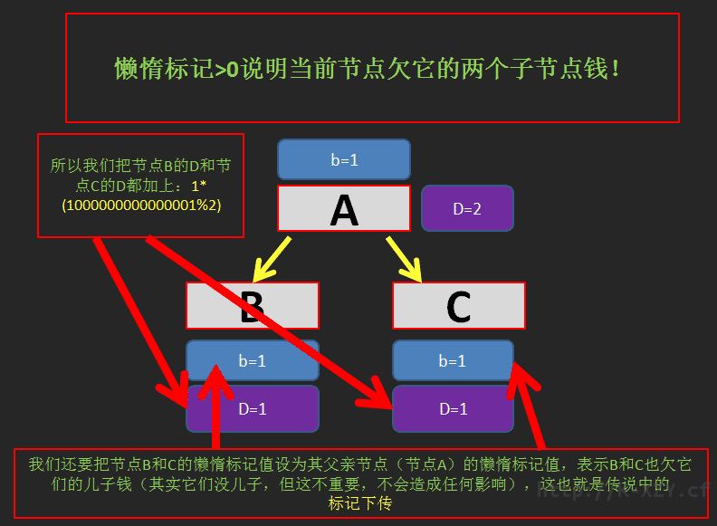
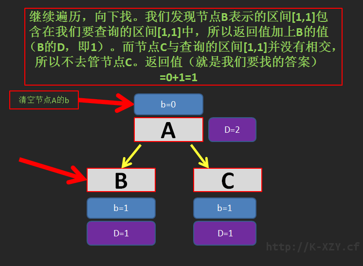

## 写在前面

线段树是个好东西啊 QwQ

OI 中最常用的数据结构之一，不学不行啊 OvO

## 线段树是什么

> 线段树是一种二叉搜索树，与区间树相似，它将一个区间划分成一些单元区间，每个单元区间对应线段树中的一个叶结点。使用线段树可以快速的查找某一个节点在若干条线段中出现的次数，时间复杂度为 $O(\log N)$ 。而未优化的空间复杂度为 $2N$ ，因此有时需要离散化让空间压缩。——From 度娘

反正就是一种可以在很短的时间内对某个区间进行操作的数据结构。

## 线段树有什么用

在 $O(\log N)$ 的时间复杂度内实现如：单点修改、区间修改、区间查询（如：区间求和，求区间最大值，求区间最小值……）还有很多……
总之线段树维护的信息，需要满足可加性，且要以可以接受的速度合并信息和修改信息，如果使用标记，标记也要满足可加性（例如取模就不满足可加性，对 $4$ 取模然后对 $3$ 取模，两个操作就不能合并在一起做（事实上某些情况下可以暴力单点取模））

## 线段树怎么实现

### 线段树的基本结构与建树

想要建立一棵线段树，不理解它的结构、原理是肯定行不通的。

下面我来举个栗子：

我们有个大小为 $5$ 的数组 $a=\{10,11,12,13,14\}$ 要进行区间求和操作，现在我们要怎么把这个数组存到线段树中（也可以说是转化成线段树）呢？我们这样子做：设线段树的根节点编号为 $1$ ，用数组 $d$ 来保存我们的线段树， $d[i]$ 用来保存编号为 $i$ 的节点的值（这里节点的值就是这个节点所表示的区间总和），如图所示：

图中 $d[1]$ 表示根节点，紫色方框是数组 $a$ ，红色方框是数组 $d$ ，红色方框中的括号中的黄色数字表示它所在的那个红色方框表示的线段树节点所表示的区间，如 $d[1]$ 所表示的区间就是 $1\sim 5\ (a[1]\sim a[5])$ ，即 $d[1]$ 所保存的值是 $a[1]+a[2]+ \cdots +a[5]$ ， $d[1]=60$ 表示的是 $a[1]+a[2]+ \cdots +a[5]=60$ 。

通过观察我们不难发现， $d[i]$ 的左儿子节点就是 $d[2\times i]$ ， $d[i]$ 的右节点就是 $d[2\times i+1]$ 。进一步观察，可以看出如果 $d[i]$ 表示的是区间 $[s,t]$ （即 $d[i]=a[s]+a[s+1]+ \cdots +a[t]$ ) 的话，那么 $d[i]$ 的左儿子节点表示的是区间 $[s, \frac{s+t}{2} ]$ ， $d[i]$ 的右儿子表示的是区间 $[ \frac{s+t}{2} +1,t]$ 。

为什么要这样表示呢？因为线段树利用了二分的思想，线段树实际上是个二叉树，这些不懂的话就无法理解线段树了，所以如果不明白二分或者二叉树的话……建议去问问度娘。

具体要怎么用代码实现呢？

我们继续观察，有没有发现如果 $d[i]$ 表示的区间大小等于 $1$ （区间大小指的是区间包含的元素的个数，即 $a$ 的个数）的话（设 $d[i]$ 表示区间 $[s,t]$ ，它的区间大小就是 $t-s+1$ ，不信你看上面的图），那么 $d[i]$ 所表示的区间 $[s,t]$ 中 $s$ 肯定等于 $t$ （不信你还是看图），且 $d[i]=a[s]$ （当然也等于 $a[t]$ ）。
为什么要讲这个东西呢？你没发现这个是个递归边界吗？

O(∩\_∩)O 哈哈~

**思路如下：**

那么就这样写代码：

```cpp
建树(s, t, i) {
  如果(s == t) { d[i] = a[s]; }
  否则 {
    建树(s, (s + t) / 2, 2 * i);
    建树((s + t) / 2 + 1, t, 2 * i + 1);
    d[i] = d[2 * i] + d[2 * i + 1];
  }
}
```

具体代码实现 (C++)：

```cpp
void build(int s, int t, int p) {
  if (s == t) {
    d[p] = a[s];
    return;
  }
  int m = (s + t) / 2;
  build(s, m, p * 2), build(m + 1, t, p * 2 + 1);
  d[p] = d[p * 2] + d[(p * 2) + 1];
}
```

上面那短短 $7$ 行代码就能建立一个线段树。

关于线段树的空间，如果采用堆式存储（上面的代码就是堆式存储，即 $2\times p$ 是 p 的左儿子， $2 \times p+1$ 是 p 的右儿子），d 数组的大小需要是 $n$ （元素个数）上取到一个 $2$ 的整数次幂（叶子数量）再乘以 $2$ （叶子上面的节点数量），上界是 $4$ 倍，可利用上面的 build 自行验证，如果采用动态开点，则需要两倍的空间（需要额外地记录左儿子和右儿子的编号/地址）。


### 线段树的区间查询

区间查询，比如求区间 $[l,r]$ 的总和（即 $a[l]+a[l+1]+ \cdots +a[r]$ ）、求区间最大值/最小值……还有很多很多……怎么做呢？


拿上面这张图举栗！


（发博客累死了无聊一下）
如果要查询区间 $[1,5]$ 的和，那直接获取 $d[1]$ 的值（ $60$ ）即可。那如果我就不查询区间 $[1,5]$ ，我就查区间 $[3,5]$ 呢？

**Σ(⊙▽⊙"a**

懵 B 了吧。但其实呢我们肯定还是有办法的！

**&lt;(~ˇ~)/**

你要查的不是 $[3,5]$ 吗？我把 $[3,5]$ 拆成 $[3,3]$ 和 $[4,5]$ 不就行了吗？

具体思路见代码：

```cpp
求和（查询区间的左端点 l, 查询区间的右端点 r, 当前节点表示的区间左端点 s,
    当前节点表示的区间 t, 当前访问的节点编号 p） {
  如果（l <= s&& t <= r）  // 当前访问的节点表示的区间包含在查询区间内
      {返回 d[p] ；} 否则 {
    令 返回值 = 0 如果（l <=
                (s + t) / 2）  // 当前访问的节点的左儿子节点表示的区间包含在查
                               // 询区间内,(s+t)/2
                               // 其实是左右儿子节点表示的区间的分割线且(s+t)/2
                               // 包含在左儿子节点表示的区间中
    {
      返回值 += 求和（l, r, s, (s + t) / 2,
          p * 2）;  // l 和 r
                    // 是可以不用变的！不管你信不信我反正是信了。当前节点的左儿子节点编号是
                    // p2，之前讲过了，左儿子节点表示的区间左端点就是当前节点表示的区间的左端点，(s+t)/2
                    // 是左儿子节点表示的区间的右短点
    }
    如果(r >
         (s + t) / 2)  // 当前访问的节点的右儿子节点表示的区间包含在查 询区间内
    {
        返回值 += 求和（l, r, (s + t) / 2 + 1, t,
        p * 2 + 1）；  //(s+t)/2+1 是当前访问节点的右儿子节点表示的区间的左端点
    } 返回 返回值；
  }
}
```

怎么样，代码很丑吧？废话，用中文写的能不丑吗？现在搞个英 (da) 文 (xin) 的 (wen)：

```cpp
int getsum(int l, int r, int s, int t, int p) {
  if (l <= s && t <= r) return d[p];
  int m = (s + t) / 2, sum = 0;
  if (l <= m) sum += getsum(l, r, s, m, p * 2);
  if (r > m) sum += getsum(l, r, m + 1, t, p * 2 + 1);
  return sum;
}
```

还是挺短的吧？这里用到的主要思路就是把一个区间拆成左右两个区间，再分别处理左右区间。也是二分的思想。

### 线段树的区间修改与懒惰标记

区间修改是个很有趣的东西 o(╯□╰)o……你想啊，如果你要修改区间 $[l,r]$ ，难道把所有包含在区间[l,r]中的节点都遍历一次、修改一次？那估计这时间复杂度估计会上天 |(\*′口\`)。这怎么办呢？我们这里要引用一个叫做**「懒惰标记」**的东西。

我们设一个数组 $b$ ， $b[i]$ 表示编号为 $i$ 的节点的懒惰标记值。啥是懒惰标记、懒惰标记值呢？(O_O)? 这里我再举个栗子（原创小故事我真有才哈哈哈 (◡ᴗ◡✿)）：

> A 有两个儿子，一个是 B，一个是 C。
>
> 有一天 A 要建一个新房子，没钱。刚好过年嘛，有人要给 B 和 C 红包，两个红包的钱数相同都是 $(1000000000000001\bmod 2)$ 圆（好多啊！……不就是 $1$ 元吗……），然而因为 A 是父亲所以红包肯定是先塞给 A 咯~
>
> 理论上来讲 A 应该把两个红包分别给 B 和 C，但是……缺钱嘛，A 就把红包偷偷收到自己口袋里了。
>
> A 高兴♂地说：「我现在有 $2$ 份红包了！我又多了 $2\times (1000000000000001\bmod 2)=2$ 圆了！哈哈哈~」
>
> 但是 A 知道，如果他不把红包给 B 和 C，那 B 和 C 肯定会不爽然后导致家庭矛盾最后崩溃，所以 A 对儿子 B 和 C 说：「我欠你们每人 $1$ 份 $(1000000000000001\bmod 2)$ 圆的红包，下次有新红包给过来的时候再给你们！这里我先做下记录……嗯……我钱你们各 $(1000000000000001\bmod 2)$ 圆……」
>
> 儿子 B、C 有点恼怒：「可是如果有同学问起我们我们收到了多少红包咋办？你把我们的红包都收了，我们还怎么装 ×？」
>
> 父亲 A 赶忙说：「有同学问起来我就会给你们的！我欠条都写好了不会不算话的！」
>
> 这样 B、C 才放了心。
>
> 注： $\bmod$ 是取余数的意思， $a\bmod b$ 就是 $a$ 除以 $b$ 的余数，所以…… $1000000000000001\bmod 2=1$ 。

在这个故事中我们不难看出，A 就是父亲节点，B 和 C 是 A 的儿子节点，而且 B 和 C 是叶子节点，分别对应一个数组中的值（就是之前讲的数组 $a$ ），我们假设节点 A 表示区间 $[1,2]$ （即 $a[1]+a[2]$ ），节点 B 表示区间 $[1,1]$ （即 $a[1]$ ），节点 C 表示区间 $[2,2]$ （即 $a[2]$ ），它们的初始值都为 $0$ （现在才刚开始呢，还没拿到红包，所以都没钱~）。

如图：


注：这里 D 表示当前节点的值（即所表示区间的区间和）。
为什么节点 A 的 D 是 $2\times (1000000000000001\bmod 2)$ 呢？原因很简单。节点 A 表示的区间是 $[1,2]$ ，一共包含 $2$ 个元素。我们是让 $[1,2]$ 这个区间的每个元素都加上 $1000000000000001\bmod 2$ ，所以节点 A 的值就加上了 $2\times (1000000000000001\bmod 2)$ 咯 =~ω~=。

如果这时候我们要查询区间 $[1,1]$ （即节点 B 的值）怎么办呢？不是说了吗？如果 B 要用到的时候，A 就把它欠的还给 B！

具体是这样操作（如图）：




注：为什么是加上 $1\times (1000000000000001\bmod 2)$ 呢？

原因和上面一样——B 和 C 表示的区间中只有 $1$ 个元素啊！



由此我们可以得到，区间 $[1,1]$ 的区间和就是 $1$ 啦！O(∩\_∩)O 哈哈~！

代码如下（下面代码不知道为什么显示出来很丑，建议复制到自己的 C++ 编辑器里看……）：

区间修改（区间加上某个值）：

```cpp
void update(
    int l, int r, int c, int s, int t,
    int p)  // l 是查询的区间左端点，r 是右端点，c 表示区间每个元素加上的值，s
            // 是当前节点所表示的区间的左端点，t 是右端点，p
            // 是当前节点的编号(根节点标号为 1)
{
  if (l <= s && t <= r) {
    d[p] += (t - s + 1) * c, b[p] += c;
    return;
  }  // 如果当前节点表示的区间完全包含在查询区间内，直接修改当前节点的值，然后做上标记，结束修改
  int m = (s + t) / 2;  // 计算左右节点表示区间的分割线
  if (b[p] &&
      s !=
          t)  // 如果当前节点不是叶子节点（叶子节点表示的区间的左右端点是相等的）且当前的懒惰标记值!=0，就更新当前节点的两个儿子节点的值和懒惰标记值
    d[p * 2] += b[p] * (m - s + 1), d[p * 2 + 1] += b[p] * (t - m),
        b[p * 2] += b[p], b[p * 2 + 1] += b[p];
  b[p] = 0;  // 清空当前节点的懒惰标记值
  if (l <= m) update(l, r, c, s, m, p * 2);
  if (r > m) update(l, r, c, m + 1, t, p * 2 + 1);
  d[p] = d[p * 2] + d[p * 2 + 1];
}
```

区间查询（求和）：

```cpp
int getsum(int l, int r, int s, int t,
           int p)  // l 是查询的区间左端点，r 是右端点，s
                   // 是当前节点所表示的区间的左端点，t 是右端点，p
                   // 是当前节点的编号（根节点标号为 1）
{
  if (l <= s && t <= r)
    return d
        [p];  // 如果当前节点表示的区间完全包含在查询区间内，返回当前节点的值
  int m = (s + t) / 2;  // 计算左右节点表示区间的分割线
  if (b[p] &&
      s !=
          t)  // 如果当前节点不是叶子节点（叶子节点表示的区间的左右端点是相等的）且当前的懒惰标记值!=0，就更新当前节点的两个儿子节点的值和懒惰标记
    d[p * 2] += b[p] * (m - s + 1), d[p * 2 + 1] += b[p] * (t - m),
        b[p * 2] += b[p], b[p * 2 + 1] += b[p];
  b[p] = 0;
  int sum = 0;  // 清空当前节点的懒惰标记值
  if (l <= m) sum = getsum(l, r, s, m, p * 2);
  if (r > m) sum += getsum(l, r, m + 1, t, p * 2 + 1);
  return sum;
}
```

你有没有发现区间查询和区间修改很像吗？(...^\_\_^...)

嘻嘻……其实平时我打线段树区间修改和查询我都是打一份，另一份复制黏贴以后再稍作修改就行了。

如果你是要实现区间修改为某一个值而不是加上某一个值的话，很简单，把上面的代码中所有的`+=`替换成`=`即可（除了`sum+=getsum(l,r,m+1,t,p*2+1)`这一句）。代码如下：

```cpp
void update(int l, int r, int c, int s, int t, int p) {
  if (l <= s && t <= r) {
    d[p] = (t - s + 1) * c, b[p] = c;
    return;
  }
  int m = (s + t) / 2;
  if (b[p] && s != t)
    d[p * 2] = b[p] * (m - s + 1), d[p * 2 + 1] = b[p] * (t - m),
          b[p * 2] = b[p * 2 + 1] = b[p];
  b[p] = 0;
  if (l <= m) update(l, r, c, s, m, p * 2);
  if (r > m) update(l, r, c, m + 1, t, p * 2 + 1);
  d[p] = d[p * 2] + d[p * 2 + 1];
}
int getsum(int l, int r, int s, int t, int p) {
  if (l <= s && t <= r) return d[p];
  int m = (s + t) / 2;
  if (b[p] && s != t)
    d[p * 2] = b[p] * (m - s + 1), d[p * 2 + 1] = b[p] * (t - m),
          b[p * 2] = b[p * 2 + 1] = b[p];
  b[p] = 0;
  int sum = 0;
  if (l <= m) sum = getsum(l, r, s, m, p * 2);
  if (r > m) sum += getsum(l, r, m + 1, t, p * 2 + 1);
  return sum;
}
```

## 一些优化

上面的代码为了简单易懂，所以呢我写的比较不优美。

这里我总结几个线段树的优化：

-    $a\times 2$ 可以用 $a<<1$ 代替， $a\div 2$ 可以用 $a>>1$ 代替（ $<<1$ 和 $\times 2$ 的速度是一样的，即使不开 O2，但 $>>1$ 速度比 $\div 2$ 快）。
-   建树时记录每个节点所对应的区间，就不需要每次计算当前节点的左右端点了，减小代码复杂度。
-   因为下标为 $a$ 的节点的左儿子下标为 $a\times 2$ ，右儿子下标为 $a\times 2+1$ ，所以可以：

```cpp
#define LS(a) (a << 1)
// a<<1 等同于 a*2
#define RS(a) (a << 1 | 1)
// a<<1|1 等同于 a*2+1
```

-   因为递归到叶子节点（左端点等于右端点的节点）的时候叶子节点一定包含在查询的区间内，所以一定会在懒惰标记下放前就处理完了 return 掉了，所以不用担心会出现叶子节点懒惰标记下放导致数组越界，也不用懒惰标记下方每次还检查当前节点是否为叶子节点了。（代码中的`s!=t`可以去掉）减小代码复杂度。
-   最好别像上文那样把所有功能都写一起，比如下放懒惰标记可以写一个专门的函数，从儿子节点更新当前节点也可以写一个专门的函数，等等。
-   标记永久化，如果确定懒惰标记不会在中途被加到超出数据范围，那么就可以将标记永久化，标记永久化可以避免下传标记，可以降低程序常数。在进行询问时要把标记的影响加到答案当中，具体如何处理与题目特性相关，需结合题目来写。标记永久化也是树套树和可持久化数据结构中会用到的一种技巧。

## 线段树基础题推荐

### LUOGU P3372【模板】线段树 1

[传送门 =~ω~=](https://www.luogu.org/problem/show?pid=3372)

代码：

```cpp
#include <iostream>
using namespace std;
typedef long long LL;
LL n, a[100005], d[270000], b[270000];
void build(LL l, LL r, LL p) {
  if (l == r) {
    d[p] = a[l];
    return;
  }
  LL m = (l + r) >> 1;
  build(l, m, p << 1), build(m + 1, r, (p << 1) | 1);
  d[p] = d[p << 1] + d[(p << 1) | 1];
}
void update(LL l, LL r, LL c, LL s, LL t, LL p) {
  if (l <= s && t <= r) {
    d[p] += (t - s + 1) * c, b[p] += c;
    return;
  }
  LL m = (s + t) >> 1;
  if (b[p] && s != t)
    d[p << 1] += b[p] * (m - s + 1), d[(p << 1) | 1] += b[p] * (t - m),
        b[p << 1] += b[p], b[(p << 1) | 1] += b[p];
  b[p] = 0;
  if (l <= m) update(l, r, c, s, m, p << 1);
  if (r > m) update(l, r, c, m + 1, t, (p << 1) | 1);
  d[p] = d[p << 1] + d[(p << 1) | 1];
}
LL getsum(LL l, LL r, LL s, LL t, LL p) {
  if (l <= s && t <= r) return d[p];
  LL m = (s + t) >> 1;
  if (b[p] && s != t)
    d[p << 1] += b[p] * (m - s + 1), d[(p << 1) | 1] += b[p] * (t - m),
        b[p << 1] += b[p], b[(p << 1) | 1] += b[p];
  b[p] = 0;
  LL sum = 0;
  if (l <= m) sum = getsum(l, r, s, m, p << 1);
  if (r > m) sum += getsum(l, r, m + 1, t, (p << 1) | 1);
  return sum;
}
int main() {
  ios::sync_with_stdio(0);
  LL q, i1, i2, i3, i4;
  cin >> n >> q;
  for (LL i = 1; i <= n; i++) cin >> a[i];
  build(1, n, 1);
  while (q--) {
    cin >> i1 >> i2 >> i3;
    if (i1 == 2)
      cout << getsum(i2, i3, 1, n, 1) << endl;
    else
      cin >> i4, update(i2, i3, i4, 1, n, 1);
  }
  return 0;
}
```

### LUOGU P3373【模板】线段树 2

[传送门 =~ω~=](https://www.luogu.org/problem/show?pid=3372)

代码：

```cpp
#include <algorithm>
#include <climits>
#include <cmath>
#include <cstdio>
#include <cstring>
#include <iomanip>
#include <iostream>
#include <vector>
using namespace std;
#define ll long long
ll read() {
  ll w = 1, q = 0;
  char ch = ' ';
  while (ch != '-' && (ch < '0' || ch > '9')) ch = getchar();
  if (ch == '-') w = -1, ch = getchar();
  while (ch >= '0' && ch <= '9') q = (ll)q * 10 + ch - '0', ch = getchar();
  return (ll)w * q;
}
int n, m;
ll mod;
ll a[100005], sum[400005], mul[400005], laz[400005];
void up(int i) { sum[i] = (sum[(i << 1)] + sum[(i << 1) | 1]) % mod; }
void pd(int i, int s, int t) {
  int l = (i << 1), r = (i << 1) | 1, mid = (s + t) >> 1;
  if (mul[i] != 1) {
    mul[l] *= mul[i];
    mul[l] %= mod;
    mul[r] *= mul[i];
    mul[r] %= mod;
    laz[l] *= mul[i];
    laz[l] %= mod;
    laz[r] *= mul[i];
    laz[r] %= mod;
    sum[l] *= mul[i];
    sum[l] %= mod;
    sum[r] *= mul[i];
    sum[r] %= mod;
    mul[i] = 1;
  }
  if (laz[i]) {
    sum[l] += laz[i] * (mid - s + 1);
    sum[l] %= mod;
    sum[r] += laz[i] * (t - mid);
    sum[r] %= mod;
    laz[l] += laz[i];
    laz[l] %= mod;
    laz[r] += laz[i];
    laz[r] %= mod;
    laz[i] = 0;
  }
  return;
}
void build(int s, int t, int i) {
  mul[i] = 1;
  if (s == t) {
    sum[i] = a[s];
    return;
  }
  int mid = (s + t) >> 1;
  build(s, mid, i << 1);
  build(mid + 1, t, (i << 1) | 1);
  up(i);
}
void chen(int l, int r, int s, int t, int i, ll z) {
  int mid = (s + t) >> 1;
  if (l <= s && t <= r) {
    mul[i] *= z;
    mul[i] %= mod;
    laz[i] *= z;
    laz[i] %= mod;
    sum[i] *= z;
    sum[i] %= mod;
    return;
  }
  pd(i, s, t);
  if (mid >= l) chen(l, r, s, mid, (i << 1), z);
  if (mid + 1 <= r) chen(l, r, mid + 1, t, (i << 1) | 1, z);
  up(i);
}
void add(int l, int r, int s, int t, int i, ll z) {
  int mid = (s + t) >> 1;
  if (l <= s && t <= r) {
    sum[i] += z * (t - s + 1);
    sum[i] %= mod;
    laz[i] += z;
    laz[i] %= mod;
    return;
  }
  pd(i, s, t);
  if (mid >= l) add(l, r, s, mid, (i << 1), z);
  if (mid + 1 <= r) add(l, r, mid + 1, t, (i << 1) | 1, z);
  up(i);
}
ll getans(int l, int r, int s, int t, int i) {
  int mid = (s + t) >> 1;
  ll tot = 0;
  if (l <= s && t <= r) {
    return sum[i];
  }
  pd(i, s, t);
  if (mid >= l) tot += getans(l, r, s, mid, (i << 1));
  tot %= mod;
  if (mid + 1 <= r) tot += getans(l, r, mid + 1, t, (i << 1) | 1);
  return tot % mod;
}
int main() {
  int i, j, x, y, bh;
  ll z;
  n = read();
  m = read();
  mod = read();
  for (i = 1; i <= n; i++) a[i] = read();
  build(1, n, 1);
  for (i = 1; i <= m; i++) {
    bh = read();
    if (bh == 1) {
      x = read();
      y = read();
      z = read();
      chen(x, y, 1, n, 1, z);
    } else if (bh == 2) {
      x = read();
      y = read();
      z = read();
      add(x, y, 1, n, 1, z);
    } else if (bh == 3) {
      x = read();
      y = read();
      printf("%lld\n", getans(x, y, 1, n, 1));
    }
  }
  return 0;
}
```

### CODEVS 线段树练习（这是一个系列）

[传送门 =~ω~=](http://codevs.cn/problem/?q=%E7%BA%BF%E6%AE%B5%E6%A0%91%E7%BB%83%E4%B9%A0)

具体题解去[我的博客](https://www.k-xzy.xyz/)里搜索吧。

不保证搜得到。

### HihoCoder 1078 线段树的区间修改

[传送门 =~ω~=](https://cn.vjudge.net/problem/HihoCoder-1078)

代码：

```cpp
#include <iostream>
using namespace std;
int n, a[100005], d[270000], b[270000];
void build(int l, int r, int p) {
  if (l == r) {
    d[p] = a[l];
    return;
  }
  int m = (l + r) >> 1;
  build(l, m, p << 1), build(m + 1, r, (p << 1) | 1);
  d[p] = d[p << 1] + d[(p << 1) | 1];
}
void update(int l, int r, int c, int s, int t, int p) {
  if (l <= s && t <= r) {
    d[p] = (t - s + 1) * c, b[p] = c;
    return;
  }
  int m = (s + t) >> 1;
  if (b[p] && s != t)
    d[p << 1] = b[p] * (m - s + 1), d[(p << 1) | 1] = b[p] * (t - m),
           b[p << 1] = b[(p << 1) | 1] = b[p];
  b[p] = 0;
  if (l <= m) update(l, r, c, s, m, p << 1);
  if (r > m) update(l, r, c, m + 1, t, (p << 1) | 1);
  d[p] = d[p << 1] + d[(p << 1) | 1];
}
int getsum(int l, int r, int s, int t, int p) {
  if (l <= s && t <= r) return d[p];
  int m = (s + t) >> 1;
  if (b[p] && s != t)
    d[p << 1] = b[p] * (m - s + 1), d[(p << 1) | 1] = b[p] * (t - m),
           b[p << 1] = b[(p << 1) | 1] = b[p];
  b[p] = 0;
  int sum = 0;
  if (l <= m) sum = getsum(l, r, s, m, p << 1);
  if (r > m) sum += getsum(l, r, m + 1, t, (p << 1) | 1);
  return sum;
}
int main() {
  ios::sync_with_stdio(0);
  cin >> n;
  for (int i = 1; i <= n; i++) cin >> a[i];
  build(1, n, 1);
  int q, i1, i2, i3, i4;
  cin >> q;
  while (q--) {
    cin >> i1 >> i2 >> i3;
    if (i1 == 0)
      cout << getsum(i2, i3, 1, n, 1) << endl;
    else
      cin >> i4, update(i2, i3, i4, 1, n, 1);
  }
  return 0;
}
```

### 2018 Multi-University Training Contest 5 Problem G. Glad You Came

[传送门](http://acm.hdu.edu.cn/showproblem.php?pid=6356)

维护一下每个区间的永久标记就可以了，最后在线段树上跑一边 dfs 统计结果即可。注意打标记的时候加个剪枝优化，否则会 T。

## 拓展 - 猫树

众所周知线段树可以支持高速查询某一段区间的信息和，比如区间最大子段和，区间和，区间矩阵的连乘积等等

但是有一个问题在于普通线段树的区间询问在某些毒瘤的眼里可能还是有些慢了

简单来说就是线段树建树的时候需要做 $O(n)$ 次合并操作，而每一次区间询问需要做 $O(logn)$ 次合并操作，询问区间和这种东西的时候还可以忍受，但是当我们需要询问区间线性基这种合并复杂度高达 $O(log^2n)$ 的信息的话，此时就算是做 $O(logn)$ 次合并有些时候在时间上也是不可接受的

而所谓 "猫树" 就是一种不支持修改，仅仅支持快速区间询问的一种静态线段树

构造一棵这样的静态线段树需要 $O(nlogn)$ 次合并操作，但是此时的查询复杂度被加速至 $O(1)$ 次合并操作

在处理线性基这样特殊的信息的时候甚至可以将复杂度降至 $O(nlog^2n)$ 

### 原理

在查询 $[l,r]$ 这段区间的信息和的时候，将线段树树上代表 $[l,l]$ 的节点和代表 $[r,r]$ 这段区间的节点在线段树上的 lca 求出来，设这个节点 p 代表的区间为 $[L,R]$ ，我们会发现一些非常有趣的性质：

**1. $[L,R]$ 这个区间一定包含 $[l,r]$ **

显然，因为它既是 l 的祖先又是 r 的祖先

**2. $[l,r]$ 这个区间一定跨越[L,R]的中点**

由于 p 是 l 和 r 的 lca，这意味着 p 的左儿子是 l 的祖先而不是 r 的祖先，p 的右儿子是 r 的祖先而不是 l 的祖先

因此 l 一定在 $[L,MID]$ 这个区间内，r 一定在 $[MID,R]$ 这个区间内

有了这两个性质，我们就可以将询问的复杂度降至 $O(1)$ 了

### 实现

具体来讲我们建树的时候对于线段树树上的一个节点，设它代表的区间为 $(l,r]$ 

不同于传统线段树在这个节点里只保留 $[l,r]$ 的和，我们在这个节点里面额外保存 $（l,mid]$ 的后缀和数组和 $(mid,r]$ 的前缀和数组

这样的话建树的复杂度为 $T(n)=2T(n/2)+O(n)=O(nlogn)$ 同理空间复杂度也从原来的 $O(n)$ 变成了 $O(nlogn)$ 

下面是最关键的询问了~

如果我们询问的区间是 $[l,r]$ 那么我们把代表 $[l,l]$ 的节点和代表 $[r,r]$ 的节点的 lca 求出来，记为 p

根据刚才的两个性质，l,r 在 p 所包含的区间之内并且一定跨越了 p 的中点

这意味这一个非常关键的事实是我们可以使用 p 里面的前缀和数组和后缀和数组，将 $[l,r]$ 拆成 $[l,mid]+(mid,r]$ 从而拼出来 $[l,r]$ 这个区间

而这个过程仅仅需要 $O(1)$ 次合并操作！

不过我们好像忽略了点什么？

似乎求 lca 的复杂度似乎还不是 $O(1)$ ，暴力求是 $O(logn)$ 的，倍增法则是 $O(loglogn)$ 的，转 st 表的代价又太大……

### 堆式建树

具体来将我们将这个序列补成 2 的整次幂，然后建线段树

此时我们发现线段树上两个节点的 lca 编号，就是两个节点二进制编号的 lcp

lcp 实在是不难求，x 和 y 的二进制下`lcp=x>>log[x^y]`

所以我们预处理一个 log 数组即可轻松完成求 lca 的工作

这样我们就完成了一个猫树

由于建树的时候涉及到求前缀和和求后缀和，所以对于线性基这种虽然合并是 $O(log^2n)$ 但是求前缀和却是 $O(nlogn)$ 的信息，使用猫树可以将静态区间线性基从 $O(nlog^2n+mlog^3n)$ 优化至 $O(nlog^2n+mlog^2n)$ 的复杂度

### 参考

[immortalCO 大爷的博客](http://immortalco.blog.uoj.ac/blog/2102)
