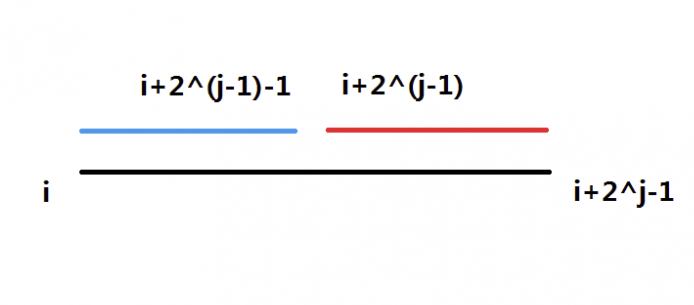

## 简介

ST 表是用于解决 **可重复贡献问题** 的数据结构。

???+note "什么是可重复贡献问题？"
    **可重复贡献问题** 是指对于运算 $\operatorname{opt}$，满足 $x\operatorname{opt} x=x$，则对应的区间询问就是一个可重复贡献问题。例如，最大值有 $\max(x,x)=x$，gcd 有 $\operatorname{gcd}(x,x)=x$，所以 RMQ 和区间 GCD 就是一个可重复贡献问题。像区间和就不具有这个性质，如果求区间和的时候采用的预处理区间重叠了，则会导致重叠部分被计算两次，这是我们所不愿意看到的。另外，$\operatorname{opt}$ 还必须满足结合律才能使用 ST 表求解。

???+note "什么是RMQ？"
    RMQ 是英文 Range Maximum/Minimum Query 的缩写，表示区间最大（最小）值。解决 RMQ 问题有很多种方法，可以参考 [RMQ 专题](../topic/rmq.md)。

## 引入

[ST 表模板题](https://www.luogu.com.cn/problem/P3865)

题目大意：给定 $n$ 个数，有 $m$ 个询问，对于每个询问，你需要回答区间 $[l,r]$ 中的最大值。

考虑暴力做法。每次都对区间 $[l,r]$ 扫描一遍，求出最大值。

显然，这个算法会超时。

## ST 表

ST 表基于 [倍增](../basic/binary-lifting.md) 思想，可以做到 $\Theta(n\log n)$ 预处理，$\Theta(1)$ 回答每个询问。但是不支持修改操作。

基于倍增思想，我们考虑如何求出区间最大值。可以发现，如果按照一般的倍增流程，每次跳 $2^i$ 步的话，询问时的复杂度仍旧是 $\Theta(\log n)$，并没有比线段树更优，反而预处理一步还比线段树慢。

我们发现 $\max(x,x)=x$，也就是说，区间最大值是一个具有“可重复贡献”性质的问题。即使用来求解的预处理区间有重叠部分，只要这些区间的并是所求的区间，最终计算出的答案就是正确的。

如果手动模拟一下，可以发现我们能使用至多两个预处理过的区间来覆盖询问区间，也就是说询问时的时间复杂度可以被降至 $\Theta(1)$，在处理有大量询问的题目时十分有效。

具体实现如下：

令 $f(i,j)$ 表示区间 $[i,i+2^j-1]$ 的最大值。

显然 $f(i,0)=a_i$。

根据定义式，第二维就相当于倍增的时候“跳了 $2^j-1$ 步”，依据倍增的思路，写出状态转移方程：$f(i,j)=\max(f(i,j-1),f(i+2^{j-1},j-1))$。



以上就是预处理部分。而对于查询，可以简单实现如下：

对于每个询问 $[l,r]$，我们把它分成两部分：$f[l,l+2^s-1]$ 与 $f[r-2^s+1,r]$。

其中 $s=\left\lfloor\log_2(r-l+1)\right\rfloor$。

根据上面对于“可重复贡献问题”的论证，由于最大值是“可重复贡献问题”，重叠并不会对区间最大值产生影响。又因为这两个区间完全覆盖了 $[l,r]$，可以保证答案的正确性。

## 模板代码

[ST 表模板题](https://www.luogu.com.cn/problem/P3865)

```cpp
#include <bits/stdc++.h>
using namespace std;
const int logn = 21;
const int maxn = 2000001;
int f[maxn][logn + 1], Logn[maxn + 1];
inline int read() {
  char c = getchar();
  int x = 0, f = 1;
  while (c < '0' || c > '9') {
    if (c == '-') f = -1;
    c = getchar();
  }
  while (c >= '0' && c <= '9') {
    x = x * 10 + c - '0';
    c = getchar();
  }
  return x * f;
}
void pre() {
  Logn[1] = 0;
  Logn[2] = 1;
  for (int i = 3; i < maxn; i++) {
    Logn[i] = Logn[i / 2] + 1;
  }
}
int main() {
  int n = read(), m = read();
  for (int i = 1; i <= n; i++) f[i][0] = read();
  pre();
  for (int j = 1; j <= logn; j++)
    for (int i = 1; i + (1 << j) - 1 <= n; i++)
      f[i][j] = max(f[i][j - 1], f[i + (1 << (j - 1))][j - 1]);
  for (int i = 1; i <= m; i++) {
    int x = read(), y = read();
    int s = Logn[y - x + 1];
    printf("%d\n", max(f[x][s], f[y - (1 << s) + 1][s]));
  }
  return 0;
}
```

## 注意点

1. 输入输出数据一般很多，建议开启输入输出优化。

2. 每次用 [std::log](https://en.cppreference.com/w/cpp/numeric/math/log) 重新计算 log 函数值并不值得，建议进行如下的预处理：

$$
\left\{\begin{aligned}
Logn[1] &=0, \\
Logn\left[i\right] &=Logn[\frac{i}{2}] + 1.
\end{aligned}\right.
$$

## ST 表维护其他信息

除 RMQ 以外，还有其它的“可重复贡献问题”。例如“区间按位和”、“区间按位或”、“区间 GCD”，ST 表都能高效地解决。

需要注意的是，对于“区间 GCD”，ST 表的查询复杂度并没有比线段树更优（令值域为 $w$，ST 表的查询复杂度为 $\Theta(\log w)$，而线段树为 $\Theta(\log n+\log w)$，且值域一般是大于 $n$ 的），但是 ST 表的预处理复杂度也没有比线段树更劣，而编程复杂度方面 ST 表比线段树简单很多。

如果分析一下，“可重复贡献问题”一般都带有某种类似 RMQ 的成分。例如“区间按位与”就是每一位取最小值，而“区间 GCD”则是每一个质因数的指数取最小值。

## 总结

ST 表能较好的维护“可重复贡献”的区间信息（同时也应满足结合律），时间复杂度较低，代码量相对其他算法很小。但是，ST 表能维护的信息非常有限，不能较好地扩展，并且不支持修改操作。

## 练习

[RMQ 模板题](https://www.luogu.com.cn/problem/P3865)

[「SCOI2007」降雨量](https://loj.ac/problem/2279)

[\[USACO07JAN\]平衡的阵容 Balanced Lineup](https://www.luogu.com.cn/problem/P2880)

## 附录：ST 表求区间 GCD 的时间复杂度分析

在算法运行的时候，可能要经过 $\Theta(\log n)$ 次迭代。每一次迭代都可能会使用 GCD 函数进行递归，令值域为 $w$，GCD 函数的时间复杂度最高是 $\Omega(\log w)$ 的，所以总时间复杂度看似有 $O(n\log n\log w)$。

但是，在 GCD 的过程中，每一次递归（除最后一次递归之外）都会使数列中的某个数至少减半，而数列中的数最多减半的次数为 $\log_2 (w^n)=\Theta(n\log w)$，所以，GCD 的递归部分最多只会运行 $O(n\log w)$ 次。再加上循环部分（以及最后一层递归）的 $\Theta(n\log n)$，最终时间复杂度则是 $O(n(\log w+\log x))$，由于可以构造数据使得时间复杂度为 $\Omega(n(\log w+\log x))$，所以最终的时间复杂度即为 $\Theta(n(\log w+\log x))$。

而查询部分的时间复杂度很好分析，考虑最劣情况，即每次询问都询问最劣的一对数，时间复杂度为 $\Theta(\log w)$。因此，ST 表维护“区间 GCD”的时间复杂度为预处理 $\Theta(n(\log n+\log w))$，单次查询 $\Theta(\log w)$。

线段树的相应操作是预处理 $\Theta(n\log x)$，查询 $\Theta(n(\log n+\log x))$。

这并不是一个严谨的数学论证，更为严谨的附在下方：

??? note "更严谨的证明"
    理解本段，可能需要具备 [时间复杂度](../basic/complexity.md) 的关于“势能分析法”的知识。
    
    先分析预处理部分的时间复杂度：
    
    设“待考虑数列”为在预处理 ST 表的时候当前层循环的数列。例如，第零层的数列就是原数列，第一层的数列就是第零层的数列经过一次迭代之后的数列，即 `st[1..n][1]`，我们将其记为 $A$。
    
    而势能函数就定义为“待考虑数列”中所有数的累乘的以二为底的对数。即：$\Phi(A)=\log_2\left(\prod\limits_{i=1}^n A_i\right)$。
    
    在一次迭代中，所花费的时间相当于迭代循环所花费的时间与 GCD 所花费的时间之和。其中，GCD 花费的时间有长有短。最短可能只有两次甚至一次递归，而最长可能有 $O(\log w)$ 次递归。但是，GCD 过程中，除最开头一层与最末一层以外，每次递归都会使“待考虑数列”中的某个结果至少减半。即，$\Phi(A)$ 会减少至少 $1$，该层递归所用的时间可以被势能函数均摊。
    
    同时，我们可以看到，$\Phi(A)$ 的初值最大为 $\log_2 (w^n)=\Theta(n\log w)$，而 $\Phi(A)$ 不增。所以，ST 表预处理部分的时间复杂度为 $O(n(\log w+\log n))$。
