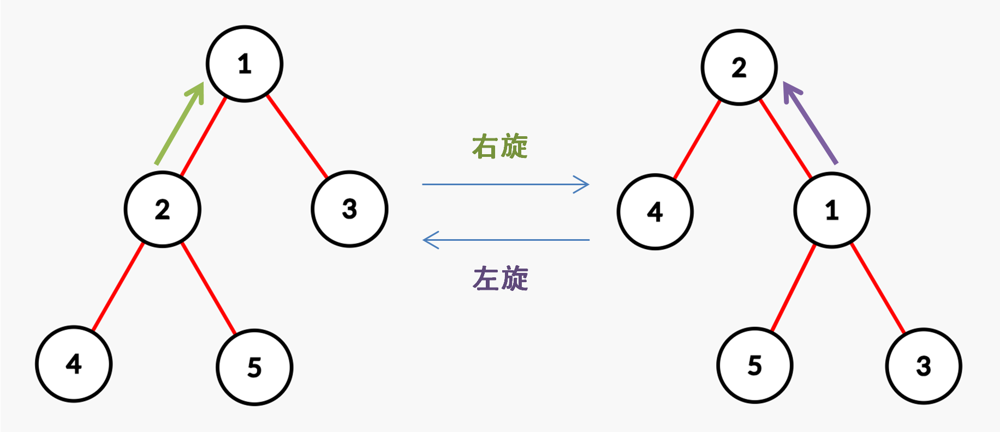

本页面将简要介绍如何用 Splay 维护二叉查找树。

## 简介

Splay 是一种二叉查找树，它通过不断将某个节点旋转到根节点，使得整棵树仍然满足二叉查找树的性质，并且保持平衡而不至于退化为链。它由 Daniel Sleator 和 Robert Tarjan 发明。

## 结构

### 二叉查找树的性质

首先肯定是一棵二叉树！

能够在这棵树上查找某个值的性质：左子树任意节点的值 $<$ 根节点的值 $<$ 右子树任意节点的值。

### 节点维护信息

|   rt  |  tot | fa[i] | ch[i][0/1] | val[i] | cnt[i] | sz[i] |
| :---: | :--: | :---: | :--------: | :----: | :----: | :---: |
| 根节点编号 | 节点个数 |   父亲  |   左右儿子编号   |  节点权值  | 权值出现次数 |  子树大小 |

## 操作

### 基本操作

- `maintain(x)`：在改变节点位置后，将节点 $x$ 的 $\text{size}$ 更新。
- `get(x)`：判断节点 $x$ 是父亲节点的左儿子还是右儿子。
- `clear(x)`：销毁节点 $x$。

```cpp
void maintain(int x) { sz[x] = sz[ch[x][0]] + sz[ch[x][1]] + cnt[x]; }
bool get(int x) { return x == ch[fa[x]][1]; }
void clear(int x) { ch[x][0] = ch[x][1] = fa[x] = val[x] = sz[x] = cnt[x] = 0; }
```

### 旋转操作

为了使 Splay 保持平衡而进行旋转操作，旋转的本质是将某个节点上移一个位置。

**旋转需要保证**：

- 整棵 Splay 的中序遍历不变（不能破坏二叉查找树的性质）。
- 受影响的节点维护的信息依然正确有效。
- `root` 必须指向旋转后的根节点。

在 Splay 中旋转分为两种：左旋和右旋。



**具体分析旋转步骤**（假设需要旋转的节点为 $x$，其父亲为 $y$，以右旋为例）

1. 将 $y$ 的左儿子指向 $x$ 的右儿子，且 $x$ 的右儿子（如果 $x$ 有右儿子的话）的父亲指向 $y$；`ch[y][0]=ch[x][1]; fa[ch[x][1]]=y;`
2. 将 $x$ 的右儿子指向 $y$，且 $y$ 的父亲指向 $x$；`ch[x][chk^1]=y; fa[y]=x;`
3. 如果原来的 $y$ 还有父亲 $z$，那么把 $z$ 的某个儿子（原来 $y$ 所在的儿子位置）指向 $x$，且 $x$ 的父亲指向 $z$。`fa[x]=z; if(z) ch[z][y==ch[z][1]]=x;`

```cpp
void rotate(int x) {
  int y = fa[x], z = fa[y], chk = get(x);
  ch[y][chk] = ch[x][chk ^ 1];
  if (ch[x][chk ^ 1]) fa[ch[x][chk ^ 1]] = y;
  ch[x][chk ^ 1] = y;
  fa[y] = x;
  fa[x] = z;
  if (z) ch[z][y == ch[z][1]] = x;
  maintain(y);
  maintain(x);
}
```

### Splay 操作

Splay 规定：每访问一个节点后都要强制将其旋转到根节点。此时旋转操作具体分为 $6$ 种情况讨论（其中 $x$ 为需要旋转到根的节点）


- 如果 $x$ 的父亲是根节点，直接将 $x$ 左旋或右旋（图 $1,2$）。
- 如果 $x$ 的父亲不是根节点，且 $x$ 和父亲的儿子类型相同，首先将其父亲左旋或右旋，然后将 $x$ 右旋或左旋（图 $3,4$）。
- 如果 $x$ 的父亲不是根节点，且 $x$ 和父亲的儿子类型不同，将 $x$ 左旋再右旋、或者右旋再左旋（图 $5,6$）。

!!! tip
    请读者尝试自行模拟 $6$ 种旋转情况，以理解 Splay 的基本思想。

```cpp
void splay(int x) {
  for (int f = fa[x]; f = fa[x], f; rotate(x))
    if (fa[f]) rotate(get(x) == get(f) ? f : x);
  rt = x;
}
```

### 插入操作

插入操作是一个比较复杂的过程，具体步骤如下（假设插入的值为 $k$）：

- 如果树空了，则直接插入根并退出。
- 如果当前节点的权值等于 $k$ 则增加当前节点的大小并更新节点和父亲的信息，将当前节点进行 Splay 操作。
- 否则按照二叉查找树的性质向下找，找到空节点就插入即可（请不要忘记 Splay 操作）。

```cpp
void ins(int k) {
  if (!rt) {
    val[++tot] = k;
    cnt[tot]++;
    rt = tot;
    maintain(rt);
    return;
  }
  int cur = rt, f = 0;
  while (1) {
    if (val[cur] == k) {
      cnt[cur]++;
      maintain(cur);
      maintain(f);
      splay(cur);
      break;
    }
    f = cur;
    cur = ch[cur][val[cur] < k];
    if (!cur) {
      val[++tot] = k;
      cnt[tot]++;
      fa[tot] = f;
      ch[f][val[f] < k] = tot;
      maintain(tot);
      maintain(f);
      splay(tot);
      break;
    }
  }
}
```

### 查询 x 的排名

根据二叉查找树的定义和性质，显然可以按照以下步骤查询 $x$ 的排名：

- 如果 $x$ 比当前节点的权值小，向其左子树查找。
- 如果 $x$ 比当前节点的权值大，将答案加上左子树（$size$）和当前节点（$cnt$）的大小，向其右子树查找。
- 如果 $x$ 与当前节点的权值相同，将答案加 $1$ 并返回。

注意最后需要进行 Splay 操作。

```cpp
int rk(int k) {
  int res = 0, cur = rt;
  while (1) {
    if (k < val[cur]) {
      cur = ch[cur][0];
    } else {
      res += sz[ch[cur][0]];
      if (k == val[cur]) {
        splay(cur);
        return res + 1;
      }
      res += cnt[cur];
      cur = ch[cur][1];
    }
  }
}
```

### 查询排名 x 的数

设 $k$ 为剩余排名，具体步骤如下：

- 如果左子树非空且剩余排名 $k$ 不大于左子树的大小 $size$，那么向左子树查找。
- 否则将 $k$ 减去左子树的和根的大小。如果此时 $k$ 的值小于等于 $0$，则返回根节点的权值，否则继续向右子树查找。

```cpp
int kth(int k) {
  int cur = rt;
  while (1) {
    if (ch[cur][0] && k <= sz[ch[cur][0]]) {
      cur = ch[cur][0];
    } else {
      k -= cnt[cur] + sz[ch[cur][0]];
      if (k <= 0) {
        splay(cur);
        return val[cur];
      }
      cur = ch[cur][1];
    }
  }
}
```

### 查询前驱

前驱定义为小于 $x$ 的最大的数，那么查询前驱可以转化为：将 $x$ 插入（此时 $x$ 已经在根的位置了），前驱即为 $x$ 的左子树中最右边的节点，最后将 $x$ 删除即可。

```cpp
int pre() {
  int cur = ch[rt][0];
  if (!cur) return cur;
  while (ch[cur][1]) cur = ch[cur][1];
  splay(cur);
  return cur;
}
```

### 查询后继

后继定义为大于 $x$ 的最小的数，查询方法和前驱类似：$x$ 的右子树中最左边的节点。

```cpp
int nxt() {
  int cur = ch[rt][1];
  if (!cur) return cur;
  while (ch[cur][0]) cur = ch[cur][0];
  splay(cur);
  return cur;
}
```

### 合并两棵树

合并两棵 Splay 树，设两棵树的根节点分别为 $x$ 和 $y$，那么我们要求 $x$ 树中的最大值小于 $y$ 树中的最小值。删除操作如下：

- 如果 $x$ 和 $y$ 其中之一或两者都为空树，直接返回不为空的那一棵树的根节点或空树。
- 否则将 $x$ 树中的最大值 $\operatorname{Splay}$ 到根，然后把它的右子树设置为 $y$ 并更新节点的信息，然后返回这个节点。

### 删除操作

删除操作也是一个比较复杂的操作，具体步骤如下：

首先将 $x$ 旋转到根的位置。

- 如果 $cnt[x]>1$（有不止一个 $x$），那么将 $cnt[x]$ 减 $1$ 并退出。
- 否则，合并它的左右两棵子树即可。

```cpp
void del(int k) {
  rk(k);
  if (cnt[rt] > 1) {
    cnt[rt]--;
    maintain(rt);
    return;
  }
  if (!ch[rt][0] && !ch[rt][1]) {
    clear(rt);
    rt = 0;
    return;
  }
  if (!ch[rt][0]) {
    int cur = rt;
    rt = ch[rt][1];
    fa[rt] = 0;
    clear(cur);
    return;
  }
  if (!ch[rt][1]) {
    int cur = rt;
    rt = ch[rt][0];
    fa[rt] = 0;
    clear(cur);
    return;
  }
  int cur = rt, x = pre();
  fa[ch[cur][1]] = x;
  ch[x][1] = ch[cur][1];
  clear(cur);
  maintain(rt);
}
```

## 代码实现

```cpp
#include <cstdio>
const int N = 100005;
int rt, tot, fa[N], ch[N][2], val[N], cnt[N], sz[N];
struct Splay {
  void maintain(int x) { sz[x] = sz[ch[x][0]] + sz[ch[x][1]] + cnt[x]; }
  bool get(int x) { return x == ch[fa[x]][1]; }
  void clear(int x) {
    ch[x][0] = ch[x][1] = fa[x] = val[x] = sz[x] = cnt[x] = 0;
  }
  void rotate(int x) {
    int y = fa[x], z = fa[y], chk = get(x);
    ch[y][chk] = ch[x][chk ^ 1];
    if (ch[x][chk ^ 1]) fa[ch[x][chk ^ 1]] = y;
    ch[x][chk ^ 1] = y;
    fa[y] = x;
    fa[x] = z;
    if (z) ch[z][y == ch[z][1]] = x;
    maintain(x);
    maintain(y);
  }
  void splay(int x) {
    for (int f = fa[x]; f = fa[x], f; rotate(x))
      if (fa[f]) rotate(get(x) == get(f) ? f : x);
    rt = x;
  }
  void ins(int k) {
    if (!rt) {
      val[++tot] = k;
      cnt[tot]++;
      rt = tot;
      maintain(rt);
      return;
    }
    int cur = rt, f = 0;
    while (1) {
      if (val[cur] == k) {
        cnt[cur]++;
        maintain(cur);
        maintain(f);
        splay(cur);
        break;
      }
      f = cur;
      cur = ch[cur][val[cur] < k];
      if (!cur) {
        val[++tot] = k;
        cnt[tot]++;
        fa[tot] = f;
        ch[f][val[f] < k] = tot;
        maintain(tot);
        maintain(f);
        splay(tot);
        break;
      }
    }
  }
  int rk(int k) {
    int res = 0, cur = rt;
    while (1) {
      if (k < val[cur]) {
        cur = ch[cur][0];
      } else {
        res += sz[ch[cur][0]];
        if (k == val[cur]) {
          splay(cur);
          return res + 1;
        }
        res += cnt[cur];
        cur = ch[cur][1];
      }
    }
  }
  int kth(int k) {
    int cur = rt;
    while (1) {
      if (ch[cur][0] && k <= sz[ch[cur][0]]) {
        cur = ch[cur][0];
      } else {
        k -= cnt[cur] + sz[ch[cur][0]];
        if (k <= 0) {
          splay(cur);
          return val[cur];
        }
        cur = ch[cur][1];
      }
    }
  }
  int pre() {
    int cur = ch[rt][0];
    if (!cur) return cur;
    while (ch[cur][1]) cur = ch[cur][1];
    splay(cur);
    return cur;
  }
  int nxt() {
    int cur = ch[rt][1];
    if (!cur) return cur;
    while (ch[cur][0]) cur = ch[cur][0];
    splay(cur);
    return cur;
  }
  void del(int k) {
    rk(k);
    if (cnt[rt] > 1) {
      cnt[rt]--;
      maintain(rt);
      return;
    }
    if (!ch[rt][0] && !ch[rt][1]) {
      clear(rt);
      rt = 0;
      return;
    }
    if (!ch[rt][0]) {
      int cur = rt;
      rt = ch[rt][1];
      fa[rt] = 0;
      clear(cur);
      return;
    }
    if (!ch[rt][1]) {
      int cur = rt;
      rt = ch[rt][0];
      fa[rt] = 0;
      clear(cur);
      return;
    }
    int cur = rt;
    int x = pre();
    fa[ch[cur][1]] = x;
    ch[x][1] = ch[cur][1];
    clear(cur);
    maintain(rt);
  }
} tree;

int main() {
  int n, opt, x;
  for (scanf("%d", &n); n; --n) {
    scanf("%d%d", &opt, &x);
    if (opt == 1)
      tree.ins(x);
    else if (opt == 2)
      tree.del(x);
    else if (opt == 3)
      printf("%d\n", tree.rk(x));
    else if (opt == 4)
      printf("%d\n", tree.kth(x));
    else if (opt == 5)
      tree.ins(x), printf("%d\n", val[tree.pre()]), tree.del(x);
    else
      tree.ins(x), printf("%d\n", val[tree.nxt()]), tree.del(x);
  }
  return 0;
}
```

## 例题

以下题目都是裸的 Splay 维护二叉查找树。

- [【模板】普通平衡树](https://loj.ac/problem/104)
- [【模板】文艺平衡树](https://loj.ac/problem/105)
- [「HNOI2002」营业额统计](https://loj.ac/problem/10143)
- [「HNOI2004」宠物收养所](https://loj.ac/problem/10144)

## 习题

- [「Cerc2007」robotic sort 机械排序](https://www.luogu.com.cn/problem/P4402)
- [二逼平衡树（树套树）](https://loj.ac/problem/106)
- [bzoj 2827 千山鸟飞绝](http://www.lydsy.com/JudgeOnline/problem.php?id=2827)
- [「Lydsy1706 月赛」K 小值查询](http://www.lydsy.com/JudgeOnline/problem.php?id=4923)

## 参考资料与注释

本文部分内容引用于 [algocode 算法博客](https://algocode.net)，特别鸣谢！
