## 引入



栈是 OI 中常用的一种线性数据结构。请注意，本文主要讲的是栈这种数据结构，而非程序运行时的系统栈/栈空间。

栈的修改与访问是按照后进先出的原则进行的，因此栈通常被称为是后进先出（last in first out）表，简称 LIFO 表。

??? warning
    LIFO 表达的是 **当前在容器** 内最后进来的最先出去。
    
    我们考虑这样一个栈
    
    ```text
    push(1)
    pop(1)
    push(2)
    pop(2)
    ```
    
    如果从整体考虑，1 最先入栈，最先出栈，2 最后入栈，最后出栈，这样就成了一个先进先出表，显然是错误的。
    
    所以，在考虑数据结构是 LIFO 还是 FIFO 的时候，应当考虑在当前容器内的情况。

## 使用数组模拟栈

我们可以方便的使用数组来模拟一个栈，如下：

???+ note "实现"
    === "C++"
        ```cpp
        int st[N];
        // 这里使用 st[0] (即 *st) 代表栈中元素数量，同时也是栈顶下标
        
        // 压栈 ：
        st[++*st] = var1;
        // 取栈顶 ：
        int u = st[*st];
        // 弹栈 ：注意越界问题, *st == 0 时不能继续弹出
        if (*st) --*st;
        // 清空栈
        *st = 0;
        ```
    
    === "Python"
        ```python
        st = [0] * N
        # 这里使用 st[0] 代表栈中元素数量，同时也是栈顶下标
        
        # 压栈 ：
        st[st[0] + 1] = var1
        st[0] = st[0] + 1
        # 取栈顶：
        u = st[st[0]]
        # 弹栈：注意越界问题, *st == 0 时不能继续弹出
        if st[0]:
            st[0] = st[0] - 1
        # 清空栈
        st[0] = 0
        ```

## C++ STL 中的栈

C++ 中的 STL 也提供了一个容器 `std::stack`，使用前需要引入 `stack` 头文件。

???+ info "STL 中对 `stack` 的定义 "
    ```cpp
    // clang-format off
    template<
        class T,
        class Container = std::deque<T>
    > class stack;
    ```
    
    `T` 为 stack 中要存储的数据类型。
    
    `Container` 为用于存储元素的底层容器类型。这个容器必须提供通常语义的下列函数：
    
    -   `back()`
    -   `push_back()`
    -   `pop_back()`
    
    STL 容器 `std::vector`、`std::deque` 和 `std::list` 满足这些要求。如果不指定，则默认使用 `std::deque` 作为底层容器。

STL 中的 `stack` 容器提供了一众成员函数以供调用，其中较为常用的有：

-   元素访问
    -   `st.top()` 返回栈顶
-   修改
    -   `st.push()` 插入传入的参数到栈顶
    -   `st.pop()` 弹出栈顶
-   容量
    -   `st.empty()` 返回是否为空
    -   `st.size()` 返回元素数量

此外，`std::stack` 还提供了一些运算符。较为常用的是使用赋值运算符 `=` 为 `stack` 赋值，示例：

```cpp
// 新建两个栈 st1 和 st2
std::stack<int> st1, st2;

// 为 st1 装入 1
st1.push(1);

// 将 st1 赋值给 st2
st2 = st1;

// 输出 st2 的栈顶元素
cout << st2.top() << endl;
// 输出: 1
```

## 使用 Python 中的 list 模拟栈

在 Python 中，你可以使用列表来模拟一个栈：

???+ note "实现"
    ```python
    st = [5, 1, 4]
    
    # 使用 append() 向栈顶添加元素
    st.append(2)
    st.append(3)
    # >>> st
    # [5, 1, 4, 2, 3]
    
    # 使用 pop 取出栈顶元素
    st.pop()
    # >>> st
    # [5, 1, 4, 2]
    
    # 使用 clear 清空栈
    st.clear()
    ```

## 参考资料

1.  [std::stack - zh.cppreference.com](https://zh.cppreference.com/w/cpp/container/stack)
