author:F7487

## Self-Adjusting Top Tree

### 简介

Self-Adjusting Top Tree，是 2005 年 Tarjan 和 Werneck 在他们的论文《Self-Adjusting Top Trees》中提出的一种基于 Top Tree 理论的维护完全动态森林的数据结构，简称为 SATT。

Self-Adjusting Top Tree 可以实现森林中任一棵树的链修改/查询、子树修改/查询以及非局部搜索等操作。

Splay Tree 是 SATT 的基础，但是 SATT 用的 Splay Tree 和普通的 Splay 在细节处不太一样（进行了一些扩展）。

### 问题引入

维护一个森林，支持如下操作：

-   删除，添加一条边，保证操作前后仍是一个森林。

-   修改某棵树上某条简单路径的权值。

-   修改以某个点为根的子树权值。

-   查询某棵树上的某条简单路径权值和。

-   查询以某个点为根的子树权值和。

### 树收缩

对于任意一棵树，我们都可以运用 **树收缩** 理论来将它收缩为一条边。

具体地，树收缩有两个基本操作：**Compress** 和 **Rake**，Compress 操作指定一个度数为二的点 $x$，与点 $x$ 相邻的那两个点记为 $y$、$z$，我们连一条新边 $yz$；将点 $x$、边 $xz$、边 $xy$ 的信息放到 $yz$ 中储存，并删去它们。如图所示。

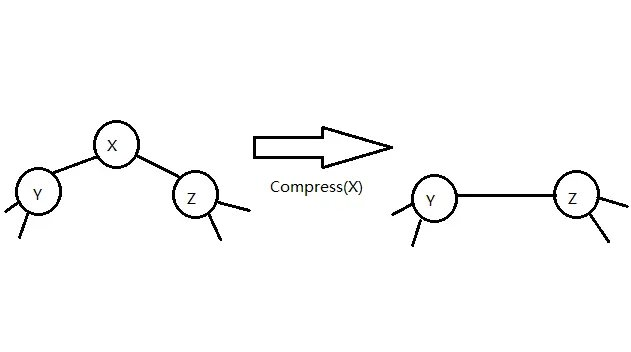

Rake 操作指定一个度为一的点 $x$，而且与点 $x$ 相邻的点 $y$ 的度数需大于一，设点 $y$ 的另一个邻点为 $z$，我们将点 $x$、边 $xy$ 的信息放入 边 $yz$ 中储存，并删去它们。如图所示。

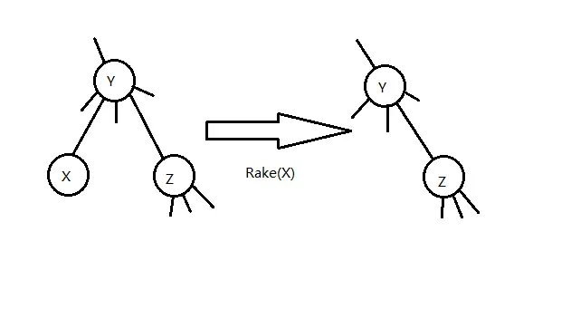

不难证明，任何一棵树都可以只用 Compress 操作 和 Rake 操作来将它收缩为一条边，如图所示。


### 簇

为了表达方便，我们记在进行任何操作之前的原树为 $T$。在对 $T$ 进行某些树收缩操作（可以不做任何操作）之后的树记为 $T_x$。

我们研究 某个 $T_x$ 中某一条边所包含的信息情况。

这条边除了带有它本身的信息（当然，如果这条边在 $T$ 中不存在，这条边就没有本身的信息）之外，还可能包含其它通过 Compress/Rake 操作合并到它上面的点、边的信息。我们不妨先从下图中的树收缩过程中选取一条边，看看它所包含的信息在 $T$ 中代表哪些点、边。

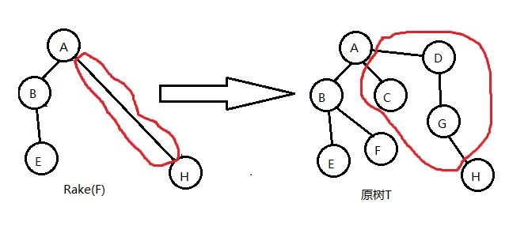

如图，选取的边和对应的图已用红线圈出。

可以看出，这条边所包含的信息在 $T$ 中代表的点、边是连通的。我们可以推及，对于任一 $T_x$ 中的任一条边储存的信息在 $T$ 中总体现为一个连通子图。我们将这样的连通子图称为 **簇（Cluster）**。

然而，簇是 **不完整的子图**，它包含的某些边的端点不被簇它自己包含。于是我们将这些端点称作簇的 **端点（Endpoint）**，将它包含的那些连通子图的点称作 **内点（Internal Node）**，连通子图的边称作 **内边（Internal Edge）**。

对于任意一个簇，都有以下性质：

1.  簇只存储和维护内点和内边的信息。

2.  簇有两个端点。这两个端点即为 $T_x$ 中代表那个簇的边相连的那两个点。两个端点之间的路径我们称之为 **簇路径（Cluster Path）**；记一个簇的两个端点分别为 $x$、$y$，我们下面用 $C(x,y)$ 来表示这个簇。

3.  内点仅与端点或内点相连。

特别地，对于 $T$ 中的每条边，都各自独立为一个簇（仅包含边自己的信息），这种簇我们称之为 **基簇（Base Cluster）**。对于由 $T$ 收缩到只有一条边的最终的 $T_x$，那条边代表的簇包含除了两个端点之外的整棵 $T$ 的信息，这个簇我们称之为 **根簇（Root Cluster）**。

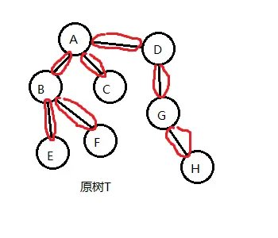

如图，上文提到的基簇已用红线圈出。

从簇的视角来看 Compress/Rake 操作，我们发现这两个操作会将两个簇“合二为一”，剩下一个新簇，所以树收缩的过程也是所有的基簇合并为一个簇的过程。

所以我们也可以得到下图，是对一系列树收缩操作的另一表示。

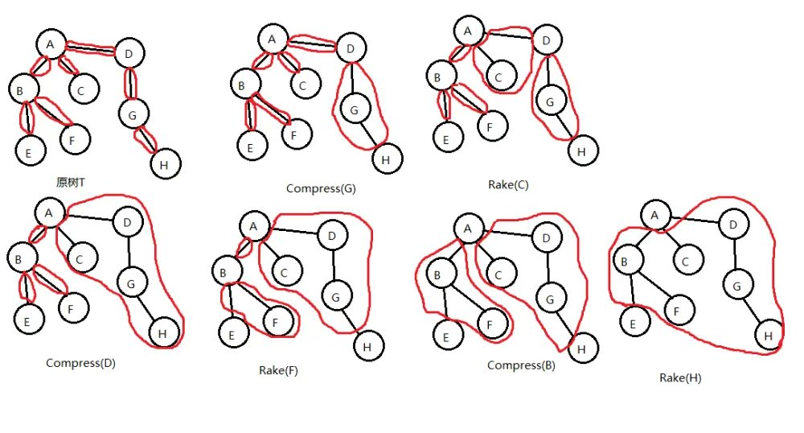

### Top Tree

我们现在想表示某一棵树进行树收缩的全过程。

我们可以用上文的两种方法来表示这一过程，但这样十分麻烦，如果树收缩进行了 $n$ 步，我们就要用 $n$ 棵树来表示整个树收缩。

考虑一个对某棵树进行某一树收缩的更简便表示，我们引入 **Top Tree**。

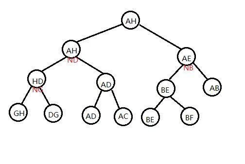

如图，是以上文的收缩方法和原树为基础的一棵 Top Tree。

Top Tree 有以下性质；

1.  一棵 Top Tree 对应一棵原树和一种对其进行树收缩的方法，Top Tree 的每个节点都表示在某个 $T_x$ 中的某一条边，也就是树收缩过程中形成的某一个簇。图中的形如 $N_x$ 的点表示 `compress(x)` 这一操作形成的簇。

2.  Top Tree 中的一个节点有两个儿子（都分别代表一个簇），这个节点代表的簇是这两个簇通过 Compress 或 Rake 操作合并得到的新簇。

3.  Top Tree 的叶子节点是基簇，其根节点是根簇。因此我们按一棵 Top Tree 的拓扑序分层，它的每一层就代表了一棵 $T_x$。

### 用三度化 Self-Adjusting Top Tree 实现信息维护

#### 原理

Top Tree 对树收缩过程的极大简化 使我们看到通过维护树收缩过程来维护树上信息的可能性，SATT 即是通过这一原理来维护树上信息的。

注意到树收缩的过程也是树上信息不断加入的过程，我们执行一次 `compress(x)`，$x$ 点的信息从此刻起就开始在某个簇中出现，影响着我们的统计结果。

假如我们现在用 Top Tree 来维护某棵树 $T$，树上的每个点，边都有权值，我们要维护的是 $T$ 的权值和。

现在我们在维护时要对 $T$ 中某个点 $x$ 的权值进行修改，很明显，我们就需要更改 Top Tree 中所有簇信息包含 $x$ 的节点信息，这样做单次时间复杂度会是 $O(n)$ 级别的。

然而，如果我们选的点它在 Top Tree 中簇信息包含 $x$ 的节点个数很少，也就是说使它的信息尽可能晚地加入簇中，我们单次操作的时间复杂度就会有一个很大的提升。如图。


SATT 就是通过修改 **某个点/某条路径** 在树收缩过程中信息被加入簇中的先后顺序（以降低其在被修改时的单次时间复杂度）来维护树上信息的。

### 实际结构

我们先将一棵原树 $T$ 分层定根，然后我们考虑对某种树收缩顺序的 Top Tree 的 根簇，它有两个端点，我们令这其中一个端点就是原树的根，另一个端点任选。

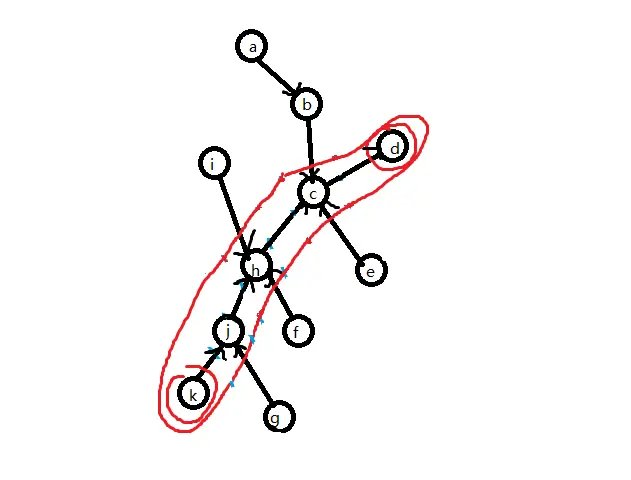

如图，给根簇选出一组端点，这里标注簇时将端点也圈进去了。

由树收缩的基本操作可知，簇路径上的点、边 $(j,h,c,jh,hc)$ 的信息最后是通过 Compress 操作才加入 $C(k,g)$ 的，而的非簇路径点 $(a,b,i,f,g,e,ig,\cdots)$ 是通过 Rake 操作才加入 $C(k,g)$ 的。

我们将簇路径单独拿出来，这是一条形态特殊（为链）的树，我们为这棵树建出一棵 top tree（其代表的树收缩顺序任意）。


我们将这一结构称之为 **Compress Tree**，因为在这棵 Top Tree 中任一个点的两个儿子之间是通过 Compress 操作来合并成它们的父亲。

Compress Tree 里的节点称为 **Compress Node**。只考虑当前这条簇路径，一个 非叶子的 Compress Node 就代表一次 compress 过程，表示将左儿子和右儿子信息合并起来，再将这个 $compress(x)$ 本身存储的点 $x$ 信息加入。这棵 Compress Tree 就维护了 $C(k,g)$ 簇路径的信息。

另外，在 Compress Tree 中，我们实际上还对使用的 Top Tree 做了一些限制。注意到 compress tree 维护的是一个 $T$ 中点的深度两两不同的链，我们规定在 Compress Tree 中基簇的中序遍历顺序与对应的 $T$ 中边的深度是一致的，且中序遍历越小深度越浅。同样，对于每个点 $x$ 对应的 $compress(x)$ 的关系 也是如此。

现在来维护那些非簇路径的信息，我们假设这些 非簇路径上的点、边已经形成了一个个极大簇，而这些极大簇是由这些用蓝线圈出的更小簇之间互相 Rake 形成的，对由一些更小簇合并形成一个极大簇的过程，我们用一个三叉树来表示，类似地，我们称这一结构为 **Rake Tree**，对应地 Rake Tree 里的点就是 **Rake Node**。每个 Rake Node 都代表一个簇，是由其左儿子和右儿子 Rake 到其 中儿子代表的更小簇上形成的。具体可见下图，可知 Rake Tree 中的每个点都代表了 $T$ 中具有相同端点的更小簇。

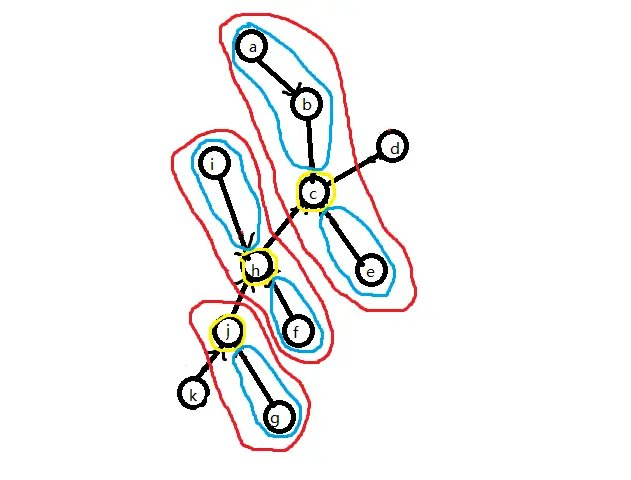

如图，蓝线圈出的是一个个极大簇，黄线圈出的是一个个更小簇。

对于那些更小簇，我们对它们进行相同处理，给它们选择簇路径、建出 Compress Tree $\cdots$ 如此递归下去，就建出了许多表示树收缩过程的 Compress Tree，Rake Tree。


如图 2-4，为原树的 Rake-Compress Tree（因为每个 Rake Node 都连着一棵 Compress Tree，所以表现为一棵 Rake Tree 连着许多 Compress Tree 的形态）和代表根簇路径的 Compress Tree。

考虑将这些树以某种方式拼接在一起，使它们形成一个有序的整体。记一个 Rake Tree 代表的最小簇的集合的公共端点是 点 $x$。我们给这些 rake node 的中儿子（一个 compress tree 集合）都加入非 $x$ 的另一端点，但仍保持其中序遍历和 top tree 的基本性质，如图。

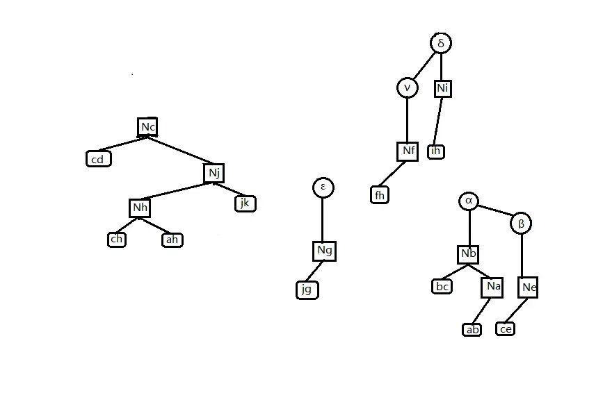

这一步相当于是让 Rake 操作加入某个 $T$ 中点的操作直接发生在 Compress Tree 中，这不仅使我们能 正确维护 Rake Node 的信息（只需将三个儿子信息合并即可），还使我们 Compress Tree 的结构更完整。下一步，我们将 Compress Tree 改为三叉树，若某个 Rake Tree 的公共端点是 点 $x$，我们就将 Rake Tree 挂在 $compress(x)$ 的中儿子处，如图。

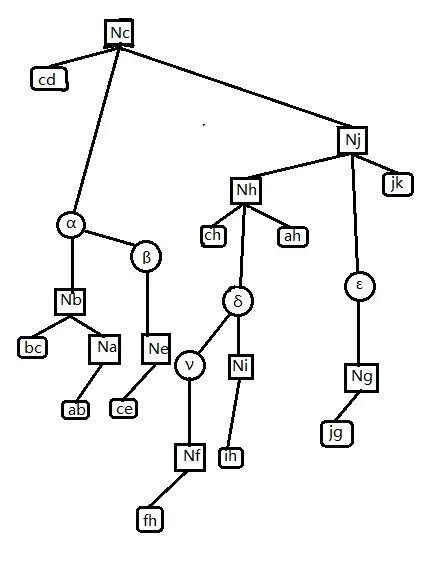

此时经过三叉化的 $compress(x)$ 点，它的意义就变成先将其中儿子 Rake 到簇路径上，再统计左右儿子 和点 $x$ 的信息。

最后，我们再处理一下根簇路径的那棵 Compress Tree：与其它所有 Compress Tree 一致地，按中序遍历加入它的两个端点，使得 它的根储存整棵 $T$ 的信息。

于是我们就实现了用三度化 Self-Adjusting Top Tree 实现一棵树的信息维护。

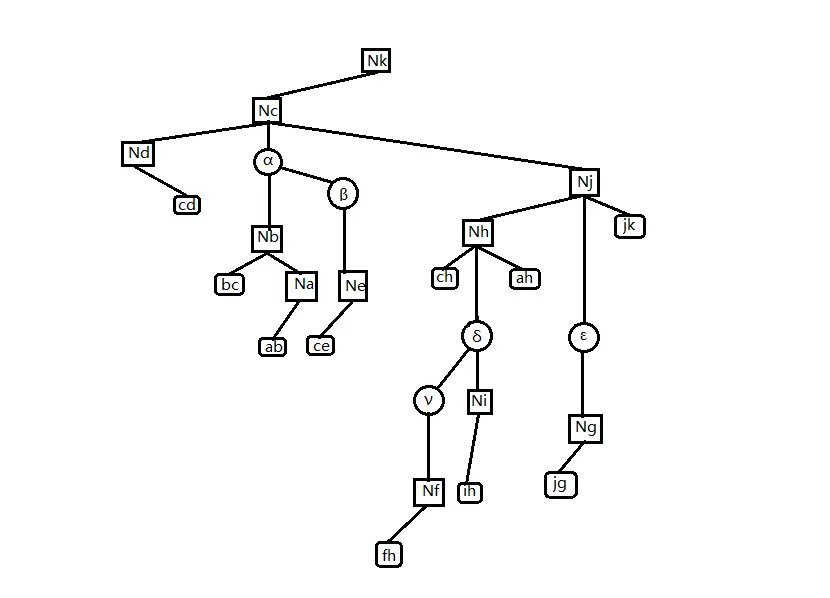

总结一下，SATT 有以下性质：

1.  SATT 由 Compress Tree 和 Rake Tree 组成，Compress Tree 是一棵特殊的 Top Tree；Rake Tree 是一个三叉树，它们都对应一棵树进行树收缩的过程。

2.  Compress Tree 里的点最多有三个儿子。Compress Tree 可以做类似于 Splay 树的旋转操作（只需保证其中序遍历不变即可，旋转一个点时保持其中儿子不动）。

3.  Rake Tree 里的点一定有一个中儿子。Rake Tree 可以做类似于 Splay 树的旋转操作（只需保证其中序遍历不变即可，旋转一个点时保持其中儿子不动）。

4.  SATT 的拓扑序反映了原树 $T$ 的树收缩顺序。

我们在上文中提到的「修改 某个点/某条路径 在树收缩过程中信息被加入簇中的先后顺序」SATT 是否能实现呢，答案是肯定的。

在 SATT 中，有一个 `access(x)` 的操作，它的作用是使某点 $x$ 成为根簇的非根端点，同时在 SATT 中使 $compress(x)$ 成为 SATT 的根。

我们可以通过 `access(x)` 操作以均摊 $O(\log n)$ 的复杂度使 SATT 中代表 $compress(x)$ 的点旋到整棵 SATT 的树根，根据 SATT 的第四个性质，我们改变了 $compress(x)$ 的操作顺序，使得它最晚执行，$x$ 点的信息也就被最晚加入；这样当我们要修改 $x$ 点的信息时，就只需要更新 $compress(x)$。

### 代码实现

#### Push 类函数

`Pushup(x)`

在考虑对 SATT 的某个节点维护信息时，首先分这个点在 Compress  Tree 还是在 Rake Tree 进行讨论，原因可见上文，不再赘述，下面以维护某个点的子树大小为例

```cpp
// ls(x) x的左儿子
// rs(x) x的右儿子
// ms(x) x的中儿子
// type==0 是 compress node
// type==1 是 rake node
void pushup(int x, int type) {
  if (type == 0)
    size[x] = size[rs(x)] + size[ms(x)] + 1;
  else
    size[x] = size[rs(x)] + size[ms(x)] + size[ls(x)];
  return;
}
```

查询点 $x$ 的子树大小，就将其 Access 到 SATT 根，答案是其中儿子的 size $+1$；因为根据上文，在 Access 之后，其中儿子才是它的真子树。

`Pushdown(x)`

我们如果要对原树中的某个子树做整体修改，一个很自然的想法是：将这个节点直接 Access 到 SATT 根节点，给它的中儿子打上一个标记即可。同理，查询子树就直接 Access 后查询中儿子。

我们如果要对原树中的某条路径做整体修改，我们就 $expose$ 路径的两个端点，其中 $expose(x,y)$ 是使 点 $x$ 成为了 $T$ 的根节点，使点 $y$ 成为根簇的另一个端点。对应在 SATT 上，此时根簇 的 compress tree 就是 $x$ 到 $y$ 的路径。于是直接给根簇的 Compress  Tree 打上一个标记即可。同理查询链 $expose$ 后查询根节点即可。

于是我们就知道问题引入的问题怎么做了。

```cpp
void pushdown(int x, int type) {
  if (type == 0) {
    // 处理链
    chain[ls(x)] += chain[x] chain[rs(x)] += chain[x];
    val[ls(x)] += chain[x];
    val[rs(x)] += chain[x];
    // 处理子树
    subtree[ls(x)] += subtree[x];
    subtree[rs(x)] += subtree[x];
    subtree[ms(x)] += subtree[x];
    val[ls(x)] += subtree[x];
    val[rs(x)] += subtree[x];
    val[ms(x)] += subtree[x];
    subtree[x] = 0;
  } else {
    subtree[ls(x)] += subtree[x];
    subtree[rs(x)] += subtree[x];
    subtree[ms(x)] += subtree[x];
    val[ls(x)] += subtree[x];
    val[rs(x)] += subtree[x];
    val[ms(x)] += subtree[x];
    subtree[x] = 0;
  }
  return;
}

// 下传标记
void pushall(int x, int type) {
  if (!isroot(x)) pushall(father[x], type);
  pushdown(x, type);
  return;
}
```

#### Splay 类函数

我们知道 SATT 中的 Rake  Tree 和 Compress Tree 都是可以旋转的，也就是说它们可以用 Splay 来维护。因此我们可以写出以下代码：

```cpp
// ls 一个SATT节点的左儿子
// rs 一个SATT节点的右儿子
// ms 一个SATT节点的中儿子
// type==1 在rake tree中
// type==0 在compress tree中
bool isroot(int x) {
  return rs(father[x]) != x && ls(father[x]) != x;
}  // 是一个节点的中儿子或无父亲

bool direction(int x) { return rs(father[x]) == x; }

void rotate(int x, int type) {
  int y = father[x], z = father[y], d = direction(x), w = son[x][d ^ 1];
  if (z) son[z][ms(z) == y ? 2 : direction(y)] = x;
  son[x][d ^ 1] = y;
  son[y][d] = w;
  if (w) father[w] = y;
  father[y] = x;
  father[x] = z;
  pushup(y, type);
  pushup(x, type);
  return;
}

void splay(int x, int type, int goal = 0) {
  pushall(x, ty); /*下传标记*/
  for (int y; y = father[x], (!isroot(x)) && y != goal; rotate(x, ty)) {
    if (father[y] != goal && (!isroot(y))) {
      rotate(direction(x) ^ diretion(y) ? x : y, type);
    }
  }
  return;
}
```

值得注意的是，函数 `direction` 和 `isroot` 与普通 Splay 的不同。

因为无论你把这个点怎么转，这个点的中儿子是不会变的。

#### Access 类函数

`access(x)` 的意义是：将点 $x$ 旋转到整个 SATT 的根处，使点 $x$ 成为根簇的两个端点之一（另一端点即为 $T$ 的根节点），同时不能改变原树的结构和原树的根。

为了实现 `access(x)`，我们先将其旋转到其所在 Compress  Tree 的树根，再把点 $x$ 的右儿子去掉，使点 $x$ 成为其所在 compress  tree 对应簇的端点。

```cpp
if (rs(x)) {
  int y = new_node();
  setfather(ms(x), y, 0);
  setfather(rs(x), y, 2);
  rs(x) = 0;
  setfather(y, x, 2);
  pushup(y, 1);
  pushup(x, 0);
}
```

如果这时点 $x$ 已经到了根部，则退出；若没有，则执行以下步骤，以让它跨过它上面的 Rake  Tree：

1.  将其父亲节点（一定是一个  Rake Node），splay 到其 Rake  Tree  的树根；

2.  将 $x$ 的爷节点（一定是一个 Compress Node）splay 到其 Compress Tree 根部。

3.  若 $x$ 的爷节点有一个右儿子，则将点 x 和爷节点的右儿子互换，更新信息，然后退出。

4.  若爷节点没有右儿子，则先让点 $x$ 成为爷节点的右儿子，此时点 $x$ 原来的父节点没有中儿子，根据上文 Rake Node 的性质，它不能存在。于是调用 `Delete` 函数，将其删除，然后退出。

1，2 两个步骤合称为 **Local Splay**。3，4 两个步骤合称为 **Splice**。但我们方便起见，将它们都写在 `Splice(x)` 函数里。

上文提到的 `Delete(x)` 函数是这样的：

1.  检视将要删除的点 $x$ 有没有左儿子，若有，则将左儿子的子树后继续旋转到点 $x$ 下方（成为新的左儿子），然后将右儿子（若有）变成左儿子的右儿子，此时点 $x$ 的左儿子就代替了点 $x$。（这相当于 Splay 的合并操作）

2.  若没有左儿子，则直接让其右儿子代替点 $x$。

不难发现，Splice(x) 改变了原树的一些簇的端点选取。一次 splice 完了之后，我们将 点 $x$ 的父亲节点当作新的 点 $x$，进行下一次 splice。

最终我们会发现 我们最开始要操作的点 $x$ 一定在 根簇的 compress tree 最右端。我们只需最后做一次 **Global Splay**，将其旋至 SATT 根部即可。

```cpp
// ls 一个SATT节点的左儿子
// rs 一个SATT节点的右儿子
// ms 一个SATT节点的中儿子
// son[x][0] ls
// son[x][1] rs
// son[x][2] ms
// type==1 在rake tree中
// type==0 在compress tree中
int new_node() {
  if (top) {
    top--;
    return Stack[top + 1];
  } else
    return ++tot;
}

void setfather(int x, int fa, int type) {
  if (x) father[x] = fa;
  son[fa][type] = x;
  return;
}

void Delete(int x) {
  setfather(ms(x), father[x], 1);
  if (ls(x)) {
    int p = ls(x);
    pushdown(p, 1);
    while (rs(p)) p = rs(p), pushdown(p, 1);
    splay(p, 1, x);
    setfather(rs(x), p, 1);
    setfather(p, father[x], 2);
    pushup(p, 1);
    pushup(father[x], 0);
  } else
    setfather(rs(x), father[x], 2);
  Clear(x);
}

void splice(int x) {
  /*  local splay */
  splay(x, 1);
  int y = father[x];
  splay(y, 0);
  pushdown(x, 1);
  /*  splice  */
  if (rs(y)) {
    swap(father[ms(x)], father[rs(y)]);
    swap(ms(x), rs(y));
  } else
    Delete(x);
  pushup(x, 1);
  pushup(y, 0);
  return;
}

void access(int x) {
  splay(x, 0);
  if (rs(x)) {
    int y = new_node();
    setfather(ms(x), y, 0);
    setfather(rs(x), y, 2);
    rs(x) = 0;
    setfather(y, x, 2);
    pushup(y, 1);
    pushup(x, 0);
  }
  while (father[x]) {
    splice(father[x]);
    x = father[x];
    pushup(x, 0);
  }
  splay(x, 0) /*global splay*/
      return;
}
```

关于 `makeroot(x)`:

若要让一个点成为原树的根，那么我们就将点 $x$ Access 到 SATT  的根节点，可知此时点 $x$ 已经是最终状态的簇一个端点。由 Compress Tree  的中序遍历性质可知，将点 $x$ 所在的 Compress Tree 左右颠倒（所有点的左右儿子互换），就使点 $x$ 成为原树的根。在具体实现中，我们通过给点 $x$ 打上一个翻转标记，之后下传来进行这一过程。

```cpp
void makeroot(int x) {
  access(x);
  push_rev(x);
  return;
}
```

于是 `expose(x,y)` 就呼之欲出：

    void expose(int x,int y){
    	makeroot(x);
    	access(y);
    	return;
    }

### Link & Cut

现在我们要将原树中两个不连通的点之间连一条边，则我们先将其中的一个点 $x$  $makeroot$，再将另一个点 $y$  $access$ 到根，可知此时应该使点 $y$ 成为点 $x$ 的右儿子，并在点 $y$ 的右儿子上挂上这一条边（在只需维护点的 SATT 中，这一步可省）。

```cpp
void Link(int x, int y, int z) {
  /*z代表连接x,y的边*/
  access(x);
  makeroot(y);
  setfather(y, x, 1);
  setfather(z, y, 0);
  pushup(x, 0);
  pushup(y, 0);
  return;
}
```

`Cut` 跟 `link` 原理差不多……

```cpp
void cut(int x, int y) {
  expose(x, y);
  clear(rs(x)); /*删掉xy这一基簇。*/
  father[x] = ls(y) = rs(x);
  pushup(y, 0);
}
```

### 完整代码（Luogu P3690【模板】动态树）

??? note "示例代码"
    ```cpp
    #include <bits/stdc++.h>
    #define ls(x) T[x][0]
    #define rs(x) T[x][1]
    #define ms(x) T[x][2]
    #define maxn 1000005
    using namespace std;
    
    int read() {
      int s = 0;
      char a = getchar();
      while (!isdigit(a)) a = getchar();
      while (isdigit(a)) {
        s = (s << 1) + (s << 3);
        s += a ^ 48;
        a = getchar();
      }
      return s;
    }
    
    int T[maxn][3], s[maxn][2], tot, v[maxn], n, m, r[maxn], top, st[maxn], f[maxn];
    
    int nnd() {
      if (top) {
        top--;
        return st[top + 1];
      } else
        return ++tot;
    }
    
    bool isr(int x) { return rs(f[x]) != x && ls(f[x]) != x; }
    
    bool dir(int x) { return rs(f[x]) == x; }
    
    void psu(int x, int ty) {
      if (ty) {
        s[x][1] = s[ls(x)][1] ^ s[rs(x)][1] ^ s[ms(x)][1];
        return;
      }
      s[x][0] = s[ls(x)][0] ^ v[x] ^ s[rs(x)][0];
      s[x][1] = s[ls(x)][1] ^ s[ms(x)][1] ^ s[rs(x)][1] ^ v[x];
    }
    
    void psr(int x) {
      if (!x) return;
      r[x] ^= 1;
      swap(ls(x), rs(x));
    }
    
    void psd(int x, int ty) {
      if (ty) return;
      if (r[x]) {
        psr(ls(x));
        psr(rs(x));
        r[x] = 0;
        return;
      }
    }
    
    void upd(int x, int ty) {
      if (!isr(x)) upd(f[x], ty);
      psd(x, ty);
    }
    
    void stf(int x, int fa, int ty) {
      if (x) f[x] = fa;
      T[fa][ty] = x;
      return;
    }
    
    void rtt(int x, int ty) {
      int y = f[x], z = f[y], d = dir(x), w = T[x][d ^ 1];
      if (z) T[z][ms(z) == y ? 2 : dir(y)] = x;
      T[x][d ^ 1] = y;
      T[y][d] = w;
      if (w) f[w] = y;
      f[y] = x;
      f[x] = z;
      psu(y, ty);
      psu(x, ty);
    }
    
    void spy(int x, int ty, int gl = 0) {
      upd(x, ty);
      for (int y; y = f[x], (!isr(x)) && y != gl; rtt(x, ty)) {
        if (f[y] != gl && (!isr(y))) rtt(dir(x) ^ dir(y) ? x : y, ty);
      }
    }
    
    void cle(int x) {
      ls(x) = ms(x) = rs(x) = s[x][0] = s[x][1] = r[x] = v[x] = 0;
      st[++top] = x;
    }
    
    void del(int x) {
      stf(ms(x), f[x], 1);
      if (ls(x)) {
        int p = ls(x);
        psd(p, 1);
        while (rs(p)) p = rs(p), psd(p, 1);
        spy(p, 1, x);
        stf(rs(x), p, 1);
        stf(p, f[x], 2);
        psu(p, 1);
        psu(f[x], 0);
      } else
        stf(rs(x), f[x], 2);
      cle(x);
    }
    
    void spl(int x) {
      spy(x, 1);
      int y = f[x];
      spy(y, 0);
      psd(x, 1);
      if (rs(y)) {
        swap(f[ms(x)], f[rs(y)]);
        swap(ms(x), rs(y));
        psu(x, 1);
      } else
        del(x);
      psu(rs(y), 0);
      psu(y, 0);
    }
    
    void acs(int x) {
      spy(x, 0);
      int ys = x;
      if (rs(x)) {
        int y = nnd();
        stf(ms(x), y, 0);
        stf(rs(x), y, 2);
        rs(x) = 0;
        stf(y, x, 2);
        psu(y, 1);
        psu(x, 0);
      }
      while (f[x]) {
        spl(f[x]);
        x = f[x];
      }
      spy(ys, 0);
    }
    
    int fdr(int x) {
      acs(x);
      psd(x, 0);
      while (ls(x)) x = ls(x), psd(x, 0);
      spy(x, 0);
      return x;
    }
    
    void mkr(int x) {
      acs(x);
      psr(x);
    }
    
    void epo(int x, int y) {
      mkr(x);
      acs(y);
    }
    
    void lnk(int x, int y) {
      if (fdr(x) == fdr(y)) return;
      acs(x);
      mkr(y);
      stf(y, x, 1);
      psu(x, 0);
      psu(y, 0);
    }
    
    void cu(int x, int y) {
      epo(x, y);
      if (ls(y) != x || rs(x)) return;
      f[x] = ls(y) = 0;
      psu(y, 0);
    }
    
    int main() {
      int i, j, op, U, V, n = read(), m = read();
      tot = n;
      for (i = 1; i <= n; i++) v[i] = read(), psu(i, 0);
      for (i = 1; i <= m; i++) {
        op = read();
        U = read();
        V = read();
        if (op == 0) {
          epo(U, V);
          cout << s[V][0] << '\n';
        }
        if (op == 1) lnk(U, V);
        if (op == 2) cu(U, V);
        if (op == 3) {
          acs(U);
          v[U] = V;
          psu(U, 0);
        }
      }
      return 0;
    }
    ```

### SATT 的时间复杂度证明

设在一棵 SATT（点数为 $n$）中，其当前状态 $x$ 的势能函数为

$\varphi(x)= \sum_{i=1}^{n} r(i)$

其中 $r(i) = \lceil \log_2 (\text{以 } i \text{ 为根的子树大小} ) \rceil$。

则 SATT 的 splay 的均摊复杂度显然仍是 $3n\log n + 1$，即使 SATT 是一个三叉树。

因此对于 SATT , 我们只要证得 Access 函数复杂度正确，就能证得 SATT 的时间复杂度。

我们逐步分析 Accese 的均摊复杂度。

我们先要将点 $x$ 旋至 其所在 Compress Tree 的根，则这一步的均摊复杂度

$a \leq  3\log n +1$

接着我们要使点 $x$ 无右儿子，则这一步的均摊复杂度

$a = 1 + r'(\gamma)- 0 \leq \log n +1$

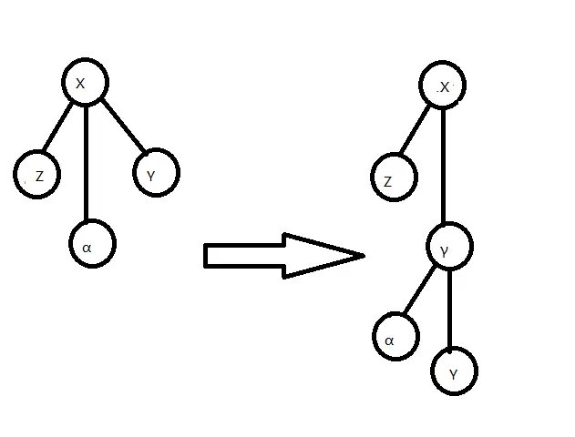

如图，为去掉点 $x$ 的右儿子过程。

然后是 Local Splay，Splice 交替进行的过程，经过若干次 Splice，点 $x$ 被旋至 SATT 的根。我们对其中一组 Local Splay，Splice 进行分析：

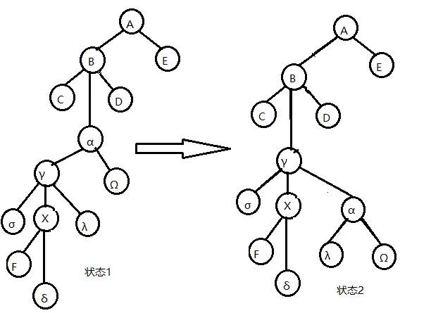


如图，体现了对点 $x$ 做一次 Splice 的过程，不包括最后左旋点 $x$ 的部分。

为表达方便，设 $r_x(i)$ 为点 $i$ 在状态 $x$ 时的 $r$ 值。

由图，易知由状态 1 到状态 2 的操作（将点 $x$ 的父亲旋至其 Rake Tree 的根部的 Local Splay 操作）的均摊复杂度

$a \leq  3(r_2(\gamma)- r_1(\gamma))+1$

由图，易知由状态 2 到状态 3 的操作（将点 $x$ 的爷节点旋至其 Compress Tree 的根部的 Local Splay 操作）的均摊复杂度

$a \leq  3(r_3(B)- r_2(B))+1$

重点分析由状态 3 到状态 4 的操作（Splice )

$a = r_4(\gamma) -r_3(\gamma) +1$

不难发现 $r_4(\gamma) \leq r_3(B)$

故这一次操作的均摊复杂度为

$$a \leq  r_3(B)- r_3(\gamma)+1
\leq  3(r_3(B)- r_3(\gamma))+1
$$

综合上述过程，一次 Splice 的复杂度为

$a\leq  3r_3(B)+3r_3(B)+3r_2(\gamma)-3r_3(\gamma)-3r_2(B)-3r_1(\gamma)+3$

记下一次 Splice 的点 $X$（即状态 4 中的点 $B$）的 $r$ 值为 $r'(X)$，并注意到

$r_3(\gamma),r_1(\gamma) \ge r_1(X)$

$r_3(B),r_2(\gamma) \leq r'(X)\text{ 且 } r_3(B)=r_2(B)$

所以

$a\leq  9(r'(X)-r(X))+3$

除了上面这个复杂度以外，在 Splice 中可能还会有因 `delete(x)` 产生的额外均摊复杂度，记这一部分为 $a' \leq 3\log n +1$。

先不管 $a'$ 部分，每次 Splice 的 $r'(X)$ 等于下一次的 $r(X)$，且第一次 Splice 的 $r(X)$ 等于我们一开始旋转点 $x$ 到其 Compress Tree 树根时的 $r(X)$，则对于不计'delete(x)' 的 一次'access(x)' 复杂度，我们有：

$a \leq 9(r'(x)-r(x))+ 3k + 1$

其中 $k$ 为 Splice 次数。

看样子 $a$ 会带一个 $3k+1$ 导致均摊复杂度无法分析，但我们有办法来对付它，注意到 zig-zig\zig-zag 的旋转可以这么均摊

$$a \leq 3(r'(X)-r(X)) + q
\leq 3(q-1)(r'(X)-r(X))
$$

如果我们能找到足够多的 zig-zig，zig-zag 操作，我们就可以将这 $3k+1$ 平摊到 这些 操作上去，从而消掉 这个 $3k+1$。

我们发现 Globel Splay 里面就有这么多的 zig-zig，zag-zig 来给我们使用，因为 Globel Splay 里面点的个数一定大于 $k$，而从点 $x$ 到 Globel Splay 根部路径的点数一定不少于 $k$，也就是说一次 `access(x)` 中一定会至少有 $\dfrac k2$ 个 zig-zag 操作，算上 Globel Splay 的均摊复杂度 $a \leq 3\log n +1$，一次 `access(x)` 不记 `delete(x)` 的均摊复杂度为

$a \leq 9(r'(X)-r(X)) + 3k + 1 + 18(r''(X)-r'(X)) -S+1 +3 \log n +1,S \ge 3k$

$a\leq 18(r''(X)-r(X)) +2 +3\log n+1$

$a\leq 21(r''(X)-r(X)) +3$

现在算上 $a'$，列出进行 $m$ 次 `access(x)` 操作的总式子。

$\sum_{i=1}^m a_i' + \sum_{i=1}^m a_i = \sum_{i=1}^m c_i + \varphi(x_n) -\varphi(x_0)$

我们要求的是实际复杂度

$\sum_{i=1}^m c_i = \sum_{i=1}^m a_i +\sum_{i=1}^m a_i' - \varphi(x_n) +\varphi(x_0)$

$\sum_{i=1}^m c_i \leq \sum_{i=1}^m a_i' + 21m\log n +n\log n +3m$

注意到 `delete(x)` 操作的本质是删掉一个 Rake Node，但我们在 $m$ 次操作中最多只会添加 $m$ 个 Rake Node，由 Rake Node 的定义，我们初始时最多有 $n$ 个 Rake Node，也就是说 我们总共只会做 $m+n$ 次 `delete(x)` 操作，由 $a' \leq 3\log n +1$ 可知

$\sum_{i=1}^m c_i \leq 3(m+n)\log n + 21m\log n +n\log n +4m +n$

所以我们就证明了 Access 的复杂度，而其他函数要么基于 Access 要么单次时间复杂度为常数，所以我们就证明了 SATT 的复杂度。

顺便一提，如果像 LCT 一样省略 Global Splay 的过程，改为在每次 Splice 时直接将要 Access 的点旋转一下，这样做时间复杂度也是对的（实测省略 Global Splay 的版本要快很多，能与 LCT 在 Luogu P3690 跑得不分上下）。

### 例题

#### CF1192B Dynamic Diameter

维护动态直径，建出 SATT 后，我们只需要在 `Pushup(x)` 里面维护每个点的答案，最后查询根节点的答案（即整棵树的直径）就可以了。

```cpp
void pushup(int x, int op) {
  if (op == 0) {
    /*是compress node*/
    len[x] = len[ls(x)] + len[rs(x)];
    diam[x] = maxs[ls(x)][1] + maxs[rs(x)][0];
    diam[x] =
        max(diam[x], max(maxs[ls(x)][1], maxs[rs(x)][0]) + maxs[ms(x)][0]);
    diam[x] = max(diam[x], max(max(diam[ls(x)], diam[rs(x)]), diam[ms(x)]));
    maxs[x][0] =
        max(maxs[ls(x)][0], len[ls(x)] + max(maxs[ms(x)][0], maxs[rs(x)][0]));
    maxs[x][1] =
        max(maxs[rs(x)][1], len[rs(x)] + max(maxs[ms(x)][0], maxs[ls(x)][1]));
  } else {
    /*是rake node*/
    diam[x] = maxs[ls(x)][0] + maxs[rs(x)][0];
    diam[x] =
        max(diam[x], maxs[ms(x)][0] + max(maxs[ls(x)][0], maxs[rs(x)][0]));
    diam[x] = max(max(diam[x], diam[ms(x)]), max(diam[ls(x)], diam[rs(x)]));
    maxs[x][0] = max(maxs[ms(x)][0], max(maxs[ls(x)][0], maxs[rs(x)][0]));
  }
  return;
}
```

其中 $diam$ 是当前点的答案（这个点代表的簇的直径）。$len$ 表示当前 Compress Node 所在簇路径的长度，$maxs_{0/1}$ 表示 compress node 到簇内点和端点的不选簇路径儿子/不选父亲的最大距离（如果是 Rake Node 则只存储选取当前簇的上端点到簇内点和端点的最大距离 $maxs_0$）。每次查询 SATT 根节点的 diam 即可，正确性显然。

注意对 `Pushrev(x)` 做一些改动。

```cpp
void pushrev(int x) {
  if (!x) return;
  r[x] ^= 1;
  swap(ls(x), rs(x));
  swap(maxs[x][0], maxs[x][1]);
  return;
}
```

#### \[CSP-S2019] 树的重心

假如我们能动态 $O(\log n)$ 维护树的重心，我们就做出这个题了。

SATT 支持动态 $O(\log n)$ 维护树的重心，做到这需要 **非局部搜索（Non-local Search）**。

对于一种树上的性质，如果一个点/一条边在整棵树中有这种性质，且在所有包含它的子树中都包含此种性质，我们就称这个性质是 **局部的（Local）**，否则称它是 **非局部的（Non-local）**。局部信息一般可以通过 `pushup(x)` 来维护

例如，权值最小值是局部的，因为一个点/一条边如果在整棵树中权值最小，那么在所有包含它的子树中它也是权值最小的，而权值第二小显然就是非局部的。

我们上文维护的 $diam$ 也是局部信息。

回到正题，重心显然是一个非局部信息，无法通过简单的 `pushup(x)` 来维护。我们考虑在 SATT 上搜索：

我们的搜索从 SATT 的根节点，即根簇开始。注意到重心有很好的性质：假如有一条边的一侧点的个数大于等于另一侧点的个数，那么边的这一侧一定至少有一个重心（重心可能有 2 个）。

记 $sum$ 表示某一个簇的点个数，$maxs$ 为一棵 Rake Tree 的所有 Rake Node 中儿子的 $sum$ 最大值。

```cpp
void pushup(int x, int op) {
  if (op == 0) {
    /*是 compress node*/
    sum[x] = sum[ls(x)] + sum[rs(x)] + sum[ms(x)] + 1;
  } else {
    /*是 rake node*/
    maxs[x] = max(maxs[ls(x)], max(maxs[rs(x)], sum[ms(x)]));
    sum[x] = sum[ls(x)] + sum[rs(x)] + sum[ms(x)];
  }
  return;
}
```

现在我们在根簇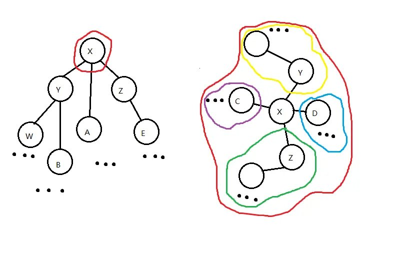

如图，为在进行 Non-local Search 时的 SATT 和对应的 原树 $T$。

我们做如下比较：

1.  比较 簇 $compress(Y)$ 的 $sum$ 值与 簇 $compress(Z)$、簇 $A$ 和点 $X$ 的并（我们暂称为簇 $α$）的 $sum$ 值。若 $compress(Y)$ 的 $sum$ 值大于等于后者，说明至少有一个重心在 $compress(Y)$ 的子树中，我们递归到 $compress(Y)$ 搜索。（如果此处取等，点 $X$ 也是一个重心，需要记录）

2.  比较 簇 $compress(Z)$ 的 $sum$ 值与 簇 $compress(Y)$、簇 $A$ 和点 $X$ 的并（我们暂称为簇 $β$）的 $sum$ 值。若 $compress(Z)$ 的 $sum$ 值大于等于后者，说明至少有一个重心在 $compress(Z)$ 的子树中，我们递归到 $compress(Z)$ 搜索。（如果此处取等，点 $X$ 也是一个重心，需要记录）

3.  比较 点 $x$ 中儿子 Rake tree 之中 $sum$ 最大的更小簇（见 3-2）的 $sum$ 值与 簇 $compress(Y)$、簇 $A$、点 $X$ 及其它更小簇的并（我们暂称为簇 $Y$）的 $sum$ 值，若 那个更小簇 的 $sum$ 值大于等于后者，说明至少有一个重心在 那个更小簇的 子树中，我们递归到它搜索。（如果此处取等，点 $X$ 也是一个重心，需要记录）

4.  若以上比较都不递归，则点 $X$ 一定是一个重心，记录并退出。

第一步的搜索显然正确，之后应该怎么搜呢？

假如我们递归到 $Y$，则现在 $Y$ 储存信息的并不完整，因为 $compress(Y)$ 里面只存储了它自己这个簇的信息，而我们要求的是整棵树的重心。解决方法是，将之前簇的信息记录下来，在点 $Y$ 上比较计算时将上一个簇的信息与 点 $Y$ 自己的信息合并处理。具体实现如下：

```cpp
void non_local_search(int x, int lv, int rv, int op) {
  /*lv 和 rv 都是搜索的上一个簇的信息*/

  if (!x) return;
  psd(x, 0);
  if (op == 0) {
    if (maxs[ms(x)] >=
        sum[ms(x)] - maxs[ms(x)] + sum[rs(x)] + sum[ls(x)] + lv + 1 + rv) {
      if (maxs[ms(x)] ==
          sum[ms(x)] - maxs[ms(x)] + sum[rs(x)] + sum[ls(x)] + lv + 1 + rv) {
        if (ans1)
          ans2 = x;
        else
          ans1 = x;
      }
      non_local_search(
          ms(x),
          sum[ms(x)] - maxs[ms(x)] + sum[rs(x)] + sum[ls(x)] + 1 + lv + rv, 0,
          1);
      return;
    }
    if (ss[rs(x)] + rv >= ss[ms(x)] + ss[ls(x)] + lv + 1) {
      if (ss[rs(x)] + rv == ss[ms(x)] + ss[ls(x)] + lv + 1) {
        if (ans1)
          ans2 = x;
        else
          ans1 = x;
      }
      non_local_search(rs(x), sum[ms(x)] + 1 + sum[ls(x)] + lv, rv, 0);
      return;
    }
    if (sum[ls(x)] + lv >= sum[ms(x)] + sum[rs(x)] + 1 + rv) {
      if (sum[ls(x)] + lv == sum[ms(x)] + sum[rs(x)] + 1 + rv) {
        if (ans1)
          ans2 = x;
        else
          ans1 = x;
      }
      non_local_search(ls(x), lv, rv + sum[ms(x)] + 1 + sum[rs(x)], 0);
      return;
    }
  } else {
    if (maxs[ls(x)] == maxs[x]) {
      non_local_search(ls(x), lv, rv, 1);
      return;
    }
    if (maxs[rs(x)] == maxs[x]) {
      non_local_search(rs(x), lv, rv, 1);
      return;
    }
    non_local_search(ms(x), lv, rv, 0);
    return;
  }
  if (ans1)
    ans2 = x;
  else
    ans1 = x;
  return;
}
```

完整代码如下：

??? note "示例代码"
    ```cpp
    #include <bits/stdc++.h>
    #define ls(x) T[x][0]
    #define rs(x) T[x][1]
    #define ms(x) T[x][2]
    #define maxn 1000005
    using namespace std;
    
    int read() {
      int s = 0;
      char a = getchar();
      while (!isdigit(a)) a = getchar();
      while (isdigit(a)) {
        s = (s << 1) + (s << 3);
        s += a ^ 48;
        a = getchar();
      }
      return s;
    }
    
    int T[maxn][3], tot, n, m, r[maxn], top, st[maxn], f[maxn], maxs[maxn],
        ss[maxn];
    
    int nnd() {
      if (top) {
        top--;
        return st[top + 1];
      } else
        return ++tot;
    }
    
    bool isr(int x) { return rs(f[x]) != x && ls(f[x]) != x; }
    
    bool dir(int x) { return rs(f[x]) == x; }
    
    void psr(int x) {
      if (!x) return;
      r[x] ^= 1;
      swap(ls(x), rs(x));
    }
    
    void psd(int x, int ty) {
      if (ty) return;
      if (r[x]) {
        psr(ls(x));
        psr(rs(x));
        r[x] = 0;
        return;
      }
    }
    
    void psu(int x, int op) {
      psd(x, op); /*不知道哪没 psd*/
      if (op == 0) {
        ss[x] = ss[ls(x)] + ss[rs(x)] + ss[ms(x)] + 1;
      } else {
        maxs[x] = max(maxs[ls(x)], max(maxs[rs(x)], ss[ms(x)]));
        ss[x] = ss[ls(x)] + ss[rs(x)] + ss[ms(x)];
      }
      return;
    }
    
    void upd(int x, int ty) {
      if (!isr(x)) upd(f[x], ty);
      psd(x, ty);
    }
    
    void stf(int x, int fa, int ty) {
      if (x) f[x] = fa;
      T[fa][ty] = x;
      return;
    }
    
    void rtt(int x, int ty) {
      int y = f[x], z = f[y], d = dir(x), w = T[x][d ^ 1];
      if (z) T[z][ms(z) == y ? 2 : dir(y)] = x;
      T[x][d ^ 1] = y;
      T[y][d] = w;
      if (w) f[w] = y;
      f[y] = x;
      f[x] = z;
      psu(y, ty);
      psu(x, ty);
    }
    
    void spy(int x, int ty, int gl = 0) {
      upd(x, ty);
      for (int y; y = f[x], (!isr(x)) && y != gl; rtt(x, ty)) {
        if (f[y] != gl && (!isr(y))) rtt(dir(x) ^ dir(y) ? x : y, ty);
      }
    }
    
    void cle(int x) {
      ls(x) = ms(x) = rs(x) = ss[x] = r[x] = maxs[x] = f[x] = 0;
      st[++top] = x;
    }
    
    void del(int x) {
      stf(ms(x), f[x], 1);
      if (ls(x)) {
        int p = ls(x);
        psd(p, 1);
        while (rs(p)) p = rs(p), psd(p, 1);
        spy(p, 1, x);
        stf(rs(x), p, 1);
        stf(p, f[x], 2);
        psu(p, 1);
        psu(f[x], 0);
      } else
        stf(rs(x), f[x], 2);
      cle(x);
    }
    
    void spl(int x) {
      spy(x, 1);
      int y = f[x];
      spy(y, 0);
      psd(x, 1);
      if (rs(y)) {
        swap(f[ms(x)], f[rs(y)]);
        swap(ms(x), rs(y));
      } else
        del(x);
      psu(x, 1);
      psu(y, 0);
      rtt(rs(y), 0);
    }
    
    void acs(int x) {
      spy(x, 0);
      if (rs(x)) {
        int y = nnd();
        stf(ms(x), y, 0);
        stf(rs(x), y, 2);
        rs(x) = 0;
        stf(y, x, 2);
        psu(y, 1);
        psu(x, 0);
      }
      while (f[x]) spl(f[x]);
    }
    
    void mkr(int x) {
      acs(x);
      psr(x);
    }
    
    void epo(int x, int y) {
      mkr(x);
      acs(y);
    }
    
    void lnk(int x, int y) {
      acs(x);
      mkr(y);
      stf(y, x, 1);
      psu(x, 0);
    }
    
    void cu(int x, int y) {
      epo(x, y);
      f[x] = ls(y) = 0;
      psu(y, 0);
    }
    
    int ans1, ans2;
    
    void non_local_search(int x, int lv, int rv, int op) {
      if (!x) return;
      psd(x, 0);
      if (op == 0) {
        if (maxs[ms(x)] >=
            ss[ms(x)] - maxs[ms(x)] + ss[rs(x)] + ss[ls(x)] + lv + 1 + rv) {
          if (maxs[ms(x)] ==
              ss[ms(x)] - maxs[ms(x)] + ss[rs(x)] + ss[ls(x)] + lv + 1 + rv) {
            if (ans1)
              ans2 = x;
            else
              ans1 = x;
          }
          non_local_search(
              ms(x), ss[ms(x)] - maxs[ms(x)] + ss[rs(x)] + ss[ls(x)] + 1 + lv + rv,
              0, 1);
          return;
        }
        if (ss[rs(x)] + rv >= ss[ms(x)] + ss[ls(x)] + lv + 1) {
          if (ss[rs(x)] + rv == ss[ms(x)] + ss[ls(x)] + lv + 1) {
            if (ans1)
              ans2 = x;
            else
              ans1 = x;
          }
          non_local_search(rs(x), ss[ms(x)] + 1 + ss[ls(x)] + lv, rv, 0);
          return;
        }
        if (ss[ls(x)] + lv >= ss[ms(x)] + ss[rs(x)] + 1 + rv) {
          if (ss[ls(x)] + lv == ss[ms(x)] + ss[rs(x)] + 1 + rv) {
            if (ans1)
              ans2 = x;
            else
              ans1 = x;
          }
          non_local_search(ls(x), lv, rv + ss[ms(x)] + 1 + ss[rs(x)], 0);
          return;
        }
      } else {
        if (maxs[ls(x)] == maxs[x]) {
          non_local_search(ls(x), lv, rv, 1);
          return;
        }
        if (maxs[rs(x)] == maxs[x]) {
          non_local_search(rs(x), lv, rv, 1);
          return;
        }
        non_local_search(ms(x), lv, rv, 0);
        return;
      }
      if (ans1)
        ans2 = x;
      else
        ans1 = x;
      return;
    }
    
    int qu[maxn], qv[maxn];
    
    int main() {
      int i, TT = read(), n, I, U, V, x;
      long long ANS;
      for (I = 1; I <= TT; I++) {
        n = read();
        tot = n;
        ANS = 0;
        for (i = 1; i <= n; i++) ss[i] = 1;
        for (i = 1; i <= n - 1; i++) {
          qu[i] = U = read();
          qv[i] = V = read();
          lnk(U, V);
        }
        for (i = 1; i <= n - 1; i++) {
          cu(qu[i], qv[i]);
          ans1 = 0;
          ans2 = 0;
          non_local_search(qu[i], 0, 0, 0);
          ANS += ans1 + ans2;
          if (ans1) acs(ans1);
          if (ans2) acs(ans2);
          ans1 = 0;
          ans2 = 0;
          non_local_search(qv[i], 0, 0, 0);
          ANS += ans1 + ans2;
          if (ans1) acs(ans1);
          if (ans2) acs(ans2);
          lnk(qu[i], qv[i]);
        }
        cout << ANS << '\n';
        for (i = 1; i <= tot; i++)
          T[i][0] = T[i][1] = T[i][2] = ss[i] = r[i] = maxs[i] = f[i] = 0;
        tot = top = 0;
      }
      return 0;
    }
    
    ```

### Referrence

1.《Self-Adjusting Top Trees Robert》E. Tarjan，Renato F. Werneck。

2.[negiizhao 的博客](https://negiizhao.blog.uoj.ac/blog/4912)

3.[zhengrunzhe 的 sone1 题解](https://www.luogu.com.cn/blog/van/solution-p5649)
