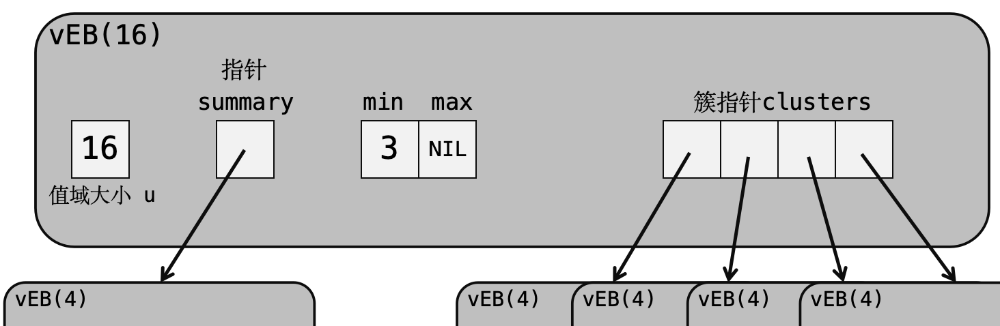

author: qwqAutomaton

van Emde Boas 树（以下简称 vEB 树），是由荷兰计算机科学家 Peter van Emde Boas 于 1975 年发明的一种树数据结构。它通过对值域的递归分割达到在 $O(\log\log u)$ 的时间和 $O(u)$ 的空间内完成**无重复元素**的动态集合的插入删除、查询元素是否存在、查询前后继、查询最大最小值等操作（其中维护的值域为 $[0,u-1]$）。一种不太严谨的理解：vEB 树是一种在值域上递归分块。

本文大体按照《算法导论》第 20 章的思路进行介绍，读者可以自行跳过部分内容。

## 记号约定

若无特殊说明，我们约定：

- $u$ 表示值域大小，且满足 $u=2^k,k\in\mathbb N$.
- $n$ 表示元素个数。
- $\log$ 指以 $2$ 为底的对数。
- 下标、值域从 $0$ 开始。

## 引入

用平衡树维护，这几个操作都要 $O(\log n)$ 的时间；用哈希表，则可以做到 $O(1)$ 的插入删除、查询和 $O(n)$ 的前后继、最值查询。有没有更快的呢？

考虑引入一个 01 串 $B$，其中第 $i$ 位为 $1$ 表示元素 $i$ 属于这个动态集合。我们记 $B(i)$ 表示 $B$ 的第 $i$ 位的值。

如果我们仅用一个串来维护这个集合的话，可以在 $O(1)$ 内完成插入删除、查询是否存在，但是此时查询前后继和最值都是 $O(u)$ 的。

因此我们尝试在这个串「上方」引入一棵二叉树，其叶子结点的值等于这个叶子结点对应的串中的值，而其余节点的值等于两个儿子的值的或（图表示值域为 $[1,8]$、集合中元素为 $\{1,6\}$ 的情况）。


这时，所有操作都是 $O(\log u)$ 的复杂度。

我们知道，此时复杂度的瓶颈在于树上信息的维护，它和树的深度有关。为了加快维护速度，我们还可以引入一棵固定高度的树。

引入一棵高度为 $2$，每层节点的度为 $\sqrt u$ 的树，叶子结点和根节点都储存一个 $\sqrt u$ 位的 01 串。其中，叶子结点的第 $i$ 位代表这个结点控制的第 $i$ 个结点是否有值，而根节点中第 $i$ 位的值等于第 $i$ 组叶子结点中值的或（图表示值域为 $[1,16]$、集合为 $\{1,9,11\}$ 的情况）。


这样，插入删除和查询都是 $O(1)$ 的，而查询前后继和最值则是 $O(\sqrt u)$ 的。

还能再快一点吗？

## 原型 vEB 树

在固定高度的树的情况下，我们注意到叶子和根实质上都是在维护一个 01 串。因此我们考虑使用规模缩小后相同的数据结构，递归地维护这些串（类似[根号树](./sqrt-tree.md)的思想）。

???+warning "关于原型 vEB 树的不同实现"
    在不同的教材上对于原型 vEB 树有不同的实现，如在删除操作中，有的实现是通过维护结点中储存的元素个数（结点大小）判断结点是否为空，从而决定是否修改 $\textit{summary}$。这里的实现参考了 [Slides14.pdf - Stanford University](https://web.stanford.edu/class/archive/cs/cs166/cs166.1166/lectures/14/Slides14.pdf)。

### 记号与定义

在这一节，我们假定值域 $u$ 满足存在一个整数 $k$ 使得 $u=2^{2^k}$，于是我们可以保证对 $u$ 任意开平方得到的都是整数（即 $\forall t\in\mathbb N:u^{\frac 1{2^t}}\in\mathbb N$）。

同时，我们定义：

- $\operatorname{high}(x)=\left\lfloor\dfrac x{\sqrt u}\right\rfloor$.
- $\operatorname{low}(x)=x\bmod \sqrt u$.
- $\operatorname{index}(h, l)=h\sqrt u+l$.

### 结构

我们考虑一种递归结构。一棵规模为 $u$ 的**原型 vEB 树**（proto-vEB tree, 以下简称 $\text{p-vEB}(u)$）维护了由整数构成的不可重的动态集合，其中的整数取值在 $[0,u-1]$ 中。当 $u\neq 2$ 时，它的结构如下。

1. 一个整数 $u$，表示维护的值域大小；
2. 一组共 $\sqrt u$ 个指针 $\textit{clusters}$，每一个指针均指向一棵 $\text{p-vEB}(\sqrt u)$，表示递归维护的子结构，称为**簇**；
3. 一个指针 $\textit{summary}$，指向一棵 $\text{p-vEB}(\sqrt u)$，表示维护这些簇的子结构。


其中，编号为 $i$ 的簇维护的是原值域中 $[\operatorname{index}(i, 0), \operatorname{index}(i+1,0)-1]$ 这一部分，即将原值域均分为 $\sqrt u$ 个块后第 $i$ 个块。对于一个整数 $x$，它将被第 $\operatorname{high}(x)$ 个簇维护，且在该簇中的编号为 $\operatorname{low}(x)$。例如，对于 $u=4$ 的情况，$3$ 将出现在第 $1$ 个簇的第 $1$ 号元素（注意下标从 $0$ 开始）。summary 指针指向的结构维护的是一个值域为 $\sqrt u$ 的动态集合，如果其中存在元素 $i$ 则说明编号为 $i$ 的簇非空（有元素）。

当 $u=2$ 时，$\text{p-vEB}(2)$ 将不储存 $\textit{clusters}$ 和 $\textit{summary}$ 指针，而是储存一个两位的数组 $A$，其中 $A[i]$ 表示元素 $i$ 是否存在。此时的该结构称为**基本结构**（basic structure）。

由此我们可以写出相应的代码。

???+note "原型 vEB 树的结构"
    ```cpp
    struct proto_vEB_node
    {
        typedef proto_vEB_node *pveb;
        int u; // 值域大小
        pveb summary;
        pveb *clusters; // 使用指针动态分配
        bool A[2]; // 基本情况的数据
    };
    ```

由于这仅仅是一个原型结构，我们不考虑它的构建。

### 基本操作

#### 元素查询

对于一棵 $\text{p-vEB}(u)$，我们需要查询元素 $x$ 是否在它所维护的集合之中。具体步骤如下：

- 如果 $u=2$ 是基本情况，那么直接查询 $A$ 数组即可。
- 否则，递归查询第 $\operatorname{high}(x)$ 个簇中是否含有元素 $\operatorname{low}(x)$。

???+note "代码实现"
    ```cpp
    // 查询元素 x 是否出现在树 t 中
    bool member(int x, proto_vEB_node *t)
    {
        if (t->u == 2) return t->A[x];
        return member(low(x), t->clusters[high(x)]);
    }
    ```

#### 最值查询

以查询最大值为例，在规模为 $u$ 的树中查询最大值的步骤如下：

- 如果 $u=2$：
  - 若 $A(1)=1$ 则返回 $1$；
  - 否则，若 $A(0)=1$ 则返回 $0$；
  - 否则返回不存在。
- 否则，先查询 $\textit{summary}$ 指针指向的树的最大值，得到最大值所在的簇。若存在，则在这个簇中查询最大值并返回；否则返回不存在（此时整棵树均为空）。

最小值是类似的，这里不再作阐述。

???+note "代码实现"
    ```cpp
    // 在树 t 中查询最大值并返回。NIL 表示不存在
    int query_max(proto_vEB_node *t)
    {
        if (t->u == 2) // 基本情况
        {
            if (t->A[1]) return 1;
            if (t->A[0]) return 0;
            return NIL;
        }
        int max_cluster = query_max(t->summary); // 查询最大值所在的簇
        if (max_cluster == NIL) // 不存在，整棵树为空
            return NIL; // 返回不存在
        int max_low = query_max(t->clusters[max_cluster]); // 在簇中查询
        return index(max_cluster, max_low); // 别忘了把簇号和簇内编号合起来
    }
    int query_min(proto_vEB_node *t) // 查询最小值
    {
        if (t->u == 2) // 基本情况
        {
            if (t->A[1]) return 1;
            if (t->A[0]) return 0;
            return NIL;
        }
        int min_cluster = query_min(t->summary); // 查最小簇号
        if (min_cluster == NIL) return NIL; // 不存在
        int min_low = query_min(t->clusters[max_cluster]); // 簇内查询
        return index(min_cluster, min_low);
    }
    ```

#### 前后继查询

以查询后继为例。在规模为 $u$ 的树中查询 $x$ 的后继的步骤为：

- 如果 $u=2$：
  - 如果 $x=0$ 且 $A(1)=1$，返回 $1$.
  - 否则，返回不存在。
- 否则，先在编号为 $\operatorname{high}(x)$ 的簇中，查询 $\operatorname{low}(x)$ 的后继。
- 如果簇中后继存在，直接返回。
- 否则，再在 $\textit{summary}$ 中查询 $\operatorname{high}(x)$ 的后继（即 $x$ 所在的簇的下一个有元素的簇）。若存在，则返回这个后继簇的最小值；否则，返回不存在。

???+note "代码实现"
    ```cpp
    // 查询树 t 中元素 x 的前驱
    int query_pre(int x, proto_vEB_node *t)
    {
        if (t->u == 2) // 边界情况
        {
            // 在这个簇中有前驱
            if (t->A[0] && x == 1)
                return 0;
            return NIL;
        }
        // 先在对应的簇内找前驱
        int pre_in_cluster = query_pre(low(x), t->clusters[high(x)]);
        if (pre_in_cluster != NIL) // 簇内有前驱
            return index(high(x), pre_in_cluster);
        // 对应的簇内不存在，说明 x 是最小的。
        // 先找前一个有元素的簇
        int pre_cluster = query_pre(high(x), t->summary);
        if (pre_cluster != NIL) // 存在前一个有元素的簇，返回最大值
            return index(pre_cluster, query_max(t->cluster[pre_cluster]));
        return NIL; // 否则说明 x 是最小的，返回不存在
    }
    // 同理，求后继
    int query_suc(int x, proto_vEB_node *t)
    {
        if (t->u == 2)
        {
            if (t->A[1] && x == 0)
                return 1;
            return NIL;
        }
        int suc_in_cluster = query_suc(low(x), t->clusters[high(x)]);
        if (suc_in_cluster != NIL)
            return index(high(x), suc_in_cluster);
        int suc_cluster = query_suc(high(x), t->summary);
        if (suc_cluster != NIL)
            return index(suc_cluster, query_min(t->cluster[suc_cluster]));
        return NIL;
    }
    ```

#### 判断是否为空

递归查询 $\textit{summary}$ 即可。

???+note "代码实现"
    ```cpp
    // 返回树 t 是否为空
    bool empty(proto_vEB_node *t)
    {
        if (t->u == 2) // 基本情况直接返回
            return !t->A[0] && !t->A[1];
        return empty(t->summary); // 否则查询 summary 即可
    }
    ```

#### 插入

为了方便实现，我们假定插入的元素在原树中不存在。

将元素 $x$ 插入规模为 $u$ 的树的步骤如下：

- 若 $u=2$，直接修改 $A$ 数组即可。
- 否则，先判断要插入的第 $\operatorname{high}(x)$ 号簇是否为空。
  - 若为空，则先在 $\textit{summary}$ 中插入 $\operatorname{high}(x)$
- 然后在第 $\operatorname{high}(x)$ 号簇中插入元素 $\operatorname{low}(x)$。

???+note "代码实现"
    ```cpp
    // 在树 t 中插入元素 x。
    // 保证 x 在 t 中不存在
    void insert(int x, proto_vEB_node *t)
    {
        if (t->u == 2) // 基本情况，直接修改
        {
            A[x] = 1;
            return;
        }
        if (empty(t->clusters[high(x)])) // 如果插入的是空树
            insert(high(x), t->summary); // 插入 summary
        insert(low(x), t->clusters[high(x)]); // 否则递归插入即可
    }
    ```

#### 删除

我们类似地假定元素 $x$ 存在。删除元素 $x$ 的具体步骤：

- 如果是基本情况，修改 $A$ 数组。
- 否则，递归删除 $\operatorname{high}(x)$ 号簇的元素 $\operatorname{low}(x)$。
- 判断该簇是否为空。若为空，则删除 $\textit{summary}$ 中的元素 $\operatorname{high}(x)$。

???+note "代码实现"
    ```cpp
    // 从树 t 中删除元素 x
    // 保证元素 x 存在
    void erase(int x, proto_vEB_node *t)
    {
        if (t->u == 2) // 基本情况，直接修改
        {
            A[x] = 0;
            return;
        }
        erase(low(x), t->clusters[high(x)]); // 递归删除簇中元素
        if (empty(t->clusters[high(x)])) // 如果簇删空了
            erase(high(x), t->summary); // summary 中删除这个簇
    }
    ```

### 操作的复杂度分析

#### 重要的递归式

这里给出两个重要递归式并给出渐进分析。它们和后续的复杂度推导有密切的关系。

##### 第一条递归

$$
T(n)=T(\sqrt n)+O(1)
$$

作换元 $m=\log n$，得到

$$
T(2^m)=T(2^{\frac m2})+O(1)
$$

我们令 $S(m)=T(2^m)$，有

$$
S(m)=S\left(\dfrac m2\right)+O(1)
$$

因此 $S(m)=O(\log m)$。代入即得

$$
T(n)=S(\log n)=O(\log\log n)
$$

##### 第二条递归

$$
T(n)=2T(\sqrt n)+O(1)
$$

类似地，我们作换元 $m=\log n$，得

$$
T(2^m)=2T(2^{\frac m2})+O(1)
$$

令 $S(m)=T(2^m)$，有

$$
S(m)=2S\left(\dfrac m2\right)+O(1)=O(m)
$$

代入原式，得

$$
T(n)=S(\log n)=O(\log n)
$$

#### 复杂度分析

对于查询元素、查询最值和判断空，我们都只进行了一次递归，满足第一条递归式，因此复杂度是 $O(\log\log u)$。

对于查询前后继，最坏情况下要进行两次递归，满足第二条，因此复杂度最坏 $O(\log u)$。

对于插入和删除元素，我们至少要进行两次递归，满足第二条递归式，因此复杂度至少是 $O(\log u)$。

## vEB 树

在原型 vEB 树当中，插入和删除都至少是 $O(\log u)$ 的。它慢的原因就在于我们需要进行两次递归判断簇是否为空。

因此，在正式的 vEB 树中，我们并不记录数组 $A$，而是记录它维护的值域中的最大值 $\textit{max}$ 和最小值 $\textit{min}$，并且保证**最小值不出现在 $\boldsymbol{summary}$ 和任何一个簇中**。因此，在插入空树时，我们只需将 $\textit{min}$ 赋值即可而不需进行又一次递归；判断树是否为空也只需要检查 $\textit{min}$ 是否是 $\text{NIL}$ 即可。

### 记号约定

我们定义（请注意箭头的方向）

- $\sqrt[\uparrow]{u}=2^{\left\lceil\frac {\log u}2\right\rceil}$ 为 $u$ 的上平方根。
- $\sqrt[\downarrow]{u}=2^{\left\lfloor\frac {\log u}2\right\rfloor}$ 为 $u$ 的下平方根。

于是立刻可以推出 $u=\sqrt[\uparrow]{u}\times \sqrt[\downarrow]{u}$。同时，我们修改原型 vEB 树中的三个重要函数的定义为

- $\operatorname{high}(x)=\left\lfloor\dfrac x{\sqrt[\downarrow] u}\right\rfloor$.
- $\operatorname{low}(x)=x\bmod \sqrt[\downarrow] u$.
- $\operatorname{index}(h, l)=h\sqrt[\downarrow] u+l$.

### 结构

在原型 vEB 树的结构的基础上，我们定义一棵规模为 $u$ 的 vEB 树（以下简称 $\text{vEB}(u)$）的结构为：

- 一个整数 $u$ 表示值域大小。
- 一组共 $\sqrt[\uparrow]{u}$ 个指针 $\textit{clusters}$，分别指向 $\sqrt[\uparrow]{u}$ 棵 $\text{vEB}(\sqrt[\downarrow]{u})$，表示递归维护的子结构（簇）。
- 一个指针 $\textit{summary}$，指向一棵 $\text{vEB}(\sqrt[\uparrow]{u})$，表示维护这些簇的子结构。
- 两个整数 $\textit{max}$ 和 $\textit{min}$，表示当前维护值域中的最大最小值；保证最小值不出现在任何的子结构中（但是最大值不一定）。



同样，对于元素 $x$ 而言，$\operatorname{high}(x)$ 表示 $x$ 所在的簇的编号，$\operatorname{low}(x)$ 表示 $x$ 在它所在簇内的编号，并且 $\operatorname{index}(\operatorname{high}(x), \operatorname{low}(x))=x$。

???+note "代码实现"
    ```cpp
    struct vEB_node
    {
        typedef vEB_node *vEB;
        int u; // 当前维护的值域大小
        int min, max; // 当前值域的最值；min 不出现在子结构中
        vEB *clusters; // 子结构
        vEB summary;
    };
    ```

### 基本操作

#### 建树

一种朴素的想法是直接递归构建。时空复杂度均为 $O(u)$（证明见后）。

???+note "朴素建树"
    ```cpp
    // 一次性建出整棵 vEB(u)
    void build(int u, vEB_node *t)
    {
        t = new vEB_node;
        t->u = u;
        t->min = t->max = NIL;
        // 基本情况，则不需要进行递归
        if (u == 2)
        {
            t->summary = nullptr;
            t->clusters = nullptr;
        }
        else
        {
            int lg = lg2(u); // 对 u 取以 2 为底的对数并向下取整
            int sqdn = 1 << (lg >> 1); // sqrt down，下根号
            int squp = sqdn << (lg & 1); // sqrt up，上根号
            build(squp, t->summary); // 先建 summary
            t->clusters = new vEB_node*[squp]; // 申请出 squp 个指针的空间
            for (int i = 0; i < squp; i++) // clusters 都是 vEB(sqdn)
                build(sqdn, t->clusters[i]);
        }
    }
    ```

#### 查询元素

这个和原型很像。递归查询簇即可。

???+note "代码实现"
    ```cpp
    // 树 t 中是否有 x 元素
    bool member(int x, vEB_node *t)
    {
        if (x == t->min || x == t->max)
            return true; // 特判一下加快速度
        if (t->u == 2) return false; // 否则不存在
        return member(low(x), t->clusters[high(x)]);
    }
    ```

#### 查询最值和判空

查询最值，直接返回结点的 $\mathit{min}$ 和 $\mathit{max}$ 即可。

也可以通过结点的 $\mathit{min}$ 和 $\mathit{max}$ 判断一个结点中值的数量：

- $\textit{min}=\mathrm{NIL}$，说明结点为空。
- $\textit{min}=\textit{max}$，说明节点中只有一个值，并且这个值恰好是 $\textit{min}$.
- $\textit{min}<\textit{max}$ 且 $\textit{min}\neq \mathrm{NIL}$，说明这个结点中至少有两个值。

???+note "代码实现"
    ```cpp
    // 树 t 中的最大值
    int query_max(vEB_node *t) { return t->max; }
    // 树 t 中的最小值
    int query_min(vEB_node *t) { return t->min; }
    // 返回 t 是否为空
    bool empty(vEB_node *t) { return t->min == NIL; }
    ```

#### 查询前后继

以查询 $x$ 的前驱为例。基本步骤：

- 如果查询值 $x>\textit{max}$，直接返回 $\textit{max}$ 即可。
- 如果是基本情况，处理同原型。
- 否则，先判断编号为 $\operatorname{high}(x)$ 的簇的情况：
  - 如果非空，并且它的最小值 $\textit{min}_c<\operatorname{low}(x)$，说明 $x$ 的前驱就在这个簇里，递归查询这个簇并返回。
  - 否则，说明要么不存在，要么在前一个块里。于是再对 $\textit{summary}$ 操作。
  - 递归查询 $\textit{summary}$ 中元素 $\operatorname{high}(x)$ 的前驱：
    - 如果前驱存在，记作 $\textit{pre}_s$，返回编号为 $\textit{pre}_s$ 的簇的最大值。
    - 否则，返回不存在。

注意 $\textit{min}$ 不在任何子结构中存在，因此需要特判。

???+note "代码实现"
    ```cpp
    // 树 t 中元素 x 的前驱
    int query_pre(int x, vEB_node *t)
    {
        if (t->u == 2) // 基本情况
        {
            if (x == 1 && t->min == 0)
                return t->min;
            return NIL;
        }
        // 特判一下加速
        if (t->max != NIL && t->max < x)
            return t->max;
        int hi = high(x), lo = low(x);
        // 对应簇非空，并且前驱在这个簇中（最小值小于 low）
        if (!empty(t->clusters[hi]) && t->clusters[hi]->min < lo)
            return index(hi, query_pre(lo, t->clusters[hi]));
        // 否则，尝试在前一个簇中寻找。
        int pre_cluster = query_pre(hi, t->summary);
        if (pre_cluster != NIL) // 存在前一个簇，返回最大值
            return index(pre_cluster, t->clusters[pre_cluster]->max);
        // 不存在前一个簇
        // 但是由于 min 不存在于子结构中，有可能 x 的前驱是 min
        if (t->min != NIL && t->min < x) return t->min;
        return NIL; // 真的没有了
    }
    // 后继同理，但是不需要考虑 min 了
    int query_suc(int x, vEB_node *t)
    {
        if (t->u == 2)
        {
            if (x == 0 && t->max == 1)
                return 1;
            return NIL;
        }
        // 同样特判加速
        if (t->min != NIL && x < t->min)
            return t->min;
        int hi = high(x), lo = low(x);
        // 当前簇内存在后继
        if (!empty(t->clusters[hi]) && t->clusters[hi]->max > lo)
            return index(hi, query_suc(lo, t->clusters[hi]));
        // 不存在，找下一个簇
        int suc_cluster = query_suc(hi, t->summary);
        if (suc_cluster != NIL) // 有下一个，返回最小值
            return index(suc_cluster, query_min(t->clusters[suc_cluster]));
        return NIL; // 不存在，直接 return
    }
    ```

#### 插入

在原型中，最坏情况下我们要递归三次次（一次查询空，一次插入 $\textit{clusters}$，一次插入 $\textit{summary}$）。现在利用 $\textit{max}$ 和 $\textit{min}$，我们可以省去查询空的一次递归，此时还要两次递归。而要达到 $O(\log\log u)$ 的复杂度，我们至多递归一次。怎么办呢？

我们来考虑递归的目的。一次递归是为了在子结构中插入数据，另一次是为了维护 $\textit{summary}$ 的正确性（可以类比分块当中修改块内信息和整块信息）。

我们注意到，当被插入的簇不为空的时候，修改 $\textit{summary}$ 是不必要的，因此只需要一次递归；同时，当被插入的簇为空时，我们如果直接 $O(1)$ 地修改这个簇的 $\textit{min}$，同时递归维护 $\textit{summary}$，此时也只需要一次递归。

这就是为什么我们要求一个结点的 $\textit{min}$ 不出现在簇和 $\textit{summary}$ 中（否则在插入空树时就不可避免地递归了）！

于是在原型 vEB 树的基础上，我们就可以给出 vEB 树的插入步骤（假定被插入的元素 $x$ 在原中不存在）：

- 如果当前结点没有元素，直接置 $\textit{min}=\textit{max}=x$ 即可。
- 如果是基本情况，此时至少有一个元素。按定义修改结点的 $\textit{min}$ 和 $\textit{max}$ 即可。
- 否则，先看 $x$ 和当前结点的最小值的大小关系。如果 $\textit{min}>x$，将二者交换。
- 然后判断 $\operatorname{high}(x)$ 号簇是否为空。
  - 簇为空：修改这个簇的 $\textit{min}$ 和 $\textit{max}$，然后在 $\textit{summary}$ 中递归插入这个簇的编号 $\operatorname{high}(x)$。
  - 簇不为空：递归在这个簇中插入 $\operatorname{low}(x)$，不用修改 $\textit{summary}$ 了。
- 最后更新 $\textit{max}$ 的值。

???+note "代码实现"
    ```cpp
    // 假定树 t 中原本不含有元素 x
    void insert(int x, vEB_node *t)
    {
        // 特判当前结点为空的情况
        if (empty(t))
        {
            t->min = t->max = x;
            return;
        }
        // 基本情况，直接修改 min 和 max
        // 由于已经判断过空结点的情况，此时结点中只有一个元素
        // 请注意我们假定 x 不在原树内
        if (t->u == 2)
        {
            if (t->min == 1) // 这个元素是 1
                t->min = 0;
            else // 否则元素是 0
                t->max = 1;
            return;
        }
        if (x < t->min) std::swap(x, t->min);
        int hi = high(x), lo = low(x);
        // 如果簇为空，则需在 summary 中插入簇号
        if (empty(t->clusters[hi]))
            insert(hi, t->summary);
        // 不论簇是否为空直接调用
        // 注意如果簇为空，则这次调用是 O(1) 的
        // 并不会造成复杂度错误（这样只是方便实现）
        insert(lo, t->clusters[hi]);
        // 最后更新 max 即可
        if (t->max < x) t->max = x;
    }
    ```

#### 删除

我们同样从原型操作中递归的目的入手优化，并假定被删除的元素 $x$ 存在于原树当中。

在最坏情况下，我们总共需要进行三次递归：一次为了删除簇中对应的元素；一次查询簇是否为空（现在可以 $O(1)$ 解决）；一次在簇删空的情况下修改 $\textit{summary}$ 使其满足要求。

还是研究什么时候要去修改 $\textit{summary}$。显然，在对应的簇中只有一个元素的情况下，我们需要删除 $\textit{summary}$ 中对应的簇号（因为删除元素之后这个簇就空了）。在这种情况下，我们可以通过把这个簇中的 $\textit{min}$ 和 $\textit{max}$ 都置为 $\mathrm{NIL}$，达到 $O(1)$ 删除簇中元素的目的；而此时我们只需要进行一次递归删除 $\textit{summary}$ 中对应的簇号就可以完成维护。

通过上述思路，我们就可以把几种删除的情况都简化为只用一次递归，做到了 $O(\log\log u)$ 的删除。具体步骤：

- 如果当前结点只有一个元素，直接置 $\textit{min}=\textit{max}=\mathrm{NIL}$ 即可。
- 如果是基本情况，此时这个结点一定恰好有两个元素。把 $\textit{min}$ 和 $\textit{max}$ 均赋值为另一个没被删的元素即可。
- 否则，我们需要讨论 $x$ 的值与 $\textit{min}$ 和 $\textit{max}$ 的大小关系。
  - 如果 $x=\textit{min}$，此时应取第二小的元素和他交换，再递归删除第二小的元素。
  - 否则，讨论对应编号为 $\operatorname{high}(x)$ 的簇的元素个数。
    - 如果个数为 $1$，说明需要修改 $\textit{summary}$。那么先 $O(1)$ 修改这个簇的 $\textit{min}$ 和 $\textit{max}$，再递归修改 $\textit{summary}$ 即可。
    - 否则，无需修改 $\textit{summary}$，直接递归删除这个簇中的对应元素即可。
  - 最后讨论 $x$ 和 $\textit{max}$ 的关系，按定义更新即可。

???+note "代码实现"
    ```cpp
    // 假定树 t 中原本包含元素 x
    void erase(int x, vEB_node *t)
    {
        // 特判当前结点只有一个元素的情况
        if (t->min != NIL && t->min == t->max)
        {
            // 由于此时 min 表示的元素不存在于任何子结构中，因此无需修改 summary
            t->min = t->max = NIL;
            return;
        }
        if (t->u == 2)
        {
            // 基本情况，此时有两个元素（一个元素的情况上面处理过了）
            t->min = t->max = 1 - x;
            return;
        }
        if (x == t->min) // 如果当前删除的是最小值
        {
            int min2_cluster = query_min(t->summary); // 找到第二小的值所在的簇
            int min2_value = query_min(t->clusters[min2_cluster]); // 然后找到它在簇里的编号
            t->min = index(min2_cluster, min2_value); // 更新最小值
            x = t->min; // 现在要删除最小值了
        }
        int hi = high(x), lo = low(x);
        erase(lo, t->clusters[hi]); // 递归删 x
        if (empty(t->clusters[hi])) // 簇删空了，需要更新 summary
        {
            // 注意能进入这个 if 说明簇里原来只有一个元素
            // 递归时直接进入特判，O(1) 返回
            // 因此虽然看起来调用两次递归，但是复杂度还是正确的
            erase(hi, t->summary);
            if (x == t->max) // 把结点的 max 删了，要更新 max
            {
                // 由于现在原先的最大值已经被删除
                // 此时的 query_max 等实际上找的是原来的第二大
                int max2_cluster = query_max(t->summary); // 先找到第二大所在的结点
                if (max2_cluster == NIL) // 没有最大值，要么删光了，要么只剩一个 min
                    t->max = t->min; // 直接赋值，就算是 NIL 也一样
                else // 还有第二大的，就更新
                {
                    int max2_value = query_max(t->clusters[max2_cluster]);
                    t->max = index(max2_cluster, max2_value); // 更新第二大为现在的 max
                }
            }
        }
        else if (x == t->max) // 没删空同样讨论最大值
        {
            // 原先的第二大值一定在 hi 这个簇里
            int max2_value = query_max(t->clusters[hi]);
            t->max = index(hi, max2_value);
        }
    }
    ```

### 复杂度分析

对于基本操作来说，由于每次最多产生一次递归调用，根据上文的[递归式](#重要的递归式)，这些操作的复杂度都是 $O(\log\log u)$ 的。

对于朴素建树而言，我们之前断言它的复杂度是 $O(u)$，现在进行证明。

设 $\text{vEB}(u)$ 的构建需要 $T(u)$ 的时间，为简单起见，我们假定 $\sqrt u$ 总是整数，那么 $\sqrt[\uparrow]u=\sqrt[\downarrow]u=\sqrt u$. 根据递归过程可知

$$
T(u)=(\sqrt u+1)T(\sqrt u)+O(\sqrt u)
$$

利用代入法，可以证明 $T(u)=O(u)$. 空间复杂度同理。

### 优化和改进

我们可以发现，当数据分布很稀疏的时候，朴素的建树方法会给很多实际上是空着的结点申请空间，导致时间和空间的浪费。因此，我们可以考虑**动态开点**。使用哈希表维护动态开点的簇的优化在《算法导论》中被称为**缩减空间的 vEB 树**（或 RS-vEB 树）。

同时，由于 vEB 树实际上是在维护一个 01 串，我们可以在值域 $u$ 不大于 64 时直接使用一个 `unsigned long long` 表示这个串进行操作，减小常数。

也可以通过附加卫星数据（值出现的次数等）使 vEB 树支持重复元素。和上面的动态开点结合就可以代替平衡树实现更高效的动态集合功能了。`

## 习题和模板

- [黑暗爆炸3685 - 普通 van Emde Boas 树](https://vjudge.net.cn/problem/%E9%BB%91%E6%9A%97%E7%88%86%E7%82%B8-3685)（模板题）

??? note "普通版 vEB 树模板"
    ```cpp
    --8<-- "docs/ds/code/vEB-tree/template.cpp"
    ``

## 参考资料与注释

- 算法导论第 20 章
- [Slides14.pdf - Stanford Univesity](https://web.stanford.edu/class/archive/cs/cs166/cs166.1166/lectures/14/Slides14.pdf)
- [van-Emde-Boas-summary.pdf - University of Bristol](http://people.cs.bris.ac.uk/~clifford/coms31900-2021/slides/van-Emde-Boas-summary.pdf)
