## 引子：BZOJ - 2286 消耗战

### Description

在一场战争中，战场由 $n$ 个岛屿和 $n-1$ 个桥梁组成，保证每两个岛屿间有且仅有一条路径可达。现在，我军已经侦查到敌军的总部在编号为 $1$ 的岛屿，而且他们已经没有足够多的能源维系战斗，我军胜利在望。已知在其他 $k$ 个岛屿上有丰富能源，为了防止敌军获取能源，我军的任务是炸毁一些桥梁，使得敌军不能到达任何能源丰富的岛屿。由于不同桥梁的材质和结构不同，所以炸毁不同的桥梁有不同的代价，我军希望在满足目标的同时使得总代价最小。

侦查部门还发现，敌军有一台神秘机器。即使我军切断所有能源之后，他们也可以用那台机器。机器产生的效果不仅仅会修复所有我军炸毁的桥梁，而且会重新随机资源分布（但可以保证的是，资源不会分布到 $1$ 号岛屿上）。不过侦查部门还发现了这台机器只能够使用 $m$ 次，所以我们只需要把每次任务完成即可。

### Input

第一行一个整数 $n$，代表岛屿数量。

接下来n-1行，每行三个整数 $u,v,w$，代表 $u$ 号岛屿和 $v$ 号岛屿由一条代价为 $c$ 的桥梁直接相连，保证 $1\le u,v\le n$ 且 $1\le c\le 10^5$。

第 $n+1$ 行，一个整数 $m$，代表敌方机器能使用的次数。

接下来 $m$ 行，每行一个整数 $k_i$，代表第 $i$ 次后，有 $k_i$ 个岛屿资源丰富，接下来 $k$ 个整数 $h_1,h_2,\cdots ,h_k$，表示资源丰富岛屿的编号。

### Output

输出有 $m$ 行，分别代表每次任务的最小代价。

### Sample Input

```plain
10
1 5 13
1 9 6
2 1 19
2 4 8
2 3 91
5 6 8
7 5 4
7 8 31
10 7 9
3
2 10 6
4 5 7 8 3
3 9 4 6
```

### Sample Output

```plain
12
32
22
```

### HINT

 对于 $100\%$ 的数据，$2\le n\le 2.5\times 10^5,m\ge 1,\sum k_i\le 5\times 10^5,1\le k_i\le n-1$。

### Source

[Stage2 day2](http://www.lydsy.com/JudgeOnline/problemset.php?search=Stage2%20day2)


## 虚树 Virtual Tree

对于上面那题，我们不难发现——如果树的点数很少，那么我们可以直接跑 DP。

首先我们称某次询问中被选中的点为——**「关键点」**。

设 $Dp[i]$ 表示——使 $i$ 不与其子树中任意一个关键点联通的**最小代价**。

设 $w[a,b]$ 表示 $a$ 与 $b$ 之间的边的权值。

则：

- 若 $son[i]$ 不是关键点：$Dp[i]=Dp[i] + \min \{Dp[son[i]],w[i,son[i]]\}$；
- 若 $son[i]$ 是关键点：$Dp[i]=Dp[i] + w[i,son[i]]$。

很好，这样我们得到了一份 $O(n\times q)$ 的代码。

听起来很有意思。

我们不难发现——其实很多点是没有用的。

比如下图：

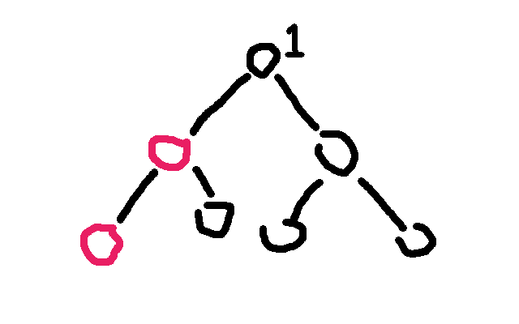

图中只有两个红色的点是**关键点**，而别的黑色的点全都是「非关键点」。一号节点（敌人所在之处）是树顶的那个标了 $1$ 的节点。

对于这题来说，我们只需要保证红色的点无法到达 $1$ 号节点就行了。

通过肉眼观察可以得出结论——$1$ 号节点的右子树（虽然实际上可能有多个子树，但这里只有两个子树，所以暂时这么称呼了）一个红色节点都木有，**所以没必要去 DP 它**，不是吗？

观察题目给出的条件，红色点（关键点）的总数是与 $n$ 同阶的，也就是说实际上一次询问中红色的点对于整棵树来说是很稀疏的，所以如果我们能让复杂度由红色点的总数来决定就好了。

因此我们需要**浓缩信息，把一整颗大树浓缩成一颗小树**。

由此我们引出了**「虚树」**这个概念。

我们先直观地来看看虚树的样子。

下图中，左边为原树，右边为生成的新的虚树。

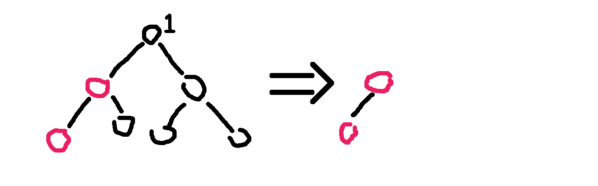

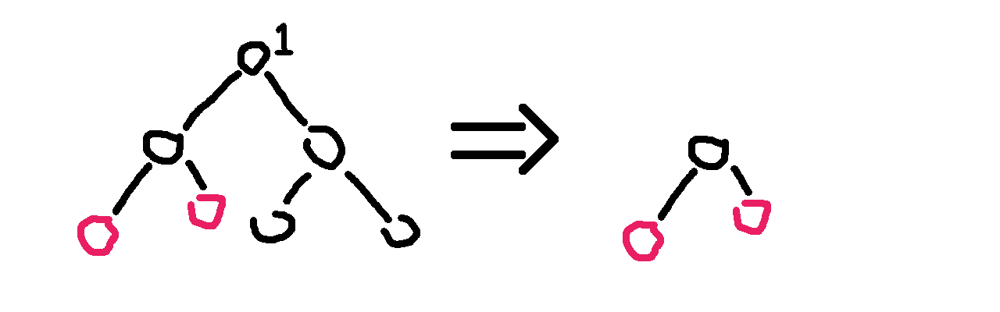

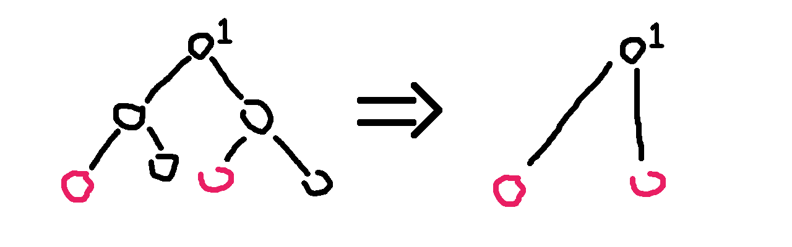

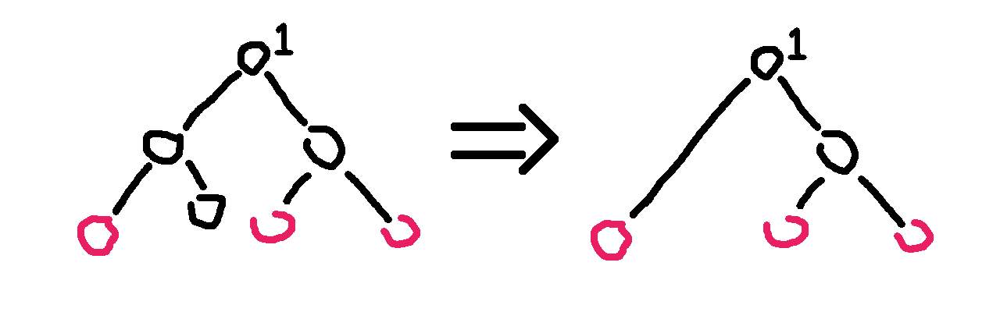

看明白了吗？

因为任意两个关键点的 LCA 也是需要保存重要信息的，所以我们需要保存它们的 LCA，也就是虚树中不一定只有关键点。

不难发现虚树中祖先 -> 后代的关系并不会改变。（就是不会出现原本 $a$ 是 $b$ 的祖先结果后面 $a$ 变成 $b$ 的后代了之类的鬼事）

但我们不可能 $O(k^2)$ 暴力枚举 LCA，所以我们不难想到——首先将关键点按 DFS 序排序，然后排完序以后相邻的两个关键点（相邻指的是在排序后的序列中下表差值的绝对值等于1）求一下 LCA，并把它加入虚树。

因为可能多个节点的 LCA 可能是同一个，所以我们不能多次将它加入虚树。

非常直观的一个方法是：

- 将关键点按 DFS 序排序；
- `for` 一遍，任意两个相邻的关键点求一下 LCA，并且哈希表判重；
- 然后根据原树中的祖先 -> 后代关系建树（然而我并不知道怎么建树）。

……

感觉很不可做的样子。<(=┘￣Д￣)┘╧═╧

所以，这里我们提出一种用单调栈的做法。

在提出方案之前，我们先确认一个事实——在虚树里，只要保证祖先 -> 后代的关系没有改变，就可以随意添加节点。

也就是，如果我们乐意，我们可以把原树中所有的点都加入虚树中，也不会导致 WA（虽然会导致 TLE）。

因此，我们为了方便，可以首先将 $1$ 号节点加入虚树中，并且并不会影响答案。

好，开始讲怎么用单调栈来建立一棵虚树吧。

首先我们要明确一个目的——我们要用单调栈来维护一条虚树上的链。

也就是一个栈里相邻的两个节点在虚树上也是相邻的，而且栈是从底部到栈首单调递增的（指的是栈中节点 DFS 序单调递增），说白了就是某个节点的父亲就是栈中它下面的那个节点。

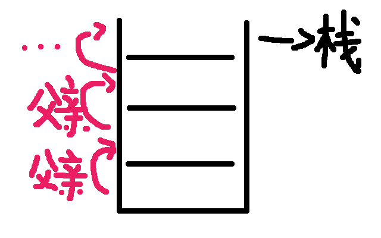

首先我们在栈中添加节点 $1$。

然后接下来按照 DFS 序从小到达添加关键节点。

假如当前的节点与栈顶节点的 LCA 就是栈顶节点的话，则说明它们是在一条链上的。所以直接把当前节点入栈就行了。

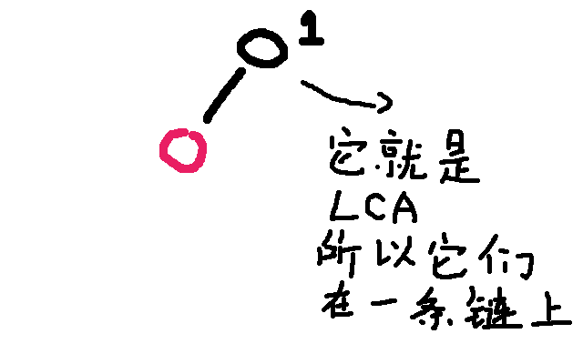

假如当前节点与栈顶节点的 LCA 不是栈顶节点的话，比如这样——

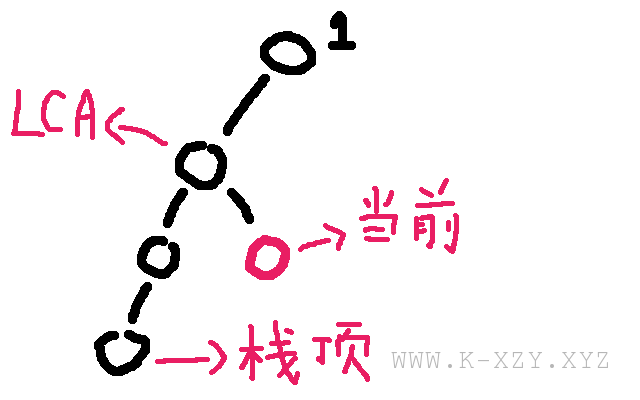

那就……非常尴尬了

显然，当前单调栈维护的链是：

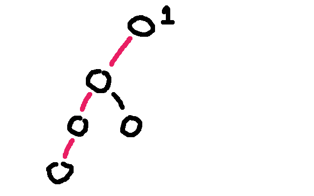

而我们需要把链变成：

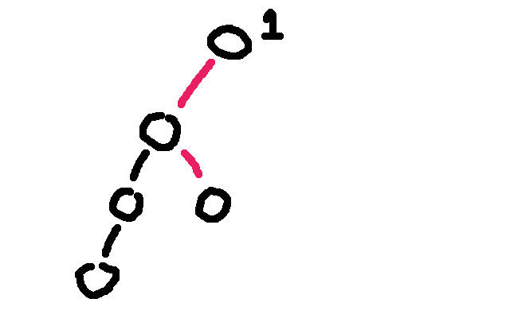

那么我们就虚树中连上这些边：

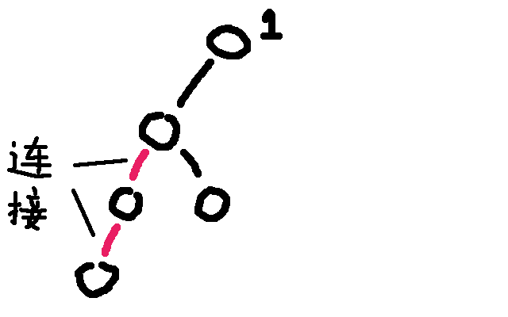

并且把这两个点从栈中弹出：

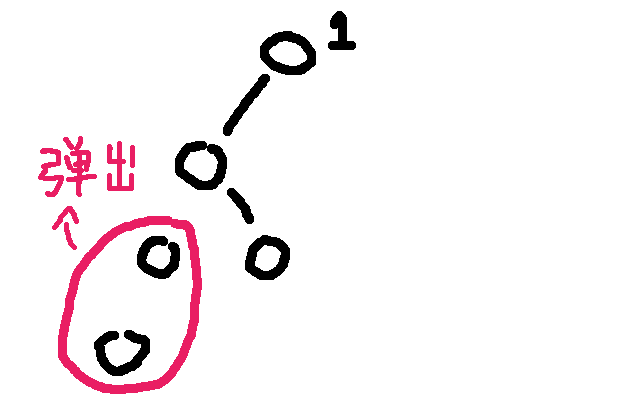

假如弹出以后发现栈首不是 LCA 的话要让 LCA 入栈。

再把当前节点入栈就行了。

打个比方吧。

假如那棵树长这样：

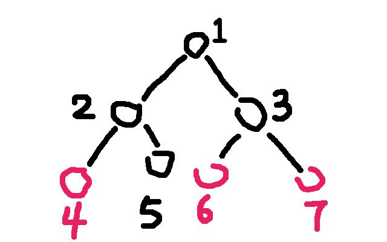

那么步骤是这样的：

- 将 $3$ 个关键点 $6,4,7$（我故意打乱了）按照 DFS 序排序，得到序列 $4,6,7$；
- 将点 $1$ 入栈；
- 取序列第一个作为当前节点，为 $4​$，再取栈顶元素，为 $1​$。求 $1​$ 和 $4​$ 的 LCA​：$\text{LCA}(1,4)=1​$；
- 发现 $\text{LCA}(1,4)$ 为栈顶元素，说明它们在虚树的一条链上，所以直接把当前节点 $4$ 入栈，当前栈为 $4,1$；
- 取序列第二个作为当前节点，为 $6$。再取栈顶元素，为 $4$。求 $6$ 和 $4$ 的 LCA：$\text{LCA}(6,4)=1$；
- 发现 $\text{LCA}(6,4)$ 不等于栈顶元素，进入判断阶段；
- 判断阶段：发现栈顶节点 $4$ 的 DFS 序是大于 $\text{LCA}(6,4)$ 的，但是次大节点（栈顶节点下面的那个节点）$1$ 的 DFS 序是等于 LCA 的（其实 DFS 序相等说明节点也相等），说明 LCA 已经入栈了，所以直接连接 $1\to 4$ 的边，也就是 LCA 到栈顶元素的边。并把 $4$ 从栈中弹出；
- 结束了判断阶段，将 $6$ 入栈，当前栈为 $6,1$；
- 取序列第三个作为当前节点，为 $7$。再取栈顶元素，为 $6$。求 $7$ 和 $6$ 的 LCA ：$\text{LCA}(7,6)=3$；
- 发现 $\text{LCA}(7,6)$ 不等于栈顶元素，进入判断阶段；
- 判断阶段：发现栈顶节点 $6$ 的 DFS 序是大于 $\text{LCA}(7,6)$ 的，但是次大节点（栈顶节点下面的那个节点）$1$ 的 DFS 序是小于 LCA 的，说明 LCA 还没有入过栈，所以直接连接 $3\to 6$ 的边，也就是 LCA 到栈顶元素的边。把 $6$ 从栈中弹出，并且把 $\text{LCA}(6,7)$ 入栈。
- 结束了判断阶段，将 $7$ 入栈，当前栈为 $3,7$；
- 发现序列里的 $2$ 个节点已经全部加入过栈了，退出循环；
- 此时栈中还有 $2$ 个节点：$3,7$，很明显它们是一条链上的，所以直接链接 $3\to 7$的边；
- 虚树就建完啦！

其中有很多细节，比如我是用临接表存图的方式存虚树的，所以需要清空临接表。但是直接清空整个临接表是很慢的，所以我们在**有一个从未入栈的元素入栈的时候清空该元素对应的临接表**即可。

建立虚树的 C++ 代码大概长这样：

```cpp
sort(h + 1, h + 1 + k, cmp);
sta[top = 1] = 1, g.sz = 0, g.head[1] = -1;
//1号节点入栈，清空1号节点对应的临接表，设置临接表边数为1
for (int i = 1, l; i <= k; i += 1) if (h[i] != 1)//如果1号节点是关键节点就不要重复添加
{
  l = lca(h[i], sta[top]);//计算当前节点与栈顶节点的LCA
  if (l != sta[top])//如果LCA和栈顶元素不同，则说明当前节点不再当前栈所存的链上
  {
    while (id[l] < id[sta[top - 1]])//当次大节点的Dfs序大于LCA的Dfs序
      g.push(sta[top - 1], sta[top]), top--;//把与当前节点所在的链不重合的链连接掉并且弹出
    if (id[l] > id[sta[top - 1]])//如果LCA不等于次大节点（这里的大于其实和不等于没有区别）
      g.head[l] = -1, g.push(l, sta[top]), sta[top] = l;
    //说明LCA是第一次入栈，清空其临接表，连边后弹出栈顶元素，并将LCA入栈
    else g.push(l, sta[top--]);//说明LCA就是次大节点，直接弹出栈顶元素
  }
  g.head[h[i]] = -1, sta[++top] = h[i];//当前节点必然是第一次入栈，清空临接表并入栈
}
for (int i = 1; i < top; i += 1) g.push(sta[i], sta[i + 1]);//剩余的最后一条链连接一下
```
于是我们就学会了虚树的建立了！

对于消耗战这题，直接在虚树上跑最开始讲的那个 DP 就行了，我们等于利用了虚树排除了那些没用的非关键节点！

- 若 $son[i]$ 不是关键点：$Dp[i]=Dp[i] + \min \{Dp[son[i]],w[i,son[i]]\}$
- 若 $son[i]$ 是关键点：$Dp[i]=Dp[i] + w[i,son[i]]$

于是这题很简单就过了。

代码看下面。

## 推荐习题

## BZOJ - 2286 消耗战

代码：

```cpp
#include <bits/stdc++.h>

#define NS (250005)
#define LGS (18)

using namespace std;

typedef long long LL;

template <typename _Tp> inline void IN(_Tp& dig)
{
	char c; bool flag = 0; dig = 0;
	while (c = getchar(), !isdigit(c)) if (c == '-') flag = 1;
	while (isdigit(c)) dig = dig * 10 + c - '0', c = getchar();
	if (flag) dig = -dig;
}

struct graph
{
	int head[NS], nxt[NS << 1], to[NS << 1], w[NS << 1], sz;
	void init(){memset(head, -1, sizeof(head)), sz = 0;}
	graph(){init();}
	void push(int a, int b, int c)
	{
		nxt[sz] = head[a], to[sz] = b, w[sz] = c, head[a] = sz++;
	}
	int& operator [] (const int a){return to[a];}
}g;

int n, pre[NS][LGS + 1], dep[NS], mx[NS][LGS + 1], id[NS], dfn;

int m, k, h[NS], sta[NS], top, MX;

LL f[NS];

bool book[NS];

void Init(int a, int fa)
{
	pre[a][0] = fa, dep[a] = dep[fa] + 1, id[a] = ++dfn;
	for (int i = 1; i <= LGS; i += 1)
	{
		pre[a][i] = pre[pre[a][i - 1]][i - 1];
		mx[a][i] = min(mx[a][i - 1], mx[pre[a][i - 1]][i - 1]);
	}
	for (int i = g.head[a]; ~i; i = g.nxt[i])
		if (g[i] != fa) mx[g[i]][0] = g.w[i], Init(g[i], a);
}

int lca(int a, int b)
{
	MX = INT_MAX;
	if (dep[a] > dep[b]) swap(a, b);
	for (int i = LGS; i >= 0; i -= 1)
		if (dep[pre[b][i]] >= dep[a])
			MX = min(MX, mx[b][i]), b = pre[b][i];
	if (a == b) return a;
	for (int i = LGS; i >= 0; i -= 1)
		if (pre[a][i] != pre[b][i])
		{
			MX = min(MX, min(mx[a][i], mx[b][i]));
			a = pre[a][i], b = pre[b][i];
		}
	return pre[a][0];
}

bool cmp(int a, int b){return id[a] < id[b];}

void Dp(int a)
{
	f[a] = 0;
	for (int i = g.head[a]; ~i; i = g.nxt[i])
	{
		Dp(g[i]);
		if (book[g[i]]) f[a] += g.w[i];
		else f[a] += min((LL)g.w[i], f[g[i]]);
	}
}

int main (int argc, char const* argv[])
{
	IN(n);
	for (int i = 1, a, b, c; i < n; i += 1)
		IN(a), IN(b), IN(c), g.push(a, b, c), g.push(b, a, c);
	Init(1, 0), IN(m);
	while (m--)
	{
		IN(k);
		for (int i = 1; i <= k; i += 1) IN(h[i]), book[h[i]] = 1;
		sort(h + 1, h + 1 + k, cmp);
		sta[top = 1] = 1, g.sz = 0, g.head[1] = -1;
		for (int i = 1, l; i <= k; i += 1) if (h[i] != 1)
		{
			l = lca(sta[top], h[i]);
			if (l != sta[top])
			{
				while (id[l] < id[sta[top - 1]])
				{
					lca(sta[top - 1], sta[top]);
					g.push(sta[top - 1], sta[top], MX);
					top--;
				}
				if (id[l] > id[sta[top - 1]])
				{
					g.head[l] = -1 ,lca(l, sta[top]);
					g.push(l, sta[top], MX), sta[top] = l;
				}
				else lca(l, sta[top]), g.push(l, sta[top--], MX);
			}
			g.head[h[i]] = -1, sta[++top] = h[i];
		}
		for (int i = 1; i < top; i += 1)
			lca(sta[i], sta[i + 1]), g.push(sta[i], sta[i + 1], MX);
		Dp(1), printf("%lld\n", f[1]);
		for (int i = 1; i <= k; i += 1) book[h[i]] = 0;
	}
	return 0;
}
```


## BZOJ - 3611 大工程

代码：

```cpp
#include <bits/stdc++.h>

#define NS (1000005)
#define LGS (20)

#define INF (100000000)

using namespace std;

typedef long long  LL;

template <typename _Tp> inline void IN(_Tp& dig)
{
	char c; bool flag = 0; dig = 0;
	while (c = getchar(), !isdigit(c)) if (c == '-') flag = 1;
	while (isdigit(c)) dig = dig * 10 + c - '0', c = getchar();
	if (flag) dig = -dig;
}

struct graph
{
	int head[NS], nxt[NS << 1], to[NS << 1], sz;
	void init(){memset(head, -1, sizeof(head)), sz = 0;}
	graph(){init();}
	void push(int a, int b)
	{
		nxt[sz] = head[a], to[sz] = b, head[a] = sz++;
	}
	int operator [] (const int a){return to[a];}
}g;

int n, id[NS], dfn, q, k, h[NS], sz[NS], mn[NS], mx[NS], mnans, mxans;

int pre[NS][LGS + 1], dep[NS];

int sta[NS], top;

bool book[NS];

LL f[NS], tot;

void Init(int a, int fa)
{
	pre[a][0] = fa, dep[a] = dep[fa] + 1, id[a] = ++dfn;
	for (int i = 1; i <= LGS; i += 1)
		pre[a][i] = pre[pre[a][i - 1]][i - 1];
	for (int i = g.head[a]; ~i; i = g.nxt[i])
		if (g[i] != fa) Init(g[i], a);
}

int lca(int a, int b)
{
	if (dep[a] > dep[b]) swap(a,b);
	for (int i = LGS; i >= 0; i -= 1)
		if (dep[pre[b][i]] >= dep[a])
			b = pre[b][i];
	if (a == b) return a;
	for (int i = LGS; i >= 0; i -= 1)
		if (pre[a][i] != pre[b][i])
			a = pre[a][i], b = pre[b][i];
	return pre[a][0];
}

bool cmp(int a, int b){return id[a] < id[b];}

void Dp(int a)
{
	sz[a] = book[a], f[a] = 0;
	if (book[a]) mn[a] = mx[a] = 0;
	else mn[a] = INF, mx[a] = -INF;
	for (int i = g.head[a], l; ~i; i = g.nxt[i])
	{
		Dp(g[i]), l = dep[g[i]] - dep[a];
		tot += (f[a] + sz[a] * l) * sz[g[i]] + f[g[i]] * sz[a];
		sz[a] += sz[g[i]], f[a] += f[g[i]] + l * sz[g[i]];
		mnans = min(mnans, mn[a] + mn[g[i]] + l);
		mxans = max(mxans, mx[a] + mx[g[i]] + l);
		mn[a] = min(mn[a], mn[g[i]] + l);
		mx[a] = max(mx[a], mx[g[i]] + l);
	}
}

int main (int argc, char const* argv[])
{
	IN(n);
	for (int i = 1, a, b; i < n; i += 1)
		IN(a), IN(b), g.push(a, b), g.push(b, a);
	Init(1, 0), IN(q);
	while (q--)
	{
		IN(k);
		for (int i = 1; i <= k; i += 1) IN(h[i]), book[h[i]] = 1;
		sort(h + 1, h + 1 + k, cmp);
		sta[top = 1] = 1, g.sz = 0, g.head[1] = -1;
		for (int i = 1, l; i <= k; i += 1) if (h[i] != 1)
		{
			l = lca(h[i], sta[top]);
			if (l != sta[top])
			{
				while (id[l] < id[sta[top - 1]])
					g.push(sta[top - 1], sta[top]), top--;
				if (id[l] > id[sta[top - 1]])
					g.head[l] = -1, g.push(l, sta[top]), sta[top] = l;
				else g.push(l, sta[top--]);
			}
			g.head[h[i]] = -1, sta[++top] = h[i];
		}
		for (int i = 1; i < top; i += 1) g.push(sta[i], sta[i + 1]);
		mnans = INF, mxans = -INF, tot = 0, Dp(1);
		printf("%lld %d %d\n", tot, mnans, mxans);
		for (int i = 1; i <= k; i += 1) book[h[i]] = 0;
	}
	return 0;
}
```


## CF613D Kingdom and its Cities

代码：

```cpp
#include <bits/stdc++.h>

#define NS (100005)
#define LGS (17)

using namespace std;

template <typename _Tp> inline void IN(_Tp& dig)
{
	char c; bool flag = 0; dig = 0;
	while (c = getchar(), !isdigit(c)) if (c == '-') flag = 1;
	while (isdigit(c)) dig = dig * 10 + c - '0', c = getchar();
	if (flag) dig = -dig;
}

struct graph
{
	int head[NS], nxt[NS << 1], to[NS << 1], sz;
	void init(){memset(head, -1, sizeof(head)), sz = 0;}
	graph(){init();}
	void push(int a, int b)
	{
		nxt[sz] = head[a], to[sz] = b, head[a] = sz++;
	}
	int operator [] (const int a){return to[a];}
}g;

int n, id[NS], dfn, q, k, h[NS], c[NS];

int pre[NS][LGS + 1], dep[NS];

int sta[NS], top;

bool book[NS];

void Init(int a, int fa)
{
	pre[a][0] = fa, dep[a] = dep[fa] + 1, id[a] = ++dfn;
	for (int i = 1; i <= LGS; i += 1)
		pre[a][i] = pre[pre[a][i - 1]][i - 1];
	for (int i = g.head[a]; ~i; i = g.nxt[i])
		if (g[i] != fa) Init(g[i], a);
}

int lca(int a, int b)
{
	if (dep[a] > dep[b]) swap(a, b);
	for (int i = LGS; i >= 0; i -= 1)
		if (dep[pre[b][i]] >= dep[a])
			b = pre[b][i];
	if (a == b) return a;
	for (int i = LGS; i >= 0; i -= 1)
		if (pre[a][i] != pre[b][i])
			a = pre[a][i], b = pre[b][i];
	return pre[a][0];
}

bool cmp(int a, int b){return id[a] < id[b];}

int Dp(int a)
{
	int tot = 0, ans = 0;
	for (int i = g.head[a]; ~i; i = g.nxt[i]) ans += Dp(g[i]), tot += c[g[i]];
	if (book[a]) c[a] = 1, ans += tot;
	else if (tot > 1) c[a] = 0, ans++;
	else c[a] = tot;
	return ans;
}

int main (int argc, char const* argv[])
{
	IN(n);
	for (int i = 1, a, b; i < n; i += 1)
		IN(a), IN(b), g.push(a, b), g.push(b, a);
	Init(1, 0), IN(q);
	while (q--)
	{
		IN(k);
		for (int i = 1; i <= k; i += 1) IN(h[i]), book[h[i]] = 1;
		for (int i = 1; i <= k; i += 1)
			if (book[pre[h[i]][0]]) {puts("-1"); goto end;}
		sort(h + 1, h + 1 + k, cmp);
		sta[top = 1] = 1, g.sz = 0, g.head[1] = -1;
		for (int i = 1, l; i <= k; i += 1) if (h[i] != 1)
		{
			l = lca(h[i], sta[top]);
			if (l != sta[top])
			{
				while (id[l] < id[sta[top - 1]])
					g.push(sta[top - 1], sta[top]), top--;
				if (id[l] > id[sta[top - 1]])
					g.head[l] = -1, g.push(l, sta[top]), sta[top] = l;
				else g.push(l, sta[top--]);
			}
			g.head[h[i]] = -1, sta[++top] = h[i];
		}
		for (int i = 1; i < top; i += 1) g.push(sta[i], sta[i + 1]);
		printf("%d\n", Dp(1));
		end : for (int i = 1; i <= k; i += 1) book[h[i]] = 0;
	}
	return 0;
}
```

## BZOJ - 3572 世界树

丧心病狂啊

代码：

```cpp
#include <bits/stdc++.h>

#define NS (300005)
#define LGS (19)
#define FIR first
#define SEC second

using namespace std;

typedef pair<int,int> PII;

template <typename _Tp>inline void IN(_Tp& dig)
{
	char c; bool flag = 0; dig = 0;
	while (c = getchar(), !isdigit(c)) if (c == '-') flag = 1;
	while (isdigit(c)) dig = dig * 10 + c - '0', c = getchar();
	if (flag) dig = -dig;
}

struct graph
{
	int head[NS], nxt[NS << 1], to[NS << 1], sz;
	void init(){memset(head, -1, sizeof(head)), sz = 0;}
	graph(){init();}
	void push(int a, int b)
	{
		nxt[sz] = head[a], to[sz] = b, head[a] = sz++;
	}
	int operator [] (const int a){return to[a];}
}g;

int n, m, q, h[NS], arr[NS], ans[NS];

int pre[NS][LGS + 1], dep[NS], id[NS], dfn, sz[NS];

int st[NS], top;

bool book[NS];

PII mx[NS];

bool cmp(int a,int b)
{
	return id[a] < id[b];
}

void Init(int a, int fa)
{
	pre[a][0] = fa, dep[a] = dep[fa] + 1, id[a] = ++dfn, sz[a] = 1;
	for (int i = 1; i <= LGS; i += 1) pre[a][i] = pre[pre[a][i - 1]][i - 1];
	for (int i = g.head[a]; ~i; i = g.nxt[i])
		if (g[i] != fa) Init(g[i], a), sz[a] += sz[g[i]];
}

int jump(int a, int k)
{
	for (int i = 0; i <= LGS; i += 1)
		if ((k >> i) & 1) a = pre[a][i];
	return a;
}

int lca(int a, int b)
{
	if (dep[a] > dep[b]) swap(a, b);
	b = jump(b, dep[b] - dep[a]);
	if (a == b) return a;
	for (int i = LGS; i >= 0; i -= 1)
		if (pre[a][i] != pre[b][i])
			a = pre[a][i], b = pre[b][i];
	return pre[a][0];
}

void dfs1(int a)
{
	if (book[a]) mx[a] = PII(0, a);
	else mx[a] = PII(1e8, 0);
	for (int i = g.head[a]; ~i; i = g.nxt[i])
	{
		dfs1(g[i]);
		PII tmp = mx[g[i]];
		tmp.FIR = dep[mx[g[i]].SEC] - dep[a];
		mx[a] = min(mx[a], tmp);
	}
}

void dfs2(int a)
{
	for (int i = g.head[a]; ~i; i = g.nxt[i])
	{
		PII tmp = mx[a];
		tmp.FIR += dep[g[i]] - dep[a];
		mx[g[i]] = min(mx[g[i]], tmp), dfs2(g[i]);
	}
	ans[mx[a].SEC] = max(ans[mx[a].SEC], sz[a]);
}

void dfs3(int a)
{
	for (int i = g.head[a], x, y, dis, z; ~i; i = g.nxt[i])
	{
		if (x = mx[a].SEC, y = mx[g[i]].SEC, x != y)
		{
			dis = dep[x] + dep[y] - (dep[lca(x, y)] << 1);
			z = jump(g[i], (dis >> 1) - mx[g[i]].FIR);
			if (dis & 1) ans[x] -= sz[z];
			else
			{
				if (z != a && z != g[i])
					z = jump(g[i], (dis >> 1) - mx[g[i]].FIR - (x < y));
				else if (z == a)
					z = jump(g[i], (dis >> 1) - mx[g[i]].FIR - 1);
				ans[x] -= sz[z];
			}
			if (g[i] != z) ans[y] += sz[z] - sz[g[i]];
		}
		dfs3(g[i]);
	}
}

int main (int argc, char const* argv[])
{
	IN(n);
	for (int i = 1, a, b; i < n; i += 1)
		IN(a), IN(b), g.push(a, b), g.push(b, a);
	Init(1, 0), IN(q);
	while (q--)
	{
		IN(m), g.sz = 0;
		for (int i = 1; i <= m; i += 1)
			IN(h[i]), book[h[i]] = 1, ans[arr[i] = h[i]] = 0;
		sort(h + 1, h + 1 + m, cmp), st[top = 1] = 1, g.head[1] = -1;
		for (int i = 1, l; i <= m; i += 1)
		{
			if (h[i] == 1) continue;
			l = lca(st[top], h[i]);
			if (l != st[top])
			{
				while (id[l] < id[st[top - 1]])
					g.push(st[top - 1], st[top]), top--;
				if (id[l] > id[st[top - 1]])
					g.head[l] = -1, g.push(l, st[top]), st[top] = l;
				else g.push(l, st[top--]);
			}
			g.head[h[i]] = -1, st[++top] = h[i];
		}
		for (int i = 1; i < top; i += 1) g.push(st[i], st[i + 1]);
		dfs1(1), dfs2(1), dfs3(1);
		for (int i = 1; i <= m; i += 1) printf("%d ", ans[arr[i]]);
		putchar(10);
		for (int i = 1; i <= m; i += 1) book[h[i]] = 0;
	}
	return 0;
}
```
