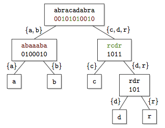

author: ShwStone

前置知识：[持久化 01-trie](./persistent-trie.md)，[持久化权值线段树/主席树](./persistent-seg.md)。

Wavelet Matrix 是一种 $\mathcal O(\log W)$ 的时间内能完成静态区间第 $k$ 大，区间排名查询，区间出现次数，区间第 $k$ 次出现的数据结构，在许多情况下可以当作持久化权值线段树（主席树）或持久化 01 trie 的小常数替代品。

Wavelet Matrix 同时是一种简洁数据结构，即使用 $n + o(n)$ 空间实现的数据结构。

静态的 Wavelet Matrix 实现非常简单，常数也很小。如果使用平衡树实现一个内部结构，则可以在单次 $\mathcal O(\log W \log n)$ 复杂度支持动态的单点修改和询问。

下面约定一些符号：

-   $\operatorname{rank}_a(l, r, w)$ 表示序列 $a$ 区间 $[l, r]$ 内 $w$ 的排名（从小到大）。
-   $\operatorname{kth}_a(l, r, k)$ 表示序列 $a$ 区间 $[l, r]$ 的第 $k$ 大。
-   $\operatorname{count}_a(l, r, w)$ 表示序列 $a$ 区间 $[l, r]$ 内 $w$ 的出现次数。
-   $\operatorname{select}_a(w, k)$ 表示序列 $a$ 中 $w$ 元素第 $k$ 次出现的位置。

由于比较小众，没有一个公认的中文名。不过其英文名 Wavelet 来自于 Wavelet Tree 结构与离散小波变换过程的相似性，所以可以称 Wavelet Matrix 为小波矩阵，称 Wavelet Tree 为小波树。

## 压缩位向量

我们先来考察一个简单的情况：当序列是一个 01 序列时，如何实现上面的操作？

大概 2000 年左右一系列压缩位向量的数据结构被提出，它们可以通过 $\mathcal O(n)$ 时间预处理，$\mathcal o(n)$ 的额外空间，在常数时间内静态实现 01 序列上的 $\operatorname{count},\operatorname{select}$ 操作。

???+ info "关于 $\operatorname{select}$ 操作"
    $\operatorname{select}$ 操作在算法竞赛中不常见，但是实现很复杂。读者可以先阅读有关 $\operatorname{count}$ 的内容，完全理解后再考虑 $\operatorname{select}$。
    

不难发现 $\operatorname{count}_a(l, r, w) = \operatorname{count}_a(1, r, w) - \operatorname{count}_a(1, l-1, w)$，所以接下来我们只解决前缀 $\operatorname{count}$ 的实现。

### $\operatorname{count}$

为了完成 $\operatorname{count}$ 操作，压缩位向量把 01 序列分成长为 $B$ 的块。我们可以处理出每一块内 1 的数量，得到长为 $\lceil \frac{n}{B}\rceil$ 的数列 $c$；再做 $c$ 的前缀和，得到一个长为 $\lceil \frac{n}{B}\rceil$ 的数列 $S$，$S_i$ 表示前 $i$ 块中 1 的出现次数。

???+ note "实用的实现"
    竞赛场景下，我们可以设定 $B = 64$，然后简单地调用 `__builtin_popcountll` 直接计算块内的 $\operatorname{count}$。压缩位向量是一个理论数据结构，我们将接着给出完整的实现。

对于一个长为 $B$，含有 $p_i$ 个 1 的块，本质不同的块的个数是 $\binom{B}{p_i}$。我们可以预处理出每一种块的前缀和，这样，块内的前缀 01 个数也可以 $\mathcal O(1)$ 查询。

但是很可惜，这样占用的总空间是 $\lceil \frac{n}{B} \rceil + B 2^B$ 个数。由于一个数需要 $\mathcal O(\log n)$ 个 bit, 这样还无法做到 $o(n)$ 的额外空间。

压缩位向量的做法是首先把序列先分为长度为 $m$ 的超级块，再对于每个超级块进行上述分块。同样维护超级块的前缀和。查询时，先查超级块的和，再查块和，最后查表得到块内前缀和。这样有 $\lceil \frac{n}{m} \rceil$ 个 $\log n$ 位的超级块前缀和，$\lceil \frac{n}{B} \rceil$ 个 $\log m$ 位的块前缀和，$B 2^B$ 个 $\log B$ 位数字组成的表。取 $m = \frac{\log^2 n}{2}$,$B = \frac{\log n}{2}$，总空间占用是 $n + o(n)$ 位。

上面的做法实现了 $\operatorname{count}_a(1, r, 1)$，显然有 $\operatorname{count}_a(1, r, 0) = r - \operatorname{count}_a(1, r, 1)$。

### $\operatorname{select}$

???+ info "不常用的操作"
    Wavelet Matrix 只有 $\operatorname{select}$ 操作会使用压缩位向量的 $\operatorname{select}$ 操作。如果不需要可以跳过这一节。

一个简单的做法是在超级块和块内进行二分查找，时间复杂度为 $\mathcal O(\log n)$。下面介绍 $\mathcal O(1)$ 的做法。

我们解决 $w=1$ 的询问。0 的情况是对称的。

将每 $L$ 个 1 分成一块，取 $L = \lfloor \log n\log\log n\rfloor$。

维护 $p_i$ 表示第 $iL$ 个 1 所在的位置。存储 $p_i$ 需要 $\mathcal O(\frac{n}{L} \log n) = \mathcal O(\frac{n}{\log \log n})$ 个二进制位。

容易知道第 $k$ 个 1 在哪个 $p_i$ 与 $p_{i+1}$ 之间。设 $r = p_{i+1} - p_i$，直接存储这一段内的 1 的位置需要 $L\log n$ 个位。

如果 $L \log n \le \lfloor\frac{r}{\log \log n}\rfloor$，也即 $r \ge L^2$，我们直接存储这些 1 的位置。因为 $\sum r = n$，这样不会使得总空间超过 $\mathcal O(\frac{n}{\log \log n})$。

否则 $r < L^2$。那么我们递归存储这一结构，即将这一块每 $L'$ 个 1 分成一个小块。取 $L' = \lfloor\log r \log \log n\rfloor$。

维护 $p'_i$ 表示这一段中第 $iL'$ 个 1 的相对位置（从 $1 \sim r$），存储 $p'$ 需要 $\mathcal O(\frac{r}{L'}\log r) = \mathcal O(\frac{r}{\log \log n})$ 个位。

同样知道 $k$ 在 $p'_i$ 与 $p'_{i+1}$ 之间。设 $r' = p'_{i+1} - p'_i$。直接存储这一段需要 $L'\log r$ 个二进制位。

如果 $L'\log r \le \lfloor\frac{r'}{\log \log n}\rfloor$，即 $r' \ge L'^2$ 则还是直接存储。因为 $\sum r'=n$，这样不会使得总空间超过 $\mathcal O(\frac{n}{\log \log n})$。

最后的情况是 $r' < L'^2 < (\log r \log \log n)^2$，由于 $r < L < (\log n \log \log n)^2$，则 $\log r < 2(\log \log n + \log \log \log n) < 4 \log \log n$。那么 $r' < 16 (\log \log n)^4$。

由于 $(\log \log n)^4$ 渐进小于 $\log n$，所以 $r' = \mathcal O(\log n)$。换句话说，此时答案所在的区间长度已经是 $\log n$ 级别的。那直接对所有长为 $\frac{\log n}{2}$ 的区间的 $\operatorname{select}$ 结果进行预处理，所需的空间是 $\mathcal O(\sqrt n \log \log n)$。

总共的额外空间是 $\mathcal O(\frac{n}{\log \log n}) + \mathcal O(\sqrt n \log \log n) = o(n)$。时间复杂度 $\mathcal O(1)$。

### 实现

理论的 $\mathcal O(1)$ 所需的常数和编码复杂度是难以接受的。

下面给出在算法竞赛中可接受的代码实现。采用 $B = 64$，`__builtin_popcountll` 求解散块，二分法实现 $\operatorname{select}$。

```cpp
struct Bits {
  vector<unsigned long long> b;
  vector<int> sum;
  int len;

  Bits(int n) {
    len = n >> 6;
    b.resize(len + 1, 0);
    sum.resize(len + 1, 0);
  }

  // 第 k 位（从 1 开始编号）设为 1
  void set(int k) {
    k--;  // 内部从 0 开始存储
    b[k >> 6] |= (1ull << (k & 0x3f));
  }

  // 设定完毕后调用
  void prepare() {
    for (int i = 0; i < b.size(); i++) {
      if (i) sum[i] = sum[i - 1];
      sum[i] += __builtin_popcountll(b[i]);
    }
  }

  int count1(int k) {
    int res = 0;
    int hi = (k >> 6), lo = (k & 0x3f);
    if (hi) res += sum[hi - 1];
    // (1 << lo) - 1 取了小于 lo 的位，正好符合从 0 开始存储
    res += __builtin_popcountll(b[hi] & ((1ull << lo) - 1ull));
    return res;
  }

  int count0(int k) { return k - count1(k); }

  int select1(int k) {
    int hi_l = 0, hi_r = len, mid;
    while (hi_l < hi_r) {
      mid = (hi_l + hi_r) >> 1;
      if (sum[mid] < k)
        hi_l = mid + 1;
      else
        hi_r = mid;
    }
    int lo_l = 1, lo_r = 64;
    while (lo_l < lo_r) {
      mid = (lo_l + lo_r) >> 1;
      int cnt = __builtin_popcountll(b[hi_l] & ((1ull << mid) - 1ull));
      if (cnt < k)
        lo_l = mid + 1;
      else
        lo_r = mid;
    }
    return 64 * hi_l + lo_l;
  }

  int select0(int k) {
    int hi_l = 0, hi_r = len, mid;
    while (hi_l < hi_r) {
      mid = (hi_l + hi_r) >> 1;
      if (64 * (mid + 1) - sum[mid] < k)
        hi_l = mid + 1;
      else
        hi_r = mid;
    }
    int lo_l = 1, lo_r = 64;
    while (lo_l < lo_r) {
      mid = (lo_l + lo_r) >> 1;
      int cnt = __builtin_popcountll((~b[hi_l]) & ((1ull << mid) - 1ull));
      if (cnt < k)
        lo_l = mid + 1;
      else
        lo_r = mid;
    }
    return 64 * hi_l + lo_l;
  }
};
```

大部分的时候用不到 $\operatorname{select}$，编码复杂度和时间复杂度都会很优秀。

## Wavelet Tree

### 结构

Wavelet Tree 是 Wavelet Matrix 的原型。对于值域在 $\Sigma$ 上的序列 $a$，对 $\Sigma$ 中的元素进行二进制编码（比如按照 $a$ 内的出现频率进行 [霍夫曼编码](./huffman-tree.md)）。

Wavelet Tree 的基础结构是一个 01 trie，在每个节点上，用一个压缩位向量维护下一位的 01 情况。

以根节点为例，Wavelet Tree 维护一个 01 序列 $b$，其中 $b_i$ 是 $a_i$ 的最高二进制位。接下来，$a$ 按照最高位分成两个子列 $a_0,a_1$，最高位为 0 的子列 $a_0$ 进入左儿子，最高位为 1 的子列 $a_1$ 进入右儿子。

递归地，左儿子维护 01 序列 $b_0$，其中 $b_{0i}$ 是 $a_{0i}$ 的次高位；右儿子维护 01 序列 $b_1$，其中 $b_{1i}$ 是 $a_{1i}$ 的次高位。

递归完成 01 trie 的结构，整个结构就是一颗 Wavelet Tree。

下面是一个示意图：



字符串只是为了帮助理解。实际上 Wavelet Tree 不存储真实数据，只存储压缩位向量。

### $\operatorname{count}$

对于询问 $\operatorname{count}_a(l, r, w)$，我们首先考察 $w$ 的最高位。如果最高位是 $c$，那么所有的 $w$ 都出现在 $a_c$ 里，而 $a_{1-c}$ 中不会含有 $w$。

不难发现，$[l,r]$ 在子列 $a_c$ 上对应的区间是 $[\operatorname{count}_b(1, l-1, c) + 1, \operatorname{count}_b(1, r, c)]$。我们把这个新的区间记作 $[l_c,r_c]$。

则有 $\operatorname{count}_a(l, r, w) = \operatorname{count}_{a_c}(l_c, r_c, w)$。相当于我们将问题转化到子节点 $a_c$ 上。

当转移到叶子节点时，$a_{\text{leaf}}$ 的所有元素都是 $w$，则 $\operatorname{count}_{a_\text{leaf}}(l_\text{leaf}, r_\text{leaf}, w) = r_\text{leaf} - l_\text{leaf} + 1$。

以前文的图为例。$\operatorname{count}_a(3, 7, \text{a})$，根节点的区间 $[3,7]$ 在左儿子上对应区间 $[3,4]$。这是因为 $a_3$ 之前（不含）元素 $\{\text{a}, \text{b}\}$ 出现了 2 个，而 $a_7$ 及以前 $\{\text{a}, \text{b}\}$ 出现了 4 个，则在 $[3,7]$ 内的 $\{\text{a},\text{b}\}$ 是第 3 个和第 4 个 $\{\text{a},\text{b}\}$。

### $\operatorname{kth}$

对于询问 $\operatorname{kth}_a(l, r, k)$，首先考虑最高位，我们可以知道 $[l, r]$ 内有 $cnt = \operatorname{count}_b(l, r, 1)$ 个元素最高位是 1。如果这个数大于等于 $k$，则第 $k$ 大的最高位是 1，问题转移到 $\operatorname{kth}_{a_1}{l, r, k}$，否则答案最高位是 0，问题转移到 $\operatorname{kth}_{a_0}(l, r, k - cnt)$。到叶子节点，答案的每一位都被确定。

读者可以将这一做法与持久化 01-trie 或持久化权值线段树进行比较，不难发现两者的思想十分相似。

### $\operatorname{rank}$

对于询问 $\operatorname{rank}_a(l, r, w)$，我们考虑 $w$ 的最高位，若最高位是 0，则答案是 $\operatorname{rank}_{a_0}(l_0, r_0, w)$。否则答案是 $\operatorname{rank}_{a_1}(l_1, r_1, w) + \operatorname{count}_{b}(l, r, 0)$。叶子节点的答案为 1。

同样的，读者可以把这一做法与持久化 01-trie 或持久化权值线段树进行比较。

### $\operatorname{select}$

如果需要查询从第 $i$ 位开始的 $\operatorname{select}$，可以先把 $k \leftarrow k + \operatorname{rank}_a(1, i-1, w)$。

考虑 $w$ 的最高位。设最高位是 $c$，那么第 $k$ 个 $w$ 在 $c$ 儿子中排第 $k' = \operatorname{select}_{a_c}(w, k)$ 位。则 $c$ 儿子的第 $k'$ 位在当前节点排 $\operatorname{select}_b(c, k')$。所以 $\operatorname{select}_a(w, k) = \operatorname{select}_b(c, \operatorname{select}_{a_c}(w, k))$。

叶子节点的答案就是 $k$。

如果使用 $\mathcal O(1)$ 实现的 $\operatorname{select}_b$，时间复杂度是 $\mathcal O(\log W)$。

其他的一些扩展操作不在此列出，读者在需要时可以仿照主席树的思考方式来思考如何在 Wavelet Tree 上实现。

### 实现

由于 Wavelet Matrix 是 Wavelet Tree 的上位替代，此处不给出代码实现。

## Wavelet Matrix

### 结构

Wavelet Matrix 的思想就是，将 Wavelet Tree 的同一层的所有位向量按照一定顺序拼成一个长度为 $n$ 的位向量一起存储，这样只剩下 $\log W$ 个长为 $n$ 的位向量，无需维护 01-trie 的结构。

具体的顺序如下：按照那一层对应的二进制位进行稳定排序，位为 1 的放在 0 的前面，但是二进制位相同的不改变顺序。

在构建时，最高层对应原来的根节点，存储最高位的 01 串 $b$。下一层是原来的 $b_1$ 拼上 $b_0$，存储次高位的 01 串。再下一层是在次高层基础上将 $b_{00}, b_{01}, b_{10}, b_{11}$ 按照第三高位进行稳定排序，即 $b_{11} + b_{01} + b_{10} + b_{00}$ 的顺序拼接。（仔细思考为什么是这个顺序，是在次高层顺序基础上排序，所以 $b_{11}$ 排在 $b_{01}$ 前面）

实现上，构造第 $i$ 层时，将原始数据按照上一层稳定排序（`stable_sort`），然后取第 $i$ 位作为第 $i$ 层存储的内容。

### 区间转移

-   原来我们将区间 $[l, r]$ 转移到 $c$ 儿子上时，$[l_c, r_c] = [\operatorname{count}_b(1, l-1, c) + 1, \operatorname{count}_b(1, r, c)]$。
-   现在：
    -   当 $c=1$ 时，稳定排序后排在 $l$ 之前的元素只有 $[1, l-1]$ 之内的 1。则 $[l_1, r_1] = [\operatorname{count}_b(1, l-1, 1) + 1, \operatorname{count}_b(1, r, 1)]$。
    -   当 $c=0$ 时，稳定排序后排在 $l$ 之前的元素既包括 $[1, l-1]$ 之内的 0, 也包括所有的 1。记 $cnt_1 = \operatorname{count}_b(1, n, 1)$，$[l_0, r_0] = [cnt_1 + \operatorname{count}_b(1, l-1, 0) + 1, cnt_1 + \operatorname{count}_b(1, r, 0)]$。

当我们确定区间如何转移之后，所有的操作就和 Wavelet Tree 一致。但是此时不再需要递归组织树状结构，而可以直接用循环实现。

### 实现

```cpp
struct WaveletMatrix {
  vector<Bits> b;
  int n;

  // 实际上构造 Wavelet Matrix 之后，不难 O(log n) 求出原始的 a[i]
  // 注意 a 将被修改
  WaveletMatrix(int n, int *a) {
    this->n = n;
    b.resize(32, Bits(n));
    for (int j = 31; j >= 0; j--) {
      for (int i = 1; i <= n; i++)
        if ((a[i] >> j) & 1) b[j].set(i);
      b[j].prepare();
      stable_partition(a + 1, a + n + 1, [&](int x) { return (x >> j) & 1; });
    }
  }

  int count(int l, int r, int w) {
    for (int j = 31; j >= 0; j--) {
      int c = (w >> j) & 1;
      int l1 = b[j].count1(l - 1), r1 = b[j].count1(r);
      if (c)
        l = l1 + 1, r = r1;
      else {
        int l0 = l - 1 - l1, r0 = r - r1;
        int total = b[j].count1(n);
        l = total + l0 + 1, r = total + r0;
      }
    }
    return r - l + 1;
  }

  int kth(int l, int r, int k) {
    int res = 0;
    for (int j = 31; j >= 0; j--) {
      int l1 = b[j].count1(l - 1), r1 = b[j].count1(r);
      if (r1 - l1 >= k)
        l = l1 + 1, r = r1, res |= (1 << j);
      else {
        int l0 = l - 1 - l1, r0 = r - r1;
        int total = b[j].count1(n);
        l = total + l0 + 1, r = total + r0;
        k -= (r1 - l1);
      }
    }
    return res;
  }

  int rank(int l, int r, int w) {
    int res = 1;
    for (int j = 31; j >= 0; j--) {
      int c = (w >> j) & 1;
      int l1 = b[j].count1(l - 1), r1 = b[j].count1(r);
      int l0 = l - 1 - l1, r0 = r - r1;
      if (c)
        l = l1 + 1, r = r1, res += r0 - l0;
      else {
        int total = b[j].count1(n);
        l = total + l0 + 1, r = total + r0;
      }
    }
    return res;
  }

  int select(int w, int k) {
    int res = k;
    for (int j = 0; j < 32; j++) {
      int c = (w >> j) & 1;
      if (c)
        res = b[j].select1(res);
      else
        res = b[j].select0(res);
    }
    return res;
  }
};
```

### 例题

#### [Luogu P3834【模板】可持久化线段树 2](https://www.luogu.com.cn/problem/P3834)

$\operatorname{kth}$ 模板。使用模板通过此题。

??? "参考代码"
    ```cpp
    --8<-- "docs/ds/code/wavelet-matrix/wavelet-matrix_1.cpp"
    ```

## 动态操作

如果使用平衡树来维护位向量，就可以实现位向量的插入和删除。进而实现 Wavelet Matrix 的插入和删除。每个操作的时间复杂度都增加到 $\mathcal O(\log W \log n)$。

## 参考资料

-   [Wavelet Tree - Wikipedia](https://en.wikipedia.org/wiki/Wavelet_Tree)
-   [算法学习笔记：Wavelet Tree 求解区间第 K 小的杀器（一）- 知乎](https://zhuanlan.zhihu.com/p/590974585)
-   [MitI-7/WaveletMatrix: implementation of dynamic wavelet matrix(tree) and static wavelet matrix](https://github.com/MitI-7/WaveletMatrix)
-   [Compact Pat Trees 24-28](https://dspacemainprd01.lib.uwaterloo.ca/server/api/core/bitstreams/d1b108b3-273b-462e-99ba-8b17b237fcf0/content)
-   [ウ工一ブレット行列（wavelet matrix) - Eating Your Own Cat Food](https://miti-7.hatenablog.com/entry/2018/04/28/152259#:~:text=%E3%82%A6%E3%82%A7%E3%83%BC%E3%83%96%E3%83%AC%E3%83%83)
