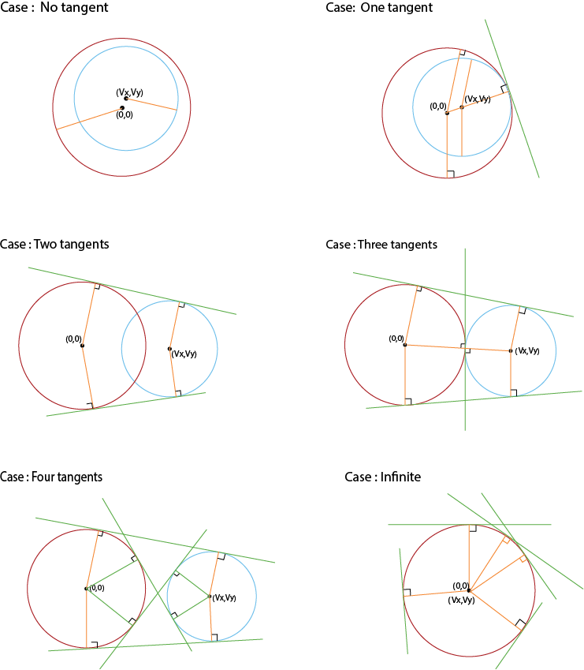

我们将需要解决的几何问题的范围限制在二维平面内，这样就用到了二维计算几何。

要用电脑解平面几何题？数学好的同学们笑了。

我们并不是用计算机算数学卷子上的几何题去了，而是解决一些更加复杂的几何相关问题。

为了解决复杂且抽象的问题，我们一定要选择合适的研究方法。对于计算机来说，给它看几何图形……

我们可以把要研究的图形放在平面直角坐标系或极坐标系下，这样解决问题就会方便很多。

## 前置技能

如并不了解：

- 几何基础
- 平面直角坐标系
- 向量（包括向量积）
- 极坐标与极坐标系

请先阅读 [向量](../math/vector.md) 和 [极坐标](./polar-coordinate.md) 。

## 图形的记录

### 点

在平面直角坐标系下，点用坐标表示，比如点 $(5,2)$ ，点 $(-1,0)$ 什么的。

我们记录其横纵坐标值即可。用 `pair` 或开结构体记录均可。

在极坐标系下，用极坐标表示即可。记录其极径与极角。

### 向量

由于向量的坐标表示与点相同，所以只需要像点一样存向量即可（当然点不是向量）。

在极坐标系下，与点同理。

### 线

#### 直线与射线

一般在解数学题时，我们用解析式表示一条直线。有一般式 $Ax+By+C=0$ ，还有斜截式 $y=kx+b$ ，还有截距式 $\frac{x}{a}+\frac{y}{b}=1$ ……用哪种？

这些式子最后都逃不过最后的结果——代入解方程求值。

解方程什么的最讨厌了，有什么好一点的方法吗？

考虑我们只想知道这条直线在哪，它的倾斜程度怎么样。于是用直线上的一个点先大致确定位置，用一个向量表示它的倾斜程度，好了，这条直线确定了。

因此我们记录的是：直线上一点和直线的方向向量。

#### 线段

线段很好记录：只需要记录左右端点即可。

在极坐标系下，记录线是比较麻烦的，因此大多数直线问题都在平面直角坐标系下解决。

### 多边形

开数组按一定顺序记录多边形的每个顶点即可。

特殊地，如果矩形的各边均与某坐标轴平行的话，我们只记录左下角和右上角的顶点即可。

### 曲线

一些特殊曲线，如函数图像等一般记录其解析式。对于圆，直接记录其圆心和半径即可。

## 基本公式

### 正弦定理

在三角形 $\triangle \text{ABC}$ 中，若角 $A,B,C$ 所对边分别为 $a,b,c$ ，则有：

$$
\frac{a}{\sin A}=\frac{b}{\sin B}=\frac{c}{\sin C}=2R
$$

其中， $R$ 为 $\triangle \text{ABC}$ 的外接圆半径。

### 余弦定理

在三角形 $\triangle \text{ABC}$ 中，若角 $A,B,C$ 所对边分别为 $a,b,c$ ，则有：

$$
\begin{aligned}
a^2&=b^2+c^2-2bc\cos A\\
b^2&=a^2+c^2-2ac\cos B\\
c^2&=a^2+b^2-2ab\cos C
\end{aligned}
$$

上述公式的证明略。均为人教版高中数学 A 版必修五内容。

## 基本操作

### 判断一个点在直线的哪边

我们有直线上的一点 $P$ 的直线的方向向量 $\mathbf v$ ，想知道某个点 $Q$ 在直线的哪边。

我们利用向量积的性质，算出 $\overrightarrow {PQ}\times \mathbf v$ 。如果向量积为负，则 $Q$ 在直线上方，如果向量积为 $0$ ，则 $Q$ 在直线上，如果向量积为正，则 $Q$ 在直线下方。

可以画一下图，用右手定则感受一下。

### 快速排斥实验与跨立实验

我们现在想判断两条线段是否相交。

首先特判一些特殊情况。如果两线段平行，自然不能相交。这种情况通过判断线段所在直线的斜率是否相等即可。

当然，如果两线段重合或部分重合，只需要判断是否有三点共线的情况即可。

如果两线段的交点为其中一条线段的端点，仍然判断是否有三点共线的情况即可。

还有些显然不相交的情况，我们口头上称之为「两条线段离着太远了」。可什么是「离着远」，怎么判断它呢？

规定「一条线段的区域」为以这条线段为对角线的，各边均与某一坐标轴平行的矩形所占的区域，那么可以发现，如果两条线段没有公共区域，则这两条线段一定不相交。

比如有以下两条线段：


它们占用的区域是这样的：


于是可以快速地判断出来这两条线段不相交。

这就是 **快速排斥实验** 。上述情况称作 **未通过快速排斥实验** 。

未通过快速排斥实验是两线段无交点的 **充分不必要条件** ，我们还需要进一步判断。

因为两线段 $a,b$ 相交， $b$ 线段的两个端点一定分布在 $a$ 线段所在直线两端；同理， $a$ 线段的两个端点一定分布在 $b$ 线段所在直线两端。我们可以直接判断一条线段的两个端点相对于另一线段所在直线的位置关系，如果不同，则两线段相交，反之则不相交。我们可以利用 3.1 中的知识帮助我们判断直线与点的位置关系。

这就是 **跨立实验** ，如果对于两线段 $a,b$ ， $b$ 线段的两个端点分布在 $a$ 线段所在直线的两侧， **且**  $a$ 线段的两个端点分布在 $b$ 线段所在直线的两侧，我们就说 $a,b$ 两线段 **通过了跨立实验** ，即两线段相交。

注意到当两条线段共线但不相交时也可以通过跨立实验，因此想要准确判断还需要与快速排斥实验结合。

### 判断一点是否在任意多边形内部

在计算几何中，这个问题被称为 [PIP 问题](https://en.wikipedia.org/wiki/Point_in_polygon) ，已经有一些成熟的解决方法，下面依次介绍。

#### 光线投射算法 (Ray casting algorithm)

在 [这里](https://wrf.ecse.rpi.edu/Research/Short_Notes/pnpoly.html) 可以看到最原始的思路。

我们先特判一些特殊情况，比如「这个点离多边形太远了」。考虑一个能够完全覆盖该多边形的最小矩形，如果这个点不在这个矩形范围内，那么这个点一定不在多边形内。这样的矩形很好求，只需要知道多边形横坐标与纵坐标的最小值和最大值，坐标两两组合成四个点，就是这个矩形的四个顶点了。

还有点在多边形的某一边或某顶点上，这种情况十分容易判断（留作课后作业）。

我们考虑以该点为端点引出一条射线，如果这条射线与多边形有奇数个交点，则该点在多边形内部，否则该点在多边形外部，我们简记为 **奇内偶外** 。这个算法同样被称为奇偶规则 (Even-odd rule)。

由于 [Jordan curve theorem](https://en.wikipedia.org/wiki/Jordan_curve_theorem) ，我们知道，这条射线每次与多边形的一条边相交，就切换一次与多边形的内外关系，所以统计交点数的奇偶即可。

这样的射线怎么取？可以随机取这条射线所在直线的斜率，建议为无理数以避免出现射线与多边形某边重合的情况。

在原版代码中，使用的是记录多边形的数组中最后一个点作为射线上一点，这样统计时，如果出现射线过多边形某边或某顶点时，可以规定射线经过的点同在射线一侧，进而做跨立实验即可。

#### 回转数算法 (Winding number algorithm)

回转数是数学上的概念，是平面内闭合曲线逆时针绕过该点的总次数。很容易发现，当回转数等于 $0$ 的时候，点在曲线外部。这个算法同样被称为非零规则 (Nonzero-rule)。

如何计算呢？我们把该点与多边形的所有顶点连接起来，计算相邻两边夹角的和。注意这里的夹角是 **有方向的** 。如果夹角和为 $0$ ，则这个点在多边形外，否则在多边形内。

### 求两条直线的交点

#### 几何法

想要确定两条直线相交与否，只需判断一下两条直线的方向向量是否平行即可。如果方向向量平行，则两条直线平行，交点个数为 $0$ 。如果两条直线平行且过同一点，则两直线重合。

那么，问题简化为有两条直线 $AB,CD$ 交于一点，想求出交点 $E$ 。

如果两直线相交，则交点只有一个，我们记录了直线上的一个点和直线的方向向量，那么我们只需要知道这个点与交点的距离 $l$ ，再将这个点沿方向向量平移 $l$ 个单位长度即可。

考虑构造三角形，利用正弦定理求解 $l$ 。


由上图可知， $|\mathbf a\times \mathbf b|=|\mathbf a||\mathbf b|\sin \beta$ ， $|\mathbf u\times \mathbf b|=|\mathbf u||\mathbf b|\sin \theta$ 。

作商得：

$$
T=\frac{|\mathbf u\times \mathbf b|}{|\mathbf a\times \mathbf b|}=\frac{|\mathbf u|\sin \theta}{|\mathbf a|\sin \beta}
$$

可以看出， $|\frac{|\mathbf u|\sin \theta}{\sin \beta}|=l$ 。若绝对值内部式子取值为正，代表沿 $\mathbf a$ 方向平移，反之则为反方向。

同时，我们将 $T$ 直接乘上 $\mathbf a$ ，就自动出现了直线的单位向量，不需要进行其他消去操作了。

于是，只需要将点 $B$ 加上 $T\mathbf a$ 即可得出交点。

#### 代数法

两直线只可能相交或者平行，为了找到它们的交点，我们需要解如下方程组：

$$
\begin{cases} 
a_1 x + b_1 y + c_1 = 0 \\
a_2 x + b_2 y + c_2 = 0
\end{cases}
$$

通过 Cramer 法则，我们可以很快地求得方程组的解，即为两直线交点：

$$
x = - \dfrac{\begin{vmatrix}c_1 & b_1 \cr c_2 & b_2\end{vmatrix}}{\begin{vmatrix}a_1 & b_1 \cr a_2 & b_2\end{vmatrix} } = - \dfrac{c_1 b_2 - c_2 b_1}{a_1 b_2 - a_2 b_1},\\
$$

$$
y = - \dfrac{\begin{vmatrix}a_1 & c_1 \cr a_2 & c_2\end{vmatrix}}{\begin{vmatrix}a_1 & b_1 \cr a_2 & b_2\end{vmatrix}} = - \dfrac{a_1 c_2 - a_2 c_1}{a_1 b_2 - a_2 b_1}.
$$

若分母为 $0$ ，即：

$$
\begin{vmatrix}a_1 & b_1 \cr a_2 & b_2\end{vmatrix} = a_1 b_2 - a_2 b_1 = 0
$$

方程组无解（两直线平行），或者有无数解（两直线重合）。为了进一步区分这两种情况，我们必须检查系数 $c$ 是否与系数 $a$ 和 $b$ 成正比。于是我们计算如下行列式，若它们均为 $0$ ，则直线重合：

$$
\begin{vmatrix}a_1 & c_1 \cr a_2 & c_2\end{vmatrix}, \begin{vmatrix}b_1 & c_1 \cr b_2 & c_2\end{vmatrix}
$$

??? note "参考代码"
    ```cpp
    struct pt {
      double x, y;
    };

    struct line {
        double a, b, c;
    };

    const double EPS = 1e-9;

    double det(double a, double b, double c, double d) {
        return a*d - b*c;
    }

    bool intersect(line m, line n, pt & res) {
        double zn = det(m.a, m.b, n.a, n.b);
        if (abs(zn) < EPS)
            return false;
        res.x = -det(m.c, m.b, n.c, n.b) / zn;
        res.y = -det(m.a, m.c, n.a, n.c) / zn;
        return true;
    }

    bool parallel(line m, line n) {
        return abs(det(m.a, m.b, n.a, n.b)) < EPS;
    }

    bool equivalent(line m, line n) {
        return abs(det(m.a, m.b, n.a, n.b)) < EPS
            && abs(det(m.a, m.c, n.a, n.c)) < EPS
            && abs(det(m.b, m.c, n.b, n.c)) < EPS;
    }
    ```

### 求线段交点

给定两个线段 $(a,b)$ ， $(c,d)$ 。判断它们是否相交。显然我们可以通过直接找交点来判断它们是否相交，但是这个方法对于具有整数坐标的线段，无法以整数形式完成。而下面所讲的方法可以以整数形式完成。

#### 算法

首先，考虑线段在同一直线上的情况。在这种情况下，只需要检查它们在 $Ox$ 和 $Oy$ 上的投影是否相交即可。而线段不在同一直线上时， $a$ 和 $b$ 不得位于线 $(c,d)$ 同一侧， $c$ 和 $d$ 不得位于线 $(a,b)$ 的同一侧。我们可以通过几对坐标的叉乘进行上述检查。

#### 实现

以下给的算法是坐标点为整数的实现。当然，它也很容易修改为 `double` 类型的实现。

??? note "参考代码"
    ```cpp
    struct pt {
      long long x, y;
      pt() {}
      pt(long long _x, long long _y) : x(_x), y(_y) {}
      pt operator-(const pt& p) const { return pt(x - p.x, y - p.y); }
      long long cross(const pt& p) const { return x * p.y - y * p.x; }
      long long cross(const pt& a, const pt& b) const {
        return (a - *this).cross(b - *this);
      }
    };
    int sgn(const long long& x) { return x >= 0 ? x ? 1 : 0 : -1; }
    bool inter1(long long a, long long b, long long c, long long d) {
      if (a > b) swap(a, b);
      if (c > d) swap(c, d);
      return max(a, c) <= min(b, d);
    }
    bool check_inter(const pt& a, const pt& b, const pt& c, const pt& d) {
      if (c.cross(a, d) == 0 && c.cross(b, d) == 0)
        return inter1(a.x, b.x, c.x, d.x) && inter1(a.y, b.y, c.y, d.y);
      return sgn(a.cross(b, c)) != sgn(a.cross(b, d)) &&
             sgn(c.cross(d, a)) != sgn(c.cross(d, b));
    ```

### 求线段长度和

给定一条直线上的 $n$ 条线段，每条线段用一对坐标 $(a_{i1},a_{i2})$ 表示。求出它们的总长度。

#### 算法

将所有的段按值排序，并将他们的端点（不论是左端点还是右端点）存入数组 $x$ 中。遍历数组，当前元素是左端点时，计数器 `c` 加一，右端时减一。 `c` 大于 $0$ 时，将右端点的值减去左端点并加到 `result` 上，故最终 `result` 就是总的右端点与左端点差值的和。

??? note "实现代码"
    ```cpp
    int length_union(const vector<pair<int, int>> &a) {
      int n = a.size();
      vector<pair<int, bool>> x(n * 2);
      for (int i = 0; i < n; i++) {
        x[i * 2] = {a[i].first, false};
        x[i * 2 + 1] = {a[i].second, true};
      }
    ```

        sort(x.begin(), x.end());

        int result = 0;
        int c = 0;
        for (int i = 0; i < n * 2; i++) {
            if (i > 0 && x[i].first > x[i-1].first && c > 0)
                result += x[i].first - x[i-1].first;
            if (x[i].second)
                c--;
            else
                c++;
        }
        return result;
    }
    ```

### 求任意多边形的周长和面积

#### 求任意多边形的面积

考虑向量积的模的几何意义，我们可以利用向量积完成。

将多边形上的点逆时针标记为 $p_1,p_2,\cdots ,p_n$ ，再任选一个辅助点 $O$ ，记向量 $\mathbf v_i=p_i-O$ ，那么这个多边形面积 $S$ 可以表示为：

$$
S=\frac{1}{2}|\sum_{i=1}^n \mathbf v_i\times \mathbf v_{i\bmod n+1}|
$$

### 圆与直线相关

#### 求直线与圆的交点

已知圆心的坐标和半径，以及直线的方程，求其交点。

我们将用几何方法来处理这个问题，而不是解两个方程组。这种方法从数值稳定性的角度得到了更精确的解。

假设圆以原点为圆心。如果不是，将圆平移到圆心，并修正直线方程中的常数 $C$ 。从而我们得到了一个圆心为 $(0,0)$ 半径为 $r$ 的圆和一条方程为 $Ax+By+C=0$ 的直线。

首先从离原点最近的点 $(x_0, y_0)$ 开始，它与直线的距离为：

 $d_0 = \dfrac{|C|}{\sqrt{A^2+B^2}}$ 

其次，向量 $(A, B)$ 垂直于直线，故可得 $\dfrac{x_0}{y_0}=\dfrac{A}{B}$ ，带入直线后可求得：

 $x_0 = - \dfrac{AC}{A^2 + B^2}$  $y_0 = - \dfrac{BC}{A^2 + B^2}$ 

实际上我们已经可以由距离确定圆与直线交点的个数：

- 若 $r>d_0$ ，两个交点；
- 若 $r=d_0$ ，一个交点；
- 若 $r<d_0$ ，没有交点。

假设直线与圆有两个交点 $(a_x, a_y)$ 和 $(b_x, b_y)$ ，那么我们就可以通过勾股定理求得半弦长：

 $d = \sqrt{r^2 - \dfrac{C^2}{A^2 + B^2}}$ 

注意到，向量 $(-B,A)$ 与直线共线，我们可以通过加减向量 $(-B,A)$ 的倍数，使得直线上的点到点 $(x_0, y_0)$ 的距离缩放到长度 $d$ ，从而来求得交点。

最终可以确定两个交点的坐标如下：

 $m = \sqrt{\dfrac{d^2}{A^2 + B^2}}$  $a_x = x_0 + B \cdot m, a_y = y_0 - A \cdot m$  $b_x = x_0 - B \cdot m, b_y = y_0 + A \cdot m$ 

??? note "参考代码"
    ```cpp
    double r, a, b, c;
    double x0 = -a * c / (a * a + b * b), y0 = -b * c / (a * a + b * b);
    if (c * c > r * r * (a * a + b * b) + EPS)
      puts("no points");
    else if (abs(c * c - r * r * (a * a + b * b)) < EPS) {
      puts("1 point");
      cout << x0 << ' ' << y0 << '\n';
    } else {
      double d = r * r - c * c / (a * a + b * b);
      double mult = sqrt(d / (a * a + b * b));
      double ax, ay, bx, by;
      ax = x0 + b * mult;
      bx = x0 - b * mult;
      ay = y0 - a * mult;
      by = y0 + a * mult;
      puts("2 points");
      cout << ax << ' ' << ay << '\n' << bx << ' ' << by << '\n';
    }
    ```

#### 求两圆交点

首先我们判断一下两个圆的位置关系，如果外离或内含则无交点，如果相切，可以算出两圆心连线的方向向量，然后利用两圆半径计算出平移距离，最后将圆心沿这个方向向量进行平移即可。

如果两圆相交，则必有两个交点，并且关于两圆心连线对称。因此下面只说明一个交点的求法，另一个交点可以用类似方法求出。

我们先将一圆圆心与交点相连，求出两圆心连线与该连线所成角。这样，将两圆心连线的方向向量旋转这个角度，就是圆心与交点相连形成的半径的方向向量了。

最后还是老套路——沿方向向量方向将圆心平移半径长度。

这个问题也可以简化为圆与直线的交点。

假设第一个圆以原点为圆心。我们可以得到两个圆的方程：

 $x^2+y^2=r_1^2$  $(x - x_2)^2 + (y - y_2)^2 = r_2^2$ 

用第二个方程减去第一个方程，去掉变量的二次幂：

 $x^2+y^2=r_1^2$  $x \cdot (-2x_2) + y \cdot (-2y_2) + (x_2^2+y_2^2+r_1^2-r_2^2) = 0$ 

这样，我们将原来的问题简化为求第一个圆与直线的交点的问题：

 $Ax + By + C = 0$  $A = -2x_2$  $B = -2y_2$  $C = x_2^2+y_2^2+r_1^2-r_2^2$ 

唯一需要单独考虑的特殊情况是当圆的中心重合时。在这个例子中， $x_2=y_2=0$ ，直线方程为 $C = r_1^2-r_2^2 =0$ 。如果两个圆的半径相同，就有无穷多个交点。

### 两圆公切线

给定两个圆，求它们的公切线。

所述算法也可以适用于其中一个圆退化成一个点的情况。

#### 公切线数量

共有六种情况，有 $0,1,2,3,4$ 条或者无数条。



这里讨论暂不涉及退化成点的情况。

总结一下，除了无限切线的情况（无限切线的情况需要单独处理，这里不讨论），我们在任意情况下需要寻找四边切线。当然在某些位置关系下，其中的某些切线会重合，这也就导致了公切线数量不同的情况出现了。

#### 算法

为了简化算法，在不失一般性的前提下，我们假设第一个圆的圆心的坐标为 $(0,0)$ ，第二个圆的圆心为 $(v_x,v_y)$ 。两圆半径分别为 $r_1$ 和 $r_2$ 。

为了解决这个问题，我们用纯粹的代数学来描述该问题。由切线的性质可知我们需要找到所有的满足与第一个圆心距离为 $r_1$ 与第二个圆心距离为 $r_2$ 的直线 $ax + by + c = 0$ ，同时为了方便处理我们对直线进行一个系数单位化限制： $a,b$ 平方和为 $1$ 。这样我们就得到了下面三个方程组：

 $a^2 + b^2 = 1$  $\mid a \cdot 0 + b \cdot 0 + c \mid = r_1$  $\mid a \cdot v_x + b \cdot v_y + c \mid = r_2$ 

去掉绝对值便可以得到：

 $a^2 + b^2 = 1$  $c = \pm r_1$  $a \cdot v_x + b \cdot v_y + c = \pm r_2$ 

进一步简化，令 $d_1 = \pm r_1$ , $d_2 = \pm r_2$ ：

 $a^2 + b^2 = 1$  $c = d_1$  $a \cdot v_x + b \cdot v_y + c = d_2$ 

这样我们利用求根公式便可得到 $a,b,c$ 的值：

 $a = {( d_2 - d_1 ) v_x \pm v_y \sqrt{v_x^2 + v_y^2-(d_2-d_1)^2} \over {v_x^2 + v_y^2} }$  $b = {( d_2 - d_1 ) v_y \pm v_x \sqrt{v_x^2 + v_y^2-(d_2-d_1)^2} \over {v_x^2 + v_y^2} }$  $c = d_1$ 

对于 $d_1,d_2$ 的四种选择对应了方程组的四个解。

#### 实现

我们首先定义必要的数据结构和其他辅助定义：

??? note "参考代码"
    ```cpp
    struct pt {
      double x, y;
      pt operator-(pt p) {
        pt res = {x - p.x, y - p.y};
        return res;
      }
    };
    struct circle : pt {
      double r;
    };
    struct line {
      double a, b, c;
    };
    const double EPS = 1E-9;
    double sqr(double a) { return a * a; }
    ```

下面便是解决方案：

??? note "参考代码"
    ```cpp
    void tangents(pt c, double r1, double r2, vector<line>& ans) {
      double r = r2 - r1;
      double z = sqr(c.x) + sqr(c.y);
      double d = z - sqr(r);
      if (d < -EPS) return;
      d = sqrt(abs(d));
      line l;
      l.a = (c.x * r + c.y * d) / z;
      l.b = (c.y * r - c.x * d) / z;
      l.c = r1;
      ans.push_back(l);
    }
    vector<line> tangents(circle a, circle b) {
      vector<line> ans;
      for (int i = -1; i <= 1; i += 2)
        for (int j = -1; j <= 1; j += 2) tangents(b - a, a.r * i, b.r * j, ans);
      for (size_t i = 0; i < ans.size(); ++i)
        ans[i].c -= ans[i].a * a.x + ans[i].b * a.y;
      return ans;
    }
    ```

### 极角序

一般来说，这类题需要先枚举一个极点，然后计算出其他点的极坐标，在极坐标系下按极角的顺序解决问题。

#### 例题 [「JOI Spring Camp 2014 Day4」两个人的星座](https://www.ioi-jp.org/camp/2014/2014-sp-tasks/2014-sp-d4.pdf) 

平面内有 $n$ 个点，有三种颜色，每个点的颜色是三种中的一种。求不相交的三色三角形对数。 $6\le n\le 3000$ 。

#### 题解

如果两个三角形不相交，则一定可以做出两条内公切线，如果相交或内含是做不出内公切线的。三角形的公切线可以类比圆的公切线。

先枚举一个原点，记为 $O$ ，以这个点为极点，过这个点且与 $x$ 轴平行的直线作为极轴，建立极坐标系，把剩余点按极角由小到大排序。然后统计出在极轴上方和下方的每种点的个数。

然后根据点枚举公切线，记枚举到的点为 $P$ ，初始时公切线为极轴。开始统计。那么一定存在一条公切线过点 $O$ 和点 $P$ 。因为公切线与三角形不相交，所以一方选择公切线上方的点，另一方一定选择下方的点。然后利用乘法原理统计方案数即可。

统计完后转公切线，那么点 $P$ 一定改变了相对于公切线的上下位置，而其他点不动，应该只将它的位置信息改变。

这样，可以发现，同一对三角形最终被统计了 $4$ 次，就是同一条公切线会被枚举两次，最后做出的答案应除以 $4$ 。

分析一下算法复杂度，我们枚举了一个原点，然后对于每一个原点将剩余点排序后线性统计。于是时间复杂度为 $O(n^2\log n)$ 。

## 代码编写注意事项

由于计算几何经常进行 `double` 类型的浮点数计算，因此带来了精度问题和时间问题。

有些问题，例如求点坐标均为整数的三角形面积，可以利用其特殊性进行纯整数计算，避免用浮点数影响精度。

由于浮点数计算比整数计算慢，所以需要注意程序的常数因子给时间带来的影响。
