author: wchengk09

求多边形的面积在计算几何中十分重要。本文将介绍计算几何中 **简单多边形** 的面积公式，及其证明。

## 前置知识

### 简单多边形

如果一个多边形的任意两条边 **除端点外不相交**，则称该多边形是一个 **简单多边形**。

例如，下图中的多边形 $ABCD$ 是一个简单多边形。

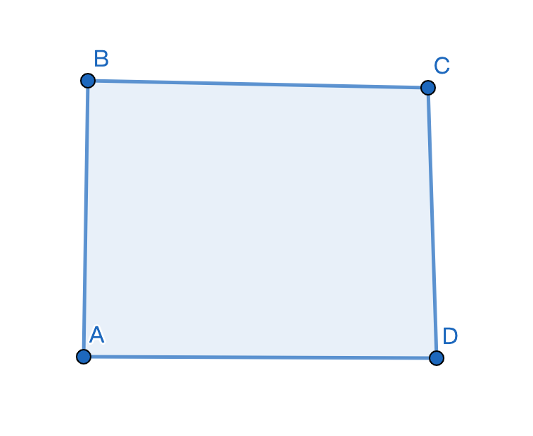

而下图中的多边形 $EFGH$ 不是简单多边形，因为线段 $FG$ 和 $EH$ 相交了，且交点不是这两条边的端点。

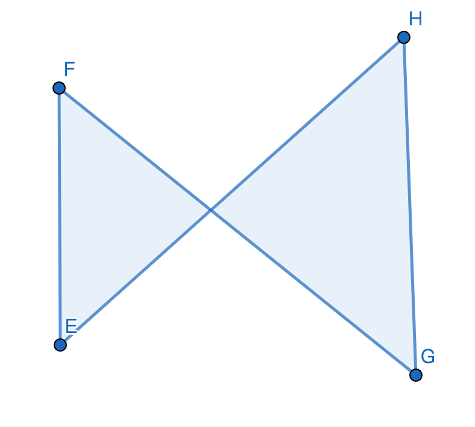

### 向量叉乘

#### 定义

对于两个 **二维** 向量 $\textbf{a}$ 和 $\textbf{b}$，二者叉乘的结果是一个 **标量**：

$\textbf{a}\times\textbf{b}=|\textbf{a}||\textbf{b}|sin\theta$

上式中，$\times$ 表示叉乘，$\theta$ 是向量 $\textbf{a}$ 和向量 $\textbf{b}$ 的夹角。

注意，此处 $\theta$ 的值是 **有向夹角**：如果 $\textbf a$ 在 $\textbf b$ 的 **逆时针方向**（即：向量 $\textbf b$ 逆时针旋转不超过 $180^\circ$ 后与向量 $\textbf a$ 共线），则 $\theta$ 的值为 **负数**，$\textbf a\times\textbf b$ 的结果也是负数；如果向量 $\textbf{a}$ 在向量 $\textbf{b}$ 的 **顺时针方向**，则 $\theta$ 的值为 **正数**，$\textbf a\times\textbf b$ 的结果也是正数。

???+ note
    其实这个定义和[三维向量的外积](../math/linear-algebra/product.md)很相似，只不过它返回的是一个标量，而不是一个向量。

#### 几何意义

两个向量叉乘的结果表示的是 **两个向量张成的平行四边形的面积**，如下图所示。

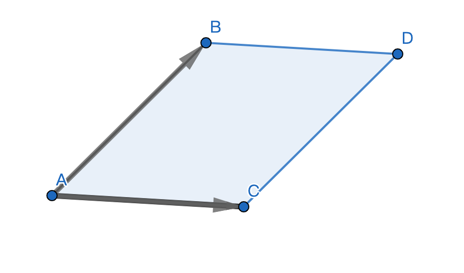

这个值除以 $2$，就是两个向量张成的 **三角形** 的面积。

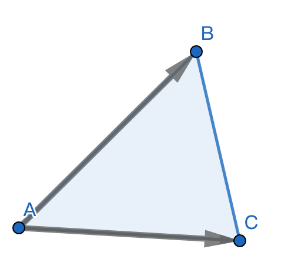

#### 坐标表示法

在平面向量的坐标表示法中，对于点 $A(x_1,y_1)$,$B(x_2,y_2)$，则

$\overrightarrow{OA}\times\overrightarrow{OB}=x_1y_2-x_2y_1$

## 简单多边形面积公式

对于一个简单多边形，设它的顶点分别为 $P_1,P_2,...,P_n$，满足点 $P_i$ 和点 $P_{(i\ mod\ n)\ +\ 1}$ 之间有边。

任取一点 $O$（一般取原点），则该多边形的面积为

$ S=\frac{1}{2}|\sum_{i=1}^n \overrightarrow{OP_i}\times\overrightarrow{OP_{(i\ mod\ n)\ +\ 1}}|  $

???+ note
    这个公式通常被称为「鞋带定理」。

## 感性理解

首先，我们可以把公式中的 $\frac{1}{2}$ 提进来，变成：

$S=|\sum_{i=1}^n\frac{\overrightarrow{OP_i}\times\overrightarrow{OP_{(i\ mod\ n)\ +\ 1}}}{2}|$

想一想，$\frac{\overrightarrow{OP_i}\times\overrightarrow{OP_{(i\ mod\ n)\ +\ 1}}}{2}$ 是什么意思？

没错，就是向量 $\overrightarrow{OP_i}$ 和 $\overrightarrow{OP_{(i\ mod\ n)\ +\ 1}}$ 张成的三角形的面积。

再次强调，这里的面积是 **有向面积**，有时为正，有时为负（可参考上文中叉乘的定义）。

那为什么这些三角形的面积之和就可以得到多边形的面积呢？

举个例子吧。

如下图所示，蓝色的多边形（$ABCD$）是我们要计算面积的简单多边形，点 $O$ 为原点。

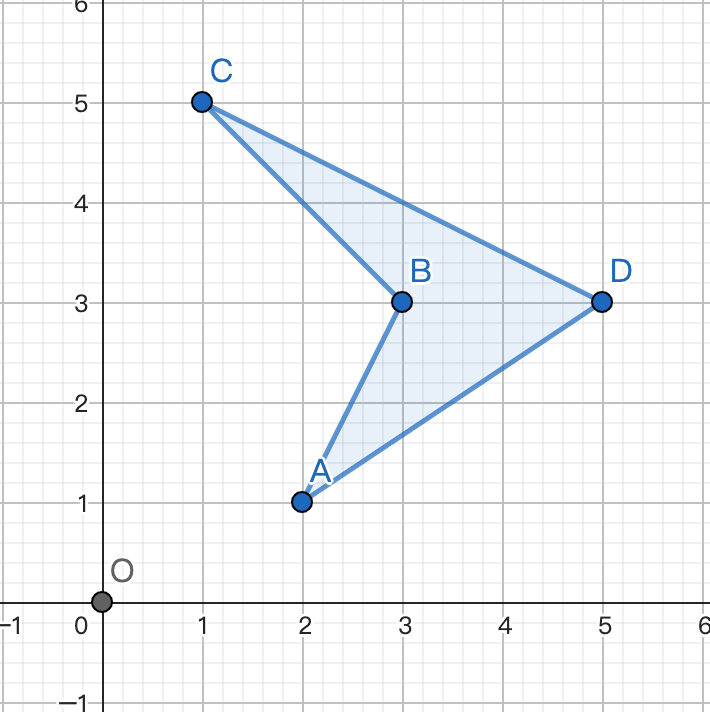

首先计算 $\overrightarrow{OA}\times\overrightarrow{OB}$，得到的是 $\Delta OAB$ 的面积。

因为 $\overrightarrow{OA}$ 在 $\overrightarrow{OB}$ 的 **顺时针方向**，所以得到的面积是 **正数**，答案应该 **加上** 这一块的面积。（绿色表示加上，红色表示减去）

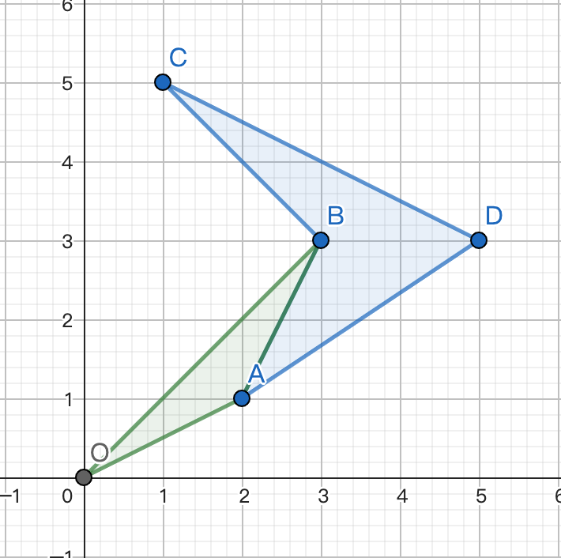

然后计算 $\overrightarrow{OB}\times\overrightarrow{OC}$，得到的是 $\Delta OBC$ 的面积。因为 $OB$ 在 $OC$ 的 **顺时针方向**，所以得到的面积是 **正数**。

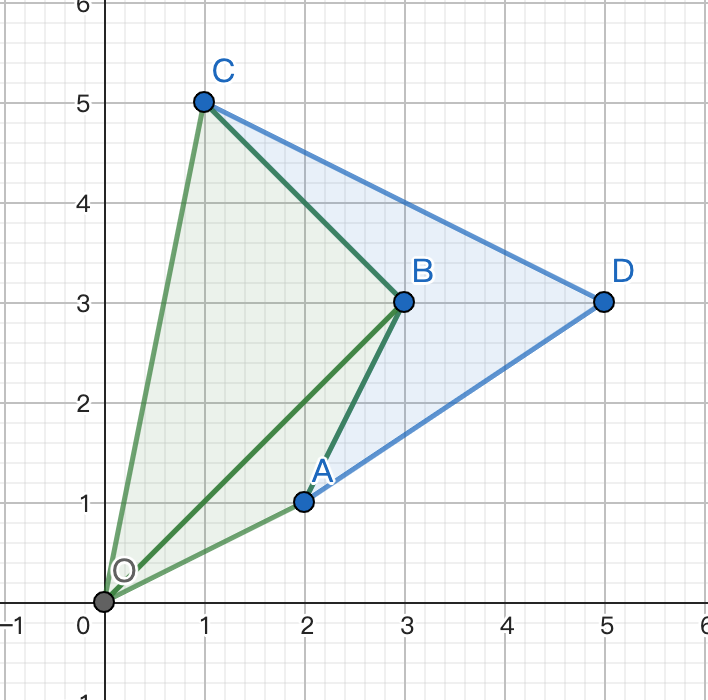

接下来是 $\overrightarrow{OC}\times\overrightarrow{OD}$，得到 $\Delta OCD$ 的面积。因为 $\overrightarrow{OC}$ 在 $\overrightarrow{OD}$ 的 **逆时针方向**，所以得到的面积是 **负数**。

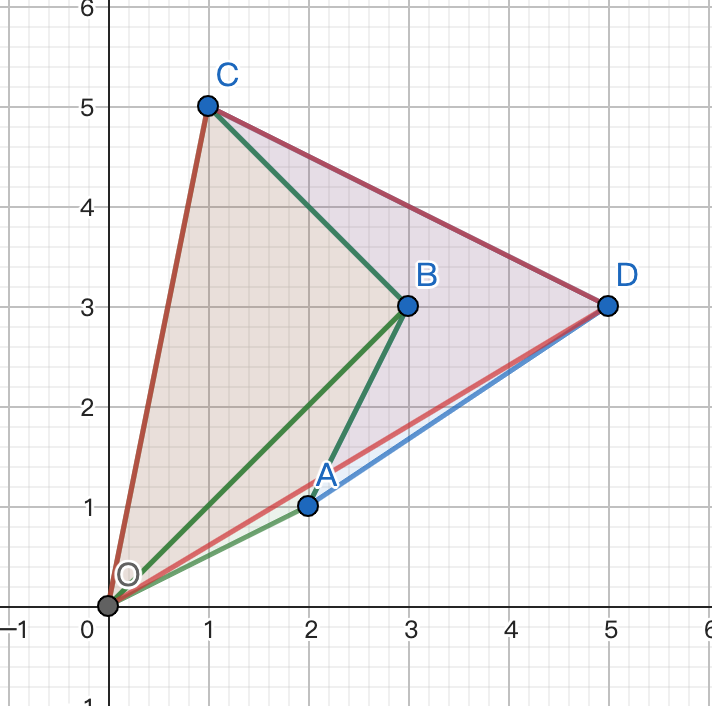

$\overrightarrow{OD}\times\overrightarrow{OA}$，得到 $\Delta ODA$ 的面积。由于 $\overrightarrow{OD}$ 在 $\overrightarrow{OA}$ 的 **逆时针方向**，所以得到的面积是 **负数**。

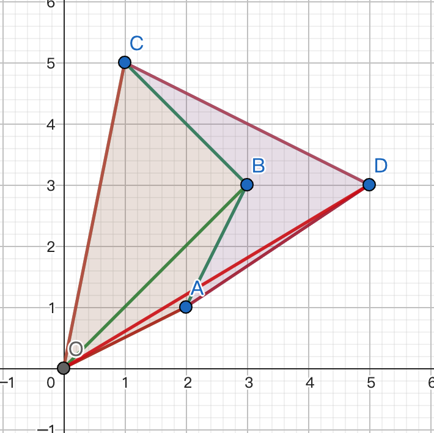

然后你神奇地发现：四边形 $OABC$ 被加了一次，减了一次，正好抵消了！这样，就只剩下（负的）四边形 $ABCD$ 的面积了。

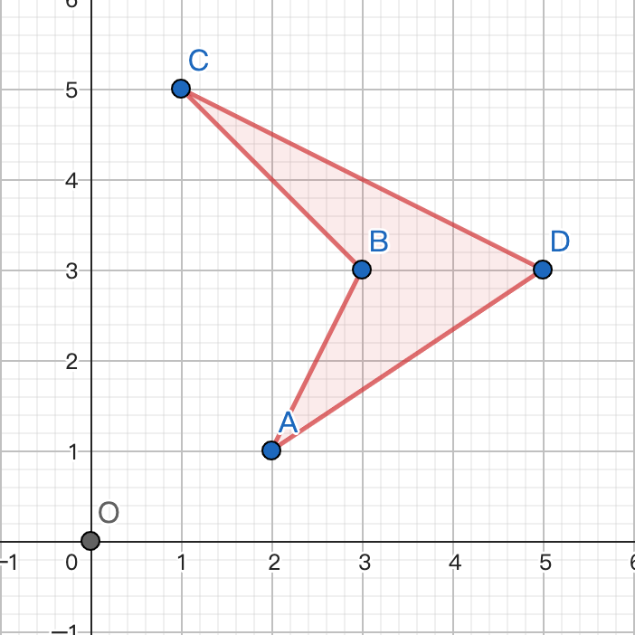

有同学可能会说：你这样求的面积是负的呀！

但是别忘了，公式的最外面还有一个 **绝对值**，取了绝对值后，得到的面积就是正数了。

## 严格证明

有人可能会想：“这个公式为什么这么神奇，把多边形里面的部分给保留了，多边形外面的刚好抵消了？怎么证明，对于任意的简单多边形，这个公式都能把多余的部分消掉？”

接下来是对这个公式的 **严格证明**。

首先考虑一点：如果我们将整个多边形作为一个整体考虑，去证明这个公式，其实是很难证的。

我们可以把这个多边形拆成很多 **点**，并考虑每个点对这个多边形的面积产生的贡献。

对于一点 $P$，如果有一个三角形 $OP_iP_{(i\ mod\ n)\ +\ 1}$ 包含了点 $P$，并且该三角形的面积是 **正数**，我们就称点 $P$ 对多边形的面积产生了 **$1$ 的贡献**；如果有一个三角形 $OP_iP_{(i\ mod\ n)\ +\ 1}$ 包含了点 $P$，并且该三角形的面积是 **负数**，我们就称点 $P$ 对多边形的面积产生了 **$-1$ 的贡献**。

那么我们就需要证明：多边形内部的点都能对面积产生（$1$ 或 $-1$ 的）贡献，而多边形外部的点对多边形面积产生的贡献均为 $0$。

### 1. 证明多边形内部的点都能产生贡献

对于多边形内部一点 $P$，我们可以引一条射线 $OP$，如下图所示。

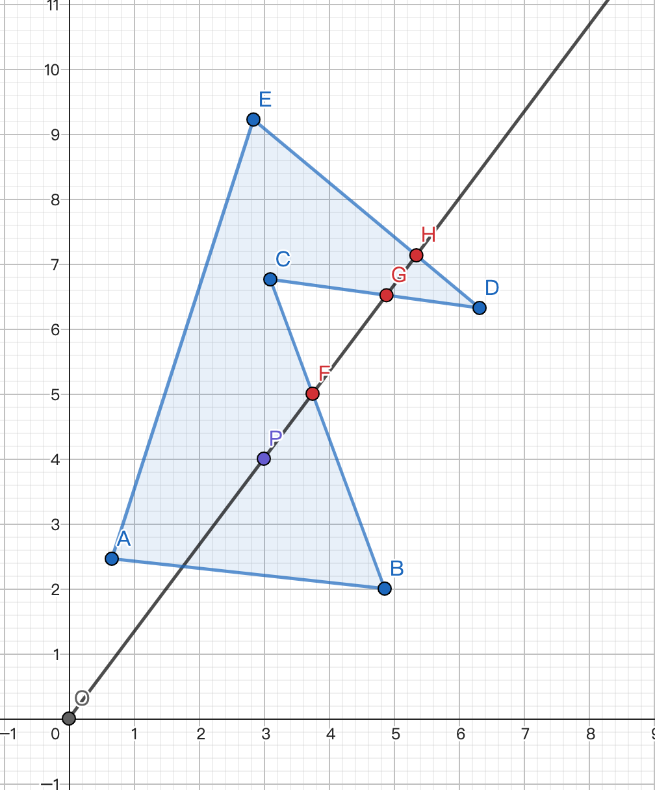

容易发现，对于多边形的一条边 $AB$，如果 $AB$ 不与射线 $OP$ 相交，或 $AB$ 与 $OP$ 的交点在 **线段**  $OP$ 上，那么 $\Delta OAB$ 一定不会包含点 $P$，因此点 $P$ 不会产生贡献。

那么，我们只需要考虑与 $OP$ 交在 **线段 $OP$ 延长线上** 的边即可。

如下图中的三条边 $BC,CD,DE$ 都符合这一条件，它们与 $OP$ 的交点分别为 $F,G,H$。


可以发现，这样的边一定有 **奇数条**。如何证明？

因为这些交点把 $OP$ 延长线分成了很多部分，而且这些部分，有些在多边形内部，有些在多边形外部，且内部和外部的部分是 **交替出现** 的。例如上图中，$PF$ 在多边形内部，$FG$ 在外部，$GH$ 在内部，$H$ 到无穷远处都在多边形的外部。

同时，射线是无限长的，多边形却是有限的。因此最后一部分（点 $H$ 到无穷远处）一定在多边形外部。而点 $P$ 在多边形内部，因此分界点（交点）必须有 **奇数** 个，才能符合上述交替出现的性质。

???+ note
    其实这也是[光影投射算法](./2d/#%E5%85%89%E7%BA%BF%E6%8A%95%E5%B0%84%E7%AE%97%E6%B3%95-ray-casting-algorithm)的基本原理。

并且我们发现，这些边有些是「从射线左边穿到右边」的（$CD$），有些是「从射线右边穿到左边」的（$BC$，$DE$），并且这两种边也是 **交替出现** 的。

又因为这两种边的总数是 **奇数**，因此它们的数量一定 **恰好差 $1$**。

对于一条边 $MN$，如果点 $M$ 在射线左侧，$N$ 在射线右侧，那么 $\overrightarrow{OM}$ 一定在 $\overrightarrow{ON}$ 的 **逆时针方向**，$\Delta OMN$ 的面积是 **负数**，点 $P$ 产生的贡献为 $-1$；同理可得，如果点 $M$ 在射线右侧，$N$ 在射线左侧，那么点 $P$ 产生的贡献为 $1$。

又因为这两种情况是 **交替出现** 的，所以点 $P$ 产生的贡献是「$1$，$-1$，$1$，$-1$」……大部分的贡献都抵消了，只有多出来的那条边贡献没有抵消（因为两种边的数量恰好差 $1$），所以点 $P$ 对多边形的面积只产生了 $1$ 或 $-1$ 的贡献。

### 2. 证明多边形外部的点都不会产生贡献

采用与上述证明类似的方法，可以证明：对于多边形外部的一点 $P$，多边形与线段 $OP$ 延长线的交点数量一定是 **偶数**。

所以两种方向的边数量一定之和也是 **偶数**，所以两种边的数量是 **相等** 的，又因为它们产生的贡献是 **一正一负交错分布的**，所以全抵消了，点 $P$ 并不会产生任何贡献。

### 3. 证明多边形内部的点对面积产生的贡献同为 $1$，或同为 $-1$

有同学可能会问：“这不就证完了吗？”

但是，细心的同学可能注意到了一点：上述证明没有任何一步用到了「这个多边形是简单多边形」，但是这个公式却仅适用于简单多边形。

到底哪里出问题了？

我们画一个复杂多边形，用这个公式计算它的面积，看看哪里出了问题。

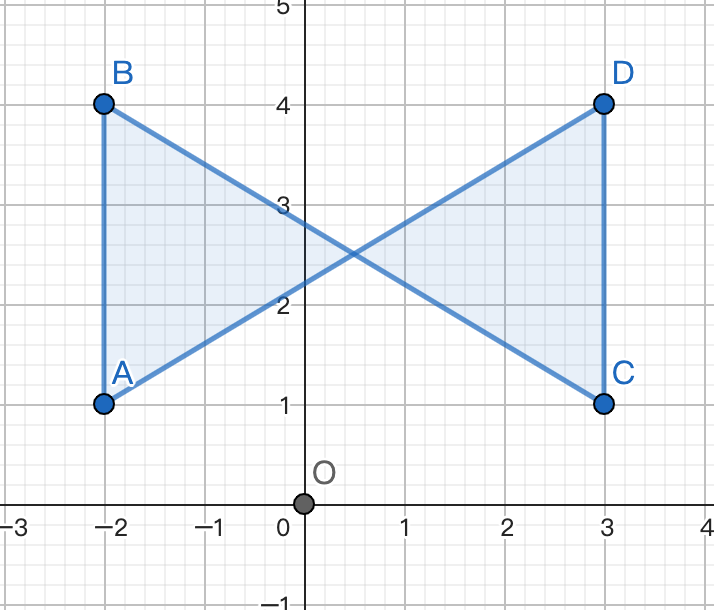

对于上图所示的复杂多边形 $ABCD$，我们用公式计算它的面积，发现：

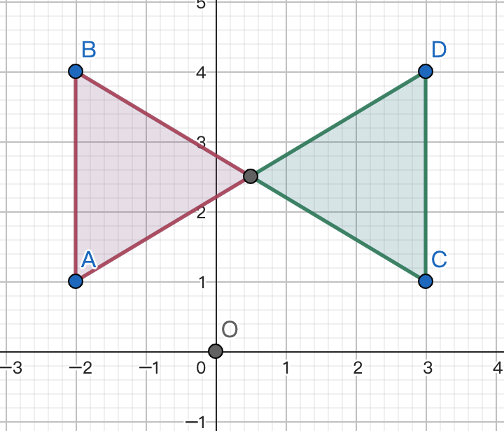

有一部分的面积是正的，有一部分的面积是负的！将这两部分的面积相加，并不能正确得到这个复杂多边形的面积。

因此，对于简单多边形，我们还需要证明：多边形内部的点对面积产生的贡献都是 **同号** 的，即：要么所有点产生的贡献都是 $1$，要么所有点产生的贡献都是 $-1$。

仔细想一下，一个点产生贡献的正负性，跟什么有关？

一个点 $P$ 产生贡献的正负性，只与「穿过线段 $OP$ 延长线的第一条边的方向」有关。

???+ note "解释" 
    「穿过线段 $OP$ 延长线的第一条边」指的是：多边形与线段 $OP$ 延长线相交的所有边中，交点离点  $P$ 最近的那条边。

在下图中，穿过线段 $OP$ 延长线的第一条边是 $BC$，点 $B$ 在射线 $OP$ 右侧，点 $C$ 在射线 $OP$ 左侧，此时点 $P$ 产生的贡献为 $1$。


在下图中，穿过线段 $OP$ 延长线的第一条边 $BC$，点 $B$ 在射线 $OP$ 左侧，点 $C$ 在射线 $OP$ 右侧，此时点 $P$ 产生的贡献为 $-1$。

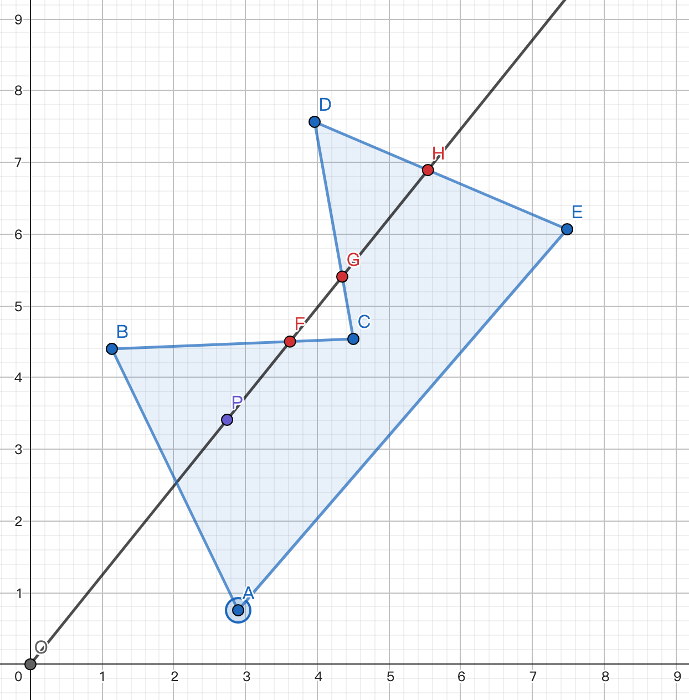

要想证明所有的点产生贡献的符号相同，我们只需要证明：对于任意一点 $P$，穿过线段 $OP$ 延长线的第一条边方向都相同就可以了。

考虑 **反证法**，假设有两点 $P,Q$，穿过 $OP$ 和 $OQ$ 延长线的第一条边方向不同。那么必然有一条边是「从左边穿到右边」，有一条边是「从右边穿到左边」，如下图所示。

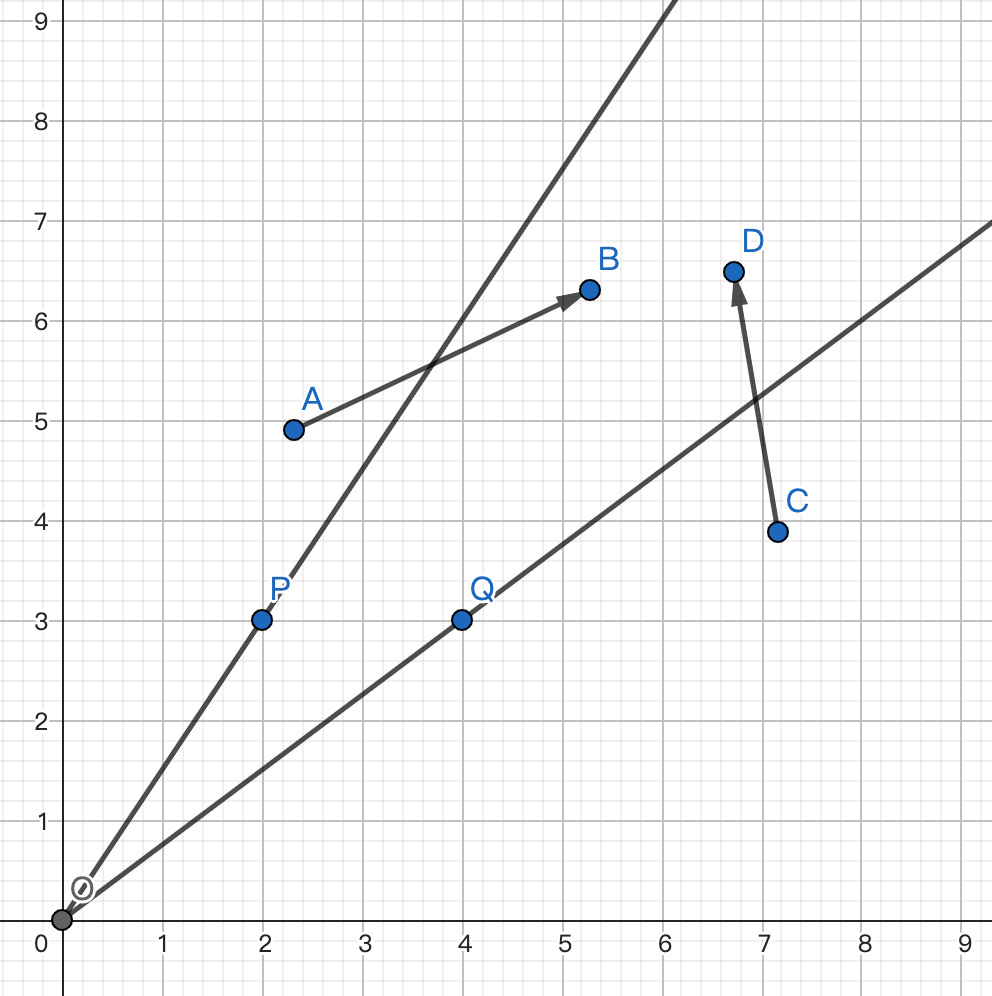

问题来了：此时点 $B$ 必须和点 $C$ 连通，点 $D$ 也必须和点 $A$ 连通。应该怎么办？

-   方案一：点 $B$ 与点 $C$ 的连线经过线段 $CD$ 下方，此时 $CD$ 不再是第一条边了。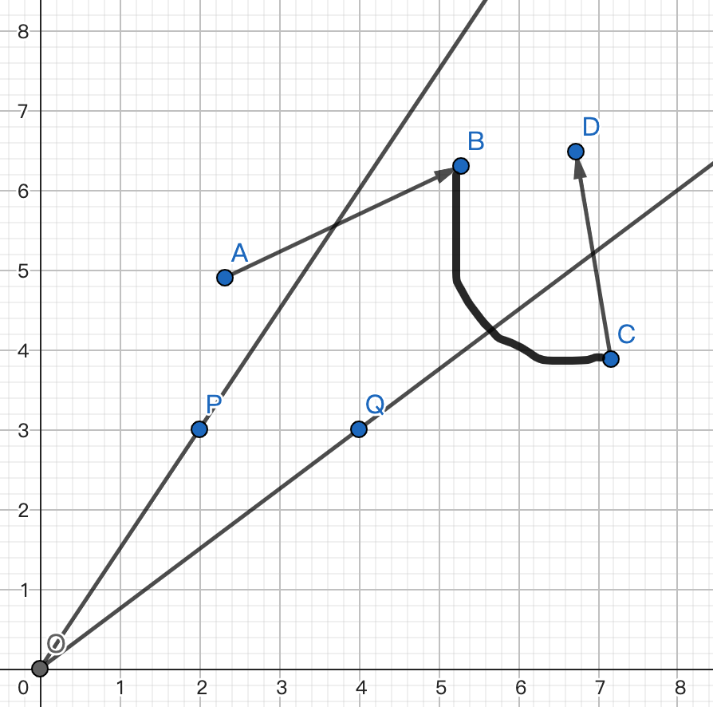

-   方案二：点 $B$ 与点 $C$ 的连线经过线段 $DC$ 上方，点 $D$ 与点 $A$ 的连线也经过线段 $AB$ 上方。此时，这个多边形不再是简单多边形了。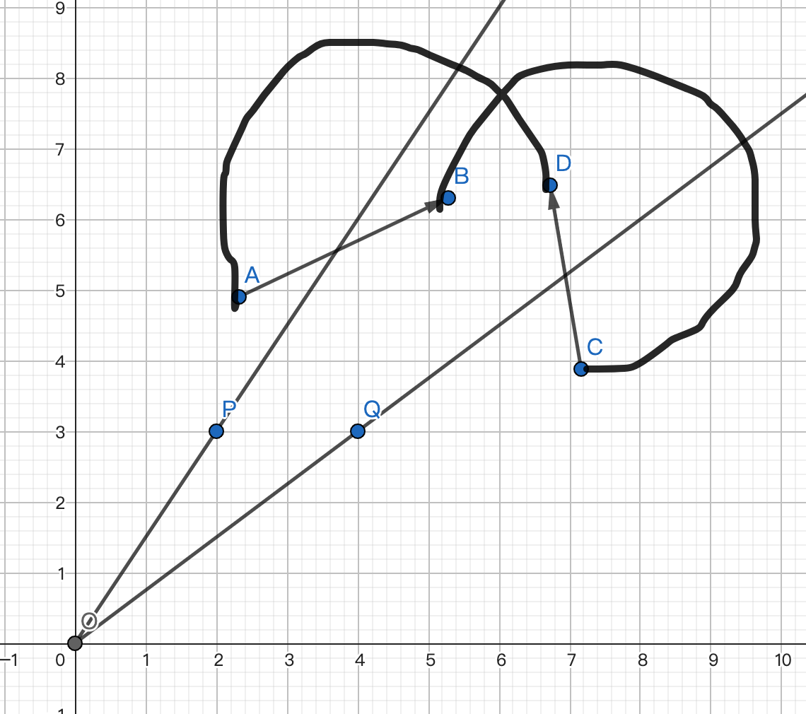

因此，假设不成立。这样，我们就证明了：对于任意一点 $P$，穿过线段 $OP$ 延长线的第一条边方向都相同就可以了。

$Q.E.D$。

## 代码实现

以下是计算多边形面积的 `C++` 代码：

```cpp
#include <stdio.h>
typedef double db;
const int MAXN = 114;
int n;
db x[MAXN], y[MAXN];

int main() {
  scanf("%d", &n);
  for (int i = 1; i <= n; i++) scanf("%lf %lf", x + i, y + i);
  db sum = 0;
  for (int i = 1; i < n; i++) sum += x[i] * y[i + 1] - x[i + 1] * y[i];
  sum += x[n] * y[1] - x[1] * y[n];
  if (sum < 0) sum = -sum;
  printf("%.2lf", sum / 2);
  return 0;
}
```

## 求多边形面积的其它方法

-   [三角剖分](./triangulation.md) 可以将多边形三角剖分成三角形，计算每个三角形的面积之和。三角形的面积可以使用叉乘直接算。
-   使用 [Pick 定理](./pick.md)。
