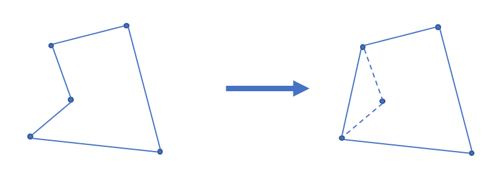

## 二维凸包

### 凸多边形

凸多边形是指所有内角大小都在 $[0,\pi]$ 范围内的 **简单多边形**。

### 凸包

在平面上能包含所有给定点的最小凸多边形叫做凸包。

其定义为：对于给定集合 $X$，所有包含 $X$ 的凸集的交集 $S$ 被称为 $X$ 的 **凸包**。

实际上可以理解为用一个橡皮筋包含住所有给定点的形态。

凸包用最小的周长围住了给定的所有点。如果一个凹多边形围住了所有的点，它的周长一定不是最小，如下图。根据三角不等式，凸多边形在周长上一定是最优的。



### 凸包的求法

常用的求法有 Graham 扫描法和 Andrew 算法。


#### Graham 算法
首先我们找出 $y$ 坐标最小，在此基础上 $x$ 坐标最小的点，也就是整张图最靠左下的点，这个点一定在凸包上，因为其他点之间的连线都不能将它围住。将它与第一个点交换，作为凸包的一个基准点。接下来最朴素的一个想法就是，我们按照一个逆时针旋转的顺序地找到凸包上的所有点，怎么才能将数组中存的点变成逆时针的顺序呢？我们可以以基准点为原点对其他点进行极角排序。不过，进行极角排序的时候也可以不用把具体的极角度数算出来，而是可以用判断叉积正负的方法来实现比较。
$\overrightarrow{AB} \times \overrightarrow{AC} >0$ : $\overrightarrow{AB}$ 在 $\overrightarrow{AC}$ 的顺时针方向。
$\overrightarrow{AB} \times \overrightarrow{AC} <0$ : $\overrightarrow{AB}$ 在 $\overrightarrow{AC}$ 的逆时针方向。
$\overrightarrow{AB} \times \overrightarrow{AC} =0$ : $\overrightarrow{AB}$ 和 $\overrightarrow{AC}$ 共线。
排好序后，我们先将前三个点放进一个栈中，由极角排序知这三个点一定是向下凸的，接着从 4 到 $n$ 遍历所有点，每访问到一个点 $i$ ，就先不断地比较 $mathit{stack}[top-1]$ 与 $mathit{stack}[top]$ 的连线在 $mathit{stack}[top-1]$ 与 $i$ 的连线的什么方向，如果是逆时针方向，说明在 $mathit{stack}[top]$ 这个点凹了进去，不符合凸包的性质，因此需要将栈顶弹出，弹到不能再弹后，再将 $i$ 加入栈顶。这样最终栈里储存的每个点都符合凸包的性质，且是以逆时针顺序排列的。算法整体复杂度为 $O(n\log n)$，由排序算法复杂度所限制。

???+note "代码实现"
    ```cpp
    struct PT{
      double x,y;
      PT(){}
      PT(double a,double b):x(a),y(b){}
      PT operator-(const PT &b)const{
        return PT(x-b.x,y-b.y);
      }
    }A[N];
    double cross(PT s,PT a,PT b){
      return (a.x-s.x)*(b.y-s.y)-(b.x-s.x)*(a.y-s.y);
    }
    double mo(PT a){
      return sqrt(a.x*a.x+a.y*a.y);
    }
    bool cmp(PT a,PT b){
      double tmp=cross(A[1],a,b);
      if(fabs(tmp)<eps){
        return mo(a-A[1])>mo(b-A[1]);
      }
      return tmp>0;
    }
    int sta[N],top;
    int main(){
      scanf("%d",&n);
      int id=1;
      for(int i=1;i<=n;++i){
        scanf("%lf%lf",&A[i].x,&A[i].y);
        if(A[i].x<A[id].x)id=i;
        else if(A[i].x==A[id].x&&A[i].y<A[id].y)id=i;
      }
      swap(A[1],A[id]);
      sort(A+2,A+n+1,cmp);
      sta[1]=1,sta[2]=2,sta[3]=3,top=3;
      for(int i=4;i<=n;++i){
        while(cross(A[sta[top-1]],A[sta[top]],A[i])<0)top--;
        sta[++top]=i;
      }
      double ans=0;
      sta[++top]=1;
      for(int i=2;i<=top;++i){
        ans+=mo(A[sta[i]]-A[sta[i-1]]);
      }
      printf("%.2lf\n",ans);
      return 0;
    }
    ```


#### Andrew 算法

Andrew 算法是 Graham 算法的一个变种。该算法的时间复杂度也为 $O(n\log n)$，其中 $n$ 为待求凸包点集的大小，同时复杂度的瓶颈也在于对所有点坐标的双关键字排序。

首先把所有点以横坐标为第一关键字，纵坐标为第二关键字排序。

显然排序后最小的元素和最大的元素一定在凸包上。而且因为是凸多边形，我们如果从一个点出发逆时针走，轨迹总是“左拐”的，一旦出现右拐，就说明这一段不在凸包上。因此我们可以用一个单调栈来维护上下凸壳。

因为从左向右看，上下凸壳所旋转的方向不同，为了让单调栈起作用，我们首先 **升序枚举** 求出下凸壳，然后 **降序** 求出上凸壳。

求凸壳时，一旦发现即将进栈的点（$P$）和栈顶的两个点（$S_1,S_2$，其中 $S_1$ 为栈顶）行进的方向向右旋转，即叉积小于 $0$：$\overrightarrow{S_2S_1}\times \overrightarrow{S_1P}<0$，则弹出栈顶，回到上一步，继续检测，直到 $\overrightarrow{S_2S_1}\times \overrightarrow{S_1P}\ge 0$ 或者栈内仅剩一个元素为止。

通常情况下不需要保留位于凸包边上的点，因此上面一段中 $\overrightarrow{S_2S_1}\times \overrightarrow{S_1P}<0$ 这个条件中的“$<$”可以视情况改为 $\le$，同时后面一个条件应改为 $>$。

???+note "代码实现"
    ```cpp
    // stk[] 是整型，存的是下标
    // p[] 存储向量或点
    tp = 0;                       // 初始化栈
    std::sort(p + 1, p + 1 + n);  // 对点进行排序
    stk[++tp] = 1;
    //栈内添加第一个元素，且不更新 used，使得 1 在最后封闭凸包时也对单调栈更新
    for (int i = 2; i <= n; ++i) {
      while (tp >= 2  // 下一行 * 操作符被重载为叉积
             && (p[stk[tp]] - p[stk[tp - 1]]) * (p[i] - p[stk[tp]]) <= 0)
        used[stk[tp--]] = 0;
      used[i] = 1;  // used 表示在凸壳上
      stk[++tp] = i;
    }
    int tmp = tp;  // tmp 表示下凸壳大小
    for (int i = n - 1; i > 0; --i)
      if (!used[i]) {
        //      ↓求上凸壳时不影响下凸壳
        while (tp > tmp && (p[stk[tp]] - p[stk[tp - 1]]) * (p[i] - p[stk[tp]]) <= 0)
          used[stk[tp--]] = 0;
        used[i] = 1;
        stk[++tp] = i;
      }
    for (int i = 1; i <= tp; ++i)  // 复制到新数组中去
      h[i] = p[stk[i]];
    int ans = tp - 1;
    ```

根据上面的代码，最后凸包上有 $\textit{ans}$ 个元素（额外存储了 $1$ 号点，因此 $h$ 数组中有 $\textit{ans}+1$ 个元素），并且按逆时针方向排序。周长就是

$$
\sum_{i=1}^{\textit{ans}}\left|\overrightarrow{h_ih_{i+1}}\right|
$$


### 例题

[UVA11626 Convex Hull](https://uva.onlinejudge.org/index.php?option=com_onlinejudge&Itemid=8&category=78&page=show_problem&problem=2673)

[「USACO5.1」圈奶牛 Fencing the Cows](https://www.luogu.com.cn/problem/P2742)

[POJ1873 The Fortified Forest](http://poj.org/problem?id=1873)

[POJ1113 Wall](http://poj.org/problem?id=1113)

[「SHOI2012」信用卡凸包](https://www.luogu.com.cn/problem/P3829)
