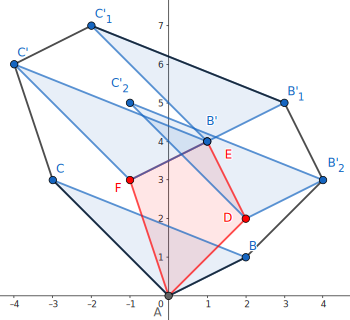

## 二维凸包

### 定义

#### 凸多边形

凸多边形是指所有内角大小都在 $[0,\pi]$ 范围内的 **简单多边形**。

#### 凸包

在平面上能包含所有给定点的最小凸多边形叫做凸包。

其定义为：对于给定集合 $X$，所有包含 $X$ 的凸集的交集 $S$ 被称为 $X$ 的 **凸包**。

实际上可以理解为用一个橡皮筋包含住所有给定点的形态。

凸包用最小的周长围住了给定的所有点。如果一个凹多边形围住了所有的点，它的周长一定不是最小，如下图。根据三角不等式，凸多边形在周长上一定是最优的。


### Andrew 算法求凸包

常用的求法有 Graham 扫描法和 Andrew 算法，这里主要介绍 Andrew 算法。

#### 性质

该算法的时间复杂度为 $O(n\log n)$，其中 $n$ 为待求凸包点集的大小，复杂度的瓶颈在于对所有点坐标的双关键字排序。

#### 过程

首先把所有点以横坐标为第一关键字，纵坐标为第二关键字排序。

显然排序后最小的元素和最大的元素一定在凸包上。而且因为是凸多边形，我们如果从一个点出发逆时针走，轨迹总是「左拐」的，一旦出现右拐，就说明这一段不在凸包上。因此我们可以用一个单调栈来维护上下凸壳。

因为从左向右看，上下凸壳所旋转的方向不同，为了让单调栈起作用，我们首先 **升序枚举** 求出下凸壳，然后 **降序** 求出上凸壳。

求凸壳时，一旦发现即将进栈的点（$P$）和栈顶的两个点（$S_1,S_2$，其中 $S_1$ 为栈顶）行进的方向向右旋转，即叉积小于 $0$：$\overrightarrow{S_2S_1}\times \overrightarrow{S_1P}<0$，则弹出栈顶，回到上一步，继续检测，直到 $\overrightarrow{S_2S_1}\times \overrightarrow{S_1P}\ge 0$ 或者栈内仅剩一个元素为止。

通常情况下不需要保留位于凸包边上的点，因此上面一段中 $\overrightarrow{S_2S_1}\times \overrightarrow{S_1P}<0$ 这个条件中的「$<$」可以视情况改为 $\le$，同时后面一个条件应改为 $>$。

#### 实现

???+ note "代码实现"
    === "C++"
        ```cpp
        // stk[] 是整型，存的是下标
        // p[] 存储向量或点
        tp = 0;                       // 初始化栈
        std::sort(p + 1, p + 1 + n);  // 对点进行排序
        stk[++tp] = 1;
        // 栈内添加第一个元素，且不更新 used，使得 1 在最后封闭凸包时也对单调栈更新
        for (int i = 2; i <= n; ++i) {
          while (tp >= 2  // 下一行 * 操作符被重载为叉积
                 && (p[stk[tp]] - p[stk[tp - 1]]) * (p[i] - p[stk[tp]]) <= 0)
            used[stk[tp--]] = 0;
          used[i] = 1;  // used 表示在凸壳上
          stk[++tp] = i;
        }
        int tmp = tp;  // tmp 表示下凸壳大小
        for (int i = n - 1; i > 0; --i)
          if (!used[i]) {
            // ↓求上凸壳时不影响下凸壳
            while (tp > tmp && (p[stk[tp]] - p[stk[tp - 1]]) * (p[i] - p[stk[tp]]) <= 0)
              used[stk[tp--]] = 0;
            used[i] = 1;
            stk[++tp] = i;
          }
        for (int i = 1; i <= tp; ++i)  // 复制到新数组中去
          h[i] = p[stk[i]];
        int ans = tp - 1;
        ```
    
    === "Python"
        ```python
        stk = []  # 是整型，存的是下标
        p = []  # 存储向量或点
        tp = 0  # 初始化栈
        p.sort()  # 对点进行排序
        tp = tp + 1
        stk[tp] = 1
        # 栈内添加第一个元素，且不更新 used，使得 1 在最后封闭凸包时也对单调栈更新
        for i in range(2, n + 1):
            while tp >= 2 and (p[stk[tp]] - p[stk[tp - 1]]) * (p[i] - p[stk[tp]]) <= 0:
                # 下一行 * 操作符被重载为叉积
                used[stk[tp]] = 0
                tp = tp - 1
            used[i] = 1  # used 表示在凸壳上
            tp = tp + 1
            stk[tp] = i
        tmp = tp  # tmp 表示下凸壳大小
        for i in range(n - 1, 0, -1):
            if used[i] == False:
                #      ↓求上凸壳时不影响下凸壳
                while tp > tmp and (p[stk[tp]] - p[stk[tp - 1]]) * (p[i] - p[stk[tp]]) <= 0:
                    used[stk[tp]] = 0
                    tp = tp - 1
                used[i] = 1
                tp = tp + 1
                stk[tp] = i
        for i in range(1, tp + 1):
            h[i] = p[stk[i]]
        ans = tp - 1
        ```

根据上面的代码，最后凸包上有 $\textit{ans}$ 个元素（额外存储了 $1$ 号点，因此 $h$ 数组中有 $\textit{ans}+1$ 个元素），并且按逆时针方向排序。周长就是

$$
\sum_{i=1}^{\textit{ans}}\left|\overrightarrow{h_ih_{i+1}}\right|
$$

### Graham 扫描法

#### 性质

与 Andrew 算法相同，Graham 扫描法的时间复杂度为 $O(n\log n)$，复杂度瓶颈也在于对所有点排序。

#### 过程

首先找到所有点中，纵坐标最小的一个点 $P$。根据凸包的定义我们知道，这个点一定在凸包上。然后将所有的点以相对于点 P 的极角大小为关键字进行排序。


和 Andrew 算法类似地，我们考虑从点 $P$ 出发，在凸包上逆时针走，那么我们经过的所有节点一定都是「左拐」的。形式化地说，对于凸包逆时针方向上任意连续经过的三个点 $P_1, P_2, P_3$，一定满足 $\overrightarrow{P_1 P_2} \times \overrightarrow{P_2 P_3} \ge 0$。

新建一个栈用于存储凸包的信息，先将 $P$ 压入栈中，然后按照极角序依次尝试加入每一个点。如果进栈的点 $P_0$ 和栈顶的两个点 $P_1, P_2$（其中 $P_1$ 为栈顶）行进的方向「右拐」了，那么就弹出栈顶的 $P_1$，不断重复上述过程直至进栈的点与栈顶的两个点满足条件，或者栈中仅剩下一个元素，再将 $P_0$ 压入栈中。


???+ note "代码实现"
    ```cpp
    struct Point {
      double x, y, ang;
    
      Point operator-(const Point& p) const { return {x - p.x, y - p.y, 0}; }
    } p[MAXN];
    
    double dis(Point p1, Point p2) {
      return sqrt((p1.x - p2.x) * (p1.x - p2.x) + (p1.y - p2.y) * (p1.y - p2.y));
    }
    
    bool cmp(Point p1, Point p2) {
      if (p1.ang == p2.ang) {
        return dis(p1, p[1]) < dis(p2, p[1]);
      }
      return p1.ang < p2.ang;
    }
    
    double cross(Point p1, Point p2) { return p1.x * p2.y - p1.y * p2.x; }
    
    int main() {
      for (int i = 2; i <= n; ++i) {
        if (p[i].y < p[1].y || (p[i].y == p[1].y && p[i].x < p[1].x)) {
          std::swap(p[1], p[i]);
        }
      }
      for (int i = 2; i <= n; ++i) {
        p[i].ang = atan2(p[i].y - p[1].y, p[i].x - p[1].x);
      }
      std::sort(p + 2, p + n + 1, cmp);
      sta[++top] = 1;
      for (int i = 2; i <= n; ++i) {
        while (top >= 2 &&
               cross(p[sta[top]] - p[sta[top - 1]], p[i] - p[sta[top]]) < 0) {
          top--;
        }
        sta[++top] = i;
      }
      return 0;
    }
    ```

## 闵可夫斯基和

### 定义

点集 $P$ 和点集 $Q$ 的闵可夫斯基和 $P+Q$ 定义为 $P+Q=\{a+b|a\in P,b\in Q\}$，即把点集 $Q$ 中的每个点看做一个向量，将点集 $P$ 中每个点沿这些向量平移，最终得到的结果的集合就是点集 $P+Q$。此处仅讨论 **凸包** 的闵可夫斯基和。

例如：对于点集 $P=\{(0,0),(-3,3),(2,1)\}$ 和 点集 $Q=\{(0,0),(-1,3),(1,4),(2,2)\}$，


将 $P$ 沿 $Q$ 的每个向量平移：


不难发现新图形也是一个 **凸包**：



### 性质

1.  若点集合 $P$，$Q$ 为凸集，则其闵可夫斯基和 $P+Q$ 也是凸集。

    ??? note "证明"
        设 $e,f\in P+Q$，有 $a,b \in P$，$c,d\in Q$ 且 $e=a+c,f=b+d$，则对任意 $t\in[0,1]$ 均有：
        
        $$
        \begin{aligned}
        te + (1-t)f &= t(a+c)+(1-t)(b+d)\\
        &=(ta+(1-t)b)+(tc+(1-t)d)\\
        &\in P+Q.
        \end{aligned}
        $$
        
        证毕。
2.  若点集 $P$，$Q$ 为凸集，则其闵可夫斯基和 $P+Q$ 的边集是由凸集 $P$，$Q$ 的边按极角排序后连接的结果。

    ??? note "证明"
        不妨假设凸集 $P$ 中任意一条边的斜率与 $Q$ 中任意一条边的斜率均不相同。将坐标系进行旋转，使得 $P$ 上的一条边 $XY$ 与 $x$ 轴平行且在最下方。
        
        设此时 $Q$ 中最低的点 $U$，$P+Q$ 的 **最低** 且 **靠左** 的点 $A$。
        
        可知 $\vec{A} = \vec{X} + \vec{U}$，所以 $A$ 必然在 $P+Q$ 的边界上。
        
        同理，$P+Q$ 中 **最低** 且 **靠右** 的点 $B$ 有 $\vec{B} = \vec{Y} + \vec{U}$，也必然在 $P+Q$ 的边界上。
        
        因此，有 $\vec{AB} = \vec{XY} + \vec{U}$。
        
        若按顺序进行旋转，则结果连续的构成了 $P+Q$ 中的每条边。
        
        证毕。

### 实现

我们可以根据性质 2，将凸集 $P,Q$ 极角排序，得到它们在 $P+Q$ 上的出现顺序，把 $P_1+Q_1$ 看做 $P+Q$ 的起点，然后用类似 **归并** 的做法依次放边即可。

时间复杂度：$O(n+m)$

???+ note "实现"
    ```cpp
    template <class T>
    struct Point {
      T x, y;
    
      Point(T x = 0, T y = 0) : x(x), y(y) {}
    
      friend Point operator+(const Point &a, const Point &b) {
        return {a.x + b.x, a.y + b.y};
      }
    
      friend Point operator-(const Point &a, const Point &b) {
        return {a.x - b.x, a.y - b.y};
      }
    
      // 点乘
      friend T operator*(const Point &a, const Point &b) {
        return a.x * b.x + a.y * b.y;
      }
    
      // 叉乘
      friend T operator^(const Point &a, const Point &b) {
        return a.x * b.y - a.y * b.x;
      }
    };
    
    template <class T>
    vector<Point<T>> minkowski_sum(vector<Point<T>> a, vector<Point<T>> b) {
      vector<Point<T>> c{a[0] + b[0]};
      for (usz i = 0; i + 1 < a.size(); ++i) a[i] = a[i + 1] - a[i];
      for (usz i = 0; i + 1 < b.size(); ++i) b[i] = b[i + 1] - b[i];
      a.pop_back(), b.pop_back();
      c.resize(a.size() + b.size() + 1);
      merge(a.begin(), a.end(), b.begin(), b.end(), c.begin() + 1,
            [](const Point<i64> &a, const Point<i64> &b) { return (a ^ b) < 0; });
      for (usz i = 1; i < c.size(); ++i) c[i] = c[i] + c[i - 1];
      return c;
    }
    ```

### 例题

???+ note "[例题 \[JSOI2018\] 战争](https://loj.ac/p/2549)"
    有两个凸包 $P,Q$，平移 $q$ 次 $Q$，问每次移动后是否有交点。$1\le n,m\le 10^5,1\le q\le 10^5$。

??? note "实现"
    ```cpp
    --8<-- "docs/geometry/code/convex-hull/convex-hull_1.cpp"
    ```

## 三维凸包

### 基础知识

> 圆的反演：反演中心为 $O$，反演半径为 $R$，若经过 $O$ 的直线经过 $P$,$P'$，且 $OP\times OP'=R^{2}$，则称 $P$、$P'$ 关于 $O$ 互为反演。

### 过程

求凸包的过程如下：

-   首先对其微小扰动，避免出现四点共面的情况。
-   对于一个已知凸包，新增一个点 $P$，将 $P$ 视作一个点光源，向凸包做射线，可以知道，光线的可见面和不可见面一定是由若干条棱隔开的。
-   将光的可见面删去，并新增由其分割棱与 $P$ 构成的平面。
    重复此过程即可，由 [Pick 定理](./pick.md)、欧拉公式（在凸多面体中，其顶点 $V$、边数 $E$ 及面数 $F$ 满足 $V−E+F=2$）和圆的反演，复杂度 $O(n^2)$。[^3d-v]

### 模板题

[P4724【模板】三维凸包](https://www.luogu.com.cn/problem/P4724)

重复上述过程即可得到答案。

???+ note "代码实现"
    ```cpp
    --8<-- "docs/geometry/code/3d/3d_1.cpp"
    ```

## 练习

-   [UVa11626 Convex Hull](https://uva.onlinejudge.org/index.php?option=com_onlinejudge\&Itemid=8\&category=78\&page=show_problem\&problem=2673)

-   [「USACO5.1」圈奶牛 Fencing the Cows](https://www.luogu.com.cn/problem/P2742)

-   [POJ1873 The Fortified Forest](http://poj.org/problem?id=1873)

-   [POJ1113 Wall](http://poj.org/problem?id=1113)

-   [USACO22JAN Multiple Choice Test P](https://www.luogu.com.cn/problem/P8101)

-   [「SHOI2012」信用卡凸包](https://www.luogu.com.cn/problem/P3829)

## 参考资料与注释

[^3d-v]: [三维凸包学习小记](https://www.cnblogs.com/xzyxzy/p/10225804.html)
