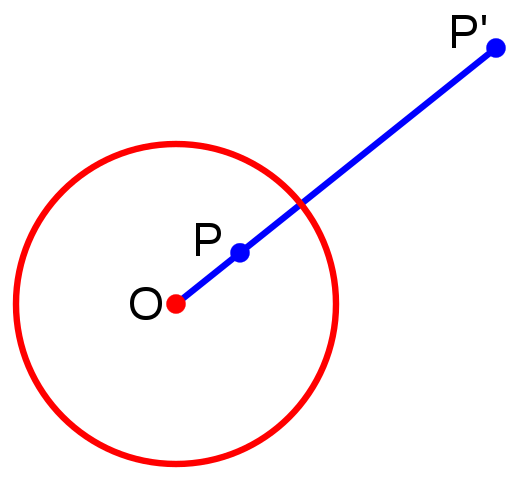
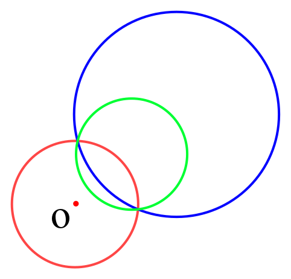
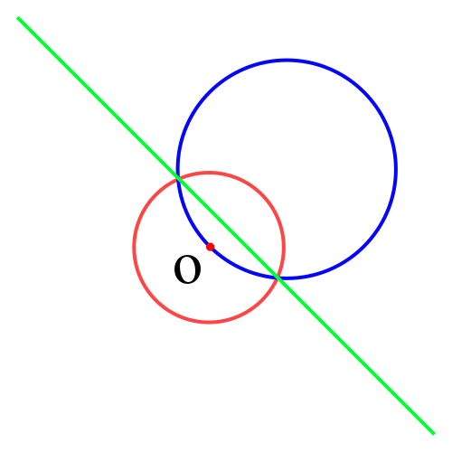

author: hyp1231

反演变换适用于题目中存在多个圆/直线之间的相切关系的情况。利用反演变换的性质，在反演空间求解问题，可以大幅简化计算。

## 定义

给定反演中心点 $O$ 和反演半径 $R$。若平面上点 $P$ 和 $P'$ 满足：

- 点 $P'$ 在射线 $\overrightarrow{OP}$ 上
- $|OP| \cdot |OP'| = R^2$

则称点 $P$ 和点 $P'$ 互为反演点。

下图所示即为平面上一点 $P$ 的反演：



## 性质

1. 圆 $O$ 外的点的反演点在圆 $O$ 内，反之亦然；圆 $O$ 上的点的反演点为其自身。

2.  不过点 $O$ 的圆 $A$，其反演图形也是不过点 $O$ 的圆。

    

    -   记圆 $A$ 半径为 $r_1$，其反演图形圆 $B$ 半径为 $r_2$，则有：

        $$
        r_2 = \frac{1}{2}\left(\frac{1}{|OA| - r_1} - \frac{1}{|OA| + r_1}\right) R^2
        $$

        **证明：**

        

        根据反演变换定义：

        $$
        \begin{aligned}
        |OC|\cdot|OC'| &= (|OA|+r_1)\cdot(|OB|-r_2) = R^2 \\
        |OD|\cdot|OD'| &= (|OA|-r_1)\cdot(|OB|+r_2) = R^2
        \end{aligned}
        $$

        消掉 $|OB|$，解方程即可。

    -   记点 $O$ 坐标为 $(x_0, y_0)$，点 $A$ 坐标为 $x_1, y_1$，点 $B$ 坐标为 $x_2, y_2$，则有：

        $$
        \begin{aligned}
        x_2 &= x_0 + \frac{|OB|}{|OA|} (x_1 - x_0) \\
        y_2 &= y_0 + \frac{|OB|}{|OA|} (y_1 - y_0)
        \end{aligned}
        $$

        其中 $|OB|$ 可在上述求 $r_2$ 的过程中计算得到。

3.  过点 $O$ 的圆 $A$，其反演图形是不过点 $O$ 的直线。

    ??? note
        为什么是一条直线呢？因为圆 $A$ 上无限接近点 $O$ 的一点，其反演点离点 $O$ 无限远。

    

4. 两个图形相切，则他们的反演图形也相切。

## 例题

### [「ICPC 2013 杭州赛区」Problem of Apollonius](https://vjudge.net/problem/HDU-4773)

#### 题目大意

求过两圆外一点，且与两圆相切的所有的圆。

#### 解法

首先考虑解析几何解法，似乎很难求解。

考虑以需要经过的点为反演中心进行反演（反演半径任意），所求的圆的反演图形是一条直线（应用性质 $3$），且与题目给出两圆的反演图形（性质 $2$）相切（性质 $4$）。

于是题目经过反演变换后转变为：求两圆的所有公切线。

求出公切线后，反演回原平面即可。

??? note "示例代码"
    ```cpp
    #include <algorithm>
    #include <cmath>
    #include <cstdio>
    #include <cstring>
    #include <iostream>
    #include <vector>
    using namespace std;
    
    const double EPS = 1e-8;       // 精度系数
    const double PI = acos(-1.0);  // π
    const int N = 4;
    
    struct Point {
      double x, y;
    
      Point(double x = 0, double y = 0) : x(x), y(y) {}
    
      const bool operator<(Point A) const { return x == A.x ? y < A.y : x < A.x; }
    };  // 点的定义
    
    typedef Point Vector;  // 向量的定义
    
    Vector operator+(Vector A, Vector B) {
      return Vector(A.x + B.x, A.y + B.y);
    }  // 向量加法
    
    Vector operator-(Vector A, Vector B) {
      return Vector(A.x - B.x, A.y - B.y);
    }  // 向量减法
    
    Vector operator*(Vector A, double p) {
      return Vector(A.x * p, A.y * p);
    }  // 向量数乘
    
    Vector operator/(Vector A, double p) {
      return Vector(A.x / p, A.y / p);
    }  // 向量数除
    
    int dcmp(double x) {
      if (fabs(x) < EPS)
        return 0;
      else
        return x < 0 ? -1 : 1;
    }  // 与0的关系
    
    double Dot(Vector A, Vector B) { return A.x * B.x + A.y * B.y; }  // 向量点乘
    
    double Length(Vector A) { return sqrt(Dot(A, A)); }  // 向量长度
    
    double Cross(Vector A, Vector B) { return A.x * B.y - A.y * B.x; }  // 向量叉乘
    
    Point GetLineProjection(Point P, Point A, Point B) {
      Vector v = B - A;
      return A + v * (Dot(v, P - A) / Dot(v, v));
    }  // 点在直线上投影
    
    struct Circle {
      Point c;
      double r;
    
      Circle() : c(Point(0, 0)), r(0) {}
    
      Circle(Point c, double r = 0) : c(c), r(r) {}
    
      Point point(double a) {
        return Point(c.x + cos(a) * r, c.y + sin(a) * r);
      }  // 输入极角返回点坐标
    };   // 圆
    
    // a[i] 和 b[i] 分别是第i条切线在圆A和圆B上的切点
    int getTangents(Circle A, Circle B, Point* a, Point* b) {
      int cnt = 0;
      if (A.r < B.r) {
        swap(A, B);
        swap(a, b);
      }
      double d2 =
          (A.c.x - B.c.x) * (A.c.x - B.c.x) + (A.c.y - B.c.y) * (A.c.y - B.c.y);
      double rdiff = A.r - B.r;
      double rsum = A.r + B.r;
      if (dcmp(d2 - rdiff * rdiff) < 0) return 0;  // 内含
    
      double base = atan2(B.c.y - A.c.y, B.c.x - A.c.x);
      if (dcmp(d2) == 0 && dcmp(A.r - B.r) == 0) return -1;  // 无限多条切线
      if (dcmp(d2 - rdiff * rdiff) == 0) {  // 内切，一条切线
        a[cnt] = A.point(base);
        b[cnt] = B.point(base);
        ++cnt;
        return 1;
      }
      // 有外公切线
      double ang = acos(rdiff / sqrt(d2));
      a[cnt] = A.point(base + ang);
      b[cnt] = B.point(base + ang);
      ++cnt;
      a[cnt] = A.point(base - ang);
      b[cnt] = B.point(base - ang);
      ++cnt;
      if (dcmp(d2 - rsum * rsum) == 0) {  // 一条内公切线
        a[cnt] = A.point(base);
        b[cnt] = B.point(PI + base);
        ++cnt;
      } else if (dcmp(d2 - rsum * rsum) > 0) {  // 两条内公切线
        double ang = acos(rsum / sqrt(d2));
        a[cnt] = A.point(base + ang);
        b[cnt] = B.point(PI + base + ang);
        ++cnt;
        a[cnt] = A.point(base - ang);
        b[cnt] = B.point(PI + base - ang);
        ++cnt;
      }
      return cnt;
    }  // 两圆公切线 返回切线的条数，-1表示无穷多条切线
    
    Circle Inversion_C2C(Point O, double R, Circle A) {
      double OA = Length(A.c - O);
      double RB = 0.5 * ((1 / (OA - A.r)) - (1 / (OA + A.r))) * R * R;
      double OB = OA * RB / A.r;
      double Bx = O.x + (A.c.x - O.x) * OB / OA;
      double By = O.y + (A.c.y - O.y) * OB / OA;
      return Circle(Point(Bx, By), RB);
    }  // 点 O 在圆 A 外，求圆 A 的反演圆 B，R 是反演半径
    
    Circle Inversion_L2C(Point O, double R, Point A, Vector v) {
      Point P = GetLineProjection(O, A, A + v);
      double d = Length(O - P);
      double RB = R * R / (2 * d);
      Vector VB = (P - O) / d * RB;
      return Circle(O + VB, RB);
    }  // 直线反演为过 O 点的圆 B，R 是反演半径
    
    bool theSameSideOfLine(Point A, Point B, Point S, Vector v) {
      return dcmp(Cross(A - S, v)) * dcmp(Cross(B - S, v)) > 0;
    }  // 返回 true 如果 A B 两点在直线同侧
    
    int main() {
      int T;
      scanf("%d", &T);
      while (T--) {
        Circle A, B;
        Point P;
        scanf("%lf%lf%lf", &A.c.x, &A.c.y, &A.r);
        scanf("%lf%lf%lf", &B.c.x, &B.c.y, &B.r);
        scanf("%lf%lf", &P.x, &P.y);
        Circle NA = Inversion_C2C(P, 10, A);
        Circle NB = Inversion_C2C(P, 10, B);
        Point LA[N], LB[N];
        Circle ansC[N];
        int q = getTangents(NA, NB, LA, LB), ans = 0;
        for (int i = 0; i < q; ++i)
          if (theSameSideOfLine(NA.c, NB.c, LA[i], LB[i] - LA[i])) {
            if (!theSameSideOfLine(P, NA.c, LA[i], LB[i] - LA[i])) continue;
            ansC[ans++] = Inversion_L2C(P, 10, LA[i], LB[i] - LA[i]);
          }
        printf("%d\n", ans);
        for (int i = 0; i < ans; ++i) {
          printf("%.8f %.8f %.8f\n", ansC[i].c.x, ansC[i].c.y, ansC[i].r);
        }
      }
    
      return 0;
    }
    ```

## 练习

[「ICPC 2017 南宁赛区网络赛」Finding the Radius for an Inserted Circle](https://nanti.jisuanke.com/t/A1283)

[「CCPC 2017 网络赛」The Designer](https://vjudge.net/problem/HDU-6158)

## 参考资料与拓展阅读

- [Inversive geometry - Wikipedia](https://en.wikipedia.org/wiki/Inversive_geometry)

- [圆的反演变换 - ACdreamers 的博客](https://blog.csdn.net/acdreamers/article/details/16966369)
