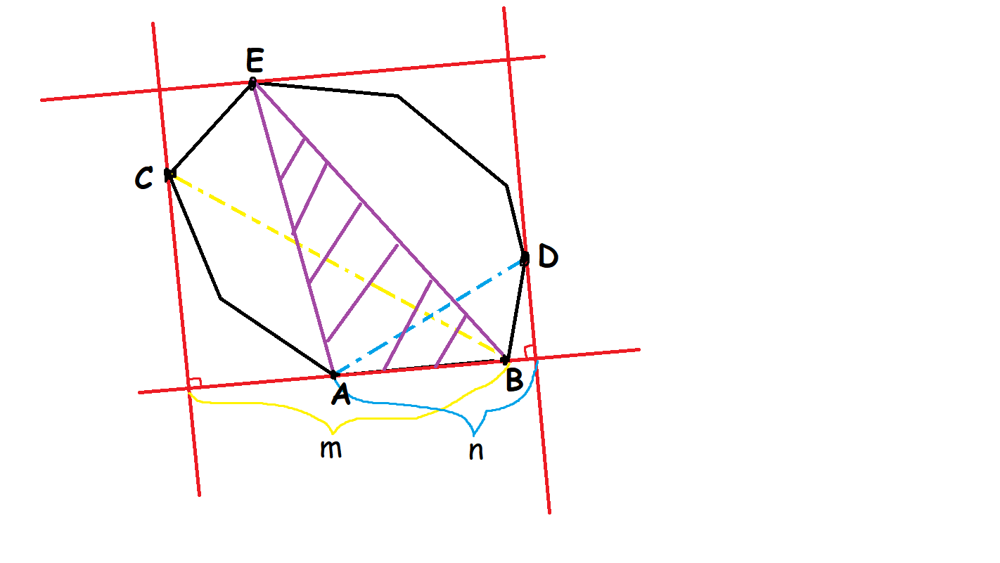

# 旋转卡壳

前置芝士：[叉积](../math/vector.md)，[极角排序](../geometry/2d.md)

Xuán zhuǎn qiǎ ké

求凸包的直径一种方法

## 实现


首先我们求出来一个凸包（绿色），然后才能找直径（红色）


找直径的方式：找两个点，做一条平行线，然后比较距离




实际上我们可以转化为两个相邻的点的线段所在的直线到最远的点的距离,这样单纯的算距离就变成了求三角形面积。


看上去我们把这些东西做麻烦了许多，实际手推一下，得到以 $CB$ 为底的面积最大值的时候，会按照 $C \to W \to D\to G $ 的方式（即为逆时针的方式）得到使三角形有最大面积的的点 $G$ ，然后找以 $WC$ 为底的三角形面积最大值的时候，也只会按照逆时针的方式得到使三角形面积最大的点 $E$（ 我们认为 $EF \verb|\\| WC$ ）,使得面积最大的点最多只会有两个，而且下一个$WD$ 取得最大值绝对不会是 $E$  而会从 $F$  开始，因此我们可以记录上一次决策的位置然后不断向逆时针防线移动。

不难发现三角形的顶点（这里姑且认为是临边不与这条平行线重合的点） 不会再回到原来的点。


因此时间复杂度达到了美妙的 $O(n\log n)$   (因为我们做了一个排序)

## 代码 

```cpp
#include<stdio.h>
#include<iostream>
#include<cmath>
#include<cstring>
#include<queue>
#include<stack>
#include<vector>
#include<set>
#include<map>
#include<algorithm>

#define int long long //陋习

using namespace std;

struct node{
	int x,y;
}p[200200],s[200200];

int n,size;

inline int cmp(node a,node b)
{
	double k1,k2;
	k1=atan2((a.y-p[1].y),(a.x-p[1].x));
	k2=atan2((b.y-p[1].y),(b.x-p[1].x));
	if(k1==k2) return a.x<b.x;
	return k1<k2;
}

inline int getdis(node a,node b)
{
	return 1ll*(a.x-b.x)*(a.x-b.x)+1ll*(a.y-b.y)*(a.y-b.y);
}

inline int getcj(node a,node b,node c)
{
	return 1ll*(b.x-a.x)*(c.y-a.y)-1ll*(b.y-a.y)*(c.x-a.x);
}

inline int bj(node a,node b)
{
	return (a.y>b.y||(a.y==b.y)&&(a.x>b.x));
}

inline void gettb() 
{
	p[0].x=p[0].y=0x3f3f3f3f;
	register int i,j;
	for(i=1;i<=n;i++) if(bj(p[0],p[i])) p[0]=p[i],j=i;  //找到最小边的点，并且把他放到第一位 
	swap(p[j],p[1]);
	sort(p+2,p+n+1,cmp); //对后面的点极点排序 
	s[++size]=p[1]; s[++size]=p[2];//让前两个点入栈（他们一定是在凸包上） 
	for(i=3;i<=n;)
	{
		if(size>=2&&getcj(s[size-1],p[i],s[size])>=0) size--; //就是上面说的 (这里的上图在凸包的那里) 
		else s[++size]=p[i++];
	}
	s[0]=s[size]; //记得凸包要首尾相连 
}

inline int getmmx()
{
	int ans=0;
	if(size==2) return getdis(s[0],s[1]);  //只有两个点的时候不能构成三角形，所以要特判 
	int j=2;
	for(int i=0;i<size;i++) 
	{
		while(getcj(s[i],s[i+1],s[j])<getcj(s[i],s[i+1],s[j+1])) j=(j+1)%size;  //实际上这也是在找面积，由于面积只有一个顶点，所以下一个j变小的时候就退出 
		ans=max(ans,max(getdis(s[i],s[j]),getdis(s[i+1],s[j]))); //找到距离最远的一条线段，并且与当前最大值比较 (求面积即可)
	}
	return ans;  //最后就是直径了 
}

signed main()
{
	ios::sync_with_stdio(false);
	register int i,j;
	cin>>n;
	for(i=1;i<=n;i++)
	{
		cin>>p[i].x>>p[i].y;
	}
	gettb();
	cout<<getmmx()<<endl;
	return 0;
}
```

## 例题

[模板题](https://www.luogu.com.cn/problem/P1452)

[ 最小矩形覆盖](https://www.luogu.com.cn/problem/P3187)

[Smallest Bounding Rectangle](https://www.luogu.com.cn/problem/UVA10173)


## 引用

动图 https://img-blog.csdn.net/20160305153623628
