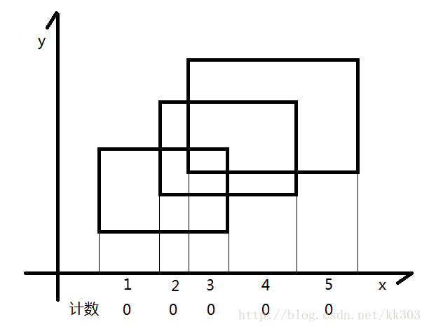
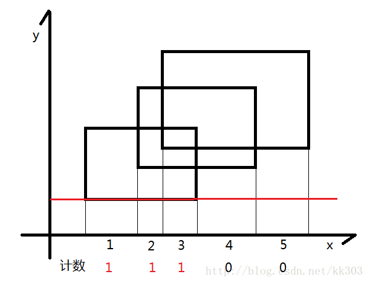
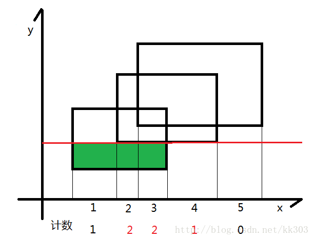
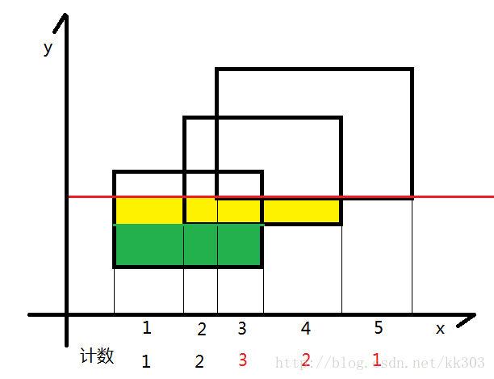
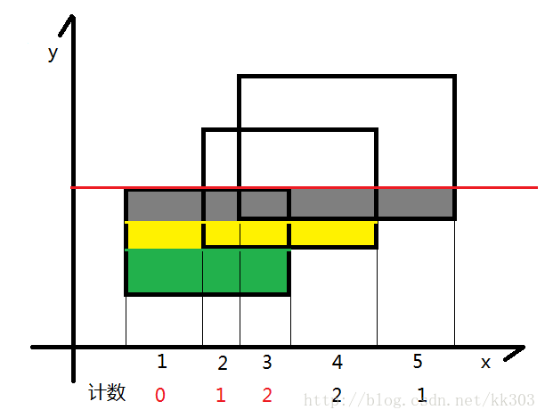
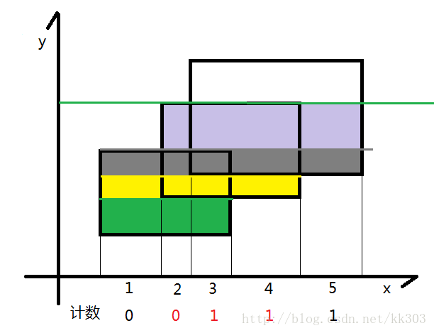
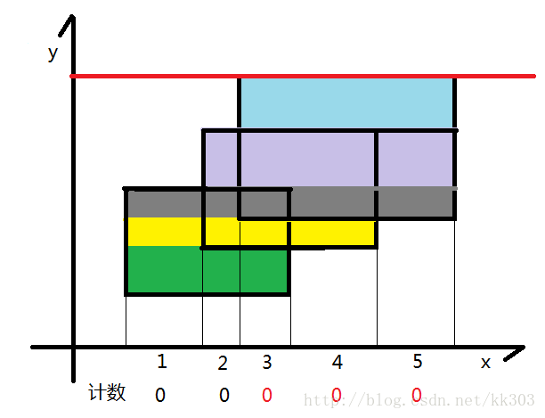

## 简介

扫描线一般运用在图形上面，它和它的字面意思十分相似，就是一条线在整个图上扫来扫去，它一般被用来解决图形面积，周长等问题。

## Atlantis 问题

### 题意

在二维坐标系上，给出多个矩形的左下以及右上坐标，求出所有矩形构成的图形的面积。

### 解法

根据图片可知总面积可以直接暴力即可求出面积，如果数据大了怎么办？这时就需要讲到 **扫描线** 算法。

### 流程

现在假设我们有一根线，从下往上开始扫描：















-   如图所示，我们可以把整个矩形分成如图各个颜色不同的小矩形，那么这个小矩形的高就是我们扫过的距离，那么剩下了一个变量，那就是矩形的长一直在变化。
-   我们的线段树就是为了维护矩形的长，我们给每一个矩形的上下边进行标记，下面的边标记为 1，上面的边标记为 -1，每遇到一个矩形时，我们知道了标记为 1 的边，我们就加进来这一条矩形的长，等到扫描到 -1 时，证明这一条边需要删除，就删去，利用 1 和 -1 可以轻松的到这种状态。
-   还要注意这里的线段树指的并不是线段的一个端点，而指的是一个区间，所以我们要计算的是 $r+1$ 和 $r-1$ 。
-   需要 [离散化](../misc/discrete.md) 。

### 代码

```cpp
#include <algorithm>
#include <cstdio>
#include <cstring>
#define maxn 300
using namespace std;

int lazy[maxn << 3];  //标记了这条线段出现的次数
double s[maxn << 3];

struct node1 {
  double l, r;
  double sum;
} cl[maxn << 3];  //线段树

struct node2 {
  double x, y1, y2;
  int flag;
} p[maxn << 3];  //坐标

//定义sort比较
bool cmp(node2 a, node2 b) { return a.x < b.x; }

//上传
void pushup(int rt) {
  if (lazy[rt] > 0)
    cl[rt].sum = cl[rt].r - cl[rt].l;
  else
    cl[rt].sum = cl[rt * 2].sum + cl[rt * 2 + 1].sum;
}

//建树
void build(int rt, int l, int r) {
  if (r - l > 1) {
    cl[rt].l = s[l];
    cl[rt].r = s[r];
    build(rt * 2, l, (l + r) / 2);
    build(rt * 2 + 1, (l + r) / 2, r);
    pushup(rt);
  } else {
    cl[rt].l = s[l];
    cl[rt].r = s[r];
    cl[rt].sum = 0;
  }
  return;
}

//更新
void update(int rt, double y1, double y2, int flag) {
  if (cl[rt].l == y1 && cl[rt].r == y2) {
    lazy[rt] += flag;
    pushup(rt);
    return;
  } else {
    if (cl[rt * 2].r > y1) update(rt * 2, y1, min(cl[rt * 2].r, y2), flag);
    if (cl[rt * 2 + 1].l < y2)
      update(rt * 2 + 1, max(cl[rt * 2 + 1].l, y1), y2, flag);
    pushup(rt);
  }
}

int main() {
  int temp = 1, n;
  double x1, y1, x2, y2, ans;
  while (scanf("%d", &n) && n) {
    ans = 0;
    for (int i = 0; i < n; i++) {
      scanf("%lf %lf %lf %lf", &x1, &y1, &x2, &y2);
      p[i].x = x1;
      p[i].y1 = y1;
      p[i].y2 = y2;
      p[i].flag = 1;
      p[i + n].x = x2;
      p[i + n].y1 = y1;
      p[i + n].y2 = y2;
      p[i + n].flag = -1;
      s[i + 1] = y1;
      s[i + n + 1] = y2;
    }
    sort(s + 1, s + (2 * n + 1));  //离散化
    sort(p, p + 2 * n, cmp);  //把矩形的边的纵坐标从小到大排序
    build(1, 1, 2 * n);       //建树
    memset(lazy, 0, sizeof(lazy));
    update(1, p[0].y1, p[0].y2, p[0].flag);
    for (int i = 1; i < 2 * n; i++) {
      ans += (p[i].x - p[i - 1].x) * cl[1].sum;
      update(1, p[i].y1, p[i].y2, p[i].flag);
    }
    printf("Test case #%d\nTotal explored area: %.2lf\n\n", temp++, ans);
  }
  return 0;
}
```

## 练习

-    [「HDU1542」Atlantis](http://acm.hdu.edu.cn/showproblem.php?pid=1542) 

-    [「HDU1828」Picture](http://acm.hdu.edu.cn/showproblem.php?pid=1828) 

-    [「HDU3265」Posters](http://acm.hdu.edu.cn/showproblem.php?pid=3265) 

## 参考资料

-    <https://www.cnblogs.com/yangsongyi/p/8378629.html> 

-    <https://blog.csdn.net/riba2534/article/details/76851233> 

-    <https://blog.csdn.net/winddreams/article/details/38495093> 
