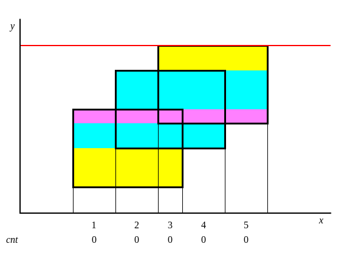

## 引入

扫描线一般运用在图形上面，它和它的字面意思十分相似，就是一条线在整个图上扫来扫去，它一般被用来解决图形面积，周长，以及二维数点等问题。

## Atlantis 问题

### 题意

在二维坐标系上，给出多个矩形的左下以及右上坐标，求出所有矩形构成的图形的面积。

### 解法

根据图片可知总面积可以直接暴力即可求出面积，如果数据大了怎么办？这时就需要讲到 **扫描线** 算法。

### 过程

现在假设我们有一根线，从下往上开始扫描：



如图所示，把整个矩形分成如图各个颜色不同的小矩形，小矩形的高是扫过的距离，然而矩形的水平宽一直在变化。

给每一个矩形的上下边进行标记，下面的边标记为 1，上面的边标记为 -1。每遇到一个水平边时，让这条边（在横轴投影区间）的权值加上这条边的标记。

> 这个操作类似遍历括号序列：开括号加 1，闭括号减 1，「权值」对应当前位置的深度，「权值」是否大于 0，对应当前在不在括号里，也就是这段区间是否记入小矩形的宽度。

小矩形（不一定只有一个）的宽度就是整个数轴上权值大于 0 的区间总长度。

### 实现

用线段树维护矩形的长，也就是整个数轴上覆盖次数大于 0 的点。需求列举如下：

-   一段区间权值加 1、减 1。
-   统计整个数轴上，区间权值大于 0 的「区间长度和」。

如果你尝试直接用普通线段树模板来实现的话，也许会遇到些挫折。具体地，由于在区间加时，即使修改区间和节点管理区间重合，我们还是不能常数时间知道覆盖次数如何变化。这是因为我们不能直接知道：管理范围里有多长的区间会从 1 变成 0（从 0 变成 1）。

这道题只需要朴素的分治就能实现：维护每个节点管理区间中「**整体** 修改的权值和 `w[]`」（类似不用下放的懒惰标记）和「覆盖长度 `v[]`」两个信息。

需要 [离散化](../misc/discrete.md)。

???+ note "模板代码"
    ```cpp
    // Luogu P5490 [模板] 扫描线 矩形面积并
    #include <algorithm>
    #include <iostream>
    
    using ll = long long;
    const int N = 1e5 + 1;
    
    int n, a[N * 2], tot;   // a[] 和 tot 用于把 x 离散化
    ll v[N * 8], w[N * 8];  // 完全覆盖区间的次数、已覆盖的长度
    
    struct St {
      ll x1, x2, y, o;
    } b[N * 2];  // 矩形上下边缘
    
    int f(int y) {  // 离散化，把坐标映射到 a 中的下标
      return std::lower_bound(a, a + tot, y) - a;
    }
    
    void up(int u, int ul, int ur) {  // pushup
      if (v[u]) w[u] = a[ur] - a[ul];
      // 如果对叶子节点调用 w[u*2+1]，那么线段树需要开 8 倍空间
      // 乘上矩形上下两边就是 16 倍
      else if (ul + 1 == ur)
        w[u] = 0;
      else
        w[u] = w[u * 2 + 1] + w[u * 2 + 2];
    }
    
    void add(int lf, int rg, ll o, int u = 0, int ul = 0, int ur = tot - 1) {
      // 区间加
      if (lf == ul && rg == ur) return v[u] += o, up(u, ul, ur), void();
      int um = (ul + ur) / 2;
      if (lf < um) add(lf, std::min(rg, um), o, u * 2 + 1, ul, um);
      if (um < rg) add(std::max(lf, um), rg, o, u * 2 + 2, um, ur);
      up(u, ul, ur);
    }
    
    int main() {
      std::cin >> n;
      for (int i = 0, x1, x2, y1, y2; i < n; i++) {
        // y1 是局部变量不会重名
        std::cin >> x1 >> y1 >> x2 >> y2;
        b[i] = {x1, x2, y1, 1};
        b[i + n] = {x1, x2, y2, -1};
        a[i] = x1, a[i + n] = x2;
      }
    
      std::sort(a, a + n * 2), tot = 1;
      for (int i = 1; i < n * 2; i++)
        if (a[i] != a[tot - 1]) a[tot++] = a[i];  // 离散化
    
      std::sort(b, b + n * 2,
                [](St &i, St &j) -> bool { return i.y < j.y; });  // 操作排序
    
      ll sum = 0;
      add(f(b[0].x1), f(b[0].x2), 1);
      for (int i = 1; i < n * 2; i++) {
        int x1 = f(b[i].x1), x2 = f(b[i].x2);
        sum += (b[i].y - b[i - 1].y) * w[0];  // 对每个小矩形面积求和
        add(x1, x2, b[i].o);
      }
      std::cout << sum << '\n';
    }
    ```

### 练习

-   [「POJ1151」Atlantis](http://poj.org/problem?id=1151)

-   [「POJ1177」Picture](http://poj.org/problem?id=1177)

-   [「POJ3832」Posters](http://poj.org/problem?id=3832)

-   [洛谷 P1856 \[IOI1998\] \[USACO5.5\] 矩形周长 Picture](https://www.luogu.com.cn/problem/P1856)
    -   横边贡献就是覆盖长度变化量。
    -   两个方向分别算一次可以避免竖直边的讨论。
    -   操作排序时注意考虑两个矩形边重合的情况。
    -   数据范围允许不用线段树，直接平方时间模拟。

## B 维正交范围

B 维正交范围指在一个 B 维直角坐标系下，第 $i$ 维坐标在一个整数范围 $[l_i,r_i]$ 间，内部的点集。

一般来说，一维正交范围简称区间，二维正交范围简称矩形，三维正交范围简称立方体（我们常说的二维数点就是二维正交范围）。

对于一个静态的二维问题，我们可以使用扫描线扫一维，数据结构维护另一维。
在扫描线从左到右扫的过程中，会在数据结构维护的那一维上产生一些修改与查询。
如果查询的信息可差分的话直接使用差分，否则需要使用分治。差分一般用树状数组和线段树维护，但因为树状数组好写而且常数小，所以大部分人会选择用树状数组来维护。分治一般是 CDQ 分治（但是这里不涉及分治）。

另一种比较容易理解的看待问题的角度是站在序列角度，而不站在二维平面角度。如果我们这样看待问题，则扫描线实际上是枚举了右端点 $r=1\cdots n$，维护一个数据结构，支持查询对于当前的 $r$，给定一个值 $l$，$l$ 到 $r$ 的答案是什么。即扫描线扫询问右端点，数据结构维护所有左端点的答案，或者说遍历一维，数据结果维护另一维。

复杂度一般为 $O((n+m)\log n)$。

## 二维数点

给一个长为 $n$ 的序列，有 $m$ 次查询，每次查区间 $[l,r]$ 中值在 $[x,y]$ 内的元素个数。

这个问题就叫做二维数点。我们可以发现等价于我们要查询一个二维平面上矩形内的点的数量和。这里讲一下这个问题最简单的处理方法，扫描线 + 树状数组。

很显然，这个问题是一个静态的二维问题，我们通过扫描线可以将静态的二维问题转换为动态的一维问题。维护动态的一维问题就使用数据结构维护序列，这里可以使用树状数组。

先将所有的询问离散化，用树状数组维护权值，对于每次询问的 $l$ 和 $r$，我们在枚举到 $l-1$ 时统计当前位于区间 $[x,y]$ 内的数的数量 $a$，继续向后枚举，枚举到 $r$ 时统计当前位于区间 $[x,y]$ 内的数的数量 $b$，$b-a$ 即为该次询问的答案。

### 例题

???+ note "[洛谷 P2163\[SHOI2007\] 园丁的烦恼](https://www.luogu.com.cn/problem/P2163)"
    首先离散化。设一个左下角为 $(0, 0)$，右上角为 $(x, y)$ 的矩形内包含 $ans_{x, y}$ 个点。则询问的答案答案可以被差分为 $ans_{c, d} - ans_{a - 1, d} - ans_{c, b - 1} + ans_{a - 1, b - 1}$。

?? note "代码"`cpp     --8<-- "docs/geometry/code/scanning/scanning_3.cpp"
    `

???+ note "[洛谷 P1908 逆序对](https://www.luogu.com.cn/problem/P1908)"
    没错，逆序对也可以用扫描线的思维来做。考虑将求逆序对的个数转化为从后向前枚举每个位置 $i$，求在区间 $[i+1,n]$ 中，大小在区间 $[0,a_i]$ 中的点的个数。题目中数据范围为 $10^9$，很显然要先进行离散化，我们可以考虑从后向前遍历数组，每次遍历到一个数时更新树状数组（线段树），之后统计当前一共有多少个数小于当前枚举的数，因为我们是从后向前遍历的，所以比当前值小的数的个数就是他的逆序对的个数，可以用树状数组或线段树进行单点修改和区间查询。

?? note "代码"`cpp     --8<-- "docs/geometry/code/scanning/scanning_1.cpp"
    `

???+ note "[洛谷 P1972 \[SDOI2009\] HH 的项链](https://www.luogu.com.cn/problem/P1972)"
    简要题意：给定一个序列，多次询问区间 $[l,r]$ 中有多少种不同的数。
    
    这类问题我们可以考虑推导性质，之后使用扫描线枚举所有右端点，数据结构维护每个左端点的答案的方法来实现，我们也可以将问题转换到二维平面上，变为一个矩形查询信息的问题。
    
    在本题中，我们设序列中 $a_i$ 上一次出现的位置为 $pre_i$，如果 $a_i$ 没有出现过，则 $pre_i = 0$。根据题意，如果一种数在区间中出现多次，只会产生一次贡献。不妨认为每种数产生贡献的位置是区间中第一次出现的位置，这时可以发现，产生的总贡献即为 $pre_x \le l - 1$ 的个数，反证法易证。
    
    现在问题即为：给定一个序列 $pre$，多次查询区间 $[l,r]$ 中有多少个 $pre_i \le l - 1$。
    
    我们可以把 $pre_i$ 看成二维平面的点：$i$ 是横坐标，$pre_i$ 是纵坐标，问题就转化为了二维数点问题：每次询问左下角为 $(l,0)$，右上角为 $(r,l - 1)$ 的矩形中有几个点。
    
    注意到这个询问是可差分的，我们可以将询问差分为左下角为 $(0,0)$，右上角为 $(r,l - 1)$ 的矩形减去左下角为 $(0,0)$，右上角为 $(l - 1,l - 1)$ 的矩形有几个点，这样方便我们使用扫描线思想。
    
    单次操作复杂度 $O(\log n)$，共有 $n$ 次加点操作和 $2m$ 次查询操作，总时间复杂度 $O((n + m) \log n)$。

?? note "代码"`cpp     --8<-- "docs/geometry/code/scanning/scanning_2.cpp"
    `

### 练习

-   [洛谷 P8593「KDOI-02」一个弹的投](https://www.luogu.com.cn/problem/P8593) 逆序对的应用。

-   [AcWing 4709. 三元组](https://www.acwing.com/problem/content/4712/) 上题的弱化版，同样为逆序对的应用。

-   [洛谷 P8773\[蓝桥杯 2022 省 A\] 选数异或](https://www.luogu.com.cn/problem/P8773) HH 的项链魔改版。

-   [洛谷 P8844\[传智杯 #4 初赛\] 小卡与落叶](https://www.luogu.com.cn/problem/P8844) 树上问题转序列问题然后进行二维数点。

总而言之，二维数点的主要思路就是数据结构维护一维，然后枚举另一维。

## 参考资料

-   <https://www.cnblogs.com/yangsongyi/p/8378629.html>

-   <https://blog.csdn.net/riba2534/article/details/76851233>

-   <https://blog.csdn.net/winddreams/article/details/38495093>

-   <https://dregen-yor.cf/2022/10/01/sao-miao-xian>
