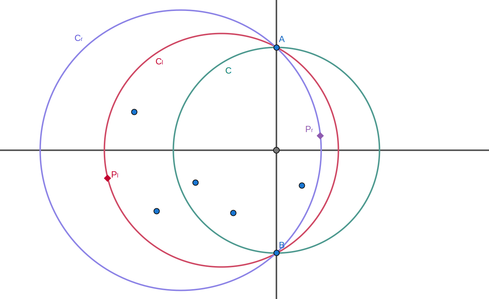

author: Ir1d, Catreap, TianyiQ, Tiphereth-A, Enter-tainer, Henry-ZHR, HeRaNO, iamtwz, ksyx, ouuan, sshwy, Xeonacid, GWBailang553

## 引入

给你平面上的 $n$ 个点，请你找出一个最小的圆，使得所有点都在圆内（包含边界）．

## 随机增量法

求解最小圆覆盖问题的最常见做法是 [随机增量法](random-incremental.md)．

不考虑退化的情况，那么最小覆盖圆会过两个或三个点．

既然最多三个点就可以确定一个圆，我们先考虑固定一些点．

### 过程

#### 固定三个点

即，给定 $A=(x_A,y_A), B=(x_B,y_B), C=(x_C,y_C)$，求 $\triangle ABC$ 的外接圆．半径显然是好求的（$r=OA$），所以关键就是求 $O$ 的坐标．

##### 方法一（推荐）：求中垂线交点

根据垂径定理，圆心落在 $AB$ 和 $AC$ 的垂直平分线上．

令 $P_1=\frac{A+B}{2},P_2=\frac{A+C}{2}$，两条垂直平分线的方向向量分别为 $d_1,d_2$．设交点为 $O=P_1+k_1d_1=P_2+k_2d_2$，即 $k_1d_1=P_2-P_1+k_2d_2$．

等式两边同时右叉乘 $d_2$，可得 $k_1(d_1\times d_2)=(P_2-P_1)\times d_2$．

故 $k_1=\frac{(P_2-P_1)\times d_2}{d_1\times d_2}$．

求出 $k_1$，代入 $O=P_1+k_1d_1$，即可求出圆心．

##### 方法二：直接解方程

设外心 $O=(x,y)$，则：

$$
\begin{aligned}
&(x-x_A)^2+(y-y_A)^2=(x-x_B)^2+(y-y_B)^2,\\
&(x-x_A)^2+(y-y_A)^2=(x-x_C)^2+(y-y_C)^2.
\end{aligned}
$$

展开后，令：

$$
\begin{aligned}
A_1&=2(x_B-x_A),&B_1&=2(y_B-y_A),&C_1&=x_B^2+y_B^2-x_A^2-y_A^2,\\
A_2&=2(x_C-x_A),&B_2&=2(y_C-y_A),&C_2&=x_C^2+y_C^2-x_A^2-y_A^2.
\end{aligned}
$$

则外心坐标满足

$$
\begin{cases}
A_1x+B_1y=C_1,\\
A_2x+B_2y=C_2.
\end{cases}
$$

若三点不共线，由克拉默法则可得

$$
x=\frac{C_1B_2-C_2B_1}{A_1B_2-A_2B_1},\quad y=\frac{A_1C_2-A_2C_1}{A_1B_2-A_2B_1}.
$$

#### 固定两个点

假如我们已经知道了最小覆盖圆上的两个点，我们能否迅速地找到最小覆盖圆呢？

根据垂径定理，最小覆盖圆的圆心必定在 $AB$ 的垂直平分线上．容易证明，可能的最小覆盖圆必定是以下三种之一：

-   以 $AB$ 为直径的圆；
-   过 $A$，$B$，以及直线 $AB$ 左侧一点 $P_l$ 的圆中，半径最大的圆；
-   过 $A$，$B$，以及直线 $AB$ 右侧一点 $P_r$ 的圆中，半径最大的圆．

其中当 $\overrightarrow{AB}\times\overrightarrow{AP_l}>0$ 时我们认为 $P_l$ 在直线 $AB$ 左侧，当 $\overrightarrow{AB}\times\overrightarrow{AP_r}<0$ 时我们认为 $P_r$ 在直线 $AB$ 右侧．

??? note "为什么要选择半径最大的？"
    固定 $A,B$ 后，圆只由半径和在哪一侧决定．如果同样选择左侧点，那么半径越大，覆盖的左侧点越多．

故最多有三个候选圆，如下图所示：



判断哪个是最小圆覆盖即可．

总时间复杂度 $O(n)$．

#### 固定一个点

假如现在只固定一个点，那么问题变为：给定一个点集 $S$ 和 $S$ 中的一个点 $P$，求经过 $P$ 的最小的覆盖 $S$ 的圆．

我们采用随机增量法，依次遍历 $S$ 中每个点加入．每次加入时，如果新点在原先的最小覆盖圆外，那么新点一定在新的最小覆盖圆上，此时转化为固定两个点的情况，用上面的做法 $O(n)$ 处理．

这个做法看上去是 $O(n^2)$ 的，但是可以证明其期望是 $O(n)$ 的．这也是需要随机化的原因．

??? note "证明"
    倒序考虑每一次操作．加入第 $j$ 个点答案发生变化等价于第 $j$ 个点在前 $j$ 个点的最小覆盖圆上．由于我们进行了随机打乱操作，故我们认为 $j$ 是平面上所有点等概率选择出的．平面上一共有 $j$ 个点，除固定点 $P$ 外，不超过 $2$ 个点在圆上．由此可得 $j$ 在圆上的概率小于等于 $\frac{2}{j}$．故加入第 $j$ 个点的期望时间复杂度为 $\frac{2}{j}\times O(j)+\frac{j-2}{j}\times O(1)=O(1)$．证毕．

#### 求解原问题

这一步与求解「固定一个点」的问题思路相同．维护当前的最小圆覆盖，每次加入一个点：如果这个点在圆内或圆上则继续，否则新的最小覆盖圆一定包含新点，变为「固定一个点」的问题．

时间复杂度与「固定一个点」同理，也是期望 $O(n)$．

空间复杂度 $O(n)$．

### 例题

???+ note "[洛谷 P1742 最小圆覆盖](https://www.luogu.com.cn/problem/P1742)"
    给出 $N$ 个点，求包含所有点的最小圆，输出圆的半径和圆心坐标．

??? note "参考实现"
    ```cpp
    --8<-- "docs/geometry/code/smallest-enclosing-circle/smallest-enclosing-circle_1.cpp"
    ```

## 练习

[「POI 2011」WYK-Plot](https://www.luogu.com.cn/problem/P3517)

## 参考资料与扩展阅读

[Computational Geometry Lecture 4: Smallest enclosing circles and more - University of Florida](https://www.cise.ufl.edu/~sitharam/COURSES/CG/kreveldnbhd.pdf)
