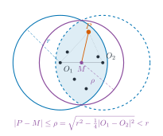
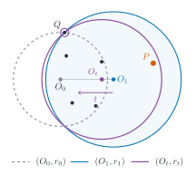
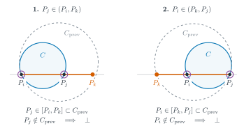
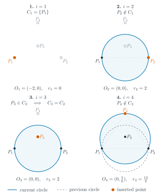
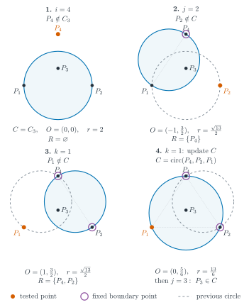
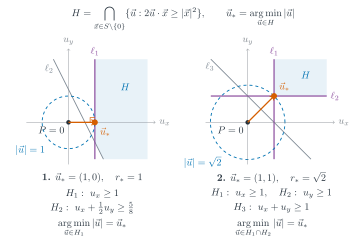

author: Ir1d, Catreap, TianyiQ, Tiphereth-A, Enter-tainer, Henry-ZHR, HeRaNO, iamtwz, ksyx, ouuan, sshwy, Xeonacid, GWBailang553

## 引入

对平面上的 $n~(n\ge 1)$ 个点 $P_1,P_2,\cdots,P_n$，找出一个半径最小的圆，使得所有点都不在圆外．这个圆称为这些点的 **最小覆盖圆**（Minimum Enclosing Circle，MEC）．

本文中，我们允许半径为 $0$ 的圆，即当所有点重合于一点 $P$ 时，我们认为这 $n$ 的点的最小覆盖圆为圆心为 $P$、半径为 $0$ 的圆．

不难发现最小覆盖圆是唯一的．

??? note "证明"
    假设存在两个不同的最小覆盖圆，其圆心分别为 $O_1,O_2$，半径均为 $r$．令 $M$ 为 $O_1O_2$ 的中点，则对任意点 $P$ 都有
    
    $$
    \begin{aligned}
        |P-M|^2&=\frac{|P-O_1|^2+|P-O_2|^2}{2}-\frac{|O_1-O_2|^2}{4}\\
        &\le r^2-\frac{|O_1-O_2|^2}{4}<r^2.
    \end{aligned}
    $$
    
    因此，以 $M$ 为圆心可以构造一个半径更小的覆盖圆，产生矛盾．
    
    

## 过程

求解最小圆覆盖问题的常见做法是基于 [随机增量法](random-incremental.md) 的 Welzl 算法[^welzl]．该算法的核心操作为：先将点随机打乱，再维护一个点集的最小覆盖圆，并依次向点集加入新点．虽然算法中包含三层循环，但其期望时间复杂度为 $O(n)$．

### 加入一个点

我们首先考虑向当前维护的点集中加入新点会发生什么．设当前圆 $C$ 是已处理点集的最小覆盖圆，现在加入点 $P$．

-   如果 $P$ 在 $C$ 内部或圆周上，则 $C$ 仍然是最小覆盖圆．
-   如果 $P$ 在 $C$ 外部，此时 $P$ 一定在新最小覆盖圆的圆周上，因此可以将问题转化为：已知 $P$ 在圆周上，求最小覆盖圆的子问题．

??? tip "为什么圆外的新点一定在新圆的圆周上"
    设旧圆、新圆的圆心分别为 $O_0,O_1$，半径分别为 $r_0,r_1$，则 $r_0\le r_1$．假设 $P$ 严格位于新圆内部．对 $0<t<1$，考虑圆 $(O_t,r_t)$ 满足
    
    $$
    O_t=(1-t)O_1+tO_0,\qquad r_t^2=(1-t)r_1^2+tr_0^2-t(1-t)|O_1-O_0|^2<r_1^2,
    $$
    
    此时取充分小的 $t$ 使得 $P$ 仍在圆 $(O_t,r_t)$ 内．对任意点 $Q$，我们有
    
    $$
    |Q-O_t|^2-r_t^2=(1-t)(|Q-O_1|^2-r_1^2)+t(|Q-O_0|^2-r_0^2).
    $$
    
    所以旧点集中的点仍能被圆 $(O_t,r_t)$ 覆盖，且原先同时固定在圆 $(O_0,r_0)$ 圆周与圆 $(O_1,r_1)$ 圆周上的点仍在圆 $(O_t,r_t)$ 的圆周上．由于 $P$ 在圆 $(O_t,r_t)$ 内，所以圆 $(O_t,r_t)$ 是合法的覆盖圆，但是我们有 $r_t<r_1$，与新圆最优矛盾．
    
    

上述结论也适用于已经固定了一点或两点在圆周上时加入新点的情况．

### 三层循环

接下来我们考虑 Welzl 算法的主体．我们将输入点等概率随机打乱，仍记为 $P_1,P_2,\cdots,P_n$，并令 $S_i=\{P_1,\cdots,P_i\}$，$S_0=\varnothing$．维护当前圆 $C$，初始时圆心为 $P_1$、半径为 $0$，圆周上没有固定点．

1.  （第一层循环）不固定圆周上的点：依次枚举 $i=2,\cdots,n$．若 $P_i$ 已在 $C$ 内则继续；否则在圆周上固定 $P_i$，重新求覆盖 $S_{i-1}$ 的最小圆．
2.  （第二层循环）固定一个圆周点 $P_i$：先将 $C$ 设为以 $P_iP_1$ 为直径的圆，再依次枚举 $j=2,\cdots,i-1$．若 $P_j$ 已在 $C$ 内则继续；否则再在圆周上固定 $P_j$，重新求覆盖 $S_{j-1}$ 的最小圆．
3.  （第三层循环）固定两个圆周点 $P_i,P_j$：先将 $C$ 设为以 $P_iP_j$ 为直径的圆，再依次枚举 $k=1,\cdots,j-1$．若 $P_k$ 已在 $C$ 内则继续；否则将 $C$ 更新为 $\triangle P_iP_jP_k$ 的外接圆．

这里「在圆内」均包含圆周，每一行中的当前圆都是满足相应约束的 **最小圆**．第三层循环结束时覆盖了 $S_{j-1}$，再加上圆周上的 $P_j$，恰好得到第二层循环所需的答案；第二层循环结束时，同理得到第一层循环所需的答案．内层循环的可行性由外层循环保证，而且不难发现第三层循环更新时，三个点 $P_iP_jP_k$ 不会共线，所以该算法是正确的．

??? tip "第三层循环更新最小圆时，为什么三点不会共线"
    由于 $P_j$ 曾在经过 $P_i$ 的圆外，因此 $P_i\ne P_j$．若 $P_i,P_j,P_k$ 共线，且 $P_k$ 在当前圆 $C$ 外，则 $P_k$ 必须在线段 $P_iP_j$ 之外．接下来分两种情况讨论：
    
    -   若 $P_j$ 位于 $P_i,P_k$ 之间，则第二层循环枚举到 $P_j$ 时，当前最小圆经过 $P_i$，且覆盖 $S_{j-1}$ 中的 $P_k$，因此也覆盖线段 $P_iP_k$ 上的 $P_j$．这与 $P_j$ 触发第三层循环矛盾．
    -   若 $P_i$ 位于 $P_j,P_k$ 之间，则第一层循环枚举到 $P_i$ 时，当前最小圆覆盖 $S_{i-1}$ 中的 $P_j,P_k$，因此也覆盖线段 $P_jP_k$ 上的 $P_i$．这与 $P_i$ 触发第二层循环矛盾．
    
    

### 计算外接圆

Welzl 算法涉及的计算几何操作较为常规，主要涉及判定点与圆的位置关系、以两点为直径的圆以及过三点的外接圆这三种，前两种我们略去不表，重点关注一下第三种操作．

给定三个不共线点 $A=(x_A,y_A), B=(x_B,y_B), C=(x_C,y_C)$，它们的外接圆圆心是线段 $AB$ 与 $AC$ 的垂直平分线交点，可以使用 [求两条直线的交点](./2d.md#求两条直线的交点) 中的方法计算．

也可以直接列方程求解．设外心 $O=(x,y)$，则

$$
\begin{cases}
(x-x_A)^2+(y-y_A)^2=(x-x_B)^2+(y-y_B)^2,\\
(x-x_A)^2+(y-y_A)^2=(x-x_C)^2+(y-y_C)^2,
\end{cases}
$$

令

$$
\begin{aligned}
A_1&=2(x_B-x_A),&B_1&=2(y_B-y_A),&C_1&=x_B^2+y_B^2-x_A^2-y_A^2,\\
A_2&=2(x_C-x_A),&B_2&=2(y_C-y_A),&C_2&=x_C^2+y_C^2-x_A^2-y_A^2,
\end{aligned}
$$

则有

$$
x=\frac{C_1B_2-C_2B_1}{A_1B_2-A_2B_1},\quad y=\frac{A_1C_2-A_2C_1}{A_1B_2-A_2B_1}.
$$

求出圆心后，取 $r=|O-A|$ 即可．分母 $A_1B_2-A_2B_1$ 非零对应三点不共线．三点接近共线时，该方法的浮点误差可能被放大，实际使用中需要特别留意．

### 示例

设点 $P_1=(-2,0)$、$P_2=(2,0)$、$P_3=(0,1)$、$P_4=(0,3)$．记 $C_i$ 为处理完前 $i$ 个点后的最小覆盖圆，下图展示外层循环的结果．蓝色实线表示当前圆，灰色虚线表示更新前的圆，橙色实心点表示本轮加入的点，灰色空心点表示尚未加入的点．



初始时半径为 $0$．加入 $P_2$ 后，当前覆盖圆以 $P_1P_2$ 为直径．$P_3$ 在圆内，所以加入它时圆不变．$P_4$ 位于圆外，必须重新计算．重算完成后，圆心为 $(0,5/6)$、半径为 $13/6$，$P_1,P_2,P_4$ 在圆周上，$P_3$ 在圆内．

下面展开 $i=4$ 时的重算过程．橙色点表示当前检查的点，紫色外圈标记本层循环固定的圆周点，其集合记为 $R$．蓝色实线与灰色虚线分别表示当前圆与上一步的圆．



1.  $P_4$ 在旧圆 $C_3$ 外，进入第二层循环．
2.  固定 $P_4$，先取以 $P_4P_1$ 为直径的圆．检查到 $j=2$ 时，发现 $P_2$ 在这个圆外，进入第三层循环．
3.  固定 $P_4,P_2$，将当前圆设为以 $P_4P_2$ 为直径的圆．检查到 $k=1$ 时，发现 $P_1$ 仍在圆外．
4.  更新为 $\triangle P_4P_2P_1$ 的外接圆，完成第三层循环．回到第二层循环后，$j=3$ 对应的 $P_3$ 已在圆内，因此跳过，得到 $C_4$．

重算中的临时圆只需满足当前子问题的约束，因此不一定覆盖上一层已经处理过的全部点．例如，第二幅子图中的圆尚未覆盖 $P_2$，第三幅子图中的圆尚未覆盖 $P_1$，这正是进入下一层或更新外接圆的原因．

### 复杂度分析

从流程来看，该算法的最坏时间复杂度上界为 $O(n^3)$，但随机打乱可以降低进入内层循环的概率，使期望时间复杂度降为 $O(n)$．

最小覆盖圆可以由至多三个点确定：只有一个不同点时半径为 $0$，否则，最小覆盖圆由一对直径端点或三个不共线的点确定．固定一个圆周点后，只需再用至多两个点即可确定最优解．

??? tip "固定一个圆周点后，为什么至多还需要两个点"
    将固定点平移到原点．设圆心向量为 $\vec{u}$，则该圆的半径为 $|\vec{u}|$．点 $x$ 被覆盖的条件等价于
    
    $$
    |\vec{x}-\vec{u}|^2\le |\vec{u}|^2\iff 2\vec{u}\cdot \vec{x}\ge |\vec{x}|^2.
    $$
    
    除原点外的每个点都会对圆心施加一个半平面约束，可行圆心落在这些 [半平面的交](./half-plane.md) 中，而最优圆心是其中离原点最近的点．在二维空间中，保留至多两条起作用的约束就能保持这个最近点不变．[^note1]因此，除了固定点，至多再保留两个输入点就足以保持最优解不变．
    
    下图中，蓝色区域 $H$ 表示所有可行圆心，橙色点 $\vec{u}_*$ 是其中离原点最近的点．去掉灰色边界对应的约束，都不会改变最优圆心．
    
    

因此，删除后会改变最优圆的点一定属于任意一组这样的确定点．不固定圆周点时，这种点至多有三个；固定一个圆周点时，这种点至多有两个．

现在进行逆向分析．先固定 $P_i$ 和第二层循环某一步的无序点集 $S_j$．由于初始顺序是随机的，所以 $P_j$ 相当于是从 $S_j$ 中等概率选取的一点．只有删除 $P_j$ 会改变受约束最优圆时，加入 $P_j$ 才会触发第三层循环，所以触发概率至多为 $\min(1,2/j)$．第三层扫描需要 $O(j)$ 时间，故整个第二层循环的期望用时为

$$
O(1)+\sum_{j=2}^{i-1}\left(O(1)+\frac{2}{j}\cdot O(j)\right)=O(i).
$$

类似地，固定第一层的无序点集 $S_i$，触发第二层重算的点至多有三个，概率至多为 $\min(1,3/i)$．固定该点以后，之前各点的相对顺序仍然是随机的，因此这次重算的条件期望用时为 $O(i)$．加上每次判定的开销以及最初打乱的开销，总期望时间复杂度为

$$
O(n)+\sum_{i=2}^{n}\left(O(1)+\min\left(1,\frac{3}{i}\right)\cdot O(i)\right)=O(n).
$$

## 例题

???+ note "[洛谷 P1742 最小圆覆盖](https://www.luogu.com.cn/problem/P1742)"
    给出 $N$ 个点，求包含所有点的最小圆，输出圆的半径和圆心坐标．

下面的实现直接维护圆心与半径，使用 `std::shuffle` 打乱点的顺序．三层循环分别对应前文的零个、一个、两个固定圆周点的子问题，`geto` 用于求三个点的外心．

??? note "参考实现"
    ```cpp
    --8<-- "docs/geometry/code/smallest-enclosing-circle/smallest-enclosing-circle_1.cpp"
    ```

## 练习

-   [「POI 2011」WYK-Plot](https://www.luogu.com.cn/problem/P3517)
-   [Library Checker - Minimum Enclosing Circle](https://judge.yosupo.jp/problem/minimum_enclosing_circle)

## 参考资料与注释

-   [Smallest-circle problem - Wikipedia](https://en.wikipedia.org/wiki/Smallest-circle_problem)
-   [Minimum Enclosing Circle - Algorithms for Competitive Programming](https://cp-algorithms.com/geometry/enclosing-circle.html)
-   [Computational Geometry Lecture 4: Smallest enclosing circles and more - University of Florida](https://www.cise.ufl.edu/~sitharam/COURSES/CG/kreveldnbhd.pdf)

[^welzl]: Welzl, E. (1991). Smallest enclosing disks (balls and ellipsoids). In: Maurer, H. (eds) New Results and New Trends in Computer Science. Lecture Notes in Computer Science, vol 555. Springer, Berlin, Heidelberg.

[^note1]: 参见 [线性规划](../math/linear-programming.md) 相关内容．
