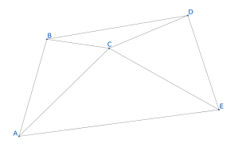
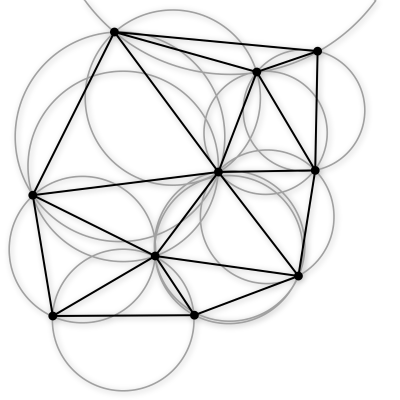
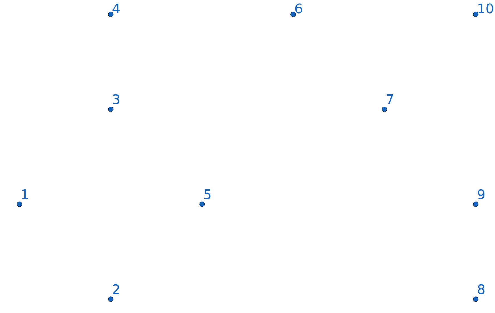
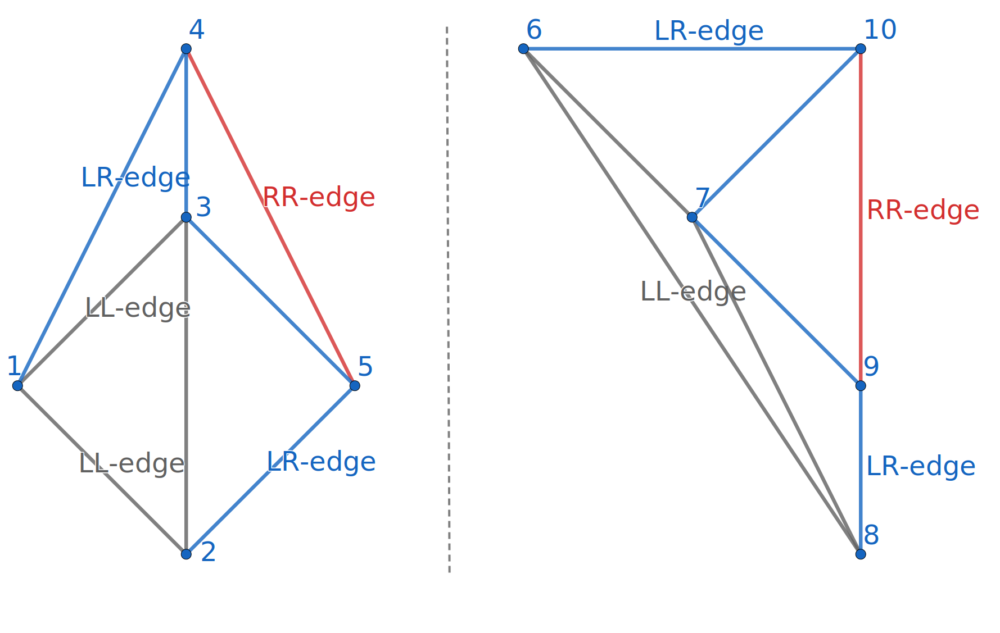
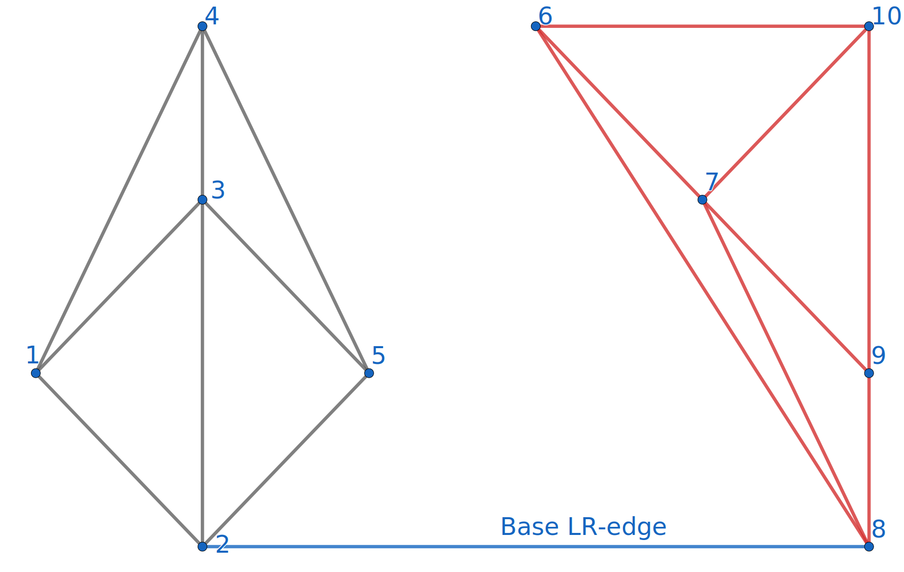
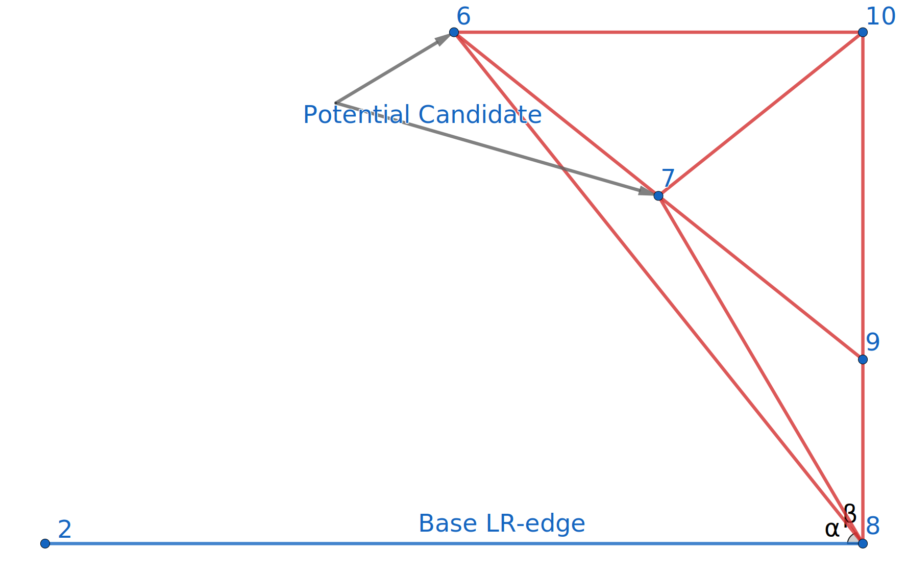
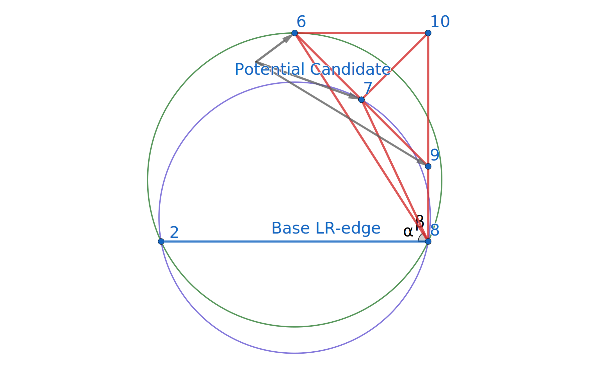
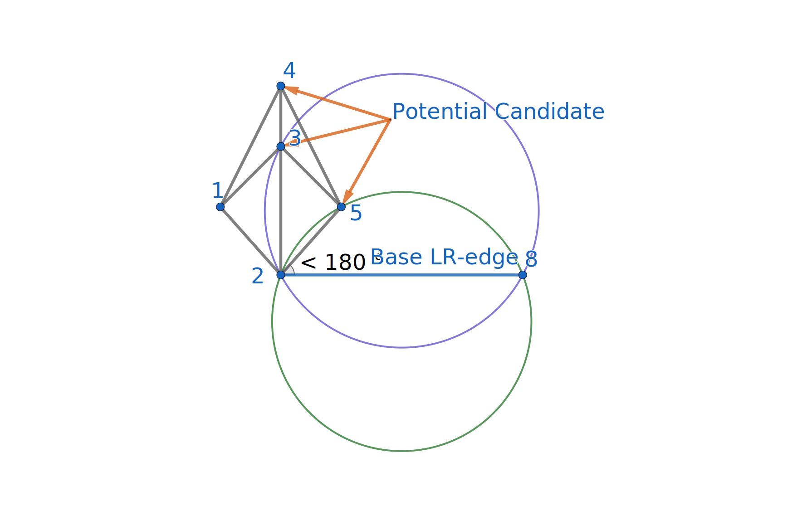
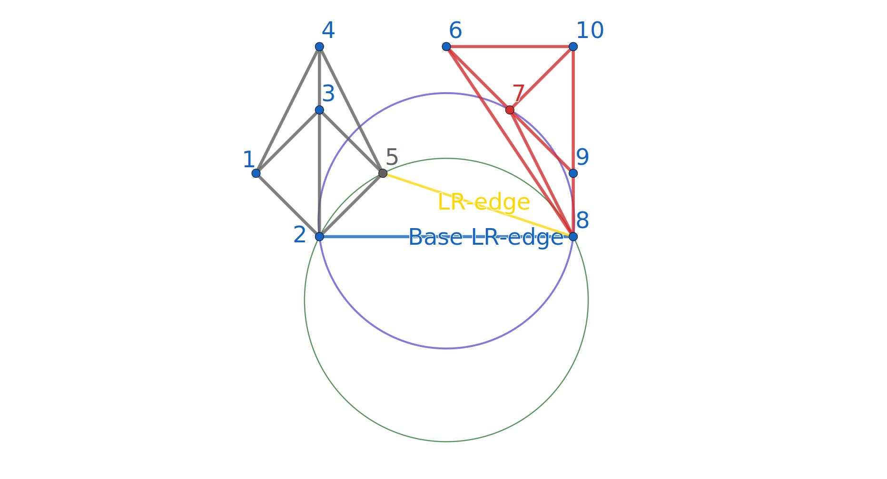
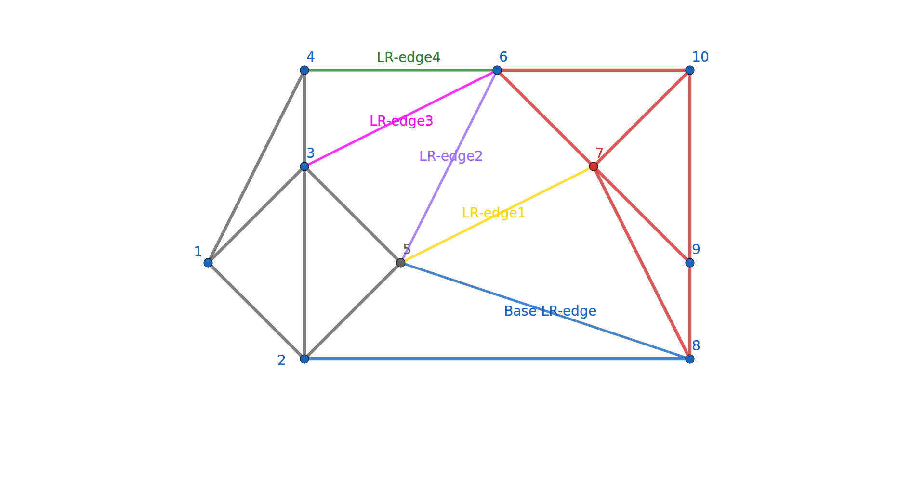

author: xehoth

在几何中，三角剖分是指将平面对象细分为三角形，并且通过扩展将高维几何对象细分为单纯形。
对于一个给定的点集，有很多种三角剖分，如：



OI 中的三角剖分主要指二维几何中的完美三角剖分（二维 Delaunay 三角剖分，简称 DT）。

## Delaunay 三角剖分

### 定义

在数学和计算几何中，对于给定的平面中的离散点集 $P$ ，其 Delaunay 三角剖分 DT( $P$ ) 满足：

1.  空圆性：DT( $P$ ) 是 **唯一** 的（任意四点不能共圆），在 DT( $P$ ) 中， **任意** 三角形的外接圆范围内不会有其它点存在。
2.  最大化最小角：在点集 $P$ 可能形成的三角剖分中，DT( $P$ ) 所形成的三角形的最小角最大。从这个意义上讲，DT( $P$ ) 是 **最接近于规则化** 的三角剖分。具体的说是在两个相邻的三角形构成凸四边形的对角线，在相互交换后，两个内角的最小角不再增大。



### 性质

1.  最接近：以最接近的三点形成三角形，且各线段（三角形的边）皆不相交。
2.  唯一性：不论从区域何处开始构建，最终都将得到一致的结果（点集中任意四点不能共圆）。
3.  最优性：任意两个相邻三角形构成的凸四边形的对角线如果可以互换的话，那么两个三角形六个内角中最小角度不会变化。
4.  最规则：如果将三角剖分中的每个三角形的最小角进行升序排列，则 Delaunay 三角剖分的排列得到的数值最大。
5.  区域性：新增、删除、移动某一个顶点只会影响邻近的三角形。
6.  具有凸边形的外壳：三角剖分最外层的边界形成一个凸多边形的外壳。

## 构造 DT 的分治算法

DT 有很多种构造算法，在 $O(n \log n)$ 的构造算法中，分治算法是最易于理解和实现的。

分治构造 DT 的第一步是将给定点集按照 $x$ 坐标 **升序** 排列，如下图是排好序的大小为 $10$ 的点集。



一旦点集有序，我们就可以不断地将其分成两个部分（分治），直到子点集大小不超过 $3$ 。然后这些子点集可以立刻剖分为一个三角形或线段。


然后在分治回溯的过程中，已经剖分好的左右子点集可以依次合并。合并后的剖分包含 LL-edge（左侧子点集的边）。RR-edge（右侧子点集的边），LR-edge（连接左右剖分产生的新的边），如图 LL-edge（灰色），RR-edge（红色），LR-edge（蓝色）。对于合并后的剖分，为了维持 DT 性质，我们 **可能** 需要删除部分 LL-edge 和 RR-edge，但我们在合并时 **不会** 增加 LL-edge 和 RR-edge。



合并左右两个剖分的第一步是插入 base LR-edge，base LR-edge 是 **最底部** 的不与 **任何** LL-edge 及 RR-edge 相交的 LR-edge。



然后，我们需要确定下一条 **紧接在** base LR-edge 之上的 LR-edge。比如对于右侧点集，下一条 LR-edge 的可能端点（右端点）为与 base LR-edge 右端点相连的 RR-edge 的另一端点（ $6, 7, 9$ 号点），左端点即为 $2$ 号点。



对于可能的端点，我们需要按以下两个标准检验：

1.  其对应 RR-edge 与 base LR-edge 的夹角小于 $180$ 度。
2.  base LR-edge 两端点和这个可能点三点构成的圆内不包含任何其它 **可能点** 。



如上图， $6$ 号可能点所对应的绿色圆包含了 $9$ 号可能点，而 $7$ 号可能点对应的紫色圆则不包含任何其它可能点，故 $7$ 号点为下一条 LR-edge 的右端点。

对于左侧点集，我们做镜像处理即可。



当左右点集都不再含有符合标准的可能点时，合并即完成。当一个可能点符合标准，一条 LR-edge 就需要被添加，对于与需要添加的 LR-edge 相交的 LL-edge 和 RR-edge，将其删除。

当左右点集均存在可能点时，判断左边点所对应圆是否包含右边点，若包含则不符合；对于右边点也是同样的判断。一般只有一个可能点符合标准（除非四点共圆）。



当这条 LR-edge 添加好后，将其作为 base LR-edge 重复以上步骤，继续添加下一条，直到合并完成。



## 代码

```cpp
#include <algorithm>
#include <cmath>
#include <cstring>
#include <list>
#include <utility>
#include <vector>

const double EPS = 1e-8;
const int MAXV = 10000;

struct Point {
  double x, y;
  int id;

  Point(double a = 0, double b = 0, int c = -1) : x(a), y(b), id(c) {}

  bool operator<(const Point &a) const {
    return x < a.x || (fabs(x - a.x) < EPS && y < a.y);
  }

  bool operator==(const Point &a) const {
    return fabs(x - a.x) < EPS && fabs(y - a.y) < EPS;
  }

  double dist2(const Point &b) {
    return (x - b.x) * (x - b.x) + (y - b.y) * (y - b.y);
  }
};

struct Point3D {
  double x, y, z;

  Point3D(double a = 0, double b = 0, double c = 0) : x(a), y(b), z(c) {}

  Point3D(const Point &p) { x = p.x, y = p.y, z = p.x * p.x + p.y * p.y; }

  Point3D operator-(const Point3D &a) const {
    return Point3D(x - a.x, y - a.y, z - a.z);
  }

  double dot(const Point3D &a) { return x * a.x + y * a.y + z * a.z; }
};

struct Edge {
  int id;
  std::list<Edge>::iterator c;
  Edge(int id = 0) { this->id = id; }
};

int cmp(double v) { return fabs(v) > EPS ? (v > 0 ? 1 : -1) : 0; }

double cross(const Point &o, const Point &a, const Point &b) {
  return (a.x - o.x) * (b.y - o.y) - (a.y - o.y) * (b.x - o.x);
}

Point3D cross(const Point3D &a, const Point3D &b) {
  return Point3D(a.y * b.z - a.z * b.y, -a.x * b.z + a.z * b.x,
                 a.x * b.y - a.y * b.x);
}

int inCircle(const Point &a, Point b, Point c, const Point &p) {
  if (cross(a, b, c) < 0) std::swap(b, c);
  Point3D a3(a), b3(b), c3(c), p3(p);
  b3 = b3 - a3, c3 = c3 - a3, p3 = p3 - a3;
  Point3D f = cross(b3, c3);
  return cmp(p3.dot(f));  // check same direction, in: < 0, on: = 0, out: > 0
}

int intersection(const Point &a, const Point &b, const Point &c,
                 const Point &d) {  // seg(a, b) and seg(c, d)
  return cmp(cross(a, c, b)) * cmp(cross(a, b, d)) > 0 &&
         cmp(cross(c, a, d)) * cmp(cross(c, d, b)) > 0;
}

class Delaunay {
 public:
  std::list<Edge> head[MAXV];  // graph
  Point p[MAXV];
  int n, rename[MAXV];

  void init(int n, Point p[]) {
    memcpy(this->p, p, sizeof(Point) * n);
    std::sort(this->p, this->p + n);
    for (int i = 0; i < n; i++) rename[p[i].id] = i;
    this->n = n;
    divide(0, n - 1);
  }

  void addEdge(int u, int v) {
    head[u].push_front(Edge(v));
    head[v].push_front(Edge(u));
    head[u].begin()->c = head[v].begin();
    head[v].begin()->c = head[u].begin();
  }

  void divide(int l, int r) {
    if (r - l <= 2) {  // #point <= 3
      for (int i = l; i <= r; i++)
        for (int j = i + 1; j <= r; j++) addEdge(i, j);
      return;
    }
    int mid = (l + r) / 2;
    divide(l, mid);
    divide(mid + 1, r);

    std::list<Edge>::iterator it;
    int nowl = l, nowr = r;

    for (int update = 1; update;) {
      // find left and right convex, lower common tangent
      update = 0;
      Point ptL = p[nowl], ptR = p[nowr];
      for (it = head[nowl].begin(); it != head[nowl].end(); it++) {
        Point t = p[it->id];
        double v = cross(ptR, ptL, t);
        if (cmp(v) > 0 || (cmp(v) == 0 && ptR.dist2(t) < ptR.dist2(ptL))) {
          nowl = it->id, update = 1;
          break;
        }
      }
      if (update) continue;
      for (it = head[nowr].begin(); it != head[nowr].end(); it++) {
        Point t = p[it->id];
        double v = cross(ptL, ptR, t);
        if (cmp(v) < 0 || (cmp(v) == 0 && ptL.dist2(t) < ptL.dist2(ptR))) {
          nowr = it->id, update = 1;
          break;
        }
      }
    }

    addEdge(nowl, nowr);  // add tangent

    for (int update = 1; true;) {
      update = 0;
      Point ptL = p[nowl], ptR = p[nowr];
      int ch = -1, side = 0;
      for (it = head[nowl].begin(); it != head[nowl].end(); it++) {
        if (cmp(cross(ptL, ptR, p[it->id])) > 0 &&
            (ch == -1 || inCircle(ptL, ptR, p[ch], p[it->id]) < 0)) {
          ch = it->id, side = -1;
        }
      }
      for (it = head[nowr].begin(); it != head[nowr].end(); it++) {
        if (cmp(cross(ptR, p[it->id], ptL)) > 0 &&
            (ch == -1 || inCircle(ptL, ptR, p[ch], p[it->id]) < 0)) {
          ch = it->id, side = 1;
        }
      }
      if (ch == -1) break;  // upper common tangent
      if (side == -1) {
        for (it = head[nowl].begin(); it != head[nowl].end();) {
          if (intersection(ptL, p[it->id], ptR, p[ch])) {
            head[it->id].erase(it->c);
            head[nowl].erase(it++);
          } else {
            it++;
          }
        }
        nowl = ch;
        addEdge(nowl, nowr);
      } else {
        for (it = head[nowr].begin(); it != head[nowr].end();) {
          if (intersection(ptR, p[it->id], ptL, p[ch])) {
            head[it->id].erase(it->c);
            head[nowr].erase(it++);
          } else {
            it++;
          }
        }
        nowr = ch;
        addEdge(nowl, nowr);
      }
    }
  }

  std::vector<std::pair<int, int> > getEdge() {
    std::vector<std::pair<int, int> > ret;
    ret.reserve(n);
    std::list<Edge>::iterator it;
    for (int i = 0; i < n; i++) {
      for (it = head[i].begin(); it != head[i].end(); it++) {
        if (it->id < i) continue;
        ret.push_back(std::make_pair(p[i].id, p[it->id].id));
      }
    }
    return ret;
  }
};
```

## Voronoi 图

Voronoi 图由一组由连接两邻点直线的垂直平分线组成的连续多边形组成，根据 $n$ 个在平面上不重合种子点，把平面分成 $n$ 个区域，使得每个区域内的点到它所在区域的种子点的距离比到其它区域种子点的距离近。

Voronoi 图是 Delaunay 三角剖分的对偶图，可以使用构造 Delaunay 三角剖分的分治算法求出三角网，再使用最左转线算法求出其对偶图实现在 $O(n \log n)$ 的时间复杂度下构造 Voronoi 图。

## 题目

 [SGU 383 Caravans](https://codeforces.com/problemsets/acmsguru/problem/99999/383) 三角剖分 + 倍增

 [CodeVS 2819. 无尽的毁灭](http://www.joyoi.cn/problem/codevs-2819) 三角剖分求对偶图建 Voronoi 图

## References

-   [1][Wikipedia - Triangulation (geometry)]( <https://en.wikipedia.org/wiki/Triangulation_(geometry)> )
-   [2][Wikipedia - Delaunay triangulation]( <https://en.wikipedia.org/wiki/Delaunay_triangulation> )
-   [3]Samuel Peterson - [Computing Constrained Delaunay Triangulations in 2-D (1997-98)](http://www.geom.uiuc.edu/~samuelp/del_project.html) 
