author: xehoth

在几何中，三角剖分是指将平面对象细分为三角形，并且通过扩展将高维几何对象细分为单纯形．
对于一个给定的点集，有很多种三角剖分，如：

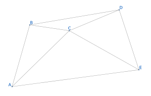

本文介绍二维 Delaunay 三角剖分（简称 DT）及其分治构造算法．

## Delaunay 三角剖分

### 定义

在数学和计算几何中，对于给定的平面中的离散点集 $P$，其 Delaunay 三角剖分 DT($P$) 满足：

1.  空圆性：DT($P$) 是 **唯一** 的（任意四点不能共圆），在 DT($P$) 中，**任意** 三角形的外接圆范围内不会有其它点存在．
2.  最大化最小角：在点集 $P$ 可能形成的三角剖分中，DT($P$) 所形成的三角形的最小角最大．从这个意义上讲，DT($P$) 是 **最接近于规则化** 的三角剖分．具体的说是在两个相邻的三角形构成凸四边形的对角线，在相互交换后，两个内角的最小角不再增大．

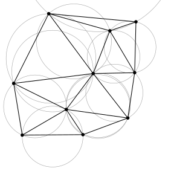

### 性质

1.  最接近：以最接近的三点形成三角形，且各线段（三角形的边）皆不相交．
2.  唯一性：不论从区域何处开始构建，最终都将得到一致的结果（点集中任意四点不能共圆）．
3.  最优性：任意两个相邻三角形构成的凸四边形的对角线如果可以互换的话，那么两个三角形六个内角中最小角度不会变化．
4.  最规则：如果将三角剖分中的每个三角形的最小角进行升序排列，则 Delaunay 三角剖分的排列得到的数值最大．
5.  区域性：新增、删除、移动某一个顶点只会影响邻近的三角形．
6.  具有凸边形的外壳：三角剖分最外层的边界形成一个凸多边形的外壳．

## 构造 DT 的分治算法

DT 有多种构造算法，下面介绍时间复杂度为 $O(n \log n)$ 的分治算法．

分治构造 DT 的第一步是将给定点集按照 $x$ 坐标 **升序** 排列，$x$ 相同时按照 $y$ 坐标升序排列，并去除重合点．如下图是排好序的大小为 $10$ 的点集．

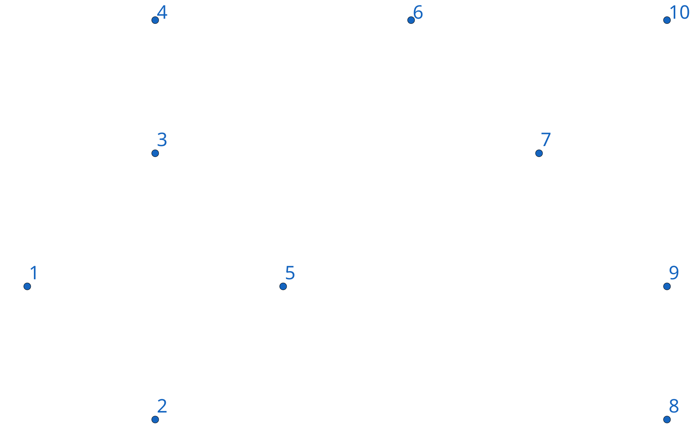

若点数不足 $2$，无需连边．否则，将有序点集不断从中间分成两部分，直到子点集大小为 $2$ 或 $3$．其中两个点连成一条边，三个不共线的点连成一个三角形，三个共线的点只连接排序后相邻的两对点．

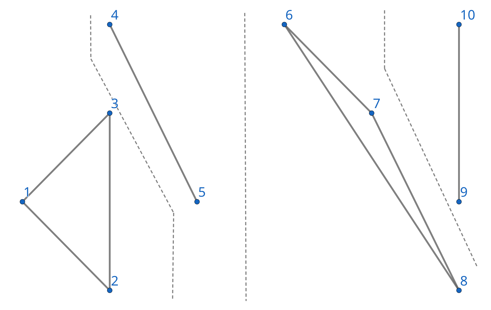

然后在分治回溯的过程中，依次合并左右子点集的剖分．合并后的边分为 LL-edge（左侧子点集内部的边）、RR-edge（右侧子点集内部的边）和 LR-edge（连接左右子点集的边），在下图中分别用灰色、红色和蓝色表示．为了维持 DT 性质，合并时 **可能** 需要删除部分 LL-edge 和 RR-edge，但 **不会** 增加这两类边．

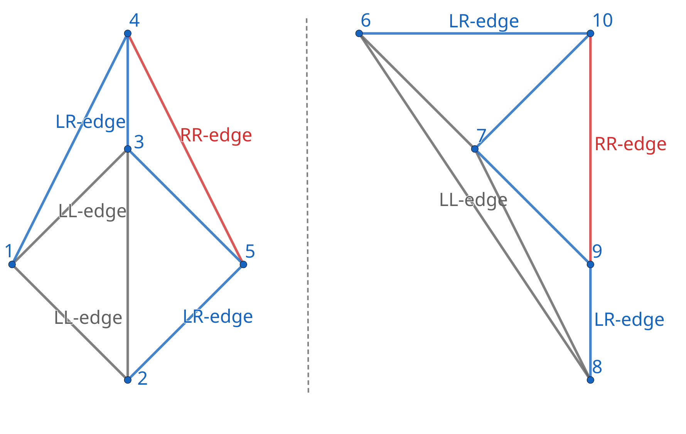

合并左右两个剖分的第一步是找到两个凸包的下公切线，并插入对应的 base LR-edge．分治时返回左右凸包的边界边，从左侧凸包的最右端、右侧凸包的最左端开始，沿凸包边界移动，直到所有点都不在从左端点指向右端点的有向直线右侧．

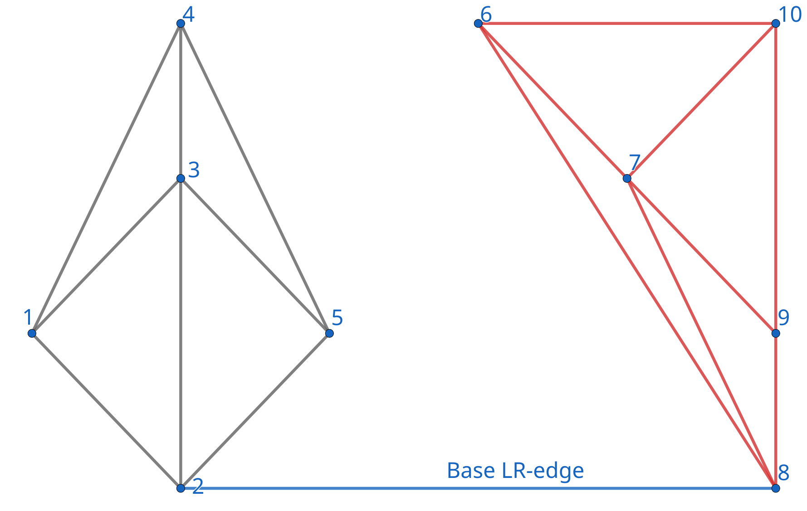

然后，我们需要确定下一条 **紧接在** base LR-edge 之上的 LR-edge．比如对于右侧点集，下一条 LR-edge 的可能端点（右端点）为与 base LR-edge 右端点相连的 RR-edge 的另一端点（$6, 7, 9$ 号点），左端点即为 $2$ 号点．

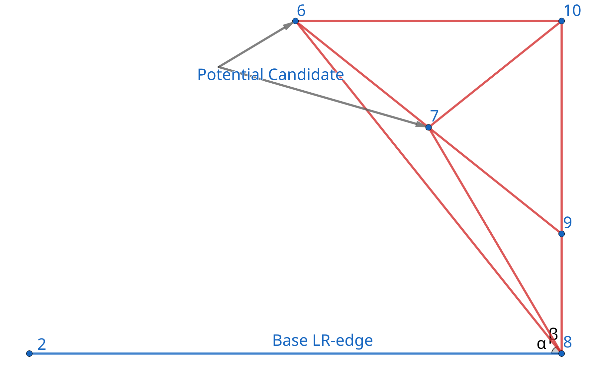

以右端点为例，从指向 base LR-edge 左端点的射线开始，按顺时针环绕顺序检查与右端点相连的 RR-edge：

1.  只有严格位于 base LR-edge 上方的端点才是有效候选点，即该点位于从 base 左端点指向右端点的有向直线的左侧．对应的顺时针转角须在 $(0^\circ,180^\circ)$ 内．
2.  设当前候选点为 $c$，沿同一方向紧邻的下一个邻点为 $d$．若 $d$ 严格位于 base LR-edge 两端点与 $c$ 的外接圆内，则删除通向 $c$ 的 RR-edge，并继续检查通向 $d$ 的边．
3.  否则保留当前候选点，停止这一侧的检查．由于这一侧已经是 Delaunay 三角剖分，只需按环绕顺序比较相邻的候选边即可．

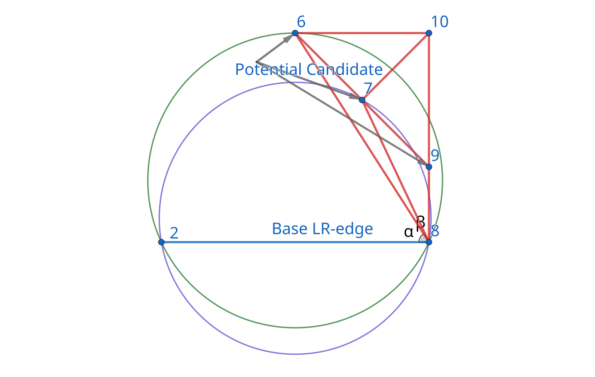

如上图，依次检查 $6,7,9$ 号点．$6$ 号点对应的绿色圆包含下一个邻点 $7$，因此删除通向 $6$ 的 RR-edge；$7$ 号点对应的紫色圆不包含下一个邻点 $9$，于是保留 $7$ 作为右侧候选点．之后还要将它与左侧候选点比较，才能确定下一条 LR-edge．

对于左侧点集，从指向 base LR-edge 右端点的射线开始，按逆时针环绕顺序作镜像处理即可．

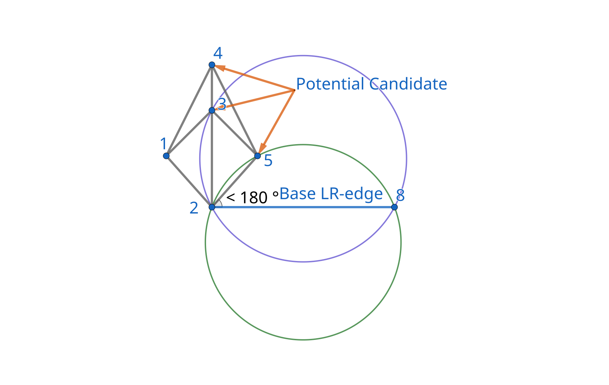

当左右两侧都没有有效候选点时，当前 base LR-edge 就是上公切线，合并完成．若只有一侧有有效候选点，就将它与 base LR-edge 的另一端点连接，得到新的 LR-edge．

当左右两侧都有有效候选点时，若右侧候选点严格位于左侧候选点与 base 两端点确定的外接圆内，则选择右侧候选点；否则选择左侧候选点．将选中的候选点与 base 的另一侧端点连接，得到新的 LR-edge．四点共圆时两者均可．

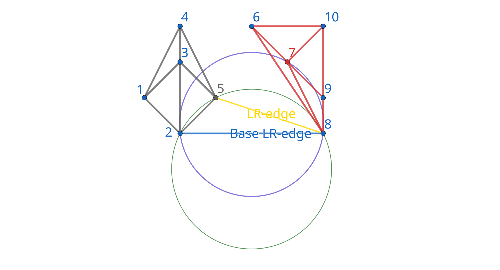

当这条 LR-edge 添加好后，将其作为 base LR-edge 重复以上步骤，继续添加下一条，直到合并完成．

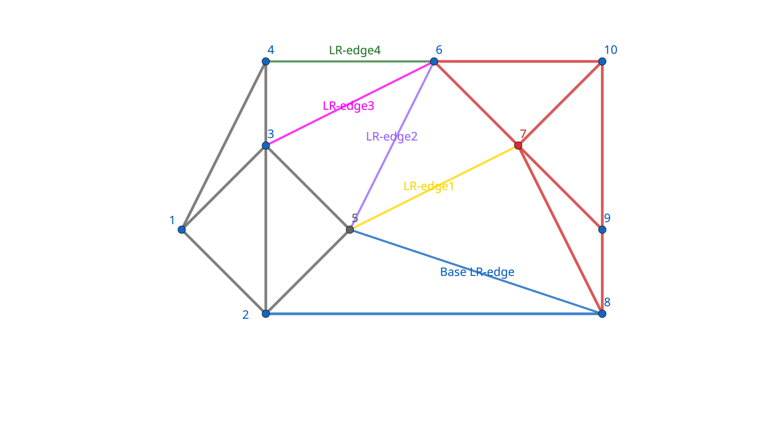

### 实现

若只用无序邻接表存边，并在每次添加 LR-edge 时扫描两端点的所有邻边，则时间复杂度为 $O(n^2)$，因为一个端点可能连续形成多条 LR-edge，导致邻接表被反复扫描．

参考实现使用 Quad-edge[^quad-edge]结构维护边的环绕顺序．每条无向边用四条有向边记录，其中两条表示原图的两个方向，另外两条表示对偶图的两个方向．同一组记录连续存放，所以只需维护每条有向边的起点和同起点的下一条逆时针边，就能在 $O(1)$ 时间内实现以下操作：

| 操作              | 含义           |
| --------------- | ------------ |
| `rev(e)`        | 反向边          |
| `onext(e)`      | 起点相同的下一条逆时针边 |
| `oprev(e)`      | 起点相同的上一条逆时针边 |
| `lnext(e)`      | 沿左侧面的边界前进一条边 |
| `onext(rev(e))` | 沿右侧面的边界后退一条边 |

`splice(a, b)` 同时修改原图和对偶图的环绕关系，用来拼接或拆开两条边所在的环．`connect(a, b)` 在同一个面内连接 `a` 的终点和 `b` 的起点．删除边时，将它的两个方向分别从对应的环中移除．这些拓扑操作只需修改常数个记录；参考实现使用动态数组分配和回收边，均摊耗时为 $O(1)$．

代码中 `base` 的方向是从右侧点集指向左侧点集，因此图示中 base LR-edge「上方」的点位于有向边 `base` 的右侧．左侧候选边为 `onext(rev(base))`，右侧候选边为 `oprev(base)`，删除候选边后，只需沿这一侧的环绕顺序继续前进．

??? note "实现"
    ```cpp
    --8<-- "docs/geometry/code/triangulation/triangulation_1.cpp:delaunay"
    ```

### 复杂度

设一次合并涉及 $k$ 个点．寻找下公切线时，每次移动都沿某一侧的凸包边界前进，总计 $O(k)$ 次．选候选点时，每次继续向后检查都伴随一条 LL-edge 或 RR-edge 的删除，而两侧子剖分总共只有 $O(k)$ 条边．每次合并主循环除这些删除操作外只做常数次判断，并添加一条 LR-edge；新添加的 LR-edge 在本次合并中不再删除，数目也是 $O(k)$．因此一次合并的总时间为 $O(k)$．

初始排序耗时 $O(n \log n)$，递归满足 $T(n)=T(\lfloor n/2 \rfloor)+T(\lceil n/2 \rceil)+O(n)$，总时间复杂度为 $O(n \log n)$．任一时刻保留的边数为 $O(n)$，代码还会回收被删除边的存储位置，避免保存所有历史边，因此空间复杂度为 $O(n)$．

## Voronoi 图

给定平面上 $n\ge 1$ 个互不重合的种子点，每个种子点对应的 Voronoi 区域由到该点的距离不大于到其他任一种子点距离的所有点组成．这些区域是可能无界的凸区域，其内部互不相交，并共同覆盖整个平面；相邻区域的公共边界位于相应两种子点连线的垂直平分线上．

对于不全共线且任意四点不共圆的点集，Voronoi 图与 Delaunay 三角剖分互为对偶：每个三角面对应其外心，每条内部边对应连接两侧三角形外心的线段，每条凸包边对应从所在三角形外心出发、垂直于该边并朝凸包外侧延伸的射线．若存在四点共圆，构造后需合并重合的外心并去除零长对偶边．全部点共线时，Voronoi 边为排序后相邻点连线的垂直平分直线；只有一个点时，其区域为整个平面．

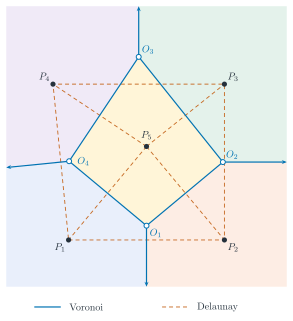

上图中，实心点 $P_i$ 为种子点，空心点 $O_i$ 为三角形外心；蓝色实线构成 Voronoi 图，橙色虚线构成 Delaunay 三角剖分．背景色区分各个 Voronoi 区域，箭头表示无界边；图中仅展示有限视窗内的部分．

构造 DT 后，利用已有的边环绕顺序枚举面和边，可在 $O(n)$ 时间内完成上述转换，因此构造 Voronoi 图的总时间复杂度为 $O(n \log n)$．

## 题目

[Luogu P6362 平面欧几里得最小生成树](https://www.luogu.com.cn/problem/P6362) 三角剖分经典应用

[SGU 383 Caravans](https://codeforces.com/problemsets/acmsguru/problem/99999/383) 三角剖分 + 倍增

[ContestHunter. 无尽的毁灭](http://noi-test.zzstep.com/contest/Beta%20Round%20%EF%BC%832%20%28%E6%96%B0%E7%96%86%E7%9C%81%E9%98%9F%E4%BA%92%E6%B5%8BWeek1-Day2%29/%E6%97%A0%E5%B0%BD%E7%9A%84%E6%AF%81%E7%81%AD) 三角剖分求对偶图建 Voronoi 图

[Codeforces Gym 103485M. Constellation collection](https://codeforces.com/gym/103485/problem/M) 三角剖分之后建图进行 Floodfill

## 参考资料与拓展阅读

1.  [Wikipedia - Triangulation (geometry)](https://en.wikipedia.org/wiki/Triangulation_%28geometry%29)
2.  [Wikipedia - Delaunay triangulation](https://en.wikipedia.org/wiki/Delaunay_triangulation)
3.  [Samuel Peterson - Computing Constrained Delaunay Triangulations in 2-D (1997-98)](http://www.geom.uiuc.edu/~samuelp/del_project.html)

[^quad-edge]: Leonidas Guibas, Jorge Stolfi.[Primitives for the Manipulation of General Subdivisions and the Computation of Voronoi Diagrams](https://people.eecs.berkeley.edu/~jrs/meshpapers/GuibasStolfi.pdf). ACM Transactions on Graphics, 4(2), 1985, 74–123.
