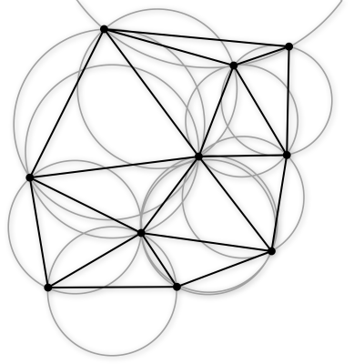

author: xehoth

在几何中，三角剖分是指将平面对象细分为三角形，并且通过扩展将高维几何对象细分为单纯形．
对于一个给定的点集，有很多种三角剖分，如：


OI 中的三角剖分主要指二维几何中的完美三角剖分（二维 Delaunay 三角剖分，简称 DT）．

## Delaunay 三角剖分

### 定义

在数学和计算几何中，对于给定的平面中的离散点集 $P$，其 Delaunay 三角剖分 DT($P$) 满足：

1.  空圆性：DT($P$) 是 **唯一** 的（任意四点不能共圆），在 DT($P$) 中，**任意** 三角形的外接圆范围内不会有其它点存在．
2.  最大化最小角：在点集 $P$ 可能形成的三角剖分中，DT($P$) 所形成的三角形的最小角最大．从这个意义上讲，DT($P$) 是 **最接近于规则化** 的三角剖分．具体的说是在两个相邻的三角形构成凸四边形的对角线，在相互交换后，两个内角的最小角不再增大．



### 性质

1.  最接近：以最接近的三点形成三角形，且各线段（三角形的边）皆不相交．
2.  唯一性：不论从区域何处开始构建，最终都将得到一致的结果（点集中任意四点不能共圆）．
3.  最优性：任意两个相邻三角形构成的凸四边形的对角线如果可以互换的话，那么两个三角形六个内角中最小角度不会变化．
4.  最规则：如果将三角剖分中的每个三角形的最小角进行升序排列，则 Delaunay 三角剖分的排列得到的数值最大．
5.  区域性：新增、删除、移动某一个顶点只会影响邻近的三角形．
6.  具有凸边形的外壳：三角剖分最外层的边界形成一个凸多边形的外壳．

## 构造 DT 的分治算法

DT 有很多种构造算法，在 $O(n \log n)$ 的构造算法中，分治算法是最易于理解和实现的．

分治构造 DT 的第一步是将给定点集按照 $x$ 坐标 **升序** 排列，$x$ 相同时按照 $y$ 坐标升序排列，并去除重合点．如下图是排好序的大小为 $10$ 的点集．


一旦点集有序，我们就可以不断地将其分成两个部分（分治），直到子点集大小不超过 $3$．其中两个点连成一条边，三个不共线的点连成一个三角形，三个共线的点只连接排序后相邻的两对点．


然后在分治回溯的过程中，已经剖分好的左右子点集可以依次合并．合并后的剖分包含 LL-edge（左侧子点集的边）．RR-edge（右侧子点集的边），LR-edge（连接左右剖分产生的新的边），如图 LL-edge（灰色），RR-edge（红色），LR-edge（蓝色）．对于合并后的剖分，为了维持 DT 性质，我们 **可能** 需要删除部分 LL-edge 和 RR-edge，但我们在合并时 **不会** 增加 LL-edge 和 RR-edge．


合并左右两个剖分的第一步是找到两个凸包的下公切线，并插入对应的 base LR-edge．分治时返回左右凸包的边界边，从左侧凸包的最右端、右侧凸包的最左端开始，沿凸包边界移动，直到所有点都不在有向线段「左端点到右端点」的右侧．


然后，我们需要确定下一条 **紧接在** base LR-edge 之上的 LR-edge．比如对于右侧点集，下一条 LR-edge 的可能端点（右端点）为与 base LR-edge 右端点相连的 RR-edge 的另一端点（$6, 7, 9$ 号点），左端点即为 $2$ 号点．


以右端点为例，应从 base LR-edge 开始，按照夹角从小到大的顺序检查与它相连的 RR-edge：

1.  只有位于 base LR-edge 上方的端点才是有效候选点，也就是对应夹角严格小于 $180$ 度的点．
2.  设当前候选点为 $c$，沿同一方向紧邻的下一个邻点为 $d$．若 $d$ 严格位于 base LR-edge 两端点与 $c$ 的外接圆内，则删除通向 $c$ 的 RR-edge，并继续检查通向 $d$ 的边．
3.  否则保留当前候选点，停止这一侧的检查．由于这一侧已经是 Delaunay 三角剖分，只需按环绕顺序比较相邻的候选边即可．


如上图，依次检查 $6,7,9$ 号点．$6$ 号点对应的绿色圆包含下一个邻点 $7$，因此删除通向 $6$ 的 RR-edge；$7$ 号点对应的紫色圆不包含下一个邻点 $9$，于是保留 $7$ 作为右侧候选点．之后还要将它与左侧候选点比较，才能确定下一条 LR-edge．

对于左侧点集，我们做镜像处理即可．


当左右两侧都没有有效候选点时，当前 base LR-edge 就是上公切线，合并完成．若只有一侧有有效候选点，就将它与 base LR-edge 的另一端点连接，得到新的 LR-edge．

当左右点集均存在可能点时，判断左边点所对应圆是否包含右边点，若包含则不符合；对于右边点也是同样的判断．一般只有一个可能点符合标准（除非四点共圆）．


当这条 LR-edge 添加好后，将其作为 base LR-edge 重复以上步骤，继续添加下一条，直到合并完成．


### 实现

实现时需要注意，只用无序邻接表存边，然后在每次添加 LR-edge 时扫描两端点的所有邻边是不行的．一个端点可能连续形成多条 LR-edge，导致邻接表被反复扫描．

参考实现中使用 Quad-edge[^quad-edge]结构维护边的环绕顺序．每条无向边用四条有向边记录，其中两条表示原图的两个方向，另外两条表示对偶图的两个方向．同一组记录连续存放，所以只需维护每条有向边的起点和同起点的下一条逆时针边，就能 $O(1)$ 实现以下操作：

| 操作              | 含义           |
| --------------- | ------------ |
| `rev(e)`        | 反向边          |
| `onext(e)`      | 起点相同的下一条逆时针边 |
| `oprev(e)`      | 起点相同的上一条逆时针边 |
| `lnext(e)`      | 沿左侧面的边界前进一条边 |
| `onext(rev(e))` | 沿右侧面的边界后退一条边 |

`splice(a, b)` 同时修改原图和对偶图的环绕关系，用来拼接或拆开两条边所在的环．`connect(a, b)` 在同一个面内连接 `a` 的终点和 `b` 的起点，删除边时，将它的两个方向分别从对应的环中移除．这些操作都是 $O(1)$ 的．

代码中 `base` 的方向是从右侧点集指向左侧点集，因此图示中 base LR-edge「上方」的点位于有向边 `base` 的右侧．左侧候选边为 `onext(rev(base))`，右侧候选边为 `oprev(base)`，删除候选边后，只需沿这一侧的环绕顺序继续前进．

??? note "实现"
    ```cpp
    --8<-- "docs/geometry/code/triangulation/triangulation_1.cpp:delaunay"
    ```

### 复杂度

设一次合并涉及 $k$ 个点．寻找下公切线时，每次移动都沿某一侧的凸包边界前进，总计 $O(k)$ 次．选候选点时，每次继续向后检查都伴随一条 LL-edge 或 RR-edge 的删除，而两侧子剖分总共只有 $O(k)$ 条边．每次合并主循环除这些删除操作外只做常数次判断，并添加一条 LR-edge；新添加的 LR-edge 在本次合并中不再删除，数目也是 $O(k)$．因此一次合并的总时间为 $O(k)$．

初始排序耗时 $O(n \log n)$，递归满足 $T(n)=T(\lfloor n/2 \rfloor)+T(\lceil n/2 \rceil)+O(n)$，总时间复杂度为 $O(n \log n)$．任一时刻保留的边数为 $O(n)$，代码还会回收被删除边的存储位置，避免保存所有历史边，因此空间复杂度为 $O(n)$．

## Voronoi 图

Voronoi 图由一组由连接两邻点直线的垂直平分线组成的连续多边形组成，根据 $n$ 个在平面上不重合种子点，把平面分成 $n$ 个区域，使得每个区域内的点到它所在区域的种子点的距离比到其它区域种子点的距离近．

Voronoi 图是 Delaunay 三角剖分的对偶图，可以使用构造 Delaunay 三角剖分的分治算法求出三角网，再使用最左转线算法求出其对偶图实现在 $O(n \log n)$ 的时间复杂度下构造 Voronoi 图．

## 题目

[Luogu P6362 平面欧几里得最小生成树](https://www.luogu.com.cn/problem/P6362) 三角剖分经典应用

[SGU 383 Caravans](https://codeforces.com/problemsets/acmsguru/problem/99999/383) 三角剖分 + 倍增

[ContestHunter. 无尽的毁灭](http://noi-test.zzstep.com/contest/Beta%20Round%20%EF%BC%832%20%28%E6%96%B0%E7%96%86%E7%9C%81%E9%98%9F%E4%BA%92%E6%B5%8BWeek1-Day2%29/%E6%97%A0%E5%B0%BD%E7%9A%84%E6%AF%81%E7%81%AD) 三角剖分求对偶图建 Voronoi 图

[Codeforces Gym 103485M. Constellation collection](https://codeforces.com/gym/103485/problem/M) 三角剖分之后建图进行 Floodfill

## 参考资料与拓展阅读

1.  [Wikipedia - Triangulation (geometry)](https://en.wikipedia.org/wiki/Triangulation_%28geometry%29)
2.  [Wikipedia - Delaunay triangulation](https://en.wikipedia.org/wiki/Delaunay_triangulation)
3.  Samuel Peterson -[Computing Constrained Delaunay Triangulations in 2-D (1997-98)](http://www.geom.uiuc.edu/~samuelp/del_project.html)

[^quad-edge]: Leonidas Guibas, Jorge Stolfi.[Primitives for the Manipulation of General Subdivisions and the Computation of Voronoi Diagrams](https://people.eecs.berkeley.edu/~jrs/meshpapers/GuibasStolfi.pdf). ACM Transactions on Graphics, 4(2), 1985, 74–123.
