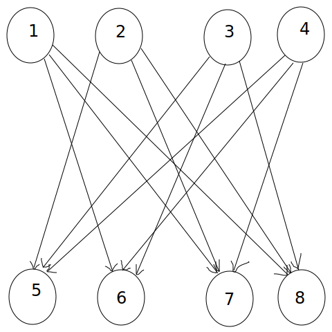

author: chu-yuehan, hhc0001

SAT 是适定性（Satisfiability）问题的简称．

## 背景

???+ example "课表"
    现在有 $n$ 节课，每一节课可以上文科或者理科．现在有 $n$ 个人，第 $i$ 个人提出要求「要么第 $a$ 节课上某种科目，要么第 $b$ 节课上某种科目」．你是班主任，要给出一个可能的课表，满足所有人的要求．

考虑把课抽象成一个布尔变量（当这节课上文科表示这个变量为 `true`），再把要求放在一起变成一个布尔表达式，原本的问题被转化成了「有 $n$ 个布尔变量 $x_i (1 \le i \le n)$，现在给你一个布尔表达式，给这些变量的每一个赋予一个独立的值，使这个布尔表达式为真」的形式．

## 定义

C-SAT 是指：有 $n$ 个布尔变量 $x_i (1 \le i \le n)$，现在给你一个布尔表达式，给这些变量的每一个赋予一个独立的值，使这个布尔表达式为真．如上的问题叫做 C-SAT．

CNF-SAT 是指：有一个 CNF 方程，需要给所有的变量赋值，这个 CNF 为真．如上的问题叫做 CNF-SAT．

3-SAT 与 CNF-SAT 类似，但是所有的方程只有三个变量．简单的说就是给出 $n$ 个布尔方程，每个方程和三个变量相关，如 $a \vee b \vee c$，表示变量 $a, b, c$ 至少满足一个．然后判断是否存在可行方案，一般题中只需要求出一种即可．

2-SAT 与 CNF-SAT 类似，但是所有的方程只有三个变量．简单的说就是给出 $n$ 个布尔方程，每个方程和两个变量相关，如 $a \vee b$，表示变量 $a, b$ 至少满足一个．然后判断是否存在可行方案，一般题中只需要求出一种即可．

然而，C-SAT、CNF-SAT 和 3-SAT 都是 NPC 问题．因此，OI 里面只会研究 2-SAT．

## 解决思路

???+ example "[洛谷 P4782「模板」2-SAT](https://www.luogu.com.cn/problem/P4782)"
    有 $n$ 个布尔变量 $x_1\sim x_n$，另有 $m$ 个需要满足的条件，每个条件的形式都是「$x_i$ 为 `true`/`false` 或 $x_j$ 为 `true`/`false`」．比如「$x_1$ 为真或 $x_3$ 为假」、「$x_7$ 为假或 $x_2$ 为假」．
    
    2-SAT 问题的目标是给每个变量赋值使得所有条件得到满足．

使用布尔方程表示上述问题．设 $a$ 表示 $x_a$ 为真（$\neg a$ 就表示 $x_a$ 为假）．如果有个人提出的要求分别是 $a$ 和 $b$，即 $(a \vee b)$（变量 $a, b$ 至少满足一个）．考虑或运算的性质：$a \vee b \iff \neg a\to b \land \neg b\to a$，可以发现利用这些关系我们从一个要求推出另一个要求．

考虑用一张图刻画这种关系和推出的过程．对这些变量关系建有向图，把 $a$ 成立或不成立用图中的点表示．那建有向图的时候，$a \to b$ 的边就可以表示 $a$ 可以推出 $b$，从而把限制转化成了一张有向图．而，之前推出的关系可以转化成在现在的有向图上走一条路径．所以，在新图上，如果 $a$ 可以走到 $\neg a$，那么 $a \to \neg a$，所以 $a$ 就不能被满足．同理，如果 $\neg a$ 可以走到 $a$，那么 $a$ 就必须被满足．那么可以直接 Tarjan SCC 缩点，然后看一看是否有某一对 $a$ 与 $\neg a$ 被缩进了同一个 SCC 即可．如果有，那么就无解．否则就一定有解．

输出方案时可以通过变量在图中的拓扑序确定该变量的取值．如果变量 $x$ 的拓扑序在 $\neg x$ 之后，那么取 $x$ 值为真时不会有满足 $\neg x$ 的必要，所以直接使 $x$ 为真即可．应用到 Tarjan 算法的缩点，即 $x$ 所在 SCC 编号在 $\neg x$ 之前时，取 $x$ 为真．因为 Tarjan 算法求强连通分量时使用了栈，如果跑完 Tarjan 缩点之后呈现出的拓扑序更大，在 Tarjan 会更晚被遍历到，就会更早地被弹出栈而缩点，分量编号会更小，所以 Tarjan 求得的 SCC 编号相当于 **反拓扑序**．

算法会把整张图遍历一遍，由于这张图 $n$ 和 $m$ 同阶，计算答案时复杂度为 $O(n)$，因此总复杂度为 $O(n)$．

??? note "代码实现"
    ```cpp
    --8<-- "docs/graph/code/2-sat/2-sat_3.cpp"
    ```

## 例题

以下称连边 $a \to b$ 和 $b \to a$ 为连边 $a \iff b$．

### 例题 1

???+ example "[HDU3062 Party](https://acm.hdu.edu.cn/showproblem.php?pid=3062)"
    有 $n$ 对夫妻被邀请参加一个聚会，因为场地的问题，每对夫妻中只有一人可以列席．在 $2n$ 个人中，某些人之间有着很大的矛盾（当然夫妻之间是没有矛盾的），有矛盾的两个人是不会同时出现在聚会上的．有没有可能会有 $n$ 个人同时列席？

按照上面的分析，如果 $a_1$ 中的丈夫和 $a_2$ 中的妻子不合，那么必须满足「$a_1$ 来妻子」或者「$a_2$ 来丈夫」，我们就把 $a_1$ 中的丈夫和 $a_2$ 中的丈夫连边，把 $a_2$ 中的妻子和 $a_1$ 中的妻子连边，其他的情况同理．然后缩点染色判断即可．

??? note "参考代码"
    ```cpp
    --8<-- "docs/graph/code/2-sat/2-sat_1.cpp"
    ```

### 例题 2

???+ example "[2018-2019 ACM-ICPC Asia Seoul Regional K TV Show Game](https://codeforces.com/gym/101987/problem/K)"
    有 $k$ 盏灯，每盏灯是红色或者蓝色，但是初始的时候不知道灯的颜色．有 $n$ 个人，每个人选择三盏灯并猜灯的颜色．一个人猜对两盏灯或以上的颜色就可以获得奖品．判断是否存在一个灯的着色方案使得每个人都能领奖，若有则输出一种灯的着色方案．

考虑对于某一个人，如果这个人的某一盏灯猜错了，那么另外两盏灯必须猜对．因此可以考虑对每一个灯像上面的方式一样建点，于是前面的限制每一个可以变成 $\neg a_1 \to a_2 \land \neg a_1 \to a_3$ 的形式，连边然后 SCC 即可．注意有三盏灯．

??? note "参考代码"
    ```cpp
    --8<-- "docs/graph/code/2-sat/2-sat_2.cpp"
    ```

### 例题 3

???+ example "[UVa1391 Astronauts](https://onlinejudge.org/index.php?option=com_onlinejudge&Itemid=8&category=446&page=show_problem&problem=4137)"
    有 $n$ 个宇航员和三个任务 A、B、C．设所有宇航员的平均年龄为 $x$，只有年龄不低于 $x$ 的才可以被分配到 A 任务，只有年龄严格低于 $x$ 的才可以被分配到 B 任务．一部分宇航员相互憎恨，如果他们执行一个任务可能导致事故．求是否有一种方案把 **所有** 宇航员分配到三个任务上，如果有需要构造方案．

方便起见下称 A/B 任务为 X 任务，称连边 $a \to b$ 和 $b \to a$ 为连边 $a \iff b$．

考虑一个宇航员吗，他要么只能去 A、C 任务（老资历），要么只能去 B、C 任务（小资历）．发现每一个宇航员只有两个选项，于是可以对第 $i$ 个宇航员设 $x_i$ 为「$i$ 是否执行 X 任务」，于是所有的条件似乎可以被整理成一个布尔方程．

考虑某一对相互憎恨的宇航员 $i, j$，有两种情况：

-   二者都是老资历或小资历．此时二人执行的任务必须不同，于是连边 $\neg x_i \iff x_j$ 和 $\neg x_j \iff x_i$；
-   二者资历不同．此时二人只要不同时执行 C 任务即可，于是连边 $\neg x_i \to x_j$，$\neg x_j \to x_i$．

这样建出图之后直接 Tarjan SCC 缩点即可．注意输出方案的时候需要判断一个宇航员是老资历还是小资历．

??? note "参考代码"
    ```cpp
    --8<-- "docs/graph/code/2-sat/2-sat_4.cpp"
    ```

### 例题 4

???+ example "[P3825 \[NOI2017\] 游戏](https://www.luogu.com.cn/problem/P3825)"
    有 $n$ 个地图和三辆车，第 $i$ 个地图不适合其中的至多一个．但是，适合所有车的地图数量 **不超过 $8$ 个**．现在给你 $n$ 个条件，第 $i$ 个条件形如「如果第 $a_i$ 个地图使用 $b_i$ 型号的车，那么第 $c_i$ 个地图必须使用 $d_i$ 型号的车」，求一个所有地图都使用适合它的车并且所有条件都满足的方案．

如果没有适合所有车的地图，那么这个题就和上面的那个题几乎完全一样．现在的问题是如何处理适合所有车的地图．

注意到至多有 $8$ 个这样的地图．我们可以枚举每一个地图 **不用** 哪一辆车，然后就转化成了上述的情况．此时直接建图 Tarjan SCC 缩点即可．

## 建图优化

### 前后缀优化建图

先看一道例题．

???+ example "[P6378 \[PA 2010\] Riddle](https://www.luogu.com.cn/problem/P6378)"
    $n$ 个点 $m$ 条边的无向图被分成 $k$ 个部分每个部分包含一些点．选择一些关键点，使得每个部分恰有一个关键点，且每条边至少有一个端点是关键点．

首先注意到如果有一个部分没有关键点，那么从这个部分里面随便选择一个即可．所以现在每一个部分可以有至多一个关键点．

对于每条边至少有一个端点是关键点的限制，这是 2-SAT 板子，直接建边即可．问题是如何处理每一个部分可以有至多一个关键点的限制．

如果直接连边，图会长得像这样：（以一个 4 个点的组为例）



这样建边会建出 $O(n^2)$ 条边，肯定会 TLE．如何优化？

发现每一个上面的点连向的下面的点都是一个前缀和一个后缀拼起来．利用这个性质，我们可以这样做：

为下面的每一个节点开一个对应的「前缀节点」和「后缀节点」．首先把这两组节点分别连一条边到它对应的节点上．然后对于前缀节点，连一条边到它前面的前缀节点；对于后缀节点，反之亦然．对于上面的情况，最终效果如图所示（Pn 为 n 的前缀节点，Sn 为 n 的后缀节点）：


可以发现，上面的某一个点会先到达某个前缀或后缀节点，然后再通过这些节点到达它本来应该到达的节点．这样就只有 $O(n)$ 条边了，足以通过此题．

??? note "参考代码"
    ```cpp
    --8<-- "docs/graph/code/2-sat/2-sat_5.cpp"
    ```

### 杂项

#### 例题 1

???+ example "[Codeforces1903F Babysitting](https://codeforces.com/problemset/problem/1903/F)"
    有一张无向图，求图的一个点覆盖，使得其中两个节点的编号差的绝对值的最小值最大．

注意到最小值最大，考虑二分答案．设当前二分的答案为 $d$．那么我们发现，原本的限制变成了这样：

-   对于每一条边，这两个点中至少有一个被选中；
-   对于每一对标号相差 $< d$ 的点，这两个点中至少有一个不被选中．

这个性质非常 2-SAT．考虑建图，发现第二条的限制很有可能建出高达 $O(n^2)$ 条边，无法通过此题．

考虑 Tarjan SCC 的核心代码：

```cpp
// to[x] 表示 x 的出边，dfn[x] 表示 x 的 dfs 序，low[x] 就是 low[x]，vis[x] 表示
// x 是否被经过过
for (auto i : to[x]) {
  if (!dfn[i]) {
    DFS(i, x, cd);
    low[x] = min(low[x], low[i]);
  } else if (!vis[i])
    low[x] = min(low[x], dfn[i]);
}
```

那么，对于第二类边我们可以：

-   开一棵线段树，处理第二种情况下，`dfn` 的最小值；
-   使用某种东西，精准处理第一种情况．

现在需要一种东西精准处理第一种情况．注意到每一个点都只会被遍历一次，于是可以从前往后遍历，开一个并查集维护一下每一个点下一个需要处理第一种情况的点，在处理第一种情况时直接转移即可．

注意由于第二种情况的限制（`!vis[i]`）所以需要在栈中弹出一个点的时候在线段树里面删掉它的记录（实现时直接赋成一个极大值即可）．

对于第一类边，由于数量不多，直接暴力建出来即可．

??? note "参考代码"
    ```cpp
    --8<-- "docs/graph/code/2-sat/2-sat_6.cpp"
    ```

## 习题

-   [洛谷 P5782 和平委员会](https://www.luogu.com.cn/problem/P5782)
-   [POJ3683 Priest John's Busiest Day](http://poj.org/problem?id=3683)
-   [Codeforces1239D Catowice City](https://codeforces.com/problemset/problem/1239/D)
-   [Codeforces27D Ring Road 2](https://codeforces.com/problemset/problem/27/D)
