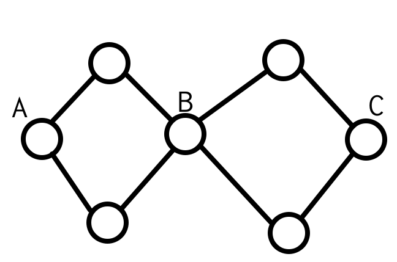
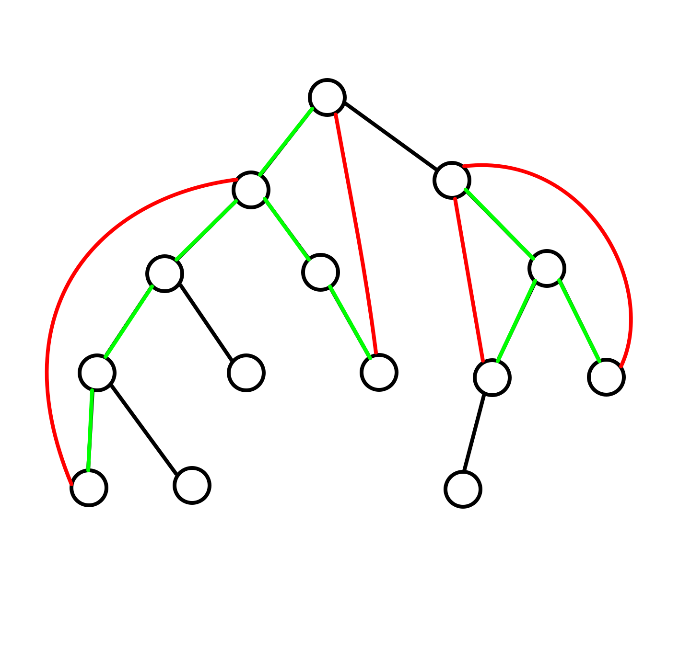
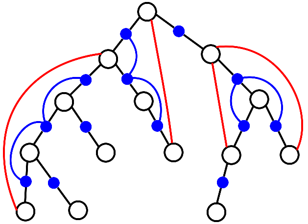

## 简介

在阅读下列内容之前，请务必了解[图论基础](/graph/basic)部分。

## 定义

在一张联通的无向图中，如果将一条边删去后，原图变成不联通的两部分，我们就说这条边是**桥**。

在一张联通的无向图中，如果将一个点删去后，原图变成不联通的两部分，我们就说这个点是**割点**。

在一张联通的无向图中，对于两个点 $u$ 和 $v$ ，如果无论删去哪条边（只能删去一条）都不能使它们不联通，我们就说 $u$ 和 $v$ **边双联通**。

在一张联通的无向图中，对于两个点 $u$ 和 $v$ ，如果无论删去哪个点（只能删去一个，且不能删 $u$ 和 $v$ 自己）都不能使它们不联通，我们就说 $u$ 和 $v$ **点双联通**。

边双联通具有传递性，即，若 $x,y$ 边双联通， $y,z$ 边双联通，则 $x,z$ 边双联通。

点双联通**不**具有传递性，反例如下图， $A,B$ 点双联通， $B,C$ 点双联通，而 $A,C$ **不**点双联通。



## DFS

对于一张联通的无向图，我们可以从任意一点开始 DFS，得到原图的一棵生成树（以开始 DFS 的那个点为根），这棵生成树上的边称作**树边**，不在生成树上的边称作**非树边**。

由于 DFS 的性质，我们可以保证所有非树边连接的两个点在生成树上都满足其中一个是另一个的祖先。

DFS 的代码如下：

```C++
void DFS(int p) {
  visited[p] = true;
  for (int to : edge[p])
    if (!visited[to]) DFS(to);
}
```

## DFS 找桥并判断边双联通

首先，对原图进行 DFS。



如上图所示，黑色与绿色边为树边，红色边为非树边。每一条非树边连接的两个点都对应了树上的一条简单路径，我们说这条非树边**覆盖**了这条树上路径上所有的边。绿色的树边**至少**被一条非树边覆盖，黑色的树边不被**任何**非树边覆盖。

我们如何判断一条边是不是桥呢？显然，非树边和绿色的树边一定不是桥，黑色的树边一定是桥。

如何用算法去实现以上过程呢？首先有一个比较暴力的做法，对于每一条非树边，都逐个地将它覆盖的每一条树边置成绿色，这样的时间复杂度为 $O(nm)$ 。

怎么优化呢？可以用差分。对于每一条非树边，在其树上深度较小的点处打上 `-1` 标记，在其树上深度较大的点处打上 `+1` 标记。然后 $O(n)$ 求出每个点的子树内部的标记之和。对于一个点 $u$ ，其子树内部的标记之和等于覆盖了 $u$ 和 $u$ 的父亲之间的树边的非树边数量。若这个值非 $0$ ，则 $u$ 和 $u$ 的父亲之间的树边不是桥，否则是桥。

用以上的方法 $O(n+m)$ 求出每条边分别是否是桥后，两个点是边双联通的，当且仅当它们的树上路径中**不**包含桥。

## DFS 找割点并判断点双联通



如上图所示，黑色边为树边，红色边为非树边。每一条非树边连接的两个点都对应了树上的一条简单路径。

考虑一张新图，新图中的每一个点对应原图中的每一条树边（在上图中用蓝色点表示）。对于原图中的每一条非树边，将这条非树边对应的树上简单路径中的所有边在新图中对应的蓝点连成一个联通块（这在上图中也用蓝色的边体现出来了）。

这样，一个点不是桥，当且仅当与其相连的所有边在新图中对应的蓝点都属于同一个联通块。两个点点双联通，当且仅当它们在原图的树上路径中的所有边在新图中对应的蓝点都属于同一个联通块。

蓝点间的连通关系可以用与求边双联通时用到的差分类似的方法维护，时间复杂度 $O(n+m)$ 。
