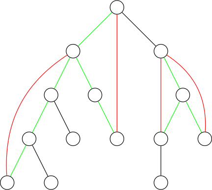
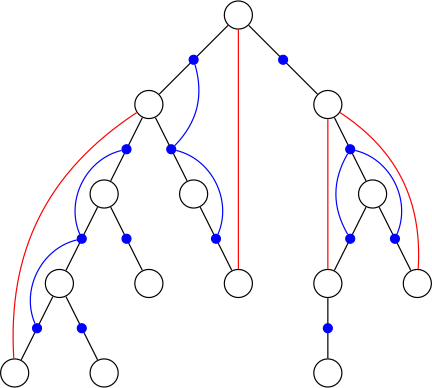

## 简介

在阅读下列内容之前，请务必了解 [图论相关概念](./concept.md) 部分。

相关阅读：[割点和桥](./cut.md)

## 定义

割点和桥更严谨的定义参见 [图论相关概念](./concept.md)。

在一张连通的无向图中，对于两个点 $u$ 和 $v$，如果无论删去哪条边（只能删去一条）都不能使它们不连通，我们就说 $u$ 和 $v$  **边双连通**。

在一张连通的无向图中，对于两个点 $u$ 和 $v$，如果无论删去哪个点（只能删去一个，且不能删 $u$ 和 $v$ 自己）都不能使它们不连通，我们就说 $u$ 和 $v$  **点双连通**。

边双连通具有传递性，即，若 $x,y$ 边双连通，$y,z$ 边双连通，则 $x,z$ 边双连通。

点双连通 **不** 具有传递性，反例如下图，$A,B$ 点双连通，$B,C$ 点双连通，而 $A,C$  **不** 点双连通。


## Tarjan 算法

用 Tarjan 求双联通分量过程与求强连通分量类似，可以先阅读 [强连通分量](./scc.md) 的 Tarjan 算法。

### 边双联通分量

#### 解法 1

我们考虑先求出所有的桥，再 DFS 求出边双联通分量。

求桥可参见 [割点和桥](./cut.md) 的桥部分。

???+ note "[例题：洛谷 P8436【模版】边双连通分量](https://www.luogu.com.cn/problem/P8436)"
    对于一个 $n$ 个节点 $m$ 条无向边的图，请输出其边双连通分量的个数，并且输出每个边双连通分量。

??? note "示例代码"
    ```cpp
    --8<-- "docs/graph/code/bcc/bcc_1.cpp"
    ```

#### 解法 2

我们先总结出一个重要的性质，在无向图中，DFS 生成树上的边不是树边就只有反祖边。

我们联系一下求强连通分量的方法，在无向图中只要一个分量没有桥，那么在 DFS 生成树上，它的所有点都在同一个强连通分量中。

反过来，在 DFS 生成树上的一个强连通分量，在原无向图中是边双联通分量。

可以发现，求边双联通分量的过程实际上就是求强连通分量的过程。

???+ note "[例题：洛谷 P8436【模板】边双连通分量](https://www.luogu.com.cn/problem/P8436)"
    对于一个 $n$ 个节点 $m$ 条无向边的图，请输出其边双连通分量的个数，并且输出每个边双连通分量。

??? note "示例代码"
    ```cpp
    --8<-- "docs/graph/code/bcc/bcc_2.cpp"
    ```

### 点双联通分量

需要先学习割点，可以先参见 [割点和桥](./cut.md) 的割点部分。

先给出两个性质：

1.  两个点双最多只有一个公共点，且一定是割点。
2.  对于一个点双，它在 DFS 搜索树中 dfn 值最小的点一定是割点或者树根。

我们根据第二个性质，分类讨论：

1.  当这个点为割点时，它一定是点双联通分量的根，因为一旦包含它的父节点，他就仍然是割点。
2.  当这个点为树根时：
    1.  有两个及以上子树，它是一个割点。
    2.  只有一个子树，它是一个点双联通分量的根。
    3.  它没有子树，视作一个点双。

???+ note "[例题：洛谷 P8435【模板】点双连通分量](https://www.luogu.com.cn/problem/P8435)"
    对于一个 $n$ 个节点 $m$ 条无向边的图，请输出其点双连通分量的个数，并且输出每个点双连通分量。

??? note "示例代码"
    ```cpp
    --8<-- "docs/graph/code/bcc/bcc_3.cpp"
    ```

## DFS 算法

对于一张连通的无向图，我们可以从任意一点开始 DFS，得到原图的一棵生成树（以开始 DFS 的那个点为根），这棵生成树上的边称作 **树边**，不在生成树上的边称作 **非树边**。

由于 DFS 的性质，我们可以保证所有非树边连接的两个点在生成树上都满足其中一个是另一个的祖先。

DFS 的代码如下：

???+ note "实现"
    === "C++"
        ```cpp
        void DFS(int p) {
          visited[p] = true;
          for (int to : edge[p])
            if (!visited[to]) DFS(to);
        }
        ```
    
    === "Python"
        ```python
        def DFS(p):
            visited[p] = True
            for to in edge[p]:
                if visited[to] == False:
                    DFS(to)
        ```

### 实现

### DFS 找桥并判断边双连通

首先，对原图进行 DFS。



如上图所示，黑色与绿色边为树边，红色边为非树边。每一条非树边连接的两个点都对应了树上的一条简单路径，我们说这条非树边 **覆盖** 了这条树上路径上所有的边。绿色的树边 **至少** 被一条非树边覆盖，黑色的树边不被 **任何** 非树边覆盖。

我们如何判断一条边是不是桥呢？显然，非树边和绿色的树边一定不是桥，黑色的树边一定是桥。

如何用算法去实现以上过程呢？首先有一个比较暴力的做法，对于每一条非树边，都逐个地将它覆盖的每一条树边置成绿色，这样的时间复杂度为 $O(nm)$。

怎么优化呢？可以用差分。对于每一条非树边，在其树上深度较小的点处打上 `-1` 标记，在其树上深度较大的点处打上 `+1` 标记。然后 $O(n)$ 求出每个点的子树内部的标记之和。对于一个点 $u$，其子树内部的标记之和等于覆盖了 $u$ 和 $u$ 的父亲之间的树边的非树边数量。若这个值非 $0$，则 $u$ 和 $u$ 的父亲之间的树边不是桥，否则是桥。

用以上的方法 $O(n+m)$ 求出每条边分别是否是桥后，两个点是边双连通的，当且仅当它们的树上路径中 **不** 包含桥。

### DFS 找割点并判断点双连通



如上图所示，黑色边为树边，红色边为非树边。每一条非树边连接的两个点都对应了树上的一条简单路径。

考虑一张新图，新图中的每一个点对应原图中的每一条树边（在上图中用蓝色点表示）。对于原图中的每一条非树边，将这条非树边对应的树上简单路径中的所有边在新图中对应的蓝点连成一个连通块（这在上图中也用蓝色的边体现出来了）。

这样，一个点不是割点，当且仅当与其相连的所有边在新图中对应的蓝点都属于同一个连通块。两个点点双连通，当且仅当它们在原图的树上路径中的所有边在新图中对应的蓝点都属于同一个连通块。

蓝点间的连通关系可以用与求边双连通时用到的差分类似的方法维护，时间复杂度 $O(n+m)$。
