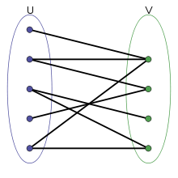

## 定义

二分图，又称二部图，英文名叫 Bipartite graph。

二分图是什么？节点由两个集合组成，且两个集合内部没有边的图。

换言之，存在一种方案，将节点划分成满足以上性质的两个集合。

（图源 [英文维基](https://en.wikipedia.org/wiki/Bipartite_graph) ）

## 性质

-   如果两个集合中的点分别染成黑色和白色，可以发现二分图中的每一条边都一定是连接一个黑色点和一个白色点。

-   ??? question "二分图不存在长度为奇数的环"
        因为每一条边都是从一个集合走到另一个集合，只有走偶数次才可能回到同一个集合。

## 判定

如何判定一个图是不是二分图呢？

换言之，我们需要知道是否可以将图中的顶点分成两个满足条件的集合。

显然，直接枚举答案集合的话实在是太慢了，我们需要更高效的方法。

考虑上文提到的性质，我们可以使用 [DFS（图论）](./dfs.md) 或者 [BFS](./bfs.md) 来遍历这张图。如果发现了奇环，那么就不是二分图，否则是。

## 应用

### 二分图匹配

#### 霍尔定理

设二部图 $G=<V_1, V_2, E>, |V_1| \leq |V_2|$ ，则 $G$ 中存在 $V_1$ 到 $V_2$ 的完备匹配当且仅当对于任意的 $S \subset V_1$ ，均有 $|S|\leq|N(S)|$ ，其中 $N(S)=\Cup_{v_i \in S}{N(V_i)}$ ，是 $S$ 的邻域。

#### 最大匹配

#### 最大权匹配

## 一般图匹配
