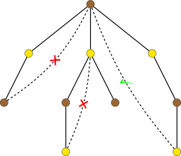

## 引入

二分图，又称二部图，是一类结构特殊的图。它的顶点集可以划分为两个互不相交的子集，使得图中的每条边都连接这两个集合之间的一对点，而不会连接同一集合内部的点。

得益于这种简单的结构，二分图不仅展现出许多优雅的性质，也广泛应用于现实生活中的建模场景，例如任务分配、推荐系统、匹配市场等。许多在一般图上困难的优化问题，在二分图上都可以高效、准确地求解。

## 定义

如果图 $G=(V,E)$ 的顶点集 $V$ 可以分为两个互不相交的子集 $X$ 和 $Y$，使得每条边 $e\in E$ 的两个端点都分别属于 $X$ 和 $Y$，就称图 $G$ 是一个 **二分图**（bipartite graph）。集合 $X$ 和 $Y$ 常称作它的两个 **部分**（part），或者分别称为二分图的左部和右部。一个典型的二分图如下图所示。


树、偶环、网格图等都是常见的二分图的例子。

## 刻画

二分图也可以由下列性质等价地定义：

-   图 $G$ 是可 2‑着色的。也就是说，可以用至多两种颜色给图的所有顶点染色，并且保证相邻顶点颜色不同。
-   图 $G$ 中不存在奇数长度的环。

很显然，第一条性质与二分图的定义等价：只需要将二分图的两个部分各染一种颜色就好了。

第二条性质稍微复杂一些。可以考虑用两种颜色尝试给图 $G$ 染色。因为不同连通分量之间染色互不干扰，只需要逐个考虑连通分量就好了。任选连通分量中的一个顶点 $s$，进行 DFS，并记录连通分量中每个顶点 $v$ 与 $s$ 的距离。从 $s$ 开始，在 DFS 生成树上进行归纳可知，如果存在一种可行的染色方法，一定是根据每个顶点 $v$ 到起点 $s$ 的距离的奇偶性分别染成两种颜色。



继而考虑那些不在生成树中的边。如果这些非树边的两个端点的颜色都不一样，就说明当前的染色方案可行；否则，就不存在可行的方案。进一步地，两个顶点颜色不同，当且仅当它们到树根 $s$ 的距离一奇一偶，这又等价于加入该非树边形成的是一个偶环而非奇环。因此，只要没有奇环，这些非树边必然连接颜色不同的点，进而整张图都可以用两种颜色染色，图就一定是二分图。

## 判定

要判定一个图是不是二分图，只需要利用上述等价刻画，尝试给二分图染色即可。为此，可以使用 [DFS](./dfs.md) 或者 [BFS](./bfs.md) 来遍历这张图。如果发现了奇环，也就是出现无法染色的情况，那么就不是二分图；否则，就是二分图。

具体流程如下：

-   遍历顶点，如果发现还没有染色的顶点，说明发现新的连通分量。
-   任选一种颜色给该顶点染色，并以它为起点做 [DFS](./dfs.md) 或者 [BFS](./bfs.md)，尝试给该连通分量染色。
-   遍历相邻的顶点时，如果发现已经染色的顶点，检查颜色是否与当前顶点相同。相同，则不是二分图，直接返回；否则，继续遍历。
-   如果发现尚未染色的顶点，将尚未染色的顶点染上与当前顶点相反的颜色。

参考代码如下：

???+ example "参考代码"
    ```cpp
    --8<-- "docs/graph/code/bi-graph/check-bipartite.cpp:core"
    ```

时间复杂度为 $O(|V|+|E|)$。

## 应用

由于结构简单，很多图论优化问题都可以在二分图上高效解决。详情参考相关主条目。

-   极大团（平凡）
-   最小点着色（平凡）
-   [最小边着色](./color.md#二分图-vizing-定理的构造性证明)
-   [最大匹配](./graph-matching/bigraph-match.md)
-   [最小边覆盖](./graph-matching/graph-match.md#最小权边覆盖)
-   [最小点覆盖](./graph-matching/bigraph-match.md#二分图最小点覆盖könig-定理)
-   [最大独立集](./graph-matching/bigraph-match.md#二分图最大独立集)
-   [最大权匹配](./graph-matching/bigraph-weight-match.md)
