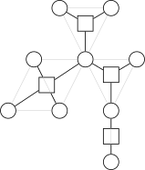

author: GitPinkRabbit, Early0v0, Backl1ght, mcendu, ksyx, iamtwz, Xeonacid, kenlig, Menci, Enter-tainer, CCXXXI

在阅读下列内容之前，请务必了解 [图论相关概念](./concept.md) 部分。

相关阅读：[割点和桥](./cut.md)。

## 引入

众所周知，树（或森林）有很好的性质，并且容易通过很多常见数据结构维护。

而一般图则没有那么好的性质，所幸有时我们可以把一般图上的某些问题转化到树上考虑。

而圆方树（Block forest 或 Round-square tree）[^ref1]就是一种将图变成树的方法。本文将介绍圆方树的构建，性质和一些应用。

限于篇幅，本文中有一些结论未经证明，读者可以自行理解或证明。

## 定义

圆方树最初是处理「仙人掌图」（每条边在不超过一个简单环中的无向图）的一种工具，不过发掘它的更多性质，有时我们可以在一般无向图上使用它。

要介绍圆方树，首先要介绍 **点双连通分量**。

一个 **点双连通图** 的一个定义是：图中任意两不同点之间都有至少两条点不重复的路径。  
点不重复既指路径上点不重复（简单路径），也指两条路径的交集为空（当然，路径必然都经过出发点和到达点，这不在考虑范围内）。

可以发现对于只有一个点的图比较难定义它是不是一个点双，这里先不考虑节点数为 $1$ 的图。

一个近乎等价的定义是：不存在割点的图。  
这个定义只在图中只有两个点，一条连接它们的边时失效。它没有割点，但是并不能找到两条不相交的路径，因为只有一条路径。  
（也可以理解为那一条路径可以算两次，的确没有交，因为不经过其他点）

虽然原始的定义的确是前者，但是为了方便，我们规定点双图的定义采用后者。

而一个图的 **点双连通分量** 则是一个 **极大点双连通子图**。  
与强连通分量等不同，一个点可能属于多个点双，但是一条边属于恰好一个点双（如果定义采用前者则有可能不属于任何点双）。

在圆方树中，原来的每个点对应一个 **圆点**，每一个点双对应一个 **方点**。  
所以共有 $n+c$ 个点，其中 $n$ 是原图点数，$c$ 是原图点双连通分量的个数。

而对于每一个点双连通分量，它对应的方点向这个点双连通分量中的每个点连边。  
每个点双形成一个「菊花图」，多个「菊花图」通过原图中的割点连接在一起（因为点双的分隔点是割点）。

显然，圆方树中每条边连接一个圆点和一个方点。

下面的图显示了一张图对应的点双和圆方树形态。[^ref2]



圆方树的点数小于 $2n$，这是因为割点的数量小于 $n$，所以请注意各种数组大小要开两倍。

其实，如果原图连通，则「圆方树」才是一棵树，如果原图有 $k$ 个连通分量，则它的圆方树也会形成 $k$ 棵树形成的森林。

如果原图中某个连通分量只有一个点，则需要具体情况具体分析，我们在后续讨论中不考虑孤立点。

## 过程

对于一个图，如何构造出它的圆方树呢？首先可以发现如果图不连通，可以拆分成每个连通子图考虑，所以我们只考虑连通图。

因为圆方树是基于点双连通分量的，而点双连通分量又基于割点，所以只需要用类似求割点的方法即可。

求割点的常用算法是 Tarjan 算法，如果你会了理解下面的内容就很简单了，如果你不会也没关系。

我们跳过 Tarjan 求割点，直接介绍圆方树使用的算法（其实是 Tarjan 的变体）：

对图进行 DFS，并且中间用到了两个关键数组 `dfn` 和 `low`（类似于 Tarjan）。

`dfn[u]` 存储的是节点 $u$ 的 DFS 序，即第一次访问到 $u$ 时它是第几个被访问的节点。  
`low[u]` 存储的是节点 $u$ 的 DFS 树中的子树中的某个点 $v$ 通过 **最多一次返祖边或向父亲的树边** 能访问到的点的 **最小** DFS 序。  
如果没有听说过 Tarjan 算法可能会有点难理解，让我们举个例子吧：


（可以发现这张图其实和上面图片中的图等价）  
这里树边从上至下用直线画出，返祖边从下至上用曲线画出。节点的编号便是它的 DFS 序。

则有 `low` 数组如下：

|        $i$        | $1$ | $2$ | $3$ | $4$ | $5$ | $6$ | $7$ | $8$ | $9$ |
| :---------------: | :-: | :-: | :-: | :-: | :-: | :-: | :-: | :-: | :-: |
| $\mathrm{low}[i]$ | $1$ | $1$ | $1$ | $3$ | $3$ | $4$ | $3$ | $3$ | $7$ |

并不是很难理解吧，注意这里 $9$ 的 `low` 是 $7$，与一些求割点的做法有差异，因为为了方便，我们规定了可以通过父边向上，但主要思想是相同的。

我们可以很容易地写出计算 `dfn` 和 `low` 的 DFS 函数（初始时 `dfn` 数组清零）：

???+ note "实现"
    === "C++"
        ```cpp
        void Tarjan(int u) {
          low[u] = dfn[u] = ++dfc;                // low 初始化为当前节点 dfn
          for (int v : G[u]) {                    // 遍历 u 的相邻节点
            if (!dfn[v]) {                        // 如果未访问过
              Tarjan(v);                          // 递归
              low[u] = std::min(low[u], low[v]);  // 未访问的和 low 取 min
            } else
              low[u] = std::min(low[u], dfn[v]);  // 已访问的和 dfn 取 min
          }
        }
        ```
    
    === "Python"
        ```python
        def Tarjan(u):
            low[u] = dfn[u] = dfc  # low 初始化为当前节点 dfn
            dfc = dfc + 1
            for v in G[u]:  # 遍历 u 的相邻节点
                if dfn[v] == False:  # 如果未访问过
                    Tarjan(v)  # 递归
                    low[u] = min(low[u], low[v])  # 未访问的和 low 取 min
                else:
                    low[u] = min(low[u], dfn[v])  # 已访问的和 dfn 取 min
        ```

接下来，我们考虑点双和 DFS 树以及这两个数组之间的关联。

可以发现，每个点双在 DFS 树上是一棵连通子树，并至少包含两个点；特别地，最顶端节点仅往下接一个点。

同时还可以发现每条树边恰好在一个点双内。

我们考虑一个点双在 DFS 树中的最顶端节点 $u$，在 $u$ 处确定这个点双，因为 $u$ 的子树包含了整个点双的信息。

因为至少有两个点，考虑这个点双的下一个点 $v$，则有 $u$，$v$ 之间存在一条树边。

不难发现，此时一定有 $\mathrm{low}[v]=\mathrm{dfn}[u]$。  
更准确地说，对于一条树边 $u\to v$，$u,v$ 在同一个点双中，且 $u$ 是这个点双中深度最浅的节点 **当且仅当** $\mathrm{low}[v]=\mathrm{dfn}[u]$。

那么我们可以在 DFS 的过程中确定哪些地方存在点双，但是还不能准确确定一个点双所包含的点集。

这并不难处理，我们可以在 DFS 过程中维护一个栈，存储还未确定所属点双（可能有多个）的节点。

在找到点双时，点双中除了 $u$ 以外的其他的点都集中在栈顶端，只需要不断弹栈直到弹出 $v$ 为止即可。

当然，我们可以同时处理被弹出的节点，只要将其和新建的方点连边即可。最后还要让 $u$ 和方点连边。

这样就很自然地完成了圆方树的构建，我们可以给方点标号为 $n+1$ 开始的整数，这样可以有效区分圆点和方点。

这部分可能讲述得不够清晰，下面贴出一份代码，附有详尽注释以及帮助理解的输出语句和一份样例，建议读者复制代码并自行实践理解，毕竟代码才是最能帮助理解的（不要忘记开 `c++11`）。

???+ note "实现"
    ```cpp
    #include <algorithm>
    #include <cstdio>
    #include <vector>
    
    const int MN = 100005;
    
    int N, M, cnt;
    std::vector<int> G[MN], T[MN * 2];
    
    int dfn[MN], low[MN], dfc;
    int stk[MN], tp;
    
    void Tarjan(int u) {
      printf("  Enter : #%d\n", u);
      low[u] = dfn[u] = ++dfc;                // low 初始化为当前节点 dfn
      stk[++tp] = u;                          // 加入栈中
      for (int v : G[u]) {                    // 遍历 u 的相邻节点
        if (!dfn[v]) {                        // 如果未访问过
          Tarjan(v);                          // 递归
          low[u] = std::min(low[u], low[v]);  // 未访问的和 low 取 min
          if (low[v] == dfn[u]) {  // 标志着找到一个以 u 为根的点双连通分量
            ++cnt;                 // 增加方点个数
            printf("  Found a New BCC #%d.\n", cnt - N);
            // 将点双中除了 u 的点退栈，并在圆方树中连边
            for (int x = 0; x != v; --tp) {
              x = stk[tp];
              T[cnt].push_back(x);
              T[x].push_back(cnt);
              printf("    BCC #%d has vertex #%d\n", cnt - N, x);
            }
            // 注意 u 自身也要连边（但不退栈）
            T[cnt].push_back(u);
            T[u].push_back(cnt);
            printf("    BCC #%d has vertex #%d\n", cnt - N, u);
          }
        } else
          low[u] = std::min(low[u], dfn[v]);  // 已访问的和 dfn 取 min
      }
      printf("  Exit : #%d : low = %d\n", u, low[u]);
      printf("  Stack:\n    ");
      for (int i = 1; i <= tp; ++i) printf("%d, ", stk[i]);
      puts("");
    }
    
    int main() {
      scanf("%d%d", &N, &M);
      cnt = N;  // 点双 / 方点标号从 N 开始
      for (int i = 1; i <= M; ++i) {
        int u, v;
        scanf("%d%d", &u, &v);
        G[u].push_back(v);  // 加双向边
        G[v].push_back(u);
      }
      // 处理非连通图
      for (int u = 1; u <= N; ++u)
        if (!dfn[u]) Tarjan(u), --tp;
      // 注意到退出 Tarjan 时栈中还有一个元素即根，将其退栈
      return 0;
    }
    ```

提供一个测试用例：

```text
13 15
1 2
2 3
1 3
3 4
3 5
4 5
5 6
4 6
3 7
3 8
7 8
7 9
10 11
11 10
11 12
```

这个例子对应的图（包含了重边和孤立点的情况）：


## 例题

我们讲一些可以使用圆方树求解的例题。

???+ note "[「APIO2018」铁人两项](https://loj.ac/p/2587)"
    ??? note "题意简述"
        给定一张简单无向图，问有多少对三元组 $\langle s, c, f \rangle$（$s, c, f$ 互不相同）使得存在一条简单路径从 $s$ 出发，经过 $c$ 到达 $f$。
    
    ??? note "题解"
        说到简单路径，就必须提一个关于点双很好的性质：对于一个点双中的两点，它们之间简单路径的并集，恰好完全等于这个点双。  
        即同一个点双中的两不同点 $u,v$ 之间一定存在一条简单路径经过给定的在同一个点双内的另一点 $w$。
        
        这个性质的证明：
        
        -   显然如果简单路径出了点双，就不可能再回到这个点双中，否则会和点双的定义冲突。
        -   所以我们只需考虑证明一个点双连通图中任意三不同点 $u,v,c$，必存在一条从 $u$ 到 $v$ 的简单路径经过 $c$。
        -   首先排除点数为 $2$ 的情况，它满足这个性质，但是无法取出 $3$ 个不同点。
        -   对于余下的情况，考虑建立网络流模型，源点向 $c$ 连容量为 $2$ 的边，$u$ 和 $v$ 向汇点连容量为 $1$ 的边。
        -   原图中的双向边 $\langle x,y\rangle$，变成 $x$ 向 $y$ 连一条容量为 $1$ 的边，$y$ 也向 $x$ 连一条容量为 $1$ 的边。
        -   最后，给除了源点，汇点和 $c$ 之外的每个点赋上 $1$ 的容量，这可以通过拆点实现。
        -   因为源点到 $c$ 的边的容量为 $2$，那么如果这个网络最大流为 $2$，则证明一定有路径经过 $c$。
        -   考虑最大流最小割定理，显然最小割小于等于 $2$，接下来只要证最小割大于 $1$。
        -   这等价于证明割掉任意一条容量为 $1$ 的边，是无法使源点和汇点不连通的。
        -   考虑割掉 $u$ 或 $v$ 与汇点连接的点，根据点双的第一种定义，必然存在简单路径从 $c$ 到另一个没割掉的点。
        -   考虑割掉一个节点拆点形成的边，这等价于删除一个点，根据点双的第二种定义，余下的图仍然连通。
        -   考虑割掉一条由原先的边建出的边，这等价于删除一条边，这比删除一个点更弱，显然存在路径。
        -   所以我们证明了最小割大于 $1$，即最大流等于 $2$。证毕。
        
        这个结论能告诉我们什么呢？它告诉了我们：考虑两圆点在圆方树上的路径，与路径上经过的方点相邻的圆点的集合，就等于原图中两点简单路径上的点集。
        
        回到题目，考虑固定 $s$ 和 $f$，求合法的 $c$ 的数量，显然有合法 $c$ 的数量等于 $s,f$ 之间简单路径的并集的点数减 $2$（去掉 $s,f$ 本身）。
        
        那么，对原图建出圆方树后，两点之间简单路径的点数，就和它们在圆方树上路径经过的方点（点双）和圆点的个数有关。
        
        接下来是圆方树的一个常用技巧：路径统计时，点赋上合适的权值。  
        本题中，每个方点的权值为对应点双的大小，而每个圆点权值为 $-1$。
        
        这样赋权后则有两圆点间圆方树上路径点权和，恰好等于原图中简单路径并集大小减 $2$。
        
        问题转化为统计圆方树上 $\sum$ 两圆点路径权值和。
        
        换个角度考虑，改为统计每一个点对答案的贡献，即权值乘以经过它的路径条数，这可以通过简单的树形 DP 求出。
        
        最后，不要忘记处理图不连通的情况。下面是对应代码：
    
    ??? note "参考代码"
        ```cpp
        --8<-- "docs/graph/code/block-forest/block-forest_1.cpp"
        ```
    
    顺带一提，刚刚的测试用例在这题的答案是 $212$。

???+ note "[Codeforces #487 E. Tourists](https://codeforces.com/contest/487/problem/E)"
    ??? note "题意简述"
        给定一张简单无向连通图，要求支持两种操作：
        
        1.  修改一个点的点权。
        2.  询问两点之间所有简单路径上点权的最小值。
    
    ??? note "题解"
        同样地，我们建出原图的圆方树，令方点权值为相邻圆点权值的最小值，问题转化为求路径上最小值。
        
        路径最小值可以使用树链剖分和线段树维护，但是修改呢？
        
        一次修改一个圆点的点权，需要修改所有和它相邻的方点，这样很容易被卡到 $O(n)$ 个修改。
        
        这时我们利用圆方树是棵树的性质，令方点权值为自己的儿子圆点的权值最小值，这样的话修改时只需要修改父亲方点。
        
        对于方点的维护，只需要对每个方点开一个 `multiset` 维护权值集合即可。
        
        需要注意的是查询时若 LCA 是方点，则还需要查 LCA 的父亲圆点的权值。
        
        注意：圆方树点数要开原图的两倍，否则会数组越界。
    
    ??? note "参考代码"
        ```cpp
        --8<-- "docs/graph/code/block-forest/block-forest_2.cpp"
        ```

???+ note "[「SDOI2018」战略游戏](https://loj.ac/p/2562)"
    ??? note "题意简述"
        给出一个简单无向连通图。有 $q$ 次询问：
        
        每次给出一个点集 $S$（$2 \le |S| \le n$），问有多少个点 $u$ 满足 $u \notin S$ 且删掉 $u$ 之后 $S$ 中的点不全在一个连通分量中。
        
        每个测试点有多组数据。
    
    ??? note "题解"
        先建出圆方树，则变为询问 $S$ 在圆方树上对应的连通子图中的圆点个数减去 $|S|$。
        
        如何计算连通子图中的圆点个数？有一个方法：
        
        把圆点的权值放到它和它的父亲方点的边上，问题转化为求边权和，这个问题可以参考 [「SDOI2015」寻宝游戏](https://loj.ac/p/2182) 的一种解法。  
        即把 $S$ 中的点按照 DFS 序排序，计算排序后相邻两点的距离和（还包括首尾两点之间的距离），答案就是距离和的一半，因为每条边只被经过两次。
        
        最后，如果子图中的深度最浅的节点是圆点，答案还要加上 $1$，因为我们没有统计到它。
        
        因为有多组数据，要注意初始化数组。
    
    ??? note "参考代码"
        ```cpp
        --8<-- "docs/graph/code/block-forest/block-forest_3.cpp"
        ```

## 外部链接

immortalCO，[圆方树——处理仙人掌的利器](https://immortalco.blog.uoj.ac/blog/1955)，Universal OJ。

## 参考资料与注释

[^ref1]: 2017 年陈俊锟同学在他的 IOI2017 中国国家集训队论文《〈神奇的子图〉命题报告及其拓展》中定义并命名了圆方树这一结构。

[^ref2]: 陈俊锟，《平凡的圆方树和神奇的（~~动态~~）动态规划》，NOI2018 冬令营，第 4 页。
