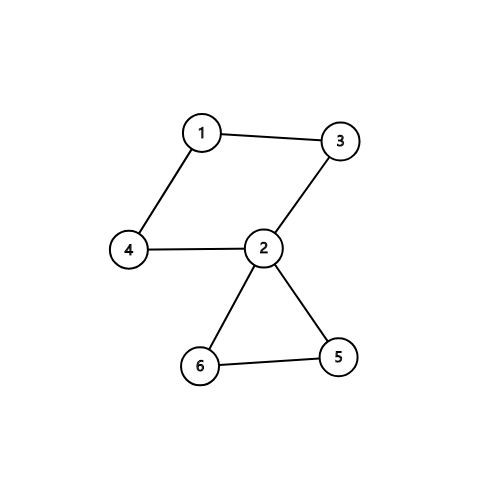
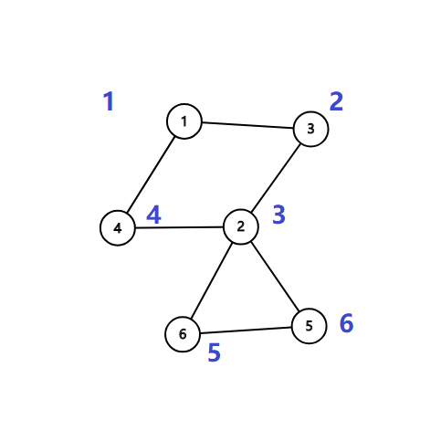
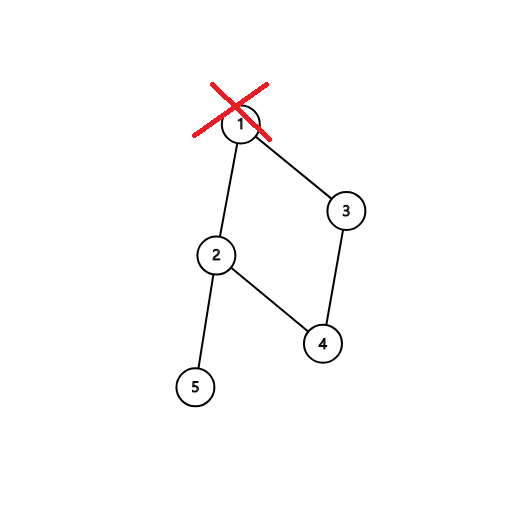

相关阅读：[双连通分量](/graph/bcc/)，

割点和桥更严谨的定义参见[图论基础](/graph/basic#_19)。

## 割点

> 对于一个无向图，如果把一个点删除后这个图的极大连通分量数增加了，那么这个点就是这个图的割点（又称割顶）。

### 如何实现？

如果我们尝试删除每个点，并且判断这个图的连通性，那么复杂度会特别的高。所以要介绍一个常用的算法：Tarjan。

首先，我们上一个图：



很容易的看出割点是 2，而且这个图仅有这一个割点。

首先，我们按照 DFS 序给他打上时间戳（访问的顺序）。



这些信息被我们保存在一个叫做 `num` 的数组中。

还需要另外一个数组 `low` ，用它来存储不经过其父亲（你有多个那么就看你遍历到了哪个）能到达的时间戳。

例如 2 的话是 1，5 和 6 是 3。

然后我们开始 DFS，我们判断某个点是否是割点的根据是：对于某个顶点 $u$ ，如果存在至少一个顶点 $v$ （ $u$ 的儿子），使得 $low_v>=num_u$ ，即不能回到祖先，那么 $u$ 点为割点。

另外，如果搜到了自己（在环中），如果他有两个及以上的儿子，那么他一定是割点了，如果只有一个儿子，那么把它删掉，不会有任何的影响。比如下面这个图，此处形成了一个环，从树上来讲它有 2 个儿子：



我们在访问 1 的儿子时候，假设先 DFS 到了 2，然后标记用过，然后递归往下，来到了 4，4 又来到了 3，当递归回溯的时候，会发现 3 已经被访问过了，所以不是割点。

更新 `low` 的伪代码如下：

```cpp
如果 v 是 u 的儿子 low[u] = min(low[u], low[v]);
否则
low[u] = min(low[u], num[v]);
```

### 例题

[洛谷 P3388【模板】割点（割顶）](https://www.luogu.org/problemnew/show/P3388)

### Code

??? "例题代码"
    ```cpp
    /*
    洛谷 P3388 【模板】割点（割顶）
    */
    #include <bits/stdc++.h>
    using namespace std;
    int n, m;  // n：点数 m：边数
    int num[100001], low[100001], inde, res;
    // num：记录每个点的时间戳
    // low：能不经过父亲到达最小的编号，inde：时间戳，res：答案数量
    bool vis[100001], flag[100001];  // flag: 答案 vis：标记是否重复
    vector<int> edge[100001];        // 存图用的
    void Tarjan(int u, int father)  // u 当前点的编号，father 自己爸爸的编号
    {
      vis[u] = true;             // 标记
      low[u] = num[u] = ++inde;  // 打上时间戳
      int child = 0;             // 每一个点儿子数量
      for (auto v : edge[u])     // 访问这个点的所有邻居 （C++11）
      {
        if (!vis[v]) {
          child++;                       // 多了一个儿子
          Tarjan(v, u);                  // 继续
          low[u] = min(low[u], low[v]);  // 更新能到的最小节点编号
          if (father != u && low[v] >= num[u] &&
              !flag
                  [u])  // 主要代码
                        // 如果不是自己，且不通过父亲返回的最小点符合割点的要求，并且没有被标记过
                        // 要求即为：删了父亲连不上去了，即为最多连到父亲
          {
            flag[u] = true;
            res++;  // 记录答案
          }
        } else if (v != father)
          low[u] =
              min(low[u], num[v]);  // 如果这个点不是自己，更新能到的最小节点编号
      }
      if (father == u && child >= 2 &&
          !flag[u])  // 主要代码，自己的话需要 2 个儿子才可以
      {
        flag[u] = true;
        res++;  // 记录答案
      }
    }
    int main() {
      cin >> n >> m;                // 读入数据
      for (int i = 1; i <= m; i++)  // 注意点是从 1 开始的
      {
        int x, y;
        cin >> x >> y;
        edge[x].push_back(y);
        edge[y].push_back(x);
      }                             // 使用 vector 存图
      for (int i = 1; i <= n; i++)  // 因为 Tarjan 图不一定连通
        if (!vis[i]) {
          inde = 0;      // 时间戳初始为 0
          Tarjan(i, i);  // 从第 i 个点开始，父亲为自己
        }
      cout << res << endl;
      for (int i = 1; i <= n; i++)
        if (flag[i]) cout << i << " ";  // 输出结果
      for (int i = 1; i <= n; i++) cout << low[i] << endl;
      return 0;
    }
    ```

## 割边

和割点差不多，还叫做割桥。

> 对于一个无向图，如果删掉一条边后图中的连通分量数增加了，则称这条边为桥或者割边。

### 实现

和割点差不多，只要改一处： $low_v>num_u$ 就可以了，而且不需要考虑根节点的问题。

割边是和是不是根节点没关系的，原来我们求割点的时候是指点 $v$ 是不可能不经过父节点 $u$ 为回到祖先节点（包括父节点），所以顶点 $u$ 是割点。如果 $low_v=num_u$ 表示还可以回到父节点，如果顶点 $v$ 不能回到祖先也没有另外一条回到父亲的路，那么 $u-v$ 这条边就是割边。

Tarjan 算法还有许多用途，常用的例如求强连通分量，缩点，还有求 2-SAT 的用途等。
