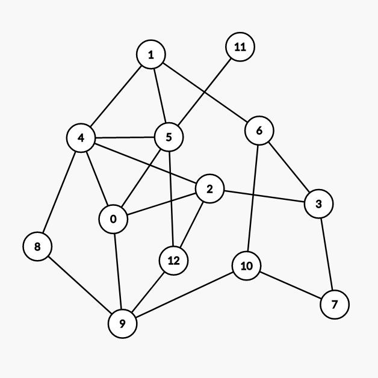
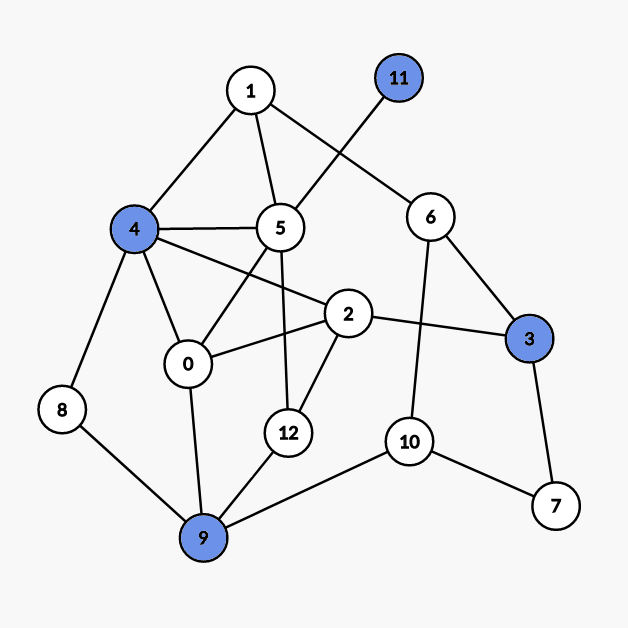
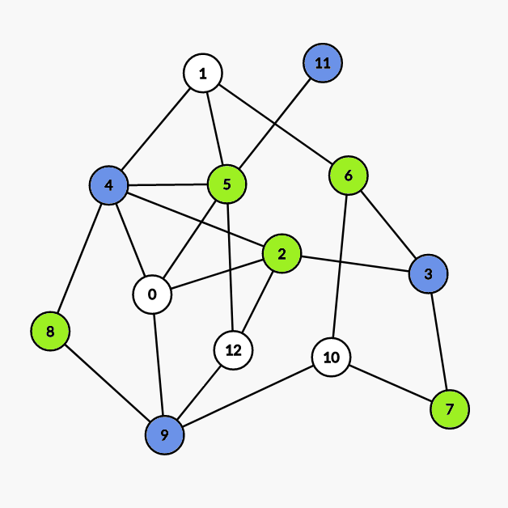
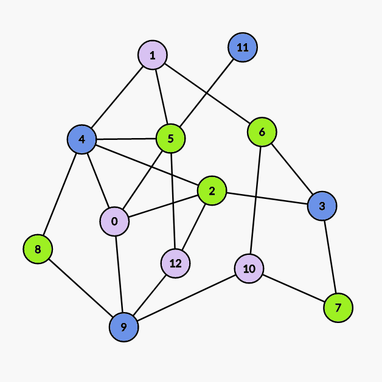

## 点着色

（讨论的是无自环无向图）

对无向图顶点着色，且相邻顶点不能同色。若 G 是 $k$- 可着色的，但不是 $(k-1)$- 可着色的，则称 k 是 G 的色数，记为 $\chi(G)$。

对任意图 G，有 $\chi(G) \leq \Delta(G) + 1$，其中 $\Delta(G)$ 为最大度。

### Brooks 定理

设连通图不是完全图也不是奇圈，则 $\chi(G) \leq \Delta(G)$。

#### 证明

???+ note "证明"
    设 $|V(G)|=n$，考虑数学归纳法。
    
    首先，$n\leq 3$ 时，命题显然成立。
    
    接下来，假设对于 $n-1$ 时的命题成立，下面我们要逐步强化命题。
    
    不妨只考虑 $\Delta(G)$- 正则图，因为对于非正则图来说，可以看作在正则图里删去一些边构成的，而这一过程并不会影响结论。
    
    对于任意不是完全图也不是奇圈的正则图 G，任取其中一点 v，考虑子图 $H:=G-v$，由归纳假设知 $\chi(H)\leq\Delta(H)=\Delta(G)$，接下来我们只需证明在 H 中插入 v 不会影响结论即可。
    
    令 $\Delta:=\Delta(G)$，设 H 染的 $\Delta$ 种颜色分别为 $c_1,c_2,\dots,c_{\Delta}$，v 的 $\Delta$ 个邻接点为 $v_1,v_1,\dots,v_{\Delta}$。不妨假设 v 的这些邻接点颜色两两不同，否则命题得证。
    
    接下来我们设所有在 H 中染成 $c_i$ 或 $c_j$ 的点以及它们之间的所有边构成子图 $H_{i,j}$。不妨假设任意 2 个不同的点 $v_i$，$v_j$ 一定在 $H_{i,j}$ 的同一个连通分量中，否则若在两个连通分量中的话，可以交换其中一个连通分量所有点的颜色，从而 $v_i$，$v_j$ 颜色相同。
    
    > 这里的交换颜色指的是若图中只有两种颜色 a，b，那么把图中原来染成颜色 a 的点全部染成颜色 b，把图中原来染成颜色 b 的点全部染成颜色 a。
    
    我们设上述连通分量为 $C_{i,j}$，那么 $C_{i,j}$ 一定只能是 $v_i$ 到 $v_j$ 的路。因为 $v_i$ 在 H 中的度为 $\Delta-1$，所以 $v_i$ 在 H 中的邻接点颜色一定两两不同，否则可以给 $v_i$ 染别的颜色，从而和 v 的其他邻接点颜色重复，所以 $v_i$ 在 $C_{i,j}$ 中邻接点数量为 1，$v_j$ 同理。然后我们在 $C_{i,j}$ 中取一条 $v_i$ 到 $v_j$ 的路，令其为 P，若 $C_{i,j}\ne P$，那么我们沿着 P 顺次给路上的点染色，设遇到的第一个度数大于 2 的点为 u，注意到 u 的邻接点最多只用了 $\Delta-2$ 种颜色，所以 u 可以重新染色，从而使 $v_i$，$v_j$ 不连通。
    
    然后我们不难发现，对任意 3 个不同的点 $v_i$，$v_j$，$v_k$，$V(C_{i,j})\cap V(C_{j,k})=\{v_j\}$。
    
    到这里我们对命题的强化工作就已经做完了。
    
    接下来就很简单。首先，如果 v 的邻接点两两相邻，那么命题得证。不妨设 $v_1$，$v_2$ 不相邻，在 $C_{1,2}$ 中取 $v_1$ 的邻接点 w，交换 $C_{1,3}$ 中的颜色。得到的新图中，$w\in V(C_{1,2})\cap V(C_{2,3})$，矛盾。
    
    至此命题证明完毕。

### Welsh–Powell 算法

Welsh–Powell 算法是一种在 **不限制最大着色数** 时寻找着色方案的贪心算法。

对于无自环无向图 G，设 $V(G):=\{v_1,v_2,\dots,v_n\}$ 满足。

$\deg(v_i)\geq\deg(v_{i+1}),~\forall 1\leq i\leq n-1$

按 Welsh–Powell 算法着色后的颜色数至多为 $\max_{i=1}^n\min\{\deg(v_i)+1,i\}$, 该算法的时间复杂度为 $O\left(n\max_{i=1}^n\min\{\deg(v_i)+1,i\}\right)=O(n^2)$。

#### 过程

1.  将当前未着色的点按度数降序排列。
2.  将第一个点染成一个未被使用的颜色。
3.  顺次遍历接下来的点，若当前点和所有与第一个点颜色 **相同** 的点 **不相邻**，则将该点染成与第一个点相同的颜色。
4.  若仍有未着色的点，则回到步骤 1, 否则结束。

示例如下：



（由 [Graph Editor](https://csacademy.com/app/graph_editor/) 生成）

我们先对点按度数降序排序，得：

| 次序                      | 1 | 2 | 3 | 4 | 5 | 6 | 7 | 8 | 9  | 10 | 11 | 12 | 13 |
| ----------------------- | - | - | - | - | - | - | - | - | -- | -- | -- | -- | -- |
| 点的编号                    | 4 | 5 | 0 | 2 | 9 | 1 | 3 | 6 | 10 | 12 | 7  | 8  | 11 |
| 度数                      | 5 | 5 | 4 | 4 | 4 | 3 | 3 | 3 | 3  | 3  | 2  | 2  | 1  |
| $\min\{\deg(v_i)+1,i\}$ | 1 | 2 | 3 | 4 | 5 | 4 | 4 | 4 | 4  | 4  | 3  | 3  | 2  |

所以 Welsh–Powell 算法着色后的颜色数最多为 5。

另外因为该图有子图 $C_3$, 所以色数一定大于等于 3。

-   第一次染色：

    

    染 `4 9 3 11` 号点。
-   第二次染色：

    

    染 `5 2 6 7 8` 号点。
-   第三次染色：

    

    染 `0 1 10 12` 号点。

#### 证明

???+ note "证明"
    对于无自环无向图 G，设 $V(G):=\{v_1,v_2,\dots,v_n\}$ 满足
    
    $\deg(v_i)\geq\deg(v_{i+1}),~\forall 1\leq i\leq n-1$
    
    令 $V_0=\varnothing$, 我们取 $V(G)\setminus\bigcup_{i=0}^{m-1} V_i$ 中的子集 $V_m$, 其中的元素满足
    
    1.  $v_{k_m}\in V_m$, 其中 $k_m=\min\{k:v_k\notin\bigcup_{i=0}^{m-1} V_i\}$
    2.  若
    
        $\{v_{i_{m,1}},v_{i_{m,2}},\dots,v_{i_{m,l_m}}\}\subset V_m,~i_{m,1}<i_{m,2}<\dots<i_{m,l_m}$
    
        则 $v_j\in V_m$ 当且仅当
    
        1.  $j>i_{m,l_m}$
        2.  $v_j$ 与 $v_{i_{m,1}},v_{i_{m,2}},\dots,v_{i_{m,l_m}}$ 均不相邻
    
    显然若将 $V_i$ 中的点染成第 i 种颜色，则该染色方案即为 Welsh–Powell 算法给出的方案，显然有
    
    -   $V_1\neq\varnothing$
    -   $V_i\cap V_j=\varnothing\iff i\neq j$
    -   $\exists \alpha(G)\in\Bbb{N}^*,\forall i>\alpha(G),~s.t.~ V_i=\varnothing$
    
    我们只需要证明：
    
    $\bigcup_{i=1}^{\alpha(G)} V_i=V(G)$
    
    其中
    
    $\chi(G)\leq\alpha(G)\leq\max_{i=1}^n\min\{\deg(v_i)+1,i\}$
    
    上式左边的不等号显然成立，我们考虑右边。
    
    首先我们不难得出：
    
    若 $v\notin\bigcup_{i=1}^mV_i$，则 v 与 $V_1,V_2,\dots,V_m$ 中分别至少有一个点相邻，从而有 $\deg(v)\geq m$
    
    进而
    
    $v_j\in\bigcup_{i=1}^{\deg(v_j)+1}V_i$
    
    另一方面，基于序列 $\{V_i\}$ 的构造方法，我们不难发现
    
    $v_j\in\bigcup_{i=1}^j V_i$
    
    两式结合即得证。

## 边着色

对无向图的边着色，要求相邻的边涂不同种颜色。若 G 是 k- 边可着色的，但不是 $(k-1)$- 边可着色的，则称 k 是 G 的边色数，记为 $\chi'(G)$。

### Vizing 定理

设 G 是简单图，则 $\Delta(G) \leq \chi'(G) \leq \Delta(G) + 1$

若 G 是二部图，则 $\chi'(G)=\Delta(G)$

当 $n$ 为奇数（$n \neq 1$）时，$\chi'(K_n)=n$; 当 $n$ 为偶数时，$\chi'(K_n)=n-1$

### 二分图 Vizing 定理的构造性证明

???+ note "证明"
    按照顺序在二分图中加边。
    
    我们在尝试加入边 $(x,y)$ 的时候，我们尝试寻找对于 $x$ 和 $y$ 的编号最小的尚未被使用过的颜色，假设分别为 $l_x$ 和 $l_y$。
    
    如果 $l_x=l_y$ 此时我们可以直接将这条边的颜色设置为 $l_x$。
    
    否则假设 $l_x<l_y$, 我们可以尝试将节点 $y$ 连出去的颜色为 $l_x$ 的边的颜色修改为 $l_y$。
    
    修改的过程可以被近似的看成是一条从 $y$ 出发，依次经过颜色为 $l_x,l_y,\cdots$ 的边的有限唯一增广路。
    
    因为增广路有限所以我们可以将增广路上所有的边反色，即原来颜色为 $l_x$ 的修改为 $l_y$，原来颜色为 $l_y$ 的修改为 $l_x$。
    
    根据二分图的性质，节点 $x$ 不可能为增广路节点，否则与最小未使用颜色为 $l_x$ 矛盾。
    
    所以我们可以在增广之后直接将连接 $x$ 和 $y$ 的边的颜色设为 $l_x$。
    
    总构造时间复杂度为 $O(nm)$。

???+ note " 示例代码 [UVa10615 Rooks](https://onlinejudge.org/index.php?option=com_onlinejudge&Itemid=8&category=18&page=show_problem&problem=1556)"
    ```cpp
    --8<-- "docs/graph/code/color/color_1.cpp"
    ```

??? note " 一道很不简单的例题 [uoj 444 二分图](https://uoj.ac/problem/444)"
    本题为笔者于 2018 年命制的集训队第一轮作业题。
    
    首先我们可以发现答案下界为度数不为 k 倍数的点的个数。
    
    下界的构造方法是对二分图进行拆点。
    
    若 $degree \bmod k \neq 0$, 我们将其拆为 $degree/k$ 个度数为 k 的节点和一个度数为 $degree \bmod k$ 的节点。
    
    若 $degree \bmod k = 0$, 我们将其拆为 $degree/k$ 个度数为 k 的节点。
    
    拆出来的点在原图中的意义相同，也就是说，在满足度数限制的情况下，一条边端点可以连接任意一个拆出来的点。
    
    根据 Vizing 定理，我们显然可以构造出该图的一种 k 染色方案。
    
    删边部分由于和 Vizing 定理关系不大这里不再展开。
    
    有兴趣的读者可以自行阅读笔者当时写的题解。

## 色多项式

$P(G,k)$ 表示 G 的不同 k 着色方式的总数。

$P(K_n, k) = k(k-1)\cdots(k-n+1)$

$P(N_n, k) = k^n$

在无向无环图 G 中，

1.  $e=(v_i, v_j) \notin E(G)$，则 $P(G, k) = P(G \cup e, k)+P(G\setminus e, k)$
2.  $e=(v_i, v_j) \in E(G)$，则 $P(G,k)=P(G-e,k)-P(G\setminus e,k)$

定理：设 $V_1$ 是 G 的点割集，且 $G[V_1]$ 是 G 的 $|V_1|$ 阶完全子图，$G-V_1$ 有 $p(p \geq 2)$ 个连通分支，则：

$P(G,k)=\frac{\Pi_{i=1}^{p}{(P(H_i, k))}}{P(G[V_1], k)^{p-1}}$

其中 $H_i=G[V_1 \cup V(G_i)]$

## 参考资料

1.  [Graph coloring - Wikipedia](https://en.wikipedia.org/wiki/Graph_coloring)
2.  Welsh, D. J. A.; Powell, M. B. (1967), "[An upper bound for the chromatic number of a graph and its application to timetabling problems](https://doi.org/10.1093%2Fcomjnl%2F10.1.85)", The Computer Journal, 10 (1): 85–86
