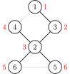
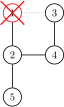
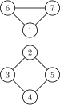

author: Ir1d, sshwy, GavinZhengOI, Planet6174, ouuan, Marcythm, ylxmf2005, 0xis-cn

相关阅读：[双连通分量](./bcc.md)，

割点和桥更严谨的定义参见 [图论相关概念](./concept.md)。

## 割点

> 对于一个无向图，如果把一个点删除后这个图的极大连通分量数增加了，那么这个点就是这个图的割点（又称割顶）。

### 过程

如果我们尝试删除每个点，并且判断这个图的连通性，那么复杂度会特别的高。所以要介绍一个常用的算法：Tarjan。

首先，我们上一个图：


很容易的看出割点是 2，而且这个图仅有这一个割点。

首先，我们按照 DFS 序给他打上时间戳（访问的顺序）。



这些信息被我们保存在一个叫做 `dfn` 的数组中。

还需要另外一个数组 `low`，用它来存储不经过其父亲能到达的最小的时间戳。

例如 `low[2]` 是 1，`low[5]` 和 `low[6]` 是 3。

然后我们开始 DFS，我们判断某个点是否是割点的根据是：对于某个顶点 $u$，如果存在至少一个顶点 $v$（$u$ 的儿子），使得 $low_v \geq dfn_u$，即不能回到祖先，那么 $u$ 点为割点。

此根据惟独不适用于搜索的起始点，其需要特殊考虑：若该点不是割点，则其他路径亦能到达全部结点，因此从起始点只「向下搜了一次」，即在搜索树内仅有一个子结点。如果在搜索树内有两个及以上的儿子，那么他一定是割点了（设想上图从 2 开始搜索，搜索树内应有两个子结点：3 或 4 及 5 或 6）。如果只有一个儿子，那么把它删掉，不会有任何的影响。比如下面这个图，此处形成了一个环。



我们在访问 1 的儿子时候，假设先 DFS 到了 2，然后标记用过，然后递归往下，来到了 4，4 又来到了 3，当递归回溯的时候，会发现 3 已经被访问过了，所以不是割点。

更新 `low` 的伪代码如下：

$$
\begin{array}{ll}
1 & \textbf{if } v \text{ is a son of } u \\
2 & \qquad \text{low}_u = \min(\text{low}_u, \text{low}_v) \\
3 & \textbf{else} \\
4 & \qquad \text{low}_u = \min(\text{low}_u, \text{dfn}_v) \\
\end{array}
$$

### 例题

[洛谷 P3388【模板】割点（割顶）](https://www.luogu.com.cn/problem/P3388)

??? "例题代码"
    ```cpp
    --8<-- "docs/graph/code/cut/cut_1.cpp"
    ```

## 割边

和割点差不多，叫做桥。

> 对于一个无向图，如果删掉一条边后图中的连通分量数增加了，则称这条边为桥或者割边。严谨来说，就是：假设有连通图 $G=\{V,E\}$，$e$ 是其中一条边（即 $e \in E$），如果 $G-e$ 是不连通的，则边 $e$ 是图 $G$ 的一条割边（桥）。

比如说，下图中，



红色的边就是割边。

### 过程

和割点差不多，只要改一处：$low_v>dfn_u$ 就可以了，而且不需要考虑根节点的问题。

割边是和是不是根节点没关系的，原来我们求割点的时候是指点 $v$ 是不可能不经过父节点 $u$ 为回到祖先节点（包括父节点），所以顶点 $u$ 是割点。如果 $low_v=dfn_u$ 表示还可以回到父节点，如果顶点 $v$ 不能回到祖先也没有另外一条回到父亲的路，那么 $u-v$ 这条边就是割边。

### 实现

下面代码实现了求割边，其中，当 `isbridge[x]` 为真时，`(father[x],x)` 为一条割边。

=== "C++"
    ```cpp
    int low[MAXN], dfn[MAXN], dfs_clock;
    bool isbridge[MAXN];
    vector<int> G[MAXN];
    int cnt_bridge;
    int father[MAXN];
    
    void tarjan(int u, int fa) {
      father[u] = fa;
      low[u] = dfn[u] = ++dfs_clock;
      for (int i = 0; i < G[u].size(); i++) {
        int v = G[u][i];
        if (!dfn[v]) {
          tarjan(v, u);
          low[u] = min(low[u], low[v]);
          if (low[v] > dfn[u]) {
            isbridge[v] = true;
            ++cnt_bridge;
          }
        } else if (dfn[v] < dfn[u] && v != fa) {
          low[u] = min(low[u], dfn[v]);
        }
      }
    }
    ```

=== "Python"
    ```python
    low = [0] * MAXN
    dfn = [0] * MAXN
    dfs_clock = 0
    isbridge = [False] * MAXN
    G = [[0 for i in range(MAXN)] for j in range(MAXN)]
    cnt_bridge = 0
    father = [0] * MAXN
    
    
    def tarjan(u, fa):
        father[u] = fa
        low[u] = dfn[u] = dfs_clock
        dfs_clock = dfs_clock + 1
        for i in range(0, len(G[u])):
            v = G[u][i]
            if dfn[v] == False:
                tarjan(v, u)
                low[u] = min(low[u], low[v])
                if low[v] > dfn[u]:
                    isbridge[v] = True
                    cnt_bridge = cnt_bridge + 1
            elif dfn[v] < dfn[u] and v != fa:
                low[u] = min(low[u], dfn[v])
    ```

## 练习

-   [P3388【模板】割点（割顶）](https://www.luogu.com.cn/problem/P3388)
-   [POJ2117 Electricity](http://poj.org/problem?id=2117)
-   [HDU4738 Caocao's Bridges](https://acm.hdu.edu.cn/showproblem.php?pid=4738)
-   [HDU2460 Network](https://acm.hdu.edu.cn/showproblem.php?pid=2460)
-   [POJ1523 SPF](http://poj.org/problem?id=1523)

Tarjan 算法还有许多用途，常用的例如求强连通分量，缩点，还有求 2-SAT 的用途等。
