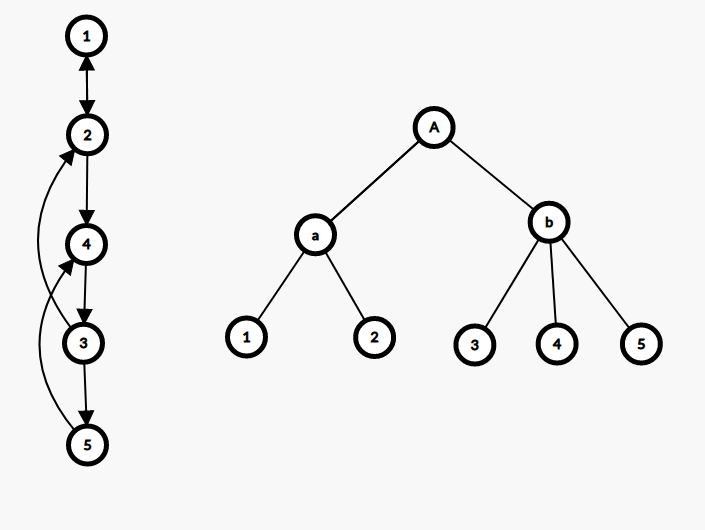

## 最小树形图

有向图上的最小生成树（Directed Minimum Spanning Tree）称为最小树形图。

常用的算法是朱刘算法（也称 Edmonds 算法），可以在 $O(nm)$ 时间内解决最小树形图问题。

### 流程

1. 对于每个点，选择它入度最小的那条边
2. 如果没有环，算法终止；否则进行缩环并更新其他点到环的距离。

### 代码

```cpp
bool solve() {
  ans = 0;
  int u, v, root = 0;
  for (;;) {
    f(i, 0, n) in[i] = 1e100;
    f(i, 0, m) {
      u = e[i].s;
      v = e[i].t;
      if (u != v && e[i].w < in[v]) {
        in[v] = e[i].w;
        pre[v] = u;
      }
    }
    f(i, 0, m) if (i != root && in[i] > 1e50) return 0;
    int tn = 0;
    memset(id, -1, sizeof id);
    memset(vis, -1, sizeof vis);
    in[root] = 0;
    f(i, 0, n) {
      ans += in[i];
      v = i;
      while (vis[v] != i && id[v] == -1 && v != root) {
        vis[v] = i;
        v = pre[v];
      }
      if (v != root && id[v] == -1) {
        for (int u = pre[v]; u != v; u = pre[u]) id[u] = tn;
        id[v] = tn++;
      }
    }
    if (tn == 0) break;
    f(i, 0, n) if (id[i] == -1) id[i] = tn++;
    f(i, 0, m) {
      u = e[i].s;
      v = e[i].t;
      e[i].s = id[u];
      e[i].t = id[v];
      if (e[i].s != e[i].t) e[i].w -= in[v];
    }
    n = tn;
    root = id[root];
  }
  return ans;
}
```

## Tarjan 的 DMST 算法

Tarjan 提出了一种能够在 $O(m+n\log n)$ 时间内解决最小树形图问题的算法。

这里的算法描述以及参考代码基于 Uri Zwick 教授的课堂讲义，更多的细节可以参考原文。

Tarjan 的算法分为 **收缩** 与 **伸展** 两个过程。接下来先介绍 **收缩** 的过程。

我们需要假设输入的图是满足强连通的，如果不满足那么就加入 $O(n)$ 条边使其满足，并且这些边的边权是无穷大的。

我们需要一个堆存储结点的入边编号，入边权值，结点总代价等相关信息，由于后续过程中会有堆的合并操作，这里采用 [左偏树](../ds/leftist-tree.md) 与 [并查集](../ds/dsu.md) 实现。算法的每一步都选择一个任意结点 $v$ ，需要保证 $v$ 不是根节点，并且在堆中没有它的入边。再将 $v$ 的最小入边加入到堆中，如果新加入的这条边使堆中的边形成了环，那么将构成环的那些结点收缩，我们不妨将这些已经收缩的结点命名为 **超级结点** ，再继续这个过程，如果所有的顶点都缩成了一个超级结点，那么收缩过程就结束了。整个收缩过程结束后会得到一棵收缩树，之后将对它进行伸展操作。

堆中的边总是会形成一条路径 $v_0\leftarrow v_1\leftarrow \dots\leftarrow v_k$ ，由于图是强连通的，这个路径必然存在，并且其中的 $v_i$ 可能是最初的单一结点，也可能是压缩后的超级结点。

最初有 $v_o=a$ ，其中 $a$ 是图中任意的一个结点，每一次选择一条最小入边 $v_k\leftarrow u$ ，如果 $u$ 不是 $v_0,v_1,\dots,v_k$ 中的一个结点，那么就将结点扩展到 $v_{k+1}=u$ 。如果 $u$ 是他们其中的一个结点 $v_i$ ，那么就找到了一个关于 $v_i\leftarrow\dots\leftarrow v_k\leftarrow v_i$ 的环，再将他们收缩为一个超级结点 $c$ 。

向队列 $P$ 中放入所有的结点或超级结点，并初始选择任意一节点 $a$ ，只要队列不为空，就进行以下步骤：

1. 选择 $a$ 的最小入边，保证不存在自环，并找到另一头的结点 $b$ 。如果结点 $b$ 没有被记录过说明未形成环，令 $a\leftarrow b$ ，继续当前操作寻找环。

2. 如果 $b$ 被记录过了，就说明出现了环。总结点数加一，并将环上的所有结点重新编号，对堆进行合并，以及结点/超级结点的总权值的更新。更新权值操作就是将环上所有结点的入边都收集起来，并减去环上入边的边权。



以图片为例，左边的强连通图在收缩后就形成了右边的一棵收缩树，其中 $a$ 是结点 1 与结点 2 收缩后的超级结点， $b$ 是结点 3，结点 4，结点 5 收缩后的超级结点， $A$ 是两个超级结点 $a$ 与 $b$ 收缩后形成的。

伸展过程是相对简单的，以原先要求的根节点 $r$ 为起始点，对 $r$ 到收缩树的根上的每一个环进行伸展。再以 $r$ 的祖先结点 $f_r$ 为起始点，将其到根的环展开，直到遍历完所有的结点。

### 代码

```cpp
#include <bits/stdc++.h>

using namespace std;

typedef long long ll;
#define maxn 102
#define INF 0x3f3f3f3f

struct UnionFind {
  int fa[maxn << 1];
  UnionFind() { memset(fa, 0, sizeof(fa)); }
  void clear(int n) { memset(fa + 1, 0, sizeof(int) * n); }
  int find(int x) { return fa[x] ? fa[x] = find(fa[x]) : x; }
  int operator[](int x) { return find(x); }
};
struct Edge {
  int u, v, w, w0;
};
struct Heap {
  Edge *e;
  int rk, constant;
  Heap *lch, *rch;
  Heap(Edge *_e) : e(_e), rk(1), constant(0), lch(NULL), rch(NULL) {}
  void push() {
    if (lch) lch->constant += constant;
    if (rch) rch->constant += constant;
    e->w += constant;
    constant = 0;
  }
};
Heap *merge(Heap *x, Heap *y) {
  if (!x) return y;
  if (!y) return x;
  if (x->e->w + x->constant > y->e->w + y->constant) swap(x, y);
  x->push();
  x->rch = merge(x->rch, y);
  if (!x->lch || x->lch->rk < x->rch->rk) swap(x->lch, x->rch);
  if (x->rch)
    x->rk = x->rch->rk + 1;
  else
    x->rk = 1;
  return x;
}
Edge *extract(Heap *&x) {
  Edge *r = x->e;
  x->push();
  x = merge(x->lch, x->rch);
  return r;
}

vector<Edge> in[maxn];
int n, m, fa[maxn << 1], nxt[maxn << 1];
Edge *ed[maxn << 1];
Heap *Q[maxn << 1];
UnionFind id;

void contract() {
  bool mark[maxn << 1];
  // 将图上的每一个结点与其相连的那些结点进行记录。
  for (int i = 1; i <= n; i++) {
    queue<Heap *> q;
    for (int j = 0; j < in[i].size(); j++) q.push(new Heap(&in[i][j]));
    while (q.size() > 1) {
      Heap *u = q.front();
      q.pop();
      Heap *v = q.front();
      q.pop();
      q.push(merge(u, v));
    }
    Q[i] = q.front();
  }
  mark[1] = true;
  for (int a = 1, b = 1, p; Q[a]; b = a, mark[b] = true) {
    //寻找最小入边以及其端点，保证无环。
    do {
      ed[a] = extract(Q[a]);
      a = id[ed[a]->u];
    } while (a == b && Q[a]);
    if (a == b) break;
    if (!mark[a]) continue;
    // 对发现的环进行收缩，以及环内的结点重新编号，总权值更新。
    for (a = b, n++; a != n; a = p) {
      id.fa[a] = fa[a] = n;
      if (Q[a]) Q[a]->constant -= ed[a]->w;
      Q[n] = merge(Q[n], Q[a]);
      p = id[ed[a]->u];
      nxt[p == n ? b : p] = a;
    }
  }
}

ll expand(int x, int r);
ll expand_iter(int x) {
  ll r = 0;
  for (int u = nxt[x]; u != x; u = nxt[u]) {
    if (ed[u]->w0 >= INF)
      return INF;
    else
      r += expand(ed[u]->v, u) + ed[u]->w0;
  }
  return r;
}
ll expand(int x, int t) {
  ll r = 0;
  for (; x != t; x = fa[x]) {
    r += expand_iter(x);
    if (r >= INF) return INF;
  }
  return r;
}
void link(int u, int v, int w) { in[v].push_back({u, v, w, w}); }

int main() {
  int rt;
  scanf("%d %d %d", &n, &m, &rt);
  for (int i = 0; i < m; i++) {
    int u, v, w;
    scanf("%d %d %d", &u, &v, &w);
    link(u, v, w);
  }
  // 保证强连通
  for (int i = 1; i <= n; i++) link(i > 1 ? i - 1 : n, i, INF);
  contract();
  ll ans = expand(rt, n);
  if (ans >= INF)
    puts("-1");
  else
    printf("%lld\n", ans);
  return 0;
}
```

## 参考文献

Uri Zwick. (2013), [Directed Minimum Spanning Trees](http://www.cs.tau.ac.il/~zwick/grad-algo-13/directed-mst.pdf) , Lecture notes on“Analysis of Algorithms”

 <https://riteme.site/blog/2018-6-18/mdst.html#_3> 
