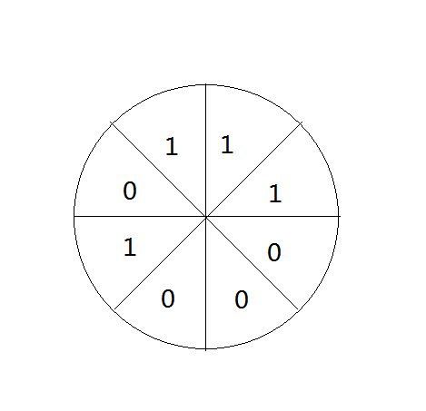
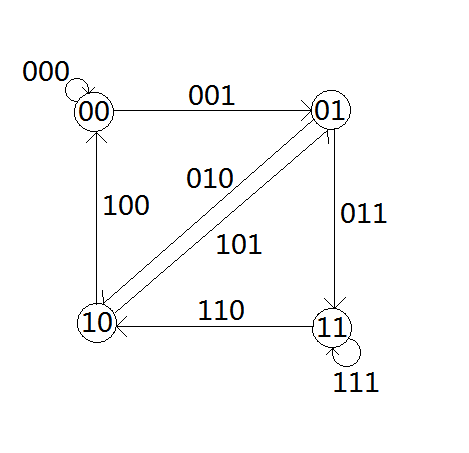

本页面将简要介绍欧拉图的概念、实现和应用。

## 定义

通过图中所有边恰好一次且行遍所有顶点的通路称为欧拉通路。

通过图中所有边恰好一次且行遍所有顶点的回路称为欧拉回路。

具有欧拉回路的无向图或有向图称为欧拉图。

具有欧拉通路但不具有欧拉回路的无向图或有向图称为半欧拉图。

有向图也可以有类似的定义。

非形式化地讲，欧拉图就是从任意一个点开始都可以一笔画完整个图，半欧拉图必须从某个点开始才能一笔画完整个图。

## 性质

欧拉图中所有顶点的度数都是偶数。

若 $G$ 是欧拉图，则它为若干个环的并，且每条边被包含在奇数个环内。

## 判别法

对于无向图 $G$，$G$ 是欧拉图当且仅当 $G$ 是连通的且没有奇度顶点。

对于无向图 $G$，$G$ 是半欧拉图当且仅当 $G$ 是连通的且 $G$ 中恰有 $0$ 个或 $2$ 个奇度顶点。

对于有向图 $G$，$G$ 是欧拉图当且仅当 $G$ 的所有顶点属于同一个强连通分量且每个顶点的入度和出度相同。

对于有向图 $G$，$G$ 是半欧拉图当且仅当

- 如果将 $G$ 中的所有有向边退化为无向边时，那么 $G$ 的所有顶点属于同一个连通分量。
- 最多只有一个顶点的出度与入度差为 $1$。
- 最多只有一个顶点的入度与出度差为 $1$。
- 所有其他顶点的入度和出度相同。

## 求欧拉回路或欧拉路

### Fleury 算法

也称避桥法，是一个偏暴力的算法。

算法流程为每次选择下一条边的时候优先选择不是桥的边。

一个广泛使用但是错误的实现方式是先 Tarjan 预处理桥边，然后再 DFS 避免走桥。但是由于走图过程中边会被删去，一些非桥边会变为桥边导致错误。最简单的实现方法是每次删除一条边之后暴力跑一遍 Tarjan 找桥，时间复杂度是 $\Theta(m(n+m))=\Theta(m^2)$。复杂的实现方法要用到动态图等，实用价值不高。

### Hierholzer 算法

也称逐步插入回路法。

算法流程为从一条回路开始，每次任取一条目前回路中的点，将其替换为一条简单回路，以此寻找到一条欧拉回路。如果从路开始的话，就可以寻找到一条欧拉路。

Hierholzer 算法的暴力实现如下：

$$
\begin{array}{ll}
1 &  \textbf{Input. } \text{The edges of the graph } e , \text{ where each element in } e \text{ is } (u, v) \\
2 &  \textbf{Output. } \text{The vertex of the Euler Road of the input graph}.\\
3 &  \textbf{Method. } \\
4 &  \textbf{Function } \text{Hierholzer } (v) \\
5 &  \qquad circle \gets \text{Find a Circle in } e \text{ Begin with } v \\
6 &  \qquad \textbf{if } circle=\varnothing \\
7 &  \qquad\qquad \textbf{return } v \\
8 &  \qquad e \gets e-circle \\
9 &  \qquad \textbf{for} \text{ each } v \in circle \\
10&  \qquad\qquad v \gets \text{Hierholzer}(v) \\
11&  \qquad \textbf{return } circle \\
12&  \textbf{Endfunction}\\
13&  \textbf{return } \text{Hierholzer}(\text{any vertex})
\end{array}
$$

这个算法的时间复杂度约为 $O(nm+m^2)$。实际上还有复杂度更低的实现方法，就是将找回路的 DFS 和 Hierholzer 算法的递归合并，边找回路边使用 Hierholzer 算法。

如果需要输出字典序最小的欧拉路或欧拉回路的话，因为需要将边排序，时间复杂度是 $\Theta(n+m\log m)$（计数排序或者基数排序可以优化至 $\Theta(n+m)$）。如果不需要排序，时间复杂度是 $\Theta(n+m)$。

### 应用

有向欧拉图可用于计算机译码。

设有 $m$ 个字母，希望构造一个有 $m^n$ 个扇形的圆盘，每个圆盘上放一个字母，使得圆盘上每连续 $n$ 位对应长为 $n$ 的符号串。转动一周（$m^n$ 次）后得到由 $m$ 个字母产生的长度为 $n$ 的 $m^n$ 个各不相同的符号串。



构造如下有向欧拉图：

设 $S = \{a_1, a_2, \cdots, a_m\}$，构造 $D=<V, E>$，如下：

$V = \{a_{i_1}a_{i_2}\cdots a_{i_{n-1}} |a_i \in S, 1 \leq i \leq n - 1 \}$

$E = \{a_{j_1}a_{j_2}\cdots a_{j_{n-1}}|a_j \in S, 1 \leq j \leq n\}$

规定 $D$ 中顶点与边的关联关系如下：

顶点 $a_{i_1}a_{i_2}\cdots a_{i_{n-1}}$ 引出 $m$ 条边：$a_{i_1}a_{i_2}\cdots a_{i_{n-1}}a_r, r=1, 2, \cdots, m$。

边 $a_{j_1}a_{j_2}\cdots a_{j_{n-1}}$ 引入顶点 $a_{j_2}a_{j_3}\cdots a_{j_{n}}$。



这样的 $D$ 是连通的，且每个顶点入度等于出度（均等于 $m$），所以 $D$ 是有向欧拉图。

任求 $D$ 中一条欧拉回路 $C$，取 $C$ 中各边的最后一个字母，按各边在 $C$ 中的顺序排成圆形放在圆盘上即可。

## 例题

???+note "[洛谷 P2731 骑马修栅栏](https://www.luogu.com.cn/problem/P2731)"
    给定一张有 500 个顶点的无向图，求这张图的一条欧拉路或欧拉回路。如果有多组解，输出最小的那一组。
    
    在本题中，欧拉路或欧拉回路不需要经过所有顶点。
    
    边的数量 m 满足 $1\leq m \leq 1024$。

??? note "解题思路"
    用 Fleury 算法解决本题的时候只需要再贪心就好，不过由于复杂度不对，还是换 Hierholzer 算法吧。
    
    保存答案可以使用 `stack<int>`，因为如果找的不是回路的话必须将那一部分放在最后。
    
    注意，不能使用邻接矩阵存图，否则时间复杂度会退化为 $\Theta(nm)$。由于需要将边排序，建议使用前向星或者 vector 存图。示例代码使用 vector。

??? note "示例代码"
    ```cpp
    #include <algorithm>
    #include <cstdio>
    #include <stack>
    #include <vector>
    using namespace std;
    
    struct edge {
      int to;
      bool exists;
      int revref;
    
      bool operator<(const edge& b) const { return to < b.to; }
    };
    
    vector<edge> beg[505];
    int cnt[505];
    
    const int dn = 500;
    stack<int> ans;
    
    void Hierholzer(int x) {  // 关键函数
      for (int& i = cnt[x]; i < (int)beg[x].size();) {
        if (beg[x][i].exists) {
          edge e = beg[x][i];
          beg[x][i].exists = 0;
          beg[e.to][e.revref].exists = 0;
          ++i;
          Hierholzer(e.to);
        } else {
          ++i;
        }
      }
      ans.push(x);
    }
    
    int deg[505];
    int reftop[505];
    
    int main() {
      for (int i = 1; i <= dn; ++i) {
        beg[i].reserve(1050);  // vector 用 reserve 避免动态分配空间，加快速度
      }
    
      int m;
      scanf("%d", &m);
      for (int i = 1; i <= m; ++i) {
        int a, b;
        scanf("%d%d", &a, &b);
        beg[a].push_back((edge){b, 1, 0});
        beg[b].push_back((edge){a, 1, 0});
        ++deg[a];
        ++deg[b];
      }
    
      for (int i = 1; i <= dn; ++i) {
        if (!beg[i].empty()) {
          sort(beg[i].begin(), beg[i].end());  // 为了要按字典序贪心，必须排序
        }
      }
    
      for (int i = 1; i <= dn; ++i) {
        for (int j = 0; j < (int)beg[i].size(); ++j) {
          beg[i][j].revref = reftop[beg[i][j].to]++;
        }
      }
    
      int bv = 0;
      for (int i = 1; i <= dn; ++i) {
        if (!deg[bv] && deg[i]) {
          bv = i;
        } else if (!(deg[bv] & 1) && (deg[i] & 1)) {
          bv = i;
        }
      }
    
      Hierholzer(bv);
    
      while (!ans.empty()) {
        printf("%d\n", ans.top());
        ans.pop();
      }
    }
    ```

## 习题

- [洛谷 P1341 无序字母对](https://www.luogu.com.cn/problem/P1341)

- [洛谷 P2731 骑马修栅栏](https://www.luogu.com.cn/problem/P2731)
