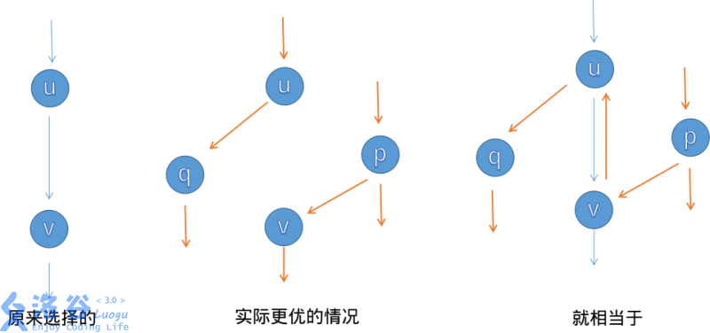

网络流在 OI 中是显得尤为重要的。在《算法导论》中就用了 35 页来讲述网络流的知识，在这里，我来给大家讲一讲网络流的一些基础知识。

## 流量

首先我们要认识**流量**是什么。我们知道，我们城市中的每一条路肯定有一定的宽度，而这些宽度就限定了车辆（我们也可以把红绿灯两端看为一条路的长度）。

网络流就对**图**诠释上了这么一个值，它不同于最短路。$a$ 站向 $b$ 站有一条流量为
 $5$ 的路，那么你就只能通过 $5$ 辆（或者是其它单位）车，而且通过以后就无法再通过。我们也就可以推出几个东西：

1.  我们可以先通 $n$ 辆车，再通 $m$ 辆车（$n+m\le$ 这条路的流量）。

2.  如果我们从 $a$ 站到 $b$ 站只剩 $20$ 的流量，那么我们有一条流量为 $15$ 的边连接 $b$ 和 $c$。我们很快能推出 $a$ **流**到 $c$ 只有 $15$ 的流量（因为后者限制了前者）。

## 最大流

先认识一下 $S$ ($source$) 和 $T$ ($sink$) 的概念。$S$ 就是常说的源点，$T$ 就是汇点（也就是起点和终点，这个跟最短路的概念是一样的）。我们有一张图，要求从源点流向汇点的最大流量（可以有很多条路到达汇点），就是我们的最大流问题 ($max\ flow$)，一般源点是无限流量的。

然后我们来认识一下**增广路**（注意路不是边），就是说，从源点到汇点，只要有 $flow$ ($flow>0$) 流过去，这条路就是增广路。在一些最大流算法中，就是将这些路**增广**（意思就是走掉这条路，带走的流量肯定就是这条路的最小流量），如图:

我们从 $4$ 到 $3$，肯定可以先从流量为 $20$ 的这条边先走。那么这条边就被走掉了，不能再选，总的流量为$20$（现在）。然后我们可以这样选择:

1.  $4\rightarrow2\rightarrow3$ 这条**增广路**的总流量为 $20$。到 $2$ 的时候还是 $30$，到 $3$ 了就只有 $20$ 了。

2.  $4\rightarrow2\rightarrow1\rightarrow3$ 这样子我们就很好的保留了 $30$ 的流量。

所以我们这张图的最大流就应该是 $20+30=50$。

求最大流是很简单的，接下来讲解求最大流的 $3$ 种方法。

所有代码请看：[剪贴板](https://www.luogu.org/paste/6t8jgtxc)。

### Edmond-Karp 动能算法（$EK$ 算法）

这个算法很简单，就是 BFS**找增广路**，然后对其进行**增广**。你可能会问，怎么找？怎么增广？

1.  找？ 我们就从源点一直 BFS 走来走去，碰到汇点就停，然后增广（每一条路都要增广）。我们在 BFS 的时候就注意一下流量合不合法就可以了。

2.  增广？其实就是按照我们找的增广路在重新走一遍。走的时候把这条路的能够成的最大流量减一减，然后给答案加上最小流量就可以了。

再讲一下**反向边**。增广的时候要注意建造反向边，原因是这条路不一定是最优的，这样子程序可以进行反悔。假如我们对这条路进行增广了，那么其中的每一条边的反向边的流量就是它的流量。

讲一下一些小细节。如果你是用邻接矩阵的话，反向边直接就是从 $table[x,y]$ 变成 $table[y,x]$。如果是常用的链式前向星，那么在加入边的时候就要先加入反向边。那么在用的时候呢，我们直接 $i\operatorname{xor}1$ 就可以了 ($i$ 为边的编号)。为什么呢? 相信大家都是知道 $\operatorname{xor}$ 的，那么我们在加入正向边后加入反向边，就是靠近的，所以可以使用 $\operatorname{xor}$。我们还要注意一开始的编号要设置为 $tot=1$，因为边要从编号 $2$ 开始，这样子 $\operatorname{xor}$ 对编号 $2,3$ 的边才有效果。

EK算法的时间复杂度上限为$O(n^2m)$（其中$n$为点数，$m$为边数）。效率还有很大提升空间。

### Dinic

**Dinic算法**的过程是这样的：每次增广前，我们先用bfs来将图分层。设源点的层数为0，那么一个点的层数便是它离源点的最近距离。

通过分层，我们可以干两件事情：

1. 如果不存在到汇点的增广路（即汇点的层数不存在），我们即可停止增广。
2. 确保我们找到的增广路是最短的。（原因见下文）

接下来是DFS找增广路的过程。

我们每次找增广路的时候，都只找比当前点层数多1的点进行增广（这样就可以确保我们找到的增广路是最短的）。

Dinic算法有两个优化：

1. **多路增广**：每次找到一条增广路的时候，如果残余流量没有用完怎么办呢？我们可以利用残余部分流量，再找出一条增广路。这样就可以在一次DFS中找出多条增广路，大大提高了算法的效率。
2. **当前弧优化**：如果一条边已经被增广过，那么它就没有可能被增广第二次。那么，我们下一次进行增广的时候，就可以不必再走那些已经被增广过的边。

设点数为$n$，边数为$m$，那么Dinic算法的时间复杂度上限是$O(nm^2)$，在稀疏图上效率和EK算法相当，但在稠密图上效率要比EK算法高很多。

特别地，在求解二分图最大匹配问题时，可以证明Dinic算法的时间复杂度是$O(n \sqrt{m})$。

### ISAP

这个是 $SAP$ 算法的加强版 (Improved)。

## 最小费用最大流 (MCMF)

这也是耳熟能闻的费用流——最小费用最大流 (Minimum cost Maximum flow)。我们给予这张图一个费用值（也就是最短路问题），然后在求出最大流的基础上，把最小费用的路径求出来。这个难度就上升到了提高组的难度，并不是大家都可以先决的。

最小费用最大流解法：最简单的就是 EK+SPFA，也推荐用 zkw 费用流和原始对偶匹配算法。

## 网络流基础知识拓展

前面都看懂的同学可以看一下以下内容。

### 最小割

割其实就是删边的意思，当然最小割就是割掉 $X$ 条边来让 $S$ 跟 $T$ 不互通。我们要求 $X$ 条边加起来的流量综合最小。这就是最小割问题。

其中我们要认识一个定理: **最小割**=**最大流**

### 二分图匹配

匈牙利算法就是其中一个可撤回贪心的过程，而网络流更快，就在于 **撤回** 这一过程很快。

### 建模

在会了最大流和费用流后，建模显得尤为重要。就像 ZJOI 的 [狼与羊的故事](https://www.luogu.org/problemnew/show/P2598)，就是一个例子。

**前期**遇到这种题目，暴搜？神奇 BFS？错误。我们首先要考虑一下会不会有**二分图匹配**，**最小割**的模型（一般不会有普通的最大流）。然后建立（超级）源点和（超级）汇点。什么意思？就是当很多个源点和很多个汇点的时候，我们就可以用超级源点和超级汇点代替「源点」和「汇点」的位置（也就是把超级源点连向各个源点，超级汇点连向各个汇点，方向按题意来定）。

这是最常见的建模的方法之一，也是做二分图匹配的方法。还有很多建模方法，可以参考 [网络流建模基础](https://www.cnblogs.com/victorique/p/8560656.html)。

来一道题练练手: [沙耶的玩偶](https://www.luogu.org/paste/z3085b8l)。
