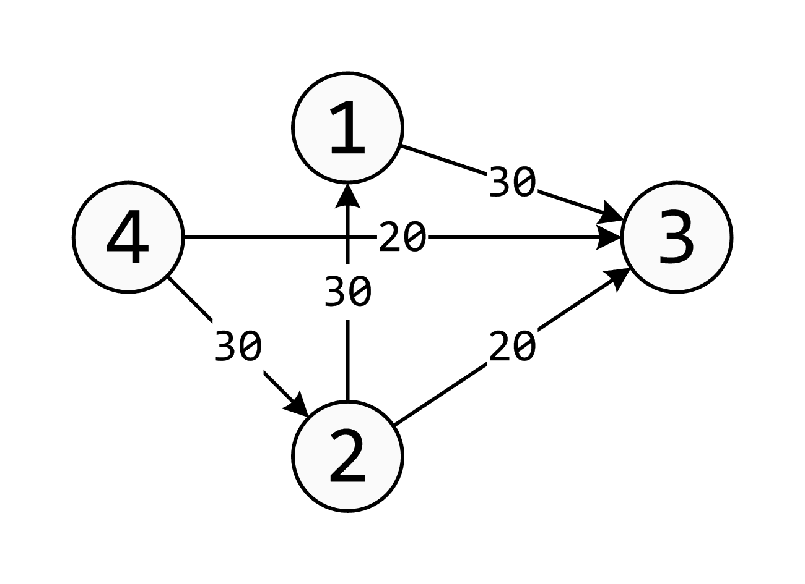
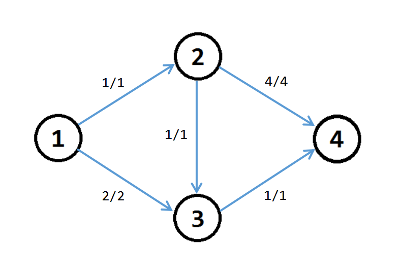
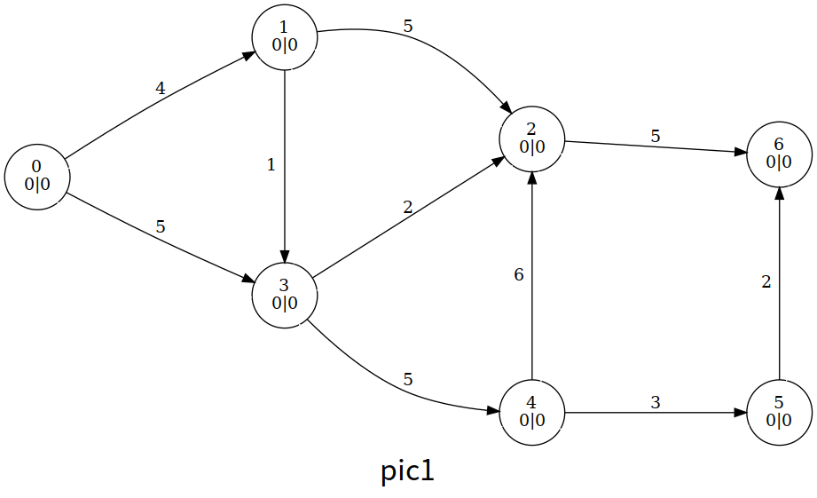
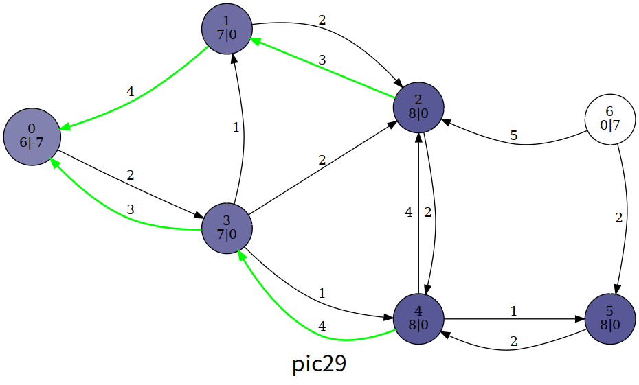
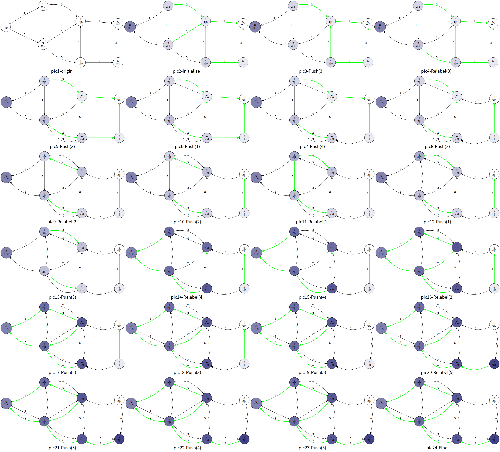

网络流基本概念参见 [网络流简介](../flow.md)

## 概述

我们有一张图，要求从源点流向汇点的最大流量（可以有很多条路到达汇点），就是我们的最大流问题。

## Ford-Fulkerson 增广路算法

该方法通过寻找增广路来更新最大流，有 EK,dinic,SAP,ISAP 主流算法。

求解最大流之前，我们先认识一些概念。

### 残量网络

首先我们介绍一下一条边的剩余容量 $c_f(u,v)$（Residual Capacity），它表示的是这条边的容量与流量之差，即 $c_f(u,v)=c(u,v)-f(u,v)$。

对于流函数 $f$，残存网络 $G_f$（Residual Network）是网络 $G$ 中所有结点 **和剩余容量大于 0** 的边构成的子图。形式化的定义，即 $G_f=(V_f=V,E_f=\left\{(u,v)\in E,c_f(u,v)>0\right\})$。

注意，剩余容量大于 0 的边可能不在原图 $G$ 中（根据容量、剩余容量的定义以及流函数的斜对称性得到）。可以理解为，残量网络中包括了那些还剩了流量空间的边构成的图，也包括虚边（即反向边）。

### 增广路

在原图 $G$ 中若一条从源点到汇点的路径上所有边的 **剩余容量都大于 0**，这条路被称为增广路（Augmenting Path）。

或者说，在残存网络 $G_f$ 中，一条从源点到汇点的路径被称为增广路。如图：



我们从 $4$ 到 $3$，肯定可以先从流量为 $20$ 的这条边先走。那么这条边就被走掉了，不能再选，总的流量为 $20$（现在）。然后我们可以这样选择：

1. $4\rightarrow2\rightarrow3$ 这条 **增广路** 的总流量为 $20$。到 $2$ 的时候还是 $30$，到 $3$ 了就只有 $20$ 了。

2. $4\rightarrow2\rightarrow1\rightarrow3$ 这样子我们就很好的保留了 $30$ 的流量。

所以我们这张图的最大流就应该是 $20+30=50$。

求最大流是很简单的，接下来讲解求最大流的 3 种方法。

### Edmonds-Karp 动能算法（EK 算法）

这个算法很简单，就是 BFS **找增广路**，然后对其进行 **增广**。你可能会问，怎么找？怎么增广？

1. 找？我们就从源点一直 BFS 走来走去，碰到汇点就停，然后增广（每一条路都要增广）。我们在 BFS 的时候就注意一下流量合不合法就可以了。

2. 增广？其实就是按照我们找的增广路在重新走一遍。走的时候把这条路的能够成的最大流量减一减，然后给答案加上最小流量就可以了。

再讲一下 **反向边**。增广的时候要注意建造反向边，原因是这条路不一定是最优的，这样子程序可以进行反悔。假如我们对这条路进行增广了，那么其中的每一条边的反向边的流量就是它的流量。



讲一下一些小细节。如果你是用邻接矩阵的话，反向边直接就是从 $table[x,y]$ 变成 $table[y,x]$。如果是常用的链式前向星，那么在加入边的时候就要先加入反向边。那么在用的时候呢，我们直接 $i\operatorname{xor}1$ 就可以了 ($i$ 为边的编号）。为什么呢？相信大家都是知道 $\operatorname{xor}$ 的，那么我们在加入正向边后加入反向边，就是靠近的，所以可以使用 $\operatorname{xor}$。我们还要注意一开始的编号要设置为 $tot=1$，因为边要从编号 $2$ 开始，这样子 $\operatorname{xor}$ 对编号 $2,3$ 的边才有效果。

EK 算法的时间复杂度为 $O(nm^2)$（其中 $n$ 为点数，$m$ 为边数）。效率还有很大提升空间。

??? note "参考代码"
    ```cpp
    #define maxn 250
    #define INF 0x3f3f3f3f
    
    struct Edge {
      int from, to, cap, flow;
      Edge(int u, int v, int c, int f) : from(u), to(v), cap(c), flow(f) {}
    };
    
    struct EK {
      int n, m;             // n：点数，m：边数
      vector<Edge> edges;   // edges：所有边的集合
      vector<int> G[maxn];  // G：点 x -> x 的所有边在 edges 中的下标
      int a[maxn], p[maxn];  // a：点 x -> BFS 过程中最近接近点 x 的边给它的最大流
                             // p：点 x -> BFS 过程中最近接近点 x 的边
    
      void init(int n) {
        for (int i = 0; i < n; i++) G[i].clear();
        edges.clear();
      }
    
      void AddEdge(int from, int to, int cap) {
        edges.push_back(Edge(from, to, cap, 0));
        edges.push_back(Edge(to, from, 0, 0));
        m = edges.size();
        G[from].push_back(m - 2);
        G[to].push_back(m - 1);
      }
    
      int Maxflow(int s, int t) {
        int flow = 0;
        for (;;) {
          memset(a, 0, sizeof(a));
          queue<int> Q;
          Q.push(s);
          a[s] = INF;
          while (!Q.empty()) {
            int x = Q.front();
            Q.pop();
            for (int i = 0; i < G[x].size(); i++) {  // 遍历以 x 作为起点的边
              Edge& e = edges[G[x][i]];
              if (!a[e.to] && e.cap > e.flow) {
                p[e.to] = G[x][i];  // G[x][i] 是最近接近点 e.to 的边
                a[e.to] =
                    min(a[x], e.cap - e.flow);  // 最近接近点 e.to 的边赋给它的流
                Q.push(e.to);
              }
            }
            if (a[t]) break;  // 如果汇点接受到了流，就退出 BFS
          }
          if (!a[t])
            break;  // 如果汇点没有接受到流，说明源点和汇点不在同一个连通分量上
          for (int u = t; u != s;
               u = edges[p[u]].from) {  // 通过 u 追寻 BFS 过程中 s -> t 的路径
            edges[p[u]].flow += a[t];      // 增加路径上边的 flow 值
            edges[p[u] ^ 1].flow -= a[t];  // 减小反向路径的 flow 值
          }
          flow += a[t];
        }
        return flow;
      }
    };
    ```

### Dinic 算法

**Dinic 算法** 的过程是这样的：每次增广前，我们先用 BFS 来将图分层。设源点的层数为 $0$，那么一个点的层数便是它离源点的最近距离。

通过分层，我们可以干两件事情：

1. 如果不存在到汇点的增广路（即汇点的层数不存在），我们即可停止增广。
2. 确保我们找到的增广路是最短的。（原因见下文）

接下来是 DFS 找增广路的过程。

我们每次找增广路的时候，都只找比当前点层数多 $1$ 的点进行增广（这样就可以确保我们找到的增广路是最短的）。

Dinic 算法有两个优化：

1. **多路增广**：每次找到一条增广路的时候，如果残余流量没有用完怎么办呢？我们可以利用残余部分流量，再找出一条增广路。这样就可以在一次 DFS 中找出多条增广路，大大提高了算法的效率。
2. **当前弧优化**：如果一条边已经被增广过，那么它就没有可能被增广第二次。那么，我们下一次进行增广的时候，就可以不必再走那些已经被增广过的边。

#### 时间复杂度

设点数为 $n$，边数为 $m$，那么 Dinic 算法的时间复杂度（在应用上面两个优化的前提下）是 $O(n^{2}m)$，在稀疏图上效率和 EK 算法相当，但在稠密图上效率要比 EK 算法高很多。

首先考虑单轮增广的过程。在应用了 **当前弧优化** 的前提下，对于每个点，我们维护下一条可以增广的边，而当前弧最多变化 $m$ 次，从而单轮增广的最坏时间复杂度为 $O(nm)$。

接下来我们证明，最多只需 $n-1$ 轮增广即可得到最大流。

我们先回顾下 Dinic 的增广过程。对于每个点，Dinic 只会找比该点层数多 $1$ 的点进行增广。

首先容易发现，对于图上的每个点，一轮增广后其层数一定不会减小。而对于汇点 $t$，情况会特殊一些，其层数在一轮增广后一定增大。

对于后者，我们考虑用反证法证明。如果 $t$ 的层数在一轮增广后不变，则意味着在上一次增广中，仍然存在着一条从 $s$ 到 $t$ 的增广路，且该增广路上相邻两点间的层数差为 $1$。这条增广路应该在上一次增广过程中就被增广了，这就出现了矛盾。

从而我们证明了汇点的层数在一轮增广后一定增大，即增广过程最多进行 $n-1$ 次。

综上 Dinic 的最坏时间复杂度为 $O(n^{2}m)$。事实上在一般的网络上，Dinic 算法往往达不到这个上界。

特别地，在求解二分图最大匹配问题时，Dinic 算法的时间复杂度是 $O(m\sqrt{n})$。接下来我们将给出证明。

首先我们来简单归纳下求解二分图最大匹配问题时，建立的网络的特点。我们发现这个网络中，所有边的流量均为 $1$，且除了源点和汇点外的所有点，都满足入边最多只有一条，或出边最多只有一条。我们称这样的网络为 **单位网络**。

对于单位网络，一轮增广的时间复杂度为 $O(m)$，因为每条边只会被考虑最多一次。

接下来我们试着求出增广轮数的上界。假设我们已经先完成了前 $\sqrt{n}$ 轮增广，因为汇点的层数在每次增广后均严格增加，因此所有长度不超过 $\sqrt{n}$ 的增广路都已经在之前的增广过程中被增广。设前 $\sqrt{n}$ 轮增广后，网络的流量为 $f$，而整个网络的最大流为 $f'$，设两者间的差值 $d=f'-f$。

因为网络上所有边的流量均为 $1$，所以我们还需要找到 $d$ 条增广路才能找到网络最大流。又因为单位网络的特点，这些增广路不会在源点和汇点以外的点相交。因此这些增广路至少经过了 $d\sqrt{n}$ 个点（每条增广路的长度至少为 $\sqrt{n}$），且不能超过 $n$ 个点。因此残量网络上最多还存在 $\sqrt{n}$ 条增广路。也即最多还需增广 $\sqrt{n}$ 轮。

综上，对于包含二分图最大匹配在内的单位网络，Dinic 算法可以在 $O(m\sqrt{n})$ 的时间内求出其最大流。

??? note "参考代码"
    ```cpp
    #define maxn 250
    #define INF 0x3f3f3f3f
    
    struct Edge {
      int from, to, cap, flow;
      Edge(int u, int v, int c, int f) : from(u), to(v), cap(c), flow(f) {}
    };
    
    struct Dinic {
      int n, m, s, t;
      vector<Edge> edges;
      vector<int> G[maxn];
      int d[maxn], cur[maxn];
      bool vis[maxn];
    
      void init(int n) {
        for (int i = 0; i < n; i++) G[i].clear();
        edges.clear();
      }
    
      void AddEdge(int from, int to, int cap) {
        edges.push_back(Edge(from, to, cap, 0));
        edges.push_back(Edge(to, from, 0, 0));
        m = edges.size();
        G[from].push_back(m - 2);
        G[to].push_back(m - 1);
      }
    
      bool BFS() {
        memset(vis, 0, sizeof(vis));
        queue<int> Q;
        Q.push(s);
        d[s] = 0;
        vis[s] = 1;
        while (!Q.empty()) {
          int x = Q.front();
          Q.pop();
          for (int i = 0; i < G[x].size(); i++) {
            Edge& e = edges[G[x][i]];
            if (!vis[e.to] && e.cap > e.flow) {
              vis[e.to] = 1;
              d[e.to] = d[x] + 1;
              Q.push(e.to);
            }
          }
        }
        return vis[t];
      }
    
      int DFS(int x, int a) {
        if (x == t || a == 0) return a;
        int flow = 0, f;
        for (int& i = cur[x]; i < G[x].size(); i++) {
          Edge& e = edges[G[x][i]];
          if (d[x] + 1 == d[e.to] && (f = DFS(e.to, min(a, e.cap - e.flow))) > 0) {
            e.flow += f;
            edges[G[x][i] ^ 1].flow -= f;
            flow += f;
            a -= f;
            if (a == 0) break;
          }
        }
        return flow;
      }
    
      int Maxflow(int s, int t) {
        this->s = s;
        this->t = t;
        int flow = 0;
        while (BFS()) {
          memset(cur, 0, sizeof(cur));
          flow += DFS(s, INF);
        }
        return flow;
      }
    };
    ```

### MPM 算法

**MPM**(Malhotra, Pramodh-Kumar and Maheshwari) 算法得到最大流的方式有两种：使用基于堆的优先队列，时间复杂度为 $O(n^3\log n)$；常用 BFS 解法，时间复杂度为 $O(n^3)$。注意，本章节只专注于分析更优也更简洁的 $O(n^3)$ 算法。

MPM 算法的整体结构和 Dinic 算法类似，也是分阶段运行的。在每个阶段，在 $G$ 的残量网络的分层网络中找到增广路。它与 Dinic 算法的主要区别在于寻找增广路的方式不同：MPM 算法中寻找增广路的部分的只花了 $O(n^2)$, 时间复杂度要优于 Dinic 算法。

MPM 算法需要考虑顶点而不是边的容量。在分层网络 $L$ 中，如果定义点 $v$ 的容量 $p(v)$ 为其传入残量和传出残量的最小值，则有：

$$
\begin{aligned}
p_{in}(v) &= \sum\limits_{(u,v) \in L} (c(u, v) - f(u, v)) \\
p_{out}(v) &= \sum\limits_{(v,u) \in L} (c(v, u) - f(v, u)) \\
p(v) &= \min (p_{in}(v), p_{out}(v))
\end{aligned}
$$

我们称节点 $r$ 是参考节点当且仅当 $p(r) = \min {p(v)}$。对于一个参考节点 $r$，我们一定可以让经过 $r$ 的流量增加 $p(r)$ 以使其容量变为 $0$。这是因为 $L$ 是有向无环图且 $L$ 中节点容量至少为 $p(r)$，所以我们一定能找到一条从 $s$ 经过 $r$ 到达 $t$ 的有向路径。那么我们让这条路上的边流量都增加 $p(r)$ 即可。这条路即为这一阶段的增广路。寻找增广路可以用 BFS。增广完之后所有满流边都可以从 $L$ 中删除，因为它们不会在此阶段后被使用。同样，所有与 $s$ 和 $t$ 不同且没有出边或入边的节点都可以删除。

#### 时间复杂度分析

MPM 算法的每个阶段都需要 $O(V^2)$，因为最多有 $V$ 次迭代（因为至少删除了所选的参考节点），并且在每次迭代中，我们删除除最多 $V$ 之外经过的所有边。求和，我们得到 $O(V^2+E)=O(V^2)$。由于阶段总数少于 $V$，因此 MPM 算法的总运行时间为 $O(V^3)$。

##### 阶段总数小于 V 的证明

MPM 算法在少于 $V$ 个阶段内结束。为了证明这一点，我们必须首先证明两个引理。

**引理 1**：每次迭代后，从 $s$ 到每个点的距离不会减少，也就是说，$level_{i+1}[v] \ge level_{i}[v]$。

**证明**：固定一个阶段 $i$ 和点 $v$。考虑 $G_{i}^R$ 中从 $s$ 到 $v$ 的任意最短路径 $P$。$P$ 的长度等于 $level_{i}[v]$。注意 $G_{i}^R$ 只能包含 $G_{i}^R$ 的后向边和前向边。如果 $P$ 没有 $G_{i}^R$ 的后边，那么 $level_{i+1}[v] \ge level_{i}[v]$。因为 $P$ 也是 $G_{i}^R$ 中的一条路径。现在，假设 $P$ 至少有一个后向边且第一个这样的边是 $(u,w)$，那么 $level_{i+1}[u] \ge level_{i}[u]$（因为第一种情况）。边 $(u,w)$ 不属于 $G_{i}^R$，因此 $(u,w)$ 受到前一次迭代的增广路的影响。这意味着 $level_{i}[u] = level_{i}[w]+1$。此外，$level_{i+1}[w] = level_{i+1}[u]+1$。从这两个方程和 $level_{i+1}[u] \ge level_{i}[u]$ 我们得到 $level_{i+1}[w] \ge level_{i}[w]+2$。路径的剩余部分也可以使用相同思想。

**引理 2**：$level_{i+1}[t] > level_{i}[t]$。

**证明**：从引理一我们得出，$level_{i+1}[t] \ge level_{i}[t]$。假设 $level_{i+1}[t] = level_{i}[t]$，注意 $G_{i}^R$ 只能包含 $G_{i}^R$ 的后向边和前向边。这意味着 $G_{i}^R$ 中有一条最短路径未被增广路阻塞。这就形成了矛盾。

??? note "参考代码"
    ```cpp
    struct MPM {
      struct FlowEdge {
        int v, u;
        long long cap, flow;
        FlowEdge() {}
        FlowEdge(int _v, int _u, long long _cap, long long _flow)
            : v(_v), u(_u), cap(_cap), flow(_flow) {}
        FlowEdge(int _v, int _u, long long _cap)
            : v(_v), u(_u), cap(_cap), flow(0ll) {}
      };
      const long long flow_inf = 1e18;
      vector<FlowEdge> edges;
      vector<char> alive;
      vector<long long> pin, pout;
      vector<list<int> > in, out;
      vector<vector<int> > adj;
      vector<long long> ex;
      int n, m = 0;
      int s, t;
      vector<int> level;
      vector<int> q;
      int qh, qt;
      void resize(int _n) {
        n = _n;
        ex.resize(n);
        q.resize(n);
        pin.resize(n);
        pout.resize(n);
        adj.resize(n);
        level.resize(n);
        in.resize(n);
        out.resize(n);
      }
      MPM() {}
      MPM(int _n, int _s, int _t) {
        resize(_n);
        s = _s;
        t = _t;
      }
      void add_edge(int v, int u, long long cap) {
        edges.push_back(FlowEdge(v, u, cap));
        edges.push_back(FlowEdge(u, v, 0));
        adj[v].push_back(m);
        adj[u].push_back(m + 1);
        m += 2;
      }
      bool bfs() {
        while (qh < qt) {
          int v = q[qh++];
          for (int id : adj[v]) {
            if (edges[id].cap - edges[id].flow < 1) continue;
            if (level[edges[id].u] != -1) continue;
            level[edges[id].u] = level[v] + 1;
            q[qt++] = edges[id].u;
          }
        }
        return level[t] != -1;
      }
      long long pot(int v) { return min(pin[v], pout[v]); }
      void remove_node(int v) {
        for (int i : in[v]) {
          int u = edges[i].v;
          auto it = find(out[u].begin(), out[u].end(), i);
          out[u].erase(it);
          pout[u] -= edges[i].cap - edges[i].flow;
        }
        for (int i : out[v]) {
          int u = edges[i].u;
          auto it = find(in[u].begin(), in[u].end(), i);
          in[u].erase(it);
          pin[u] -= edges[i].cap - edges[i].flow;
        }
      }
      void push(int from, int to, long long f, bool forw) {
        qh = qt = 0;
        ex.assign(n, 0);
        ex[from] = f;
        q[qt++] = from;
        while (qh < qt) {
          int v = q[qh++];
          if (v == to) break;
          long long must = ex[v];
          auto it = forw ? out[v].begin() : in[v].begin();
          while (true) {
            int u = forw ? edges[*it].u : edges[*it].v;
            long long pushed = min(must, edges[*it].cap - edges[*it].flow);
            if (pushed == 0) break;
            if (forw) {
              pout[v] -= pushed;
              pin[u] -= pushed;
            } else {
              pin[v] -= pushed;
              pout[u] -= pushed;
            }
            if (ex[u] == 0) q[qt++] = u;
            ex[u] += pushed;
            edges[*it].flow += pushed;
            edges[(*it) ^ 1].flow -= pushed;
            must -= pushed;
            if (edges[*it].cap - edges[*it].flow == 0) {
              auto jt = it;
              ++jt;
              if (forw) {
                in[u].erase(find(in[u].begin(), in[u].end(), *it));
                out[v].erase(it);
              } else {
                out[u].erase(find(out[u].begin(), out[u].end(), *it));
                in[v].erase(it);
              }
              it = jt;
            } else
              break;
            if (!must) break;
          }
        }
      }
      long long flow() {
        long long ans = 0;
        while (true) {
          pin.assign(n, 0);
          pout.assign(n, 0);
          level.assign(n, -1);
          alive.assign(n, true);
          level[s] = 0;
          qh = 0;
          qt = 1;
          q[0] = s;
          if (!bfs()) break;
          for (int i = 0; i < n; i++) {
            out[i].clear();
            in[i].clear();
          }
          for (int i = 0; i < m; i++) {
            if (edges[i].cap - edges[i].flow == 0) continue;
            int v = edges[i].v, u = edges[i].u;
            if (level[v] + 1 == level[u] && (level[u] < level[t] || u == t)) {
              in[u].push_back(i);
              out[v].push_back(i);
              pin[u] += edges[i].cap - edges[i].flow;
              pout[v] += edges[i].cap - edges[i].flow;
            }
          }
          pin[s] = pout[t] = flow_inf;
          while (true) {
            int v = -1;
            for (int i = 0; i < n; i++) {
              if (!alive[i]) continue;
              if (v == -1 || pot(i) < pot(v)) v = i;
            }
            if (v == -1) break;
            if (pot(v) == 0) {
              alive[v] = false;
              remove_node(v);
              continue;
            }
            long long f = pot(v);
            ans += f;
            push(v, s, f, false);
            push(v, t, f, true);
            alive[v] = false;
            remove_node(v);
          }
        }
        return ans;
      }
    };
    ```

### ISAP

在 Dinic 算法中，我们每次求完增广路后都要跑 BFS 来分层，有没有更高效的方法呢？

答案就是下面要介绍的 ISAP 算法。

和 Dinic 算法一样，我们还是先跑 BFS 对图上的点进行分层，不过与 Dinic 略有不同的是，我们选择在反图上，从 $t$ 点向 $s$ 点进行 BFS。

执行完分层过程后，我们通过 DFS 来找增广路。

增广的过程和 Dinic 类似，我们只选择比当前点层数少 $1$ 的点来增广。

与 Dinic 不同的是，我们并不会重跑 BFS 来对图上的点重新分层，而是在增广的过程中就完成重分层过程。

具体来说，设 $i$ 号点的层为 $d_i$，当我们结束在 $i$ 号点的增广过程后，我们遍历残量网络上 $i$ 的所有出边，找到层最小的出点 $j$，随后令 $d_i=d_j+1$。特别地，若残量网络上 $i$ 无出边，则 $d_i=n$。

容易发现，当 $d_s \geq n$ 时，图上不存在增广路，此时即可终止算法。

和 Dinic 类似，ISAP 中也存在 **当前弧优化**。

而 ISAP 还存在另外一个优化，我们记录层数为 $i$ 的点的数量 $num_i$，每当将一个点的层数从 $x$ 更新到 $y$ 时，同时更新 $num$ 数组的值，若在更新后 $num_x=0$，则意味着图上出现了断层，无法再找到增广路，此时可以直接终止算法（实现时直接将 $d_s$ 标为 $n$），该优化被称为 **GAP 优化**。

??? note "参考代码"
    ```cpp
    struct Edge {
      int from, to, cap, flow;
      Edge(int u, int v, int c, int f) : from(u), to(v), cap(c), flow(f) {}
    };
    
    bool operator<(const Edge& a, const Edge& b) {
      return a.from < b.from || (a.from == b.from && a.to < b.to);
    }
    
    struct ISAP {
      int n, m, s, t;
      vector<Edge> edges;
      vector<int> G[maxn];
      bool vis[maxn];
      int d[maxn];
      int cur[maxn];
      int p[maxn];
      int num[maxn];
    
      void AddEdge(int from, int to, int cap) {
        edges.push_back(Edge(from, to, cap, 0));
        edges.push_back(Edge(to, from, 0, 0));
        m = edges.size();
        G[from].push_back(m - 2);
        G[to].push_back(m - 1);
      }
    
      bool BFS() {
        memset(vis, 0, sizeof(vis));
        queue<int> Q;
        Q.push(t);
        vis[t] = 1;
        d[t] = 0;
        while (!Q.empty()) {
          int x = Q.front();
          Q.pop();
          for (int i = 0; i < G[x].size(); i++) {
            Edge& e = edges[G[x][i] ^ 1];
            if (!vis[e.from] && e.cap > e.flow) {
              vis[e.from] = 1;
              d[e.from] = d[x] + 1;
              Q.push(e.from);
            }
          }
        }
        return vis[s];
      }
    
      void init(int n) {
        this->n = n;
        for (int i = 0; i < n; i++) G[i].clear();
        edges.clear();
      }
    
      int Augment() {
        int x = t, a = INF;
        while (x != s) {
          Edge& e = edges[p[x]];
          a = min(a, e.cap - e.flow);
          x = edges[p[x]].from;
        }
        x = t;
        while (x != s) {
          edges[p[x]].flow += a;
          edges[p[x] ^ 1].flow -= a;
          x = edges[p[x]].from;
        }
        return a;
      }
    
      int Maxflow(int s, int t) {
        this->s = s;
        this->t = t;
        int flow = 0;
        BFS();
        memset(num, 0, sizeof(num));
        for (int i = 0; i < n; i++) num[d[i]]++;
        int x = s;
        memset(cur, 0, sizeof(cur));
        while (d[s] < n) {
          if (x == t) {
            flow += Augment();
            x = s;
          }
          int ok = 0;
          for (int i = cur[x]; i < G[x].size(); i++) {
            Edge& e = edges[G[x][i]];
            if (e.cap > e.flow && d[x] == d[e.to] + 1) {
              ok = 1;
              p[e.to] = G[x][i];
              cur[x] = i;
              x = e.to;
              break;
            }
          }
          if (!ok) {
            int m = n - 1;
            for (int i = 0; i < G[x].size(); i++) {
              Edge& e = edges[G[x][i]];
              if (e.cap > e.flow) m = min(m, d[e.to]);
            }
            if (--num[d[x]] == 0) break;
            num[d[x] = m + 1]++;
            cur[x] = 0;
            if (x != s) x = edges[p[x]].from;
          }
        }
        return flow;
      }
    };
    ```

## Push-Relabel 预流推进算法

该方法在求解过程中忽略流守恒性，并每次对一个结点更新信息，以求解最大流。

### 通用的预流推进算法

首先我们介绍预流推进算法的主要思想，以及一个可行的暴力实现算法。

预流推进算法通过对单个结点的更新操作，直到没有结点需要更新来求解最大流。

算法过程维护的流函数不一定保持流守恒性，对于一个结点，我们允许进入结点的流超过流出结点的流，超过的部分被称为结点 $u(u\in V-\{s,t\})$ 的 **超额流**  $e(u)$：

$$
e(u)=\sum_{(x,u)\in E}f(x,u)-\sum_{(u,y)\in E}f(u,y)
$$

若 $e(u)>0$，称结点 $u$  **溢出**[^note1]，注意当我们提到溢出结点时，并不包括 $s$ 和 $t$。

预流推进算法维护每个结点的高度 $h(u)$，并且规定溢出的结点 $u$ 如果要推送超额流，只能向高度小于 $u$ 的结点推送；如果 $u$ 没有相邻的高度小于 $u$ 的结点，就修改 $u$ 的高度（重贴标签）。

#### 高度函数[^note2]

准确地说，预流推进维护以下的一个映射 $h:V\to \mathbf{N}$：

- $h(s)=|V|,h(t)=0$
- $\forall (u,v)\in E_f,h(u)\leq h(v)+1$

称 $h$ 是残存网络 $G_f=(V_f,E_f)$ 的高度函数。

引理 1：设 $G_f$ 上的高度函数为 $h$，对于任意两个结点 $u,v\in V$，如果 $h(u)>h(v)+1$，则 $(u,v)$ 不是 $G_f$ 中的边。

算法只会在 $h(u)=h(v)+1$ 的边执行推送。

#### 推送（Push）

适用条件：结点 $u$ 溢出，且存在结点 $v((u,v)\in E_f,c(u,v)-f(u,v)>0,h(u)=h(v)+1)$，则 push 操作适用于 $(u,v)$。

于是，我们尽可能将超额流从 $u$ 推送到 $v$，推送过程中我们只关心超额流和 $c(u,v)-f(u,v)$ 的最小值，不关心 $v$ 是否溢出。

如果 $(u,v)$ 在推送完之后满流，将其从残存网络中删除。

#### 重贴标签（Relabel）

适用条件：如果结点 $u$ 溢出，且 $\forall (u,v)\in E_f,h(u)\leq h(v)$，则 relabel 操作适用于 $u$。

则将 $h(u)$ 更新为 $min_{(u,v)\in E_f}h(v)+1$ 即可。

#### 初始化

$$
\begin{aligned}
\forall (u,v)\in E,&f(u,v)=\left\{\begin{aligned}
&c(u,v)&,u=s\\
&0&,u\neq s\\
\end{aligned}\right.
\\
\forall u\in V,&h(u)=\left\{\begin{aligned}
&|V|&,u=s\\
&0&,u\neq s\\
\end{aligned}\right.
,e(u)=\sum_{(x,u)\in E}f(x,u)-\sum_{(u,y)\in E}f(u,y)
\end{aligned}
$$

上述将 $(s,v)\in E$ 充满流，并将 $h(s)$ 抬高，使得 $(s,v)\notin E_f$，因为 $h(s)>h(v)$，而且 $(s,v)$ 毕竟满流，没必要留在残存网络中；上述还将 $e(s)$ 初始化为 $\sum_{(s,v)\in E}f(s,v)$ 的相反数。

#### 通用算法

我们每次扫描整个图，只要存在结点 $u$ 满足 push 或 relabel 操作的条件，就执行对应的操作。

如图，每个结点中间表示编号，左下表示高度值 $h(u)$，右下表示超额流 $e(u)$，结点颜色的深度也表示结点的高度；边权表示 $c(u,v)-f(u,v)$，绿色的边表示满足 $h(u)=h(v)+1$ 的边 $(u,v)$（即残存网络的边 $E_f$）：



整个算法我们大致浏览一下过程，这里笔者使用的是一个暴力算法，即暴力扫描是否有溢出的结点，有就更新


最后的结果



可以发现，最后的超额流一部分回到了 $s$，且除了源点汇点，其他结点都没有溢出；这时的流函数 $f$ 满足流守恒性，为最大流，流量即为 $e(t)$。

但是实际上论文[^ref1]指出只处理高度小于 $n$ 的溢出节点也能获得正确的最大流值，不过这样一来算法结束的时候预流还不满足流函数性质，不能知道每条边上真实的流量。

???+ "核心代码"
    ```cpp
    const int N = 1e4 + 4, M = 1e5 + 5, INF = 0x3f3f3f3f;
    int n, m, s, t, maxflow, tot;
    int ht[N], ex[N];
    void init() {  // 初始化
      for (int i = h[s]; i; i = e[i].nex) {
        const int &v = e[i].t;
        ex[v] = e[i].v, ex[s] -= ex[v], e[i ^ 1].v = e[i].v, e[i].v = 0;
      }
      ht[s] = n;
    }
    bool push(int ed) {
      const int &u = e[ed ^ 1].t, &v = e[ed].t;
      int flow = min(ex[u], e[ed].v);
      ex[u] -= flow, ex[v] += flow, e[ed].v -= flow, e[ed ^ 1].v += flow;
      return ex[u];  // 如果 u 仍溢出，返回 1
    }
    void relabel(int u) {
      ht[u] = INF;
      for (int i = h[u]; i; i = e[i].nex)
        if (e[i].v) ht[u] = min(ht[u], ht[e[i].t]);
      ++ht[u];
    }
    ```

### HLPP 算法

最高标号预流推进算法（Highest Label Preflow Push）在上述通用的预流推送算法中，在每次选择结点时，都优先选择高度最高的溢出结点，其算法算法复杂度为 $O(n^2\sqrt m)$。

具体地说，HLPP 算法过程如下：

1. 初始化（基于预流推进算法）；
2. 选择溢出结点中高度最高的结点 $u$，并对它所有可以推送的边进行推送；
3. 如果 $u$ 仍溢出，对它重贴标签，回到步骤 2；
4. 如果没有溢出的结点，算法结束。

一篇对最大流算法实际表现进行测试的论文[^ref2]表明，实际上基于预流的算法，有相当一部分时间都花在了重贴标签这一步上。以下介绍两种来自论文[^ref3]的能显著减少重贴标签次数的优化。

#### BFS 优化

HLPP 的上界为 $O(n^2\sqrt m)$，但在使用时卡得比较紧；我们可以在初始化高度的时候进行优化。具体来说，我们初始化 $h(u)$ 为 $u$ 到 $t$ 的最短距离；特别地，$h(s)=n$。

在 BFS 的同时我们顺便检查图的连通性，排除无解的情况。

#### GAP 优化

HLPP 推送的条件是 $h(u)=h(v)+1$，而如果在算法的某一时刻，$h(u)=t$ 的结点个数为 $0$，那么对于 $h(u)>t$ 的结点就永远无法推送超额流到 $t$，因此只能送回 $s$，那么我们就在这时直接让他们的高度变成至少 $n+1$，以尽快推送回 $s$，减少重贴标签的操作。

以下的实现采取论文[^ref2]中的实现方法，使用 $N*2-1$ 个桶 `B`，其中 `B[i]` 中记录所有当前高度为 $i$ 的溢出节点。加入了以上提到的两种优化，并且只处理了高度小于 $n$ 的溢出节点。

值得注意的是论文[^ref2]中使用的桶是基于链表的栈，而 STL 中的 `stack` 默认的容器是 `deque`。经过简单的测试发现 `vector`，`deque`，`list` 在本题的实际运行过程中效率区别不大。

??? "LuoguP4722【模板】最大流 加强版/预流推进"
    ```cpp
    #include <cstdio>
    #include <cstring>
    #include <queue>
    #include <stack>
    using namespace std;
    const int N = 1200, M = 120000, INF = 0x3f3f3f3f;
    int n, m, s, t;
    
    struct qxx {
      int nex, t, v;
    };
    qxx e[M * 2 + 1];
    int h[N + 1], cnt = 1;
    void add_path(int f, int t, int v) { e[++cnt] = (qxx){h[f], t, v}, h[f] = cnt; }
    void add_flow(int f, int t, int v) {
      add_path(f, t, v);
      add_path(t, f, 0);
    }
    int ht[N + 1], ex[N + 1],
        gap[N];  // 高度; 超额流; gap 优化 gap[i] 为高度为 i 的节点的数量
    stack<int> B[N];       // 桶 B[i] 中记录所有 ht[v]==i 的v
    int level = 0;         // 溢出节点的最高高度
    int push(int u) {      // 尽可能通过能够推送的边推送超额流
      bool init = u == s;  // 是否在初始化
      for (int i = h[u]; i; i = e[i].nex) {
        const int &v = e[i].t, &w = e[i].v;
        if (!w || init == false && ht[u] != ht[v] + 1)  // 初始化时不考虑高度差为1
          continue;
        int k = init ? w : min(w, ex[u]);
        // 取到剩余容量和超额流的最小值，初始化时可以使源的溢出量为负数。
        if (v != s && v != t && !ex[v]) B[ht[v]].push(v), level = max(level, ht[v]);
        ex[u] -= k, ex[v] += k, e[i].v -= k, e[i ^ 1].v += k;  // push
        if (!ex[u]) return 0;  // 如果已经推送完就返回
      }
      return 1;
    }
    void relabel(int u) {  // 重贴标签（高度）
      ht[u] = INF;
      for (int i = h[u]; i; i = e[i].nex)
        if (e[i].v) ht[u] = min(ht[u], ht[e[i].t]);
      if (++ht[u] < n) {  // 只处理高度小于 n 的节点
        B[ht[u]].push(u);
        level = max(level, ht[u]);
        ++gap[ht[u]];  // 新的高度，更新 gap
      }
    }
    bool bfs_init() {
      memset(ht, 0x3f, sizeof(ht));
      queue<int> q;
      q.push(t), ht[t] = 0;
      while (q.size()) {  // 反向 BFS, 遇到没有访问过的结点就入队
        int u = q.front();
        q.pop();
        for (int i = h[u]; i; i = e[i].nex) {
          const int &v = e[i].t;
          if (e[i ^ 1].v && ht[v] > ht[u] + 1) ht[v] = ht[u] + 1, q.push(v);
        }
      }
      return ht[s] != INF;  // 如果图不连通，返回 0
    }
    // 选出当前高度最大的节点之一, 如果已经没有溢出节点返回 0
    int select() {
      while (B[level].size() == 0 && level > -1) level--;
      return level == -1 ? 0 : B[level].top();
    }
    int hlpp() {                  // 返回最大流
      if (!bfs_init()) return 0;  // 图不连通
      memset(gap, 0, sizeof(gap));
      for (int i = 1; i <= n; i++)
        if (ht[i] != INF) gap[ht[i]]++;  // 初始化 gap
      ht[s] = n;
      push(s);  // 初始化预流
      int u;
      while ((u = select())) {
        B[level].pop();
        if (push(u)) {  // 仍然溢出
          if (!--gap[ht[u]])
            for (int i = 1; i <= n; i++)
              if (i != s && i != t && ht[i] > ht[u] && ht[i] < n + 1)
                ht[i] = n + 1;  // 这里重贴成 n+1 的节点都不是溢出节点
          relabel(u);
        }
      }
      return ex[t];
    }
    int main() {
      scanf("%d%d%d%d", &n, &m, &s, &t);
      for (int i = 1, u, v, w; i <= m; i++) {
        scanf("%d%d%d", &u, &v, &w);
        add_flow(u, v, w);
      }
      printf("%d", hlpp());
      return 0;
    }
    ```

感受一下运行过程



其中 pic13 到 pic14 执行了 Relabel(4)，并进行了 GAP 优化。

## 脚注

[^ref1]: Cherkassky B V, Goldberg A V. On implementing push-relabel method for the maximum flow problem\[C]//International Conference on Integer Programming and Combinatorial Optimization. Springer, Berlin, Heidelberg, 1995: 157-171.

[^ref2]: Ahuja R K, Kodialam M, Mishra A K, et al. Computational investigations of maximum flow algorithms\[J]. European Journal of Operational Research, 1997, 97(3): 509-542.

[^ref3]: Derigs U, Meier W. Implementing Goldberg's max-flow-algorithm—A computational investigation\[J]. Zeitschrift für Operations Research, 1989, 33(6): 383-403.

[^note1]: 英语文献中通常称为“active“。

[^note2]: 在英语文献中，一个结点的高度通常被称为“distance label”。此处使用的“高度”这个术语源自算法导论中的相关章节。你可以在机械工业出版社算法导论（原书第 3 版）的 P432 脚注中找到这么做的理由。
