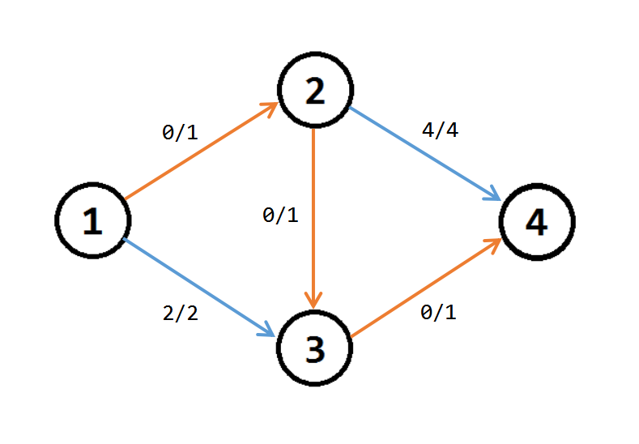
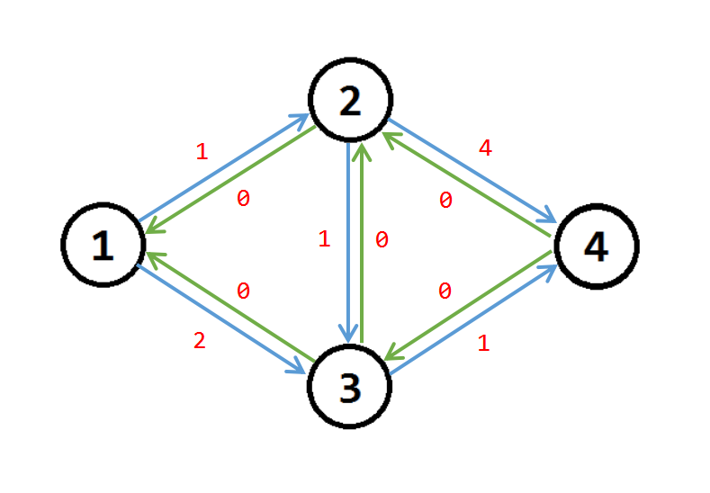
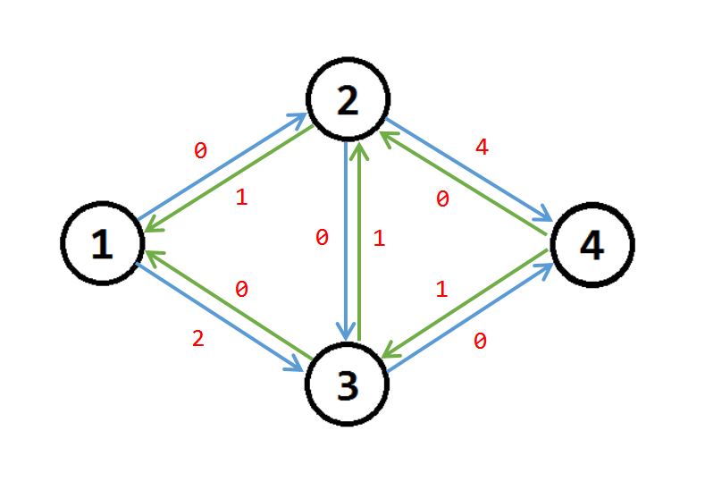
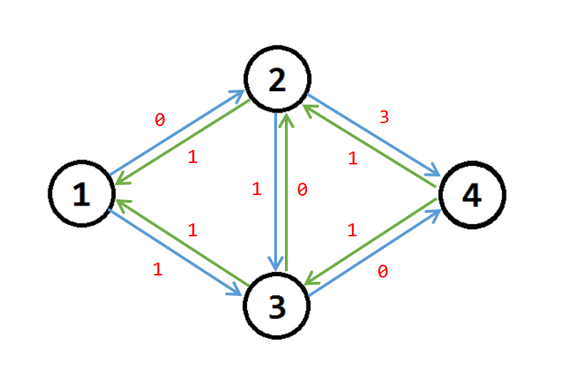
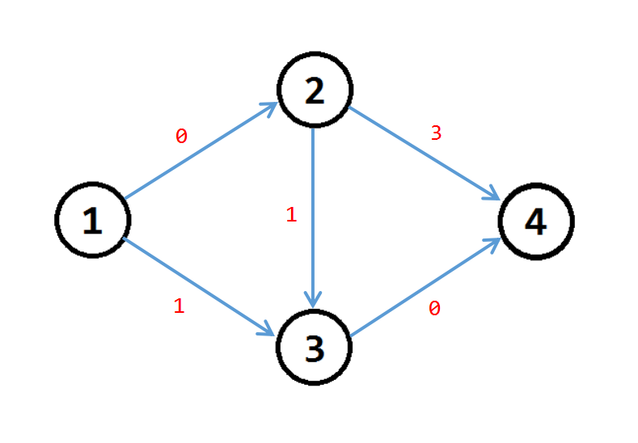
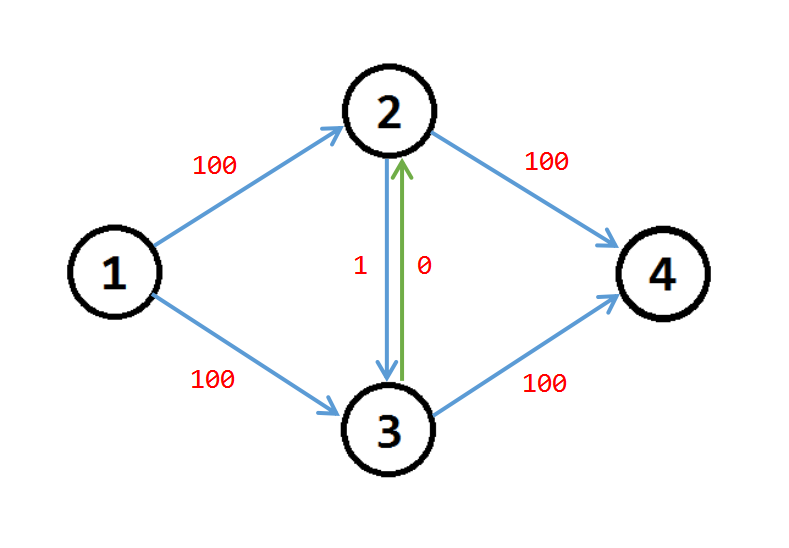

## 概念

### 网络流

网络流是指给定一个有向图，其中有两个特殊的点：**源点** $s$（Source）和**汇点** $t$（Sink）；每条边都有一个指定的流量上限，下文均称之为**容量**（Capacity），即经过这条边的流量不能超过容量，这样的图被称为网络流图。同时，除了源点和汇点外，所有点的入流和出流都相等，源点只有流出的流，汇点只有流入的流，网络流就是从 $s$ 到 $t$ 的一个**可行流**。

### 可行流

定义 $c(u,v)$ 表示边 $(u,v)$ 的容量，$f(u,v)$ 表示边 $(u,v)$ 的流量。如果满足 $0\le f(u,v)\le c(u,v)$，则称 $f(u,v)$ 为边 $(u,v)$ 上的流量。

如果有一组流量满足：源点 $s$ 的流出量等于整个网络的流量，汇点 $t$ 的流入量等于整个网络的流量，除了任意一个不是 $s$ 或 $t$ 的点的总流入量等于总流出量。那么整个网络中的流量被称为一个可行流。

### 最大流

在所有可行流中，最大流指其中流量最大的一个流的流量。

------

## 定义

我们定义（部分定义在上文有涉及）：

- 源点 $s$：只有流出量的点。
- 汇点 $t$：只有流入量的点。
- 容量 $c$：$c(u,v)$ 表示边 $(u,v)$ 上的容量。
- 流量 $f$：$f(u,v)$ 表示边 $(u,v)$ 上的流量。
- 残量 $w$：$w(u,v)$ 表示边 $(u,v)$ 上的残量（显然有 $w(u,v)=c(u,v)-f(u,v)$）。

------

## 性质

### 容量限制

对于任何一条边，都有 $0\le f(u,v)\le c(u,v)$。

### 斜对称性

对于任何一条边，都有 $f(u,v)=-f(v,u)$。即从 $u$ 到 $v$ 的流量一定等于从 $v$ 到 $u$ 的流量的相反数。

### 流守恒性

对于任何一个点 $u$，如果满足 $u\neq s$ 并且 $u\neq t$，那么一定有 $\sum f(u,v)=0$，即 $u$ 到相邻节点的流量之和为 $0$。因为 $u$ 本身不会制造和消耗流量。

------

## 求解

### 増广路

网络流的所有算法都基于**増广路**的思想，接下来首先介绍一下増广路思想。

1. 找到一条从 $s$ 到 $t$ 的路径，使得路径上的每一条边都有 $w(u,v)>0$ 即残量大于 $0$。注意：这里是严格 $>$ 而不是 $\ge$，这意味着这条边还可以**分配流量**。这条路径就被叫做増广路。
2. 找到这条路径上最小的 $w(u,v)$，记为 $flow$。将这条路径上的每一条边的 $w(u,v)$ 减去 $flow$。
3. 重复上述过程，直到找不到増广路为止。

> **注意**：其实上述方法并不是正确的，但这是一个非常重要的分析过程，因此请读者仔细阅读！

我们可以根据这个过程在下面这张图中模拟一遍。


如果我们把每条边的的信息用**残量 / 容量**表示出来，可以得到下图：


假设我们第一次找到的増广路为 $1-2-3-4$，那么我们把这条路径上的边的 $w(u,v)$ 减去 $\min\{f(u,v)\}$ 即 $1$，得到下图：



然后呢……我们发现已经没有増广路了，此时算出来的“最大流”为 $1$！但是我们可以手动计算一下，这张图的最大流其实是 $2$！这个最大流的路径为 $1-2-4$（流量为 $1$）和 $1-3-4$（流量为 $1$）。

因此，我们可以发现这样的过程是错误的。原因就是増广路在一定意义上是**有顺序的**，说白了就是没有给它**反悔**的机会。所以我们要引入**反向边**的概念。

### 反向边

#### 改进

通过上文的分析我们已经知道，当我们在寻找増广路的时候，找到的并不一定是最优解。如果我们对正向边的 $w(u,v)$ 减去 $flow$ 的同时，将对应的反向边的 $w(v,u)$ 加上 $flow$，我们就相当于可以**反悔**从这条边流过。

那么我们可以建立反向边，初始时每条边的 $w(u,v)=c(u,v)$，它的反向边的 $w(v,u)=0$（显然反向边不能有流量，因此残量为 $0$）。

接下来再看一下上面那个例子，我们只用 $w(u,v)$ 来表示每条边（包括反向边）的信息：



接下来开始寻找増广路，假如还是 $1-2-3-4$ 这条路径。

我们需要把 $w(1,2)$，$w(2,3)$，$w(3,4)$ 减少 $1$，同时把反向边的 $w(2,1)$，$w(3,2)$，$w(4,3)$ 增加 $1$。那么可以得到下图：



继续从 $s$ 开始寻找増广路（不需要考虑**边的类型**），显然可以发现路径 $1-3-2-4$，其中 $flow=1$。更新边的信息，得到下图：



此时我们发现没有増广路了，为了直观观察这个网络，我们去掉反向边，显然我们求出的最大流为 $2$！



#### 正确性

当我们第二次増广边 $(2,3)$ 走这条反向边 $(3,2)$ 时，把 $(2,3)$ 和 $(3,2)$ 的流量抵消了，相当于把 $(2,3)$ 这条正向边的流量给**退了回去**使得可以不走 $(2,3)$ 这条边。

如果反向边 $(v,u)$ 的流量不能完全抵消正向边 $(u,v)$，那么意味着从 $u$ 开始还可以流一部分流量到 $v$，这样也是允许的。

#### 小技巧

**如何快速找到反向边？**如果使用邻接表存图，那么可以对边从 $2$ 开始编号，那么下标为 $i$ 的边的反向边就是 $i\ \text{XOR}\ 1$。

### 思路总结

1. 最初这个网络的流量为 $0$，称为**零流**。
2. 找到一条从 $s$ 到 $t$ 的路径，使得路径上的每一条边都有 $w(u,v)>0$ 即残量大于 $0$。注意：这里是严格 $>$ 而不是 $\ge$，这意味着这条边还可以**分配流量**。这条路径就被叫做増广路。
3. 找到这条路径上最小的 $w(u,v)$，记为 $flow$。
4. 将这条路径上的每一条边的 $w(u,v)$ 减去 $flow$，同时将反向边 $(v,u)$ 的 $w(v,u)$ 加上 $flow$。
5. 重复上述过程，直到找不到増广路为止，此时的流量就是最大流。

这个算法基于**増广路定理**（Augmenting Path Theorem）：网络达到最大流当且仅当残留网络中没有増广路。~~然而我不会证明 QAQ~~

------

## 算法

求最大流有若干种算法，此处介绍其中的两种：$\text{Edmonds-Karp}$ 和 $\text{Dinic}$。

### Edmonds-Karp

#### 实现过程

简称 $\text{EK}$ 算法，每次用 $\text{BFS}$ 求出一条増广路径，通过记录每个点的前驱和这条边的编号来记录下这条路径。可以说是对増广路思路的完全模拟。

但是 $\text{EK}$ 在某些情况下会被卡得很慢。假如有下面这张图：



其中 $w(u,v)=1$，其余正向边的 $w(u,v)=100$。如果第一次増广路的策略不恰当，找到了 $1-2-3-4$，那么 $w(2,3)=0$，$w(3,2)=1$。接下来又会找到増广路经 $1-3-2-4$，然后又是 $1-2-3-4$……

然后显然最大流路径就是 $1-2-4$（流量为 $100$）和 $1-3-4$（流量为 $100$），但是如果策略不当，就会这样不断这样増广下去，导致复杂度会爆炸！

#### 复杂度

$\text{EK}$ 算法的时间复杂度为 $O(nm^2)$。我们可以证明最多需要 $O(nm)$ 次増广可以达到最大流，每次増广的复杂度为 $O(m)$。绝大多数情况下这个复杂度都跑不满。

#### 代码

```cpp
#include <cstdio>
#include <cstring>
#include <algorithm>
#include <queue>

const int N=1e4+5,M=2e5+5;
int n,m,s,t,tot=1,lnk[N],ter[M],nxt[M],val[M],pre[N],idx[N];
bool vis[N];

void add(int u,int v,int w) {
	ter[++tot]=v,nxt[tot]=lnk[u],lnk[u]=tot,val[tot]=w;
}
bool bfs(int s,int t) {
	memset(pre,0,sizeof(pre));
	memset(vis,0,sizeof(vis));
	std::queue<int> q;
	q.push(s),vis[s]=1;
	while(!q.empty()) {
		int u=q.front(); q.pop();
		for(int i=lnk[u];i;i=nxt[i]) {
			int v=ter[i];
			if(!vis[v]&&val[i]) {
				pre[v]=u,idx[v]=i,q.push(v),vis[v]=1;
				if(v==t) return 1;
			}
		}
	}
	return 0;
}
int EK(int s,int t) {
	int ans=0;
	while(bfs(s,t)) {
		int mn=1<<30;
		for(int i=t;i!=s;i=pre[i]) mn=std::min(mn,val[idx[i]]);
		for(int i=t;i!=s;i=pre[i]) {
			int x=idx[i];
			val[x]-=mn,val[x^1]+=mn;
		}
		ans+=mn;
	}
	return ans;
}
int main() {
	scanf("%d%d%d%d",&n,&m,&s,&t);
	while(m--) {
		int u,v,w;
		scanf("%d%d%d",&u,&v,&w);
		add(u,v,w),add(v,u,0);
	}
	printf("%d\n",EK(s,t));
	return 0;
}
```

### Dinic

#### 实现过程

我们发现 $\text{EK}$ 在某些情况下会很低效，我们有另一个算法 $\text{Dinic}$。它引入了**分层图**的概念，具体的方法如下：

1. 为了避免走重复的路径，从 $s$ 开始 $\text{BFS}$ 对图**分层**，将整个图分为若干层，其中 $s$ 是第 $1$ 层。如果一条边的残量为 $0$，那么忽略这条无法増广的边。如果 $t$ 的层数不为 $0$，那么意味着存在増广路径。

2. 如果存在増广路，那么从 $s$ 开始进行 $\text{DFS}$ 寻找从源点到汇点的増广路，注意此处増广必须要按照**图的层次**来遍历。每次下传**当前流量** $flow$（初始流量认为是无穷大）。

   设 $dep_i$ 表示 $i$ 的层次，$ans$ 代表当前从 $u$ 可以流的流量，对于当前点 $u$ 相连的点 $v$，如果 $dep_v=dep_u+1$ 并且 $w(u,v)>0$，那么可以増广。此时下传的 $flow$ 应为 $\min(w(u,v),flow-ans)$，其中 $flow-ans$ 代表从 $u$ 还可以流的流量（已经有 $ans$ 的流量从 $v'$ 流出去了）。当 $ans\ge flow$ 时意味着没有可以流的流量了，应该**退出増广**。

   如果该 $\text{DFS}$ 找到的可以増广的流量为 $0$，表示增广失败，跳过这条边。否则将 $w(u,v)$ 减去増广的流量，将 $w(v,u)$ 和 $ans$ 加上相同的值。

   **小剪枝**：如果遍历完所有的 $v$ 后 $ans<flow$，意味着已经从 $u$ 流出了所有可以増广的流量，即 $u$ 已经**满流**了，此时需要将 $dep_u$ 设为 $-1$，防止再次从这个点増广。

#### 优化

$\text{Dinic}$ 算法还有一个优化，被称为**当前弧优化**，即每次 $\text{DFS}$ 増广时不是从 $u$ 出发的第 $1$ 个点开始，而是用一个 $cur$ 数组记录点 $u$ 増广到了哪条边，从这条边开始増广，以此来进一步加速。

#### 复杂度

$\text{Dinic}$ 算法的时间复杂度为 $O(n^2m)$。我们可以证明最多需要建立 $O(n)$ 个层次图，每次建立层次图的复杂度为 $O(m)$。接下来分析 $\text{DFS}$ 的复杂度，每次最多増广 $O(m)$ 次，每次修改流量的复杂度为 $O(n)$，所以 $\text{DFS}$ 的复杂度为 $O(nm)$。再加上 $O(n)$ 个层次图，总复杂度为 $O(n^2m)$。绝大多数情况下这个复杂度都跑不满。

对于 $\text{Dinic}$ 算法的复杂度，有如下 $3$ 种情况：

1. 一般的网络图：$O(n^2m)$
2. 单位容量的图：$O(\min(\sqrt m,n^{\frac{2}{3}})\cdot m)$
3. 二分图：$O(m\sqrt n)$

#### 代码

```cpp
#include <cstdio>
#include <cstring>
#include <algorithm>
#include <queue>

const int N=1e4+5,M=2e5+5;
int n,m,s,t,tot=1,lnk[N],ter[M],nxt[M],val[M],dep[N],cur[N];

void add(int u,int v,int w) {
	ter[++tot]=v,nxt[tot]=lnk[u],lnk[u]=tot,val[tot]=w;
}
void addedge(int u,int v,int w) {
	add(u,v,w),add(v,u,0);
}
int bfs(int s,int t) {
	memset(dep,0,sizeof(dep));
	memcpy(cur,lnk,sizeof(lnk));
	std::queue<int> q;
	q.push(s),dep[s]=1;
	while(!q.empty()) {
		int u=q.front(); q.pop();
		for(int i=lnk[u];i;i=nxt[i]) {
			int v=ter[i];
			if(val[i]&&!dep[v]) q.push(v),dep[v]=dep[u]+1;
		}
	}
	return dep[t];
}
int dfs(int u,int t,int flow) {
	if(u==t) return flow;
	int ans=0;
	for(int &i=cur[u];i&&ans<flow;i=nxt[i]) {
		int v=ter[i];
		if(val[i]&&dep[v]==dep[u]+1) {
			int x=dfs(v,t,std::min(val[i],flow-ans));
			if(x) val[i]-=x,val[i^1]+=x,ans+=x;
		}
	}
	if(ans<flow) dep[u]=-1;
	return ans;
}
int dinic(int s,int t) {
	int ans=0;
	while(bfs(s,t)) {
		int x;
		while((x=dfs(s,t,1<<30))) ans+=x;
	}
	return ans;
}
int main() {
	scanf("%d%d%d%d",&n,&m,&s,&t);
	while(m--) {
		int u,v,w;
		scanf("%d%d%d",&u,&v,&w);
		addedge(u,v,w);
	}
	printf("%d\n",dinic(s,t));
	return 0;
}
```

------

## 习题

- [「Luogu 3376」【模板】网络最大流](https://www.luogu.org/problemnew/show/P3376)
- [「Luogu 4722」【模板】最大流 加强版 / 预流推进](https://www.luogu.org/problemnew/show/P4722)
- [「Luogu 1231」教辅的组成](https://www.luogu.org/problemnew/show/P1231)

------

## 网络流 24 题

- [「Luogu 1251」餐巾计划问题](https://www.luogu.org/problemnew/show/P1251)
- [「Luogu 2754」家园](https://www.luogu.org/problemnew/show/P2754)
- [「Luogu 2756」飞行员配对方案问题](https://www.luogu.org/problemnew/show/P2756)
- [「Luogu 2761」软件补丁问题](https://www.luogu.org/problemnew/show/P2761)
- [「Luogu 2762」太空飞行计划问题](https://www.luogu.org/problemnew/show/P2762)
- [「Luogu 2763」试题库问题](https://www.luogu.org/problemnew/show/P2763)
- [「Luogu 2764」最小路径覆盖问题](https://www.luogu.org/problemnew/show/P2764)
- [「Luogu 2765」魔术球问题](https://www.luogu.org/problemnew/show/P2765)
- [「Luogu 2766」最长不下降子序列问题](https://www.luogu.org/problemnew/show/P2766)
- [「Luogu 2770」航空路线问题](https://www.luogu.org/problemnew/show/P2770)
- [「Luogu 2774」方格取数问题](https://www.luogu.org/problemnew/show/P2774)
- [「Luogu 2775」机器人路径规划问题](https://www.luogu.org/problemnew/show/P2775)
- [「Luogu 3254」圆桌问题](https://www.luogu.org/problemnew/show/P3254)
- [「Luogu 3355」骑士共存问题](https://www.luogu.org/problemnew/show/P3355)
- [「Luogu 3356」火星探险问题](https://www.luogu.org/problemnew/show/P3356)
- [「Luogu 3357」最长k可重线段集问题](https://www.luogu.org/problemnew/show/P3357)
- [「Luogu 3358」最长k可重区间集问题](https://www.luogu.org/problemnew/show/P3358)
- [「Luogu 4009」汽车加油行驶问题](https://www.luogu.org/problemnew/show/P4009)
- [「Luogu 4011」孤岛营救问题](https://www.luogu.org/problemnew/show/P4011)
- [「Luogu 4012」深海机器人问题](https://www.luogu.org/problemnew/show/P4012)
- [「Luogu 4013」数字梯形问题](https://www.luogu.org/problemnew/show/P4013)
- [「Luogu 4014」分配问题](https://www.luogu.org/problemnew/show/P4014)
- [「Luogu 4015」运输问题](https://www.luogu.org/problemnew/show/P4015)
- [「Luogu 4016」负载平衡问题](https://www.luogu.org/problemnew/show/P4016)
