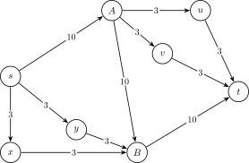

## 概念

### 割

对于一个网络流图 $G=(V,E)$，其割的定义为一种 **点的划分方式**：将所有的点划分为 $S$ 和 $T=V-S$ 两个集合，其中源点 $s\in S$，汇点 $t\in T$．

### 割的容量

我们的定义割 $(S,T)$ 的容量 $c(S,T)$ 表示所有从 $S$ 到 $T$ 的边的容量之和，即 $c(S,T)=\sum_{u\in S,v\in T}c(u,v)$．当然我们也可以用 $c(s,t)$ 表示 $c(S,T)$．

### 最小割

最小割就是求得一个割 $(S,T)$ 使得割的容量 $c(S,T)$ 最小．

## 证明

### 最大流最小割定理

参见 [最大流](max-flow.md) 页面最大流最小割定理一节．

## 代码

### 最小割

通过 **最大流最小割定理**，我们可以直接得到如下代码：

??? note "参考代码"
    ```cpp
    #include <algorithm>
    #include <cstdio>
    #include <cstring>
    #include <queue>
    
    constexpr int N = 1e4 + 5, M = 2e5 + 5;
    int n, m, s, t, tot = 1, lnk[N], ter[M], nxt[M], val[M], dep[N], cur[N];
    
    void add(int u, int v, int w) {
      ter[++tot] = v, nxt[tot] = lnk[u], lnk[u] = tot, val[tot] = w;
    }
    
    void addedge(int u, int v, int w) { add(u, v, w), add(v, u, 0); }
    
    int bfs(int s, int t) {
      memset(dep, 0, sizeof(dep));
      memcpy(cur, lnk, sizeof(lnk));
      std::queue<int> q;
      q.push(s), dep[s] = 1;
      while (!q.empty()) {
        int u = q.front();
        q.pop();
        for (int i = lnk[u]; i; i = nxt[i]) {
          int v = ter[i];
          if (val[i] && !dep[v]) q.push(v), dep[v] = dep[u] + 1;
        }
      }
      return dep[t];
    }
    
    int dfs(int u, int t, int flow) {
      if (u == t) return flow;
      int ans = 0;
      for (int &i = cur[u]; i && ans < flow; i = nxt[i]) {
        int v = ter[i];
        if (val[i] && dep[v] == dep[u] + 1) {
          int x = dfs(v, t, std::min(val[i], flow - ans));
          if (x) val[i] -= x, val[i ^ 1] += x, ans += x;
        }
      }
      if (ans < flow) dep[u] = -1;
      return ans;
    }
    
    int dinic(int s, int t) {
      int ans = 0;
      while (bfs(s, t)) {
        int x;
        while ((x = dfs(s, t, 1 << 30))) ans += x;
      }
      return ans;
    }
    
    int main() {
      scanf("%d%d%d%d", &n, &m, &s, &t);
      while (m--) {
        int u, v, w;
        scanf("%d%d%d", &u, &v, &w);
        addedge(u, v, w);
      }
      printf("%d\n", dinic(s, t));
      return 0;
    }
    ```

### 方案

我们可以通过从源点 $s$ 开始 DFS，每次走残量大于 $0$ 的边，找到所有 $S$ 点集内的点．

```cpp
void dfs(int u) {
  vis[u] = 1;
  for (int i = lnk[u]; i; i = nxt[i]) {
    int v = ter[i];
    if (!vis[v] && val[i]) dfs(v);
  }
}
```

### 割边数量

如果要求割边数量最小的割，直接把所有边的容量设成 $1$，求一遍最小割就好了．如果要求割边数量最小的最小割，那么有两种做法：

1.  将所有边的容量 $c(u,v)$ 更新为 $c(u,v)(|E| + 1) + 1$，在新图上求最小割，就得到原图的最少割边最小割．新图最小割除以 $|E| + 1$ 下取整即原图最小割，余数即割边数量．

    这相当于求以割的大小为第一关键字、割边数量为第二关键字的字典序最小割．因为系数 $|E| + 1$ 严格大于总边数，而割边数量不超过总边数，所以无论割边数量如何，都无法抵消割的大小的影响，求出的一定是原图最小割；在原图最小割的前提下，割边数量最小的将成为新图最小割．

2.  首先求出图的最大流，然后建新图：对 **残量图** 中的每条弧（即没有满流的边的正向弧，以及有流量的边的反向弧）连一条容量为 $\infty$ 的边，对每条满流的边连一条容量为 $1$ 的边，重新跑一遍最小割就可以得到最小割边数量．

    新图最小割的割边一定不包含 $\infty$ 容量边，即没有残量弧从 $S$ 指向 $T$．所以，新图最小割中，原图的前向边都满流，反向边都没有流量，这说明它的容量等于最大流，也一定是原图最小割．反过来，原图任一最小割的前向边都满流，它在新图中的容量就是它的割边数量．所以新图最小割就是原图的最少割边最小割．

    ??? warning "常见错误「只将未满流边容量设为 $\infty$」"
        这种做法有一个常见的错误版本：求出最大流后，将满流边的容量设为 $1$、未满流边的容量设为 $\infty$，直接跑最小割．这种做法似乎符合直觉，但其实是错误的．反例如下图所示．
        
        
        
        如图，最大流为 $16$（即 $s$ 的所有出边都满流），且最大流唯一，只有边 $A\to B$ 未满流．原图任一最小割的割边数量都是 $3$，但按错误版本重设容量后，新图最小割是 $2$，在 $S = \{s,x,y,B\}$ 处取得．这个割的容量是 $20$，并不是原图最小割：它的前向边 $s\to A$、$B\to t$ 虽然都满流，但有流量的边 $A\to B$ 从 $T$ 侧指回了 $S$ 侧，而错误版本没有排除这种情况．正确做法中，$A\to B$ 有流量，于是会连出容量为 $\infty$ 的反向边 $B\to A$，阻止了这个错误最小割的出现．

## 问题模型 1

有 $n$ 个物品和两个集合 $A,B$，如果一个物品没有放入 $A$ 集合会花费 $a_i$，没有放入 $B$ 集合会花费 $b_i$；还有若干个形如 $u_i,v_i,w_i$ 限制条件，表示如果 $u_i$ 和 $v_i$ 同时不在一个集合会花费 $w_i$．每个物品必须且只能属于一个集合，求最小的代价．

这是一个经典的 **二者选其一** 的最小割题目．我们对于每个集合设置源点 $s$ 和汇点 $t$，第 $i$ 个点由 $s$ 连一条容量为 $a_i$ 的边、向 $t$ 连一条容量为 $b_i$ 的边．对于限制条件 $u,v,w$，我们在 $u,v$ 之间连容量为 $w$ 的双向边．

注意到当源点和汇点不相连时，代表这些点都选择了其中一个集合．如果将连向 $s$ 或 $t$ 的边割开，表示不放在 $A$ 或 $B$ 集合，如果把物品之间的边割开，表示这两个物品不放在同一个集合．

最小割就是最小花费．

## 问题模型 2

最大权值闭合图，即给定一张有向图，每个点都有一个权值（可以为正或负或 $0$），你需要选择一个权值和最大的子图，使得子图中每个点的后继都在子图中．

做法：建立超级源点 $s$ 和超级汇点 $t$，若节点 $u$ 权值为正，则 $s$ 向 $u$ 连一条有向边，边权即为该点点权；若节点 $u$ 权值为负，则由 $u$ 向 $t$ 连一条有向边，边权即为该点点权的相反数．原图上所有边权改为 $\infty$．跑网络最大流，将所有正权值之和减去最大流，即为答案．

几个小结论来证明：

1.  每一个符合条件的子图都对应流量网络中的一个割．因为每一个割将网络分为两部分，与 $s$ 相连的那部分满足没有边指向另一部分，于是满足上述条件．这个命题是充要的．
2.  最小割所去除的边必须与 $s$ 和 $t$ 其中一者相连．因为否则边权是 $\infty$，不可能成为最小割．
3.  我们所选择的那部分子图，权值和 $=$ 所有正权值之和 $-$ 我们未选择的正权值点的权值之和 $+$ 我们选择的负权值点的权值之和．当我们不选择一个正权值点时，其与 $s$ 的连边会被断开；当我们选择一个负权值点时，其与 $t$ 的连边会被断开．断开的边的边权之和即为割的容量．于是上述式子转化为：权值和 $=$ 所有正权值之和 $-$ 割的容量．
4.  于是得出结论，最大权值和 $=$ 所有正权值之和 $-$ 最小割 $=$ 所有正权值之和 $-$ 最大流．

## 习题

-   [「USACO 4.4」Pollutant Control](https://www.luogu.com.cn/problem/P1344)
-   [「USACO 5.4」Telecowmunication](https://www.luogu.com.cn/problem/P1345)
-   [「Luogu 1361」小 M 的作物](https://www.luogu.com.cn/problem/P1361)
-   [「SHOI 2007」善意的投票](https://www.luogu.com.cn/problem/P2057)
-   [太空飞行计划问题](https://www.luogu.com.cn/problem/P2762)
