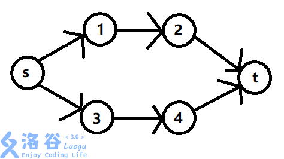

By [hsfzLZH1](https://github.com/hsfzLZH1)

拆点是一种 **[网络流](/graph/flow/)** 建模思想，用来处理 **点权或者点的流量限制** 的问题。这种思路同样可以用于其他的图论算法中（比较经典的有 **分层图** ）

# 例题 经典问题 结点有流量限制的最大流

如果把结点转化成边，那么这个问题就可以套板子解决了。

我们考虑把有流量限制的结点转化成这样一种形式：由两个结点 $u,v$ 和一条边 $<u,v>$ 组成的部分。其中，结点 $u$ 承接所有从原图上其他点的出发到原图上该点的边，结点 $v$ 引出所有从原图上该点出发到达原图上其他点的边。边 $<u,v>$ 的流量限制为原图该点的流量限制，再套板子就可以解决本题。这就是拆点的基本思想。

如果原图是这样：

拆点之后的图是这个样子：

# 例题 [luogu P4568 \[JLOI2011\] 飞行路线](https://www.luogu.org/problemnew/show/P4568)

题目大意：有 $n$ 个结点， $m$ 条边， $k$ 张旅行券，可以使用一张旅行券使得经过该边的边权除以二向下取整，求从结点 $s$ 到 $t$ 的最短路的长度。

当然可以使用 DP 方法解决这道题。我们考虑使用拆点的解法。

将每个结点拆成 $k$ 个点，这样图就可以形象化地看做是 $k$ 层，每层的结点之间连上原来就有的边，边权和原来相等；若图上存在边 $<u,v>$，则在当前层的 $u$ 所对应的结点和更高一层的 $v$ 所对应的结点，连接一条边权为原边权除以二向下取整的边。这样可以保证最多只使用 $k$ 次旅行券，因为每次从较低的一层到上面一层，就相当于是使用了一张旅行券。以最底层的 $s$ 所对应的点跑单元最短路即可。
