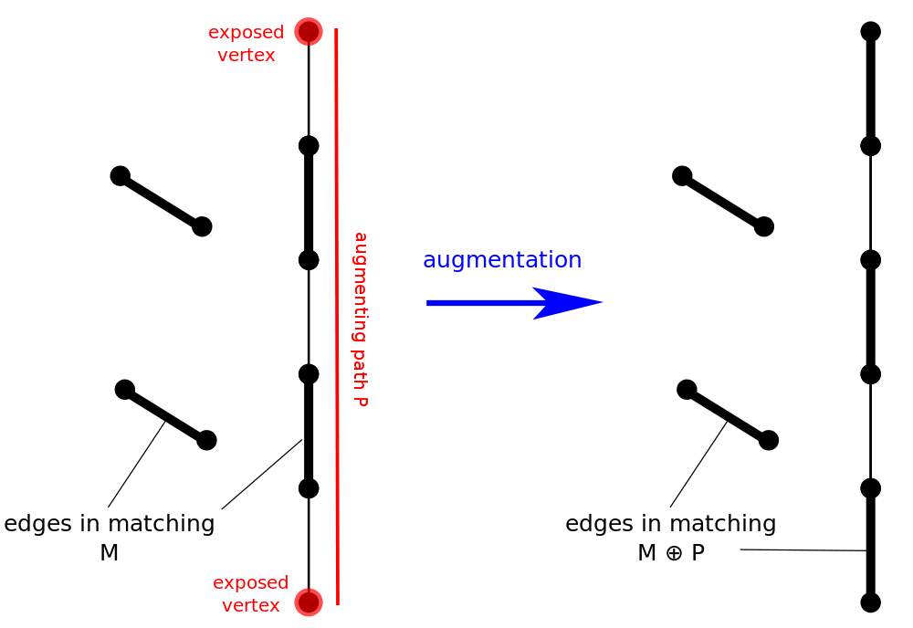
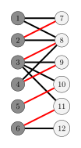
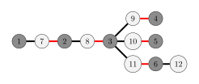

author: accelsao, Chrogeek, t4rf9, yuhuoji

## 增广路定理 Berge's lemma

这是最大匹配的一个重要理论。

### 定义

-   交错路（alternating path）始于非匹配点且由匹配边与非匹配边交错而成。
-   增广路（augmenting path）是始于非匹配点且终于非匹配点（除了起始的点）的交错路。增广路中边的数量是奇数。

增广路上非匹配边比匹配边数量多 1，如果将增广路上的匹配边和未匹配边反转，则匹配数量会增加 1 且依然是交错路。

如上图，匹配数从 2 增加为 3，匈牙利算法中只通过这样的方式增加匹配数量，称为 **增广（Augment）**。

根据 Berge's lemma 当找不到增广路的时候，得到最大匹配。

### 过程

由此定理可知我们求最大匹配的核心思路。

??? 核心思路
    枚举所有未匹配点，找增广路径，直到找不到增广路径。

### 证明

事实上，对于每个点只要枚举一次就好，证明如下：

假设某一轮沿着增广路 $a - b$ 增广后，新增了以未匹配点 $x$ 为起点的增广路 $P_x$，则 $P_x$ 必与 $a - b$ 有公共边（否则 $P_x$ 不可能是因此次增广而新增的）。
在 $P_x$ 与 $a - b$ 取得公共边时，由于 $a - b$ 是交错路，意味着相交点在 $a - b$ 内的两邻边是不同类型的（图中以红和蓝表示）；因而增广前 $x$ 就能走到 $a - b$ 中的某个未匹配点，说明此前已存在从 $x$ 出发的增广路，即已枚举过的未匹配点不再可能作为增广路起点。

## 交错树

从未匹配点 $r$ 进行 DFS 或 BFS 寻找增广路的过程中产生的树称为交错树，$r$ 是交错树的根。设 $T=(V_t,E_t)$ 为再寻找增广路时产生的交错树。定义：

-   偶点（黑点）为树上深度为偶数的点。
-   奇点（白点）为树上深度为奇数的点。

下图展示了一个二分图和从未匹配点 $1$ 开始寻找增广路时，形成的以 $1$ 为根的交错树。

