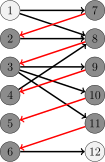
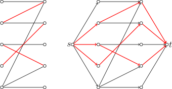
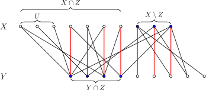

author: accelsao, thallium, Chrogeek, Enter-tainer, ksyx, StudyingFather, H-J-Granger, Henry-ZHR, countercurrent-time, william-song-shy, 5ab-juruo, XiaoQuQuSD, hhc0001

前置知识：[二分图](../bi-graph.md)、[图匹配](./graph-match.md)

## 引入

本文讨论二分图 $G=(X,Y,E)$ 的最大匹配问题。

生活中一个典型的二分图匹配的例子是男女配对。设有若干男生（$X$）和女生（$Y$），每个人只能配对一次，且允许配对的组合已由某个列表（$E$）限定。此时，二分图最大匹配算法的任务就是在这些限制下，找到最多的配对对数，使尽可能多的人成功配对。

???+ info "提示"
    本文假设已知二分图顶点集 $V$ 的一种划分（染色）方式：$V=X\cup Y$。如果事先不清楚二分图的顶点集 $V$ 的划分方法，可以通过 [二分图的染色算法](../bi-graph.md#判定) 在 $O(|V|+|E|)$ 时间内求出这样一个划分。

## Kuhn 算法

Kuhn 算法是 [Berge 引理](./graph-match.md#berge-引理) 的直接应用。它也是 [匈牙利算法](./bigraph-weight-match.md#hungarian-algorithmkuhnmunkres-algorithm) 的一部分。

### 过程

为了求出最大匹配，算法依次枚举所有顶点，求出从它出发的一条增广路，并进行增广。因为增广路的长度总是奇数，所以在二分图中，它的端点必然分别位于左右两个部分。这说明，只需要考虑从左部出发的增广路即可。

为了寻找增广路，可以依据当前的匹配 $M$ 给二分图定向。从左部的未匹配点出发的增广路（或者任何一条交错路）中，只能沿着非匹配边从左部点到达右部点，再沿着匹配边从右部点到达左部点。因此，可以规定所有非匹配边都指向右部点，而所有匹配边都指向左部点。寻找增广路的问题就转换为从某个未匹配的左部点出发，在有向图中寻找一条简单路径通向某个未匹配点。这一问题很容易通过 [DFS](../dfs.md) 或 [BFS](../bfs.md) 在 $O(|E|)$ 时间内解决。



（图中，深色点为匹配点，浅色点为未匹配点，红边为匹配边，黑边为非匹配边，箭头表示当前匹配对应的定向。由图可知，路径 $1\rightarrow 8\rightarrow 3\rightarrow 11\rightarrow 6\rightarrow 12$ 是相对于当前匹配的一条增广路。）

算法开始时，所有边都指向右部点。每次寻找到增广路后，都需要沿着增广路将经过的所有边都反向，以表示它们的匹配状态已经反转。算法结束时，所有指向左部点的边就是匹配边。

因为至多只需要枚举 $O(|V|)$ 个左部点 [各一次](./graph-match.md#berge-引理)，所以，算法总的时间复杂度为 $O(|V||E|)$。

### 优化

有一些简单的技巧，可以优化 Kuhn 算法的常数：

1.  Kuhn 算法基于 Berge 引理，而后者并不要求事先给出二分图的左右部分。因此，即使在左右两部分未明确划分的情况下，Kuhn 算法也能正确运行，只要图本身是二分图。但是，先将二分图染色，确定好它的左部和右部，往往效率更高。
2.  因为上文描述的 Kuhn 算法的时间复杂度实际上是 $O(|X||E|)$ 的，所以，可以选取二分图的两个部分中较小的那个作为左部 $X$。
3.  在寻找增广路时，用于避免重复查找的标记无需每次 DFS 都清空。可以在清空标记前，尝试为所有未匹配的左部点都寻找增广路。在一轮这样的查找中，所有边至多访问一次，复杂度仍然是 $O(|E|)$ 的；但是，在一轮查找中，可能找到多条增广路，因此总的轮数 $k$ 不会超过 $|M|+1$，其中，$M$ 为最大匹配。相应地，算法整体复杂度降低到了 $O(k|E|)$。
4.  寻找增广路时，优先考虑未匹配的右部点，因为这意味着更短的增广路。
5.  因为 Berge 引理并不要求初始匹配为空，所以，Kuhn 算法开始时，可以随机地选取一些互不相交的边作为初始匹配，以减少后续搜索的次数。如果已经应用优化 3，本优化可以忽略。

虽然最差复杂度仍然是 $O(|V||E|)$，但是，充分优化的 Kuhn 算法效率并不差。但是为了避免个别数据将它卡到最差复杂度，在匹配前需要首先随机打乱边或顶点的顺序。

### 参考实现

实现时，不需要真正维护定向，只需要为每个顶点都维护与它相匹配的顶点即可。

??? example " 模板题 [Library Checker - Matching on Bipartite Graph](https://judge.yosupo.jp/problem/bipartitematching)"
    ```cpp
    --8<-- "docs/graph/code/graph-matching/bigraph-match/bigraph-match_1.cpp"
    ```

## Hopcroft–Karp 算法

Hopcroft–Karp 算法进一步优化了 Kuhn 算法查找增广路的过程，将总的轮数降低到了 $O(|V|^{1/2})$，从而获得了 $O(|V|^{1/2}|E|)$ 的时间复杂度。这一算法实际上是 [Dinic 算法](../flow/max-flow.md#dinic-算法) 的一种特殊情形。

### 过程

算法依然是在寻找增广路，但是为了在更少的轮次内完成匹配，算法在每一轮中都采取了如下策略：

1.  将匹配边定向为指向左部点，非匹配边定向为指向右部点。
2.  从所有未匹配的左部点出发，在有向图上进行 BFS，记录每个访问到的顶点所在的层数 $d(v)$，直到某一层出现未匹配的右部点为止。若 BFS 结束仍未找到未匹配的右部点，说明当前匹配已是最大匹配。
3.  依次从每个未匹配的左部点出发进行 DFS，寻找增广路并进行增广。DFS 时沿着满足层数连续且严格递增（即 $d(v') = d(v) + 1$）的边向前扩展，且只访问尚未在本轮 DFS 中访问过的顶点。特别地，DFS 中不会访问到前一步 BFS 中尚未访问到的顶点。

用网络流的术语说，步骤 2 是构造了一个层次图，而步骤 3 则是找到了层次图上的阻塞流。所谓层次图，是指它的每条边都必然从这一层指向下一层；而所谓阻塞流，在当前语境下，就是指一组极大的、两两之间没有公共顶点的增广路。步骤 3 得到的这一组增广路必然是极大的：假设不然，存在一条新的增广路，那么在当初枚举到它的起点时，就应当已经找到这样一条路。

比起前文的 Kuhn 算法，Hopcroft–Karp 算法最关键的改变就是在求阻塞流之前，添加了求层次图这一步骤。基于层次图进行 DFS，相当于限制了算法总是沿着最短路径到达各个顶点。这样做的好处是，在算法的不同轮次间，算法找到的增广路的长度是严格递增的。而且，可以证明的是，直到求出最大匹配为止，增广路的长度至多增加 $3|M|^{1/2}$ 次，其中，$|M|$ 为最大匹配的大小。所以，这就将总的增广的轮次控制在 $O(|M|^{1/2})$，进而得到 $O(|M|^{1/2}|E|)$ 的时间复杂度。由于 $2|M|\leqslant |V|$，所以，时间复杂度也可以写成更宽松的上界 $O(|V|^{1/2}|E|)$。

??? note "证明"
    首先说明，在算法的不同轮次之间，算法找到的增广路的长度是严格递增的。
    
    假设当前轮次的 BFS 中，顶点向前延伸了 $\ell$ 层，那么，因为 BFS 中找到的未匹配的右部点都位于同一层，所以本轮 DFS 能够找到的所有增广路的长度就都是 $\ell$。需要证明的是，沿着本轮找到的这组增广路 $\{P_i\}$ 增广结束后，重新定向得到的有向图中，将不再存在长度不超过 $\ell$ 的增广路。
    
    实际上，如果 $P$ 是相对于 $M$ 的最短的增广路，而 $P'$ 是相对于 $M\oplus P$ 的增广路，都有 $|P'|\geqslant |P| + 2|P\cap P'|$ 成立。这是因为 $N=(M\oplus P)\oplus P'$ 相对于 $M$ 增广了两次，故而类似 [Berge 引理的证明](./graph-match.md#berge-引理)，可以说明对称差 $M\oplus N=P\oplus P'$ 中至少包含两条相对于 $M$ 的不交的增广路 $P_1$ 和 $P_2$。由于 $P$ 的最短性，有
    
    $$
    2|P|\leqslant |P_1|+|P_2|\leqslant |P\oplus P'| = |P| + |P'| - 2|P\cap P'|.
    $$
    
    这就说明 $|P'|\geqslant |P| + 2|P\cap P'|$。因此，如果添加完增广路 $\{P_i\}$ 之后，新的增广路 $P'$ 仍然和它们一样长，就必然与它两两不交，这与 $\{P_i\}$ 的极大性相矛盾。这一矛盾说明，增广完阻塞流后，新的增广路一定严格更长。
    
    最后，需要说明，增广路的长度至多增加 $3|M|^{1/2}$ 次。
    
    记 $p=\lfloor|M|^{1/2}\rfloor$。在前 $p$ 个轮次结束后，剩下的增广路的长度至少是 $|M|^{1/2}$。设当前匹配为 $M_p$，那么，与前文情形类似，可以说明图 $(V,M\oplus M_p)$ 中有 $|M|-|M_p|$ 条两两之间没有公共顶点的相对于 $M_p$ 的增广路。每条增广路至少用到 $|M|^{1/2}/2$ 条 $M$ 中的匹配边，因此，这些增广路的总数不会超过 $2|M|^{1/2}$，也就是说，$|M|-|M_p|\leqslant 2|M|^{1/2}$。这说明从 $M_p$ 开始，至多只能再增广 $2|M|^{1/2}$ 次，这同样意味着算法至多再进行 $2|M|^{1/2}$ 轮增广。所以，增广路的长度总共至多增加 $3|M|^{1/2}$ 次。

这仅仅是对 Hopcroft–Karp 算法的最差复杂度的估计。实际上，在随机图中，Hopcroft–Karp 算法的时间复杂度有很大概率是 $O(|E|\log |V|)$ 的[^hk-comp-ref]。

### 优化

在建立层次图时，和一般的 Dinic 算法一样，Hopcroft–Karp 算法在到达未匹配的右部点时就终止。但是，仅仅就二分图匹配问题来说，这样做是没有必要的。而且，因为 BFS 过早终止，限制了后续 DFS 的范围，会导致每轮找到的增广路数目有限，从而拖慢整体匹配效率。在有些图上，它的效率甚至不如经过优化的 Kuhn 算法。所以，一个简单的改进是，不提前终止 BFS，而是为所有可以到达的顶点建立层次图。

??? note "正确性证明"
    在优化后的算法中，阻塞流中增广路的长度将不再相同，因此，前文中关于复杂度的证明也不再成立。但是，可以说明的是，通过为算法的每个轮次建立辅助图，同样可以建立最短增广路长度严格递增的结论，进而保证最差复杂度依然是正确的。
    
    设二分图为 $G=(X,Y,E)$，当前的匹配为 $M$。设通过 BFS 可以访问到的未匹配的右部点的集合为 $W\subseteq Y$，且到达 $y\in W$ 的最短的增广路的长度为 $d(y)$。记 $d_\text{max} = \max_{y\in W}d(y)$，那么，对于每个 $y\in W$，都可以新建一条从 $y$ 开始且长度为 $d_\text{max} - d(y)$ 的链，并将新建的顶点依次标记为左部点和右部点，将新建的边依次标记为匹配边和非匹配边。设这样得到的图为 $G'=(X',Y',E')$，匹配为 $M'$，最短增广路的长度为 $d_\text{max}$。那么，图 $G$ 中沿着层次图能够找到的相对于 $M$ 的增广路——也就是那些到达相应顶点的最短的增广路——与图 $G'$ 中相对于 $M'$ 的全局最短的增广路之间存在双射。因此，在图 $G$ 的层次图中找到阻塞流并进行增广，就相当于在图 $G'$ 的层次图中找到阻塞流并进行增广。按照前文的证明，增广后，图 $G'$ 中将不再存在长度为 $d_\text{max}$ 的增广路。所以，图 $G$ 中也不再存在长度为 $d_\text{min}=\min_{y\in W} d(y)$ 的增广路：因为这样的增广路通过新延长的交错路，必然对应着一条图 $G'$ 中长度为 $d_\text{max}$ 的增广路。这样就再次得到了算法的不同轮次间，最短增广路的长度严格递增的结论。因此，整体复杂度也仍然是 $O(|M|^{1/2}|E|)$ 的。

### 参考实现

??? example " 模板题 [Library Checker - Matching on Bipartite Graph](https://judge.yosupo.jp/problem/bipartitematching)"
    ```cpp
    --8<-- "docs/graph/code/graph-matching/bigraph-match/bigraph-match_2.cpp"
    ```

## 归约为最大流问题

二分图最大匹配问题可以归约为最大流问题。



如图所示，添加两个顶点分别作为源点和汇点。从源点出发，向每个左部点连接一条边；从每个右部点出发，向汇点连接一条边；并为二分图中的每条无向边，都连接一条从左部点指向右部点的边。所有边的容量都是 $1$。这样得到的有向图中的每个网络流，都和二分图中的一组匹配一一对应，且网络流的容量就是相应的匹配的大小。因此，求解二分图最大匹配，就相当于求解相应的有向图中的最大流。

任何可以解决最大流问题的算法都可以用于解决二分图最大匹配问题。容易发现，Kuhn 算法和 Hopcroft–Karp 算法都是最大流问题中相应算法的特例。同样地，[预流推进算法](../flow/max-flow.md#push-relabel-预流推进算法) 等同样可以用于解决二分图最大匹配问题。但是，应当注意的是，任何最大流算法，在应用于二分图最大匹配问题时，都需要有针对性地进行相应的优化，以避免过大的常数。

### 线性规划形式

和其他最大流问题一样，二分图 $G=(V,E)$ 的最大匹配问题可以写作线性规划问题。如果用 $x_e\in\{0,1\}$ 表示边 $e$ 是否属于匹配，那么，可以得到如下的线性规划问题：

$$
\begin{aligned}
\max_{\{x_e\}}\;& \sum_{e\in E}x_e \\
\text{subject to } & \sum_{e\sim v} x_{e} \leqslant 1,~\forall v\in V,\\
& x_e\geqslant 0,~\forall e\in E.
\end{aligned}
$$

其中，$e\sim v$ 表示关联关系，即顶点 $v$ 是边 $e$ 的端点之一。除了非负限制之外，问题的约束还要求每个顶点 $v\in V$ 处至多与一条边关联，这正是匹配的定义。因此，所有的匹配都对应于该线性规划可行域中的某些整点。

反过来却不然。在可行解中，$x_e$ 可能是小数，这并不代表任何实际的匹配。尽管如此，对于二分图 $G$，上述线性规划的所有极点解都是整点。这意味着，目标函数的最优值总能在整点处取得，而无需考虑非整数的情形。这一性质对一般图并不成立，因此，上述线性规划在一般图中并不等价于最大匹配问题。

这一线性规划问题的对偶问题可以写作如下形式：

$$
\begin{aligned}
\min_{\{y_v\}}\;& \sum_{v\in V}y_v \\
\text{subject to } & y_u+y_v \geqslant 1,~\forall (u,v)\in E,\\
& y_v\geqslant 0,~\forall v\in V.
\end{aligned}
$$

马上就会看到，这正是二分图的最小点覆盖问题。

## 相关问题

利用二分图最大匹配的算法，可以解决其它组合优化问题。

### 二分图最小点覆盖

最小点覆盖问题是指，在一张无向图中选择最少的顶点，满足每条边至少有一个端点被选。

一般图的最小点覆盖问题是 NP 困难的，但是对于二分图，Kőnig 定理说明它可以归约为最大匹配问题，从而高效求解。定理的证明同时也给出了最小点覆盖的构造。

???+ note "Kőnig 定理"
    二分图中，最小点覆盖中的顶点数量等于最大匹配中的边数量。

??? note "证明"
    设二分图 $G=(X,Y,E)$ 的一个最大匹配为 $M$。设图 $G$ 中可以由未匹配的左部点 $U$ 出发，沿着某条交错路到达的顶点集合为 $Z$。于是，顶点集合 $C=(X\setminus Z)\cup(Y\cap Z)$ 就是所求的最小点覆盖。
    
    
    
    首先，集合 $C$ 是点覆盖。假设不然，存在边 $(u,v)\in E$ 使得 $u\in X\cap Z$ 且 $v\in Y\setminus Z$。设 $P_u$ 是到达 $u$ 的一条交错路。如果边 $(u,v)$ 是匹配边，那么，路径 $P_u$ 中的最后一条边就是 $(v,u)$，这与 $v\notin Z$ 矛盾；如果边 $(u,v)$ 不是匹配边，那么，可以沿着边 $(u,v)$ 延长 $P_u$ 得到一条到达 $v$ 的交错路，同样与 $v\notin Z$ 矛盾。这些矛盾说明所有边都至少包含一个 $C$ 中的端点，所以 $C$ 是点覆盖。
    
    然后，需要说明 $C$ 是最小点覆盖。为了覆盖最大匹配 $M$ 的所有边，任何点覆盖都至少需要 $|M|$ 个顶点。因此，只需要证明 $|C|=|M|$，它就一定是最小点覆盖。这等价于证明，除了包含每条匹配边各一个端点之外，$C$ 再不包含其它顶点；也就是说，$C$ 不包含未匹配点。假设不然，存在未匹配点 $v\in C$。如果 $v\in X$，就一定有 $v\in U\subseteq Z$，这与 $C$ 的构造矛盾；如果 $v\in Y$，那么，到达 $v$ 的一条交错路是相对于 $M$ 的一条增广路，由 Berge 引理，这与 $M$ 是最大匹配矛盾。这些矛盾说明不存在这样的未匹配点，进而 $C$ 是最小点覆盖。

从网络流的角度看，最小点覆盖问题就是最小割问题：选择左部点，相当于切割它与源点的连边；选择右部点，相当于切割它与汇点的连边。从线性规划的角度看，最小点覆盖问题就是最大匹配问题的对偶问题。因此，König 定理可以看作是 [最大流最小割定理](../flow/max-flow.md#最大流最小割定理) 的特殊情形，或者更一般地，线性规划的强对偶定理的特殊情形。

### 二分图最大独立集

最大独立集问题是指，在一张无向图中选择最多的顶点，满足两两之间互不相邻。

对于一般图，成立如下定理：

???+ note "定理"
    图 $G=(V,E)$ 中，点集 $C\subseteq V$ 是点覆盖，当且仅当它的补集 $V\setminus C$ 是独立集。

??? note "证明"
    点集 $C$ 是点覆盖，当且仅当 $E$ 中任何一条边 $e$ 的两个端点至少有一个出现在集合 $C$ 中，当且仅当 $E$ 中没有一条边的两个端点都出现在集合 $V\setminus C$ 中，当且仅当，$V\setminus C$ 是独立集。

???+ note "推论"
    图 $G=(V,E)$ 中，最小点覆盖与最大独立集的大小之和等于顶点数目。

因此，与最小点覆盖问题一样，最大独立集问题对于一般图是 NP 困难的，但是对于二分图它可以归约为最大匹配问题，从而高效求解。

### 有向无环图最小路径覆盖

最小路径覆盖问题是指，在一张有向图中，选择最少数量的简单路径，使得所有顶点都恰好出现在一条路径中。

一般的有向图上的最小路径覆盖问题是 NP 困难的，但是对于有向无环图，该问题可以归约为二分图最大匹配问题。对于有向无环图 $G=(V,E)$，可以二分图 $G'=(V^\text{in},V^\text{out},E')$ 如下：

-   为每个顶点 $v\in V$，分别建立一个入点 $v^\text{in}$ 和一个出点 $v^\text{out}$。设全体入点和出点的集合分别为 $V^\text{in}$ 和 $V^\text{out}$。它们分别成为新图的左部和右部。
-   为每条有向边 $(u,v)\in E$，建立无向边 $(u^\text{out},v^\text{in})$。全体无向边的集合就是 $E'$。

为此，有如下结论：

???+ note "定理"
    有向无环图 $G=(V,E)$ 的最小路径覆盖与相应的二分图 $G'=(V^\text{in},V^\text{out},E')$ 的最大匹配的大小之和等于顶点数量。

??? note "证明"
    二分图 $G'$ 的每个匹配 $M'$，都对应着图 $G$ 的一张子图 $F$，且子图 $F$ 中每个顶点的入度和出度都至多为一，也就是说，子图 $F$ 实际上是有向图 $G$ 中若干互不相交的路径或环的集合。但是，已经假设 $G$ 中不存在环路，所以 $F$ 只包含若干不交的路径。反过来，对于每个这样的子图 $F$，都能构造出相应的匹配。因为匹配 $M$ 的大小，就是顶点数量与 $F$ 中路径数量的差值，所以，图 $G$ 的最小路径覆盖问题，就对应着图 $G'$ 的最大匹配问题。

证明是构造性的，因此，很容易根据得到的最大匹配构造出相应的最小路径覆盖。而且，这个构造说明，对于一般的有向图，这个归约不再成立，正是因为二分图中的匹配可能对应着有向图中的环。

特别地，对于集合 $X$ 和它上面的偏序关系 $P$，可以建立有向无环图 $G=(X,P)$。此时，根据 [Dilworth 定理](../../math/order-theory.md#dilworth-定理与-mirsky-定理)，图 $G$ 的最小路径覆盖的大小，就等于它的最长反链的长度，也就是偏序集 $(X,P)$ 的宽度。因此，本节实际上给出了任意偏序集的宽度的高效计算方法。

## 例题

应用二分图匹配的难点在于建图，本节通过一些例题展示建图的技巧。

???+ note "[Luogu P1129 矩阵游戏](https://www.luogu.com.cn/problem/P1129)"
    有一个 01 方阵，每一次可以交换两行或两列，问是否可以交换使得主对角线（左上到右下）全都是 1。
    
    ??? note "解法"
        注意到，当存在 $n$ 个 $1$，使得这些 $1$ 不在同一行、同一列，那么必然有解，否则必然无解。问题转化成了能否找到这 $n$ 个 $1$。
        
        考虑对于一个 $1$ 而言，最终的方案中选了这个 $1$ 代表这个 $1$ 的行、列被占用。于是可以建出一个 $n$ 个左部点、$n$ 个右部点的二分图，其中对于某个为 $1$ 的元素，我们建一条连接它的行的左部点和它的列的右部点。于是就可以二分图匹配了。
    
    ??? note "代码"
        ```cpp
        --8<-- "docs/graph/code/graph-matching/bigraph-match/bigraph-match_3.cpp"
        ```

???+ note "[Gym 104427B Lawyers](https://codeforces.com/gym/104427/problem/B)"
    有 $n$ 个律师，都被指控有欺诈罪。于是，他们需要互相辩护，确保每一名律师都被释放。这 $n$ 个律师有 $m$ 对信任关系，一个信任关系 $(a, b)$ 表示 $a$ 可以为 $b$ 辩护。任何一个受到辩护的律师都会被无罪释放，除了一个例外：如果 $a$ 和 $b$ 互相辩护，他们都会被判有罪。
    
    求是否可以使得每一名律师都被释放。
    
    ??? note "解法"
        对于每一个 **无序对** $(a, b)$，当 $a$ 可以辩护 $b$，连这个无序对向 $a$ 的边，反之亦然。
        
        只保存有边相连的 $(a, b)$，问题被转化成了一个 $m$ 个左部点、$n$ 个右部点的二分图最大匹配。
    
    ??? note "代码"
        ```cpp
        --8<-- "docs/graph/code/graph-matching/bigraph-match/bigraph-match_4.cpp"
        ```

???+ note "[Codeforces 1404E Bricks](https://codeforces.com/problemset/problem/1404/E)"
    用一些 $1 \times x$ 的砖精确覆盖一个 $n \times m$ 的网格，砖可以旋转，其中有一些格子不能覆盖。
    
    ??? note "解法"
        考虑最终的方案是如何构成的：
        
        先在所有能覆盖的网格上全部铺上 $1 \times 1$ 的砖。对于一个 $1 \times x$ 的砖，可以由同一行的 $x$ 个连续的 $1 \times 1$ 砖依次「行合并」形成。同理，对于一个 $x \times 1$ 的砖。可以由同一列的 $x$ 个连续的 $1 \times 1$ 砖依次「列合并」形成。
        
        显然，一次行合并和一次列合并不能干涉到同一个砖，而且合并的次数越多，砖块数量越少。于是，可以以行合并作为左部点，列合并作为右部点，以前面的冲突作为边，建出一个二分图。随即原问题变成了一个二分图最大独立集问题。
    
    ??? note "代码"
        ```cpp
        --8<-- "docs/graph/code/graph-matching/bigraph-match/bigraph-match_5.cpp"
        ```

???+ note "[Codeforces 1139E - Maximize Mex](https://codeforces.com/problemset/problem/1139/E)"
    有 $m$ 个共有 $n$ 个元素的可重集，每一次从某一个可重集里面删除一个元素，然后查询「在每一个可重集里面选至多一个元素，可以达到的最大 $\operatorname{mex}$」。
    
    ??? note "解法"
        先考虑如果没有删除元素时怎么做。
        
        对于每一个多重集，开一个新点；对于每一个可能的答案，开一个新点。然后，对于某一个对应点 $l_i$ 的多重集的一个元素 $a$，连一条 $l_i$ 至 $r_a$ 的边。此时这个弱化版本变成了一个二分图最大匹配。
        
        现在加回来删除元素的操作，发现根本搞不了：删了一条边可能引起匹配的巨变，复杂度无法接受。于是，不如反过来，我们每一次加一条边，然后顺过去重新增广。所以本题只能使用 Kuhn 算法。
    
    ??? note "代码"
        ```cpp
        --8<-- "docs/graph/code/graph-matching/bigraph-match/bigraph-match_6.cpp"
        ```

???+ note "[Luogu P3355 - 骑士共存问题](https://www.luogu.com.cn/problem/P3355)"
    有一个 $n \times n$ 的国际象棋棋盘，其中一些位置不能放棋子，问最多可以放多少个马使得这些马不会互相攻击。
    
    ??? note "解法"
        可以发现，如果对整个棋盘染色使得所有黑格、白格均不相邻，那么马只能够攻击到与其异色的格子。
        
        然后就可以直接二分图最大独立集了。
    
    ??? note "代码"
        ```cpp
        --8<-- "docs/graph/code/graph-matching/bigraph-match/bigraph-match_7.cpp"
        ```

## 习题

-   [Codeforces 1765A - Access Levels](https://codeforces.com/problemset/problem/1765/A)
-   [AtCoder abc274G - Security Camera 3](https://atcoder.jp/contests/abc274/tasks/abc274_g)
-   [Codeforces 1773D - Dominoes](https://codeforces.com/problemset/problem/1773/D)
-   [Luogu P5030 - 长脖子鹿放置](https://www.luogu.com.cn/problem/P5030)
-   [Luogu P2071 - 座位安排](https://www.luogu.com.cn/problem/P2071)
-   [LibreOJ 6002 - 最小路径覆盖](https://loj.ac/p/6002)

## 参考资料

-   [Kuhn's Algorithm - Maximum Bipartite Matching](https://cp-algorithms.com/graph/kuhn_maximum_bipartite_matching.html)
-   [二分图最大匹配的 König 定理及其证明](https://matrix67.com/blog/archives/116)
-   [Implementing Dinitz on bipartite graphs by adamant - Codeforces blogs](https://codeforces.com/blog/entry/118098)
-   Bondy, John Adrian, and Uppaluri Siva Ramachandra Murty. Graph theory with applications. Vol. 290. London: Macmillan, 1976.

[^hk-comp-ref]: Bast, Holger; Mehlhorn, Kurt; Schäfer, Guido; Tamaki, Hisao (2006), "Matching algorithms are fast in sparse random graphs", Theory of Computing Systems, 39 (1): 3–14.
