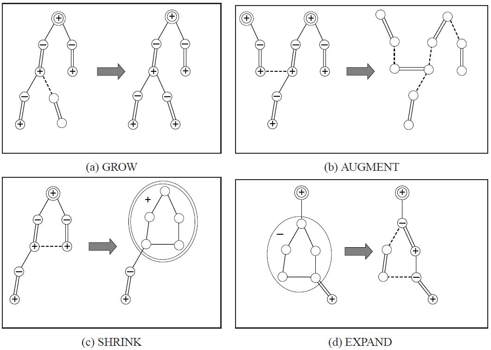

author: accelsao, Henry-ZHR, yuhuoji

本页从一般图最大权完美匹配到一般图最大权匹配（最大权匹配可以通过增加零边变成最大权完美匹配）。

## 预备知识

### 花（blossom）

一般图匹配和二分图匹配不同的是，图可能存在奇环。可以将偶环视为二分图。

带花树算法（Blossom Algorithm）的处理方式时是遇到奇环就把它缩成一个 **花（Blossom）**，并把花中所有的点设为偶点。既然花上的点都可以成为偶点，那么可以把整个花直接缩成一个偶点。注意，一个花可以包含其它花。

这也可以变成线性规划和对偶问题，但是要对花进行一些处理。

### 顶标（vertex labeling）和等边（Equality Edge）

定义 $z_u$ 是点 $u$ 的顶标（vertex labeling），与 $KM$ 算法中定义的顶标含义相同。定义边 $e(u,v)$ 为 "等边" 当且仅当点 $u$ 和点 $v$ 的标号和等于边 $e$ 的权值（$z_u + z_v = w(e)$），此时边的标号 $z_e = z_u + z_v − w(e) = 0$。

## 一般图最大权完美匹配的线性规划

### 定义

因为一朵花最少有三个点，缩花后成为一个点。设 $O$ 为大小为 $≥3$ 奇数的集合的集合（包含所有花），$\gamma(S)$ 表示 $S$ 集合中的边。

$$
\begin{aligned}
& \text{设} S\subseteq V \\
& \gamma(S)=\{(u,v)\in E:u\in S,v\in S\} \\
& O=\{B\subseteq V:|B|\text{是奇数且}|B|\geq3\} \\
\end{aligned}
$$

### 对偶问题

???+ note "原问题"
    $$
    \begin{aligned}
    & \max\sum_{e\in E}w(e)x_e \\
    & \text{限制：} \\
    & x(\delta(u))=1:\forall u\in V \\
    & x(\gamma(B))\leq\lfloor\frac{|B|}{2}\rfloor:\forall B\in O \\
    & x_e\geq0:\forall e\in E \\
    \end{aligned}
    $$

然后通过原始对偶（Primal-Dual）将问题转换为对偶问题。

???+ note "对偶问题"
    $$
    \begin{aligned}
    & \min\sum_{u\in V}z_u+\sum_{B\in O}\left\lfloor\frac{|B|}{2}\right\rfloor z_B \\
    & \text{限制：} \\
    & z_B\geq0:\forall B\in O \\
    & z_e\geq0:\forall e\in E \\
    & \text{设} e=(u,v)，\text{这里} \\
    & \begin{array}{lll}
    z_e & = & z_u + z_v - w(e) + \sum_{\substack{B \in O \\ u,v \in \gamma(B)}} z_B
    \end{array}
    \end{aligned}
    $$

$x_e=1$ 的边是匹配边，$x_e=0$ 的边是非匹配边。和二分图一样，我们必须满足 $x_e\in\{0,1\}:\forall e\in E$。因此必须在最大权完美匹配的时候，让所有匹配边都是 **等边** 的。

和二分图不同的是，一般图多了 $z_B$ 要处理。下面考虑 $z_B$ 什么时候大于 $0$。

可以看出，尽量使 $z_B=0$ 是最好的做法，但在不得已时还是要让 $z_B>0$。在 $x(\gamma(B)) = \left\lfloor \dfrac{|B|}2 \right\rfloor \text{且} x(\delta(B)) = 1$ 时，让 $z_B>0$ 即可。因为除了在这种情况下，$z_B>0$ 是无意义的。

根据互补松弛条件，有以下的对应关系：

-   对于选中的边 $e$，必有 $z_e=0$。

    $$
    x_e>0 \longrightarrow z_e=0,\quad \forall e\in E
    $$

-   对于选中的集合*B*，$z_B>0 \longrightarrow x(\gamma(B))= \left\lfloor \dfrac{|B|}2 \right\rfloor$，即所有 $z_B>0$ 的集合 $B$，都被选了集合大小一半的边，也即集合 $B$ 是一朵花，选中花中的一条边进行增广。同时，我们加入一个条件：$x(\delta(B))=1$，即只有花 $B$ 向外连了一条边的时候，$z_B>0$ 才是有意义的。

    $$
    z_B>0 \longrightarrow x(\gamma(B))=\left\lfloor\frac{|B|}2\right\rfloor, x(\delta(B))=1\quad \forall B\in O
    $$

以「**等边**」的概念，结合之前的带花树算法：用「等边」构成的增广路不断进行扩充，由于用来扩充的边全是「等边」，最后得到的最大权完美匹配仍然全是「等边」。

### 处理花的问题

当遇到花的时候，要将它缩成一个偶点。将花中所有点都设为偶点，并让它的 $z_B=0$。

由于缩花后会把花保存起来，直到满足某些条件才会拆开，所以不能用之前的方法记录花。

如果没有特殊说明，之前提到的点，都包含缩花形成的偶点。

由于花也有可能缩成点被加入队列中，并且花的数量是不固定的，因此不能像之前一样枚举每个点来检查是否有增广路。因此，在进行广度优先搜索（BFS）时，必须将所有未匹配的点都放入队列中。

这样会同时产生很多棵交错树。

### 算法的四个步骤

这个算法可以分成四个步骤。

1.  GROW（等边）：用 "等边" 构成交错树。
2.  AUGMENT（增广）：找出增广路并扩充匹配。
3.  SHRINK（缩花）：把花缩成一个点。
4.  EXPAND（展开）：把花拆开。



在 AUGMENT 阶段时，因为所有未匹配点都会在不同的交错树上，所以当增广时两棵交错树的偶点连在一起，就表示找到了一条增广路。

### 找不到等边扩充

和二分图一样，也会有找不到「等边」扩充的问题。这时就需要调整 vertex labeling。

### 调整 VERTEX LABELING

vertex labeling 仍要维持大于等于的性质，而且既有的「等边」不能被改变，还要让 $z_B$ 尽量的小。

???+ note "定义符号 奇偶点"
    以 $u^−$ 来表示 $u$ 在交错树上为奇点。  
    以 $u^+$ 来表示 $u$ 在交错树上为偶点。  
    以 $u^\varnothing$ 来表示 $u$ 不在任何一棵交错树上。  
    之后所有提到的 $B$ 预设都是花，并同时代表缩花之后的点。  
    花也可以有奇花偶花之分，因此也适用 $B^+$、$B^−$、$B^\varnothing$ 等符号。

设目前有 r 棵交错树 $T_i=(U_{t_i},V_{t_i}):1\leq i\leq r$，令

$$
\begin{aligned}
d1 &= \min(\{z_e : e = (u^+,v^\varnothing)\}) \\
d2 &= \min(\{z_e : e = (u^+,v^+), ~ u^+ \in T_i, ~ v^+ \in T_j, ~ i \neq j\}) / 2 \\
d3 &= \min(\{z_{B^-} : B^- \in O\}) / 2
\end{aligned}
$$

注意这里*B*是缩花之后的点，所以可以有奇偶性。

设 $d=min(d1,d2,d3)$，让

$$
\begin{aligned}
z_{u^+} - &= d \\
z_{v^-} + &= d \\
z_{B^+} + &= 2d \\
z_{B^-} - &= 2d \\
\end{aligned}
$$

如果出现 $z_B=0(d=d3)$，为了防止 $z_B<0$ 的情况，所以要把这朵花拆了 (EXPAND)。
拆花后只留下花里的交替路径，并把花里不在交替路径上的点设为未走访 ($\varnothing$)。

如此便制造了一条（以上）的等边，既有等边保持不动，并维持了 $z_e\geq0:\forall e\in E$ 的性质，且最低限度增加了 $z_B$，可以继续找增广路了。

## 一般图最大权匹配

以上求的是最大权完美匹配，求最大权匹配需要在 vertex labeling 额外增加一个限制：对于所有匹配点 $u$，$z_u>0$。

开始时先设所有的 $z_u=max(\{w(e):e\in E\})/2$。

vertex labeling 为 $0$ 的点最后将成为未匹配点。

### 参考代码

这里为了方便实现，使用边权乘 $2$ 来计算 $z_e$ 的值，这样就不会出现浮点数误差了。

???+ note "存储"
    ```c++
    #define INF INT_MAX
    #define MAXN 400
    
    struct edge {
      int u, v, w;
    
      // 表示(u,v)为一条边其权重为w
      edge() {}
    
      edge(int u, int v, int w) : u(u), v(v), w(w) {}
    };
    
    int n, n_x;
    // 有n个点，编号为 1 ~ n
    // n_x表示当前点加上花的数量，编号从n+1到n_x为花的节点
    edge g[MAXN * 2 + 1][MAXN * 2 + 1];
    // 图用邻接矩阵存储，因为最多有n-1朵花，所以大小为MAXN*
    vector<int> flower[MAXN * 2 + 1];
    // flower[b]记录了花b中有哪些点
    // 我们记录花中的点的方式是只记录花里面的最外层花
    ```

下面是嵌套花的例子。


其中 $\{ 6, 5, 8\} \in b1,\{ b1, 4, 3, 2, 11, 10, 9\} \in b2$。存储为：

```text
flower[b2] = {b1, 4, 3, 2, 11, 10, 9} 
flower[b1] = {6, 5, 8}
```


```text
flower[b2] = {9, b1, 4, 3, 2, 11, 10} 
flower[b1] = {5, 8, 6}
```

```c++
int lab[MAXN * 2 + 1];
// lab[u]用来记录z_u, lab[b]用来记录z_B
int match[MAXN * 2 + 1], slack[MAXN * 2 + 1], st[MAXN * 2 + 1],
    pa[MAXN * 2 + 1];
// match[x]=y表示(x,y)是匹配，这里x、y可能是花
// slack[x]=u表示z(x,u)是所有和x相邻的边中最小的那条边
// 表示节点 x 所在的花是 b。如果 x=b 且 b<=n，则表示 x
// 是一个普通节点（不属于任何花） 表示在交错树中，节点 v 的父节点是 u
int flower_from[MAXN * 2 + 1][MAXN + 1], S[MAXN * 2 + 1], vis[MAXN * 2 + 1];
/*
flower_from[b][x]=xs表示最大的包含x的b的子花是xs
x是b里面的一个点，xs是b里面的一朵花或一个点，同时x=xs或x是xs的其中一个点
*/
// S[u]={-1:没走过 0:偶点 1:奇点}
// vis只用在找lca的时候检查是不是走过了
queue<int> q;
// BFS找增广路用的queue
```


```text
flower_from[b2][6] = b1 
flower_from[b2][5] = b1 
flower_from[b2][9] = 9 
flower_from[b1][6] = 6 
以此类推
```

```c++
inline int e_delta(const edge &e) {
  // 计算ze，为了方便起见先把所有边的权重乘二
  // 在花里面直接计算 e_delta 值会导致错误
  return lab[e.u] + lab[e.v] - g[e.u][e.v].w * 2;
}

inline void update_slack(int u, int x) {
  // 以u更新slack[x]的值
  if (!slack[x] || e_delta(g[u][x]) < e_delta(g[slack[x]][x])) {
    slack[x] = u;
  }
}

inline void set_slack(int x) {
  // 算出slack[x]的值，slack[x]=0表示x是交错树中的节点
  slack[x] = 0;
  for (int u = 1; u <= n; ++u) {
    if (g[u][x].w > 0 && st[u] != x && S[st[u]] == 0) {
      update_slack(u, x);
    }
  }
}
```

```c++
void q_push(int x) {
  // 把x丟到queue里面，我们设定queue不能直接push一朵花
  if (x <= n)
    q.push(x);
  else {
    // 若要push花必须将花里面原图的点都添加到queue中
    for (size_t i = 0; i < flower[x].size(); i++) {
      q_push(flower[x][i]);
    }
  }
}

inline void set_st(int x, int b) {
  // 将x所在的花设为b
  st[x] = b;
  if (x > n) {
    // 若x也是花的话，就必须要把x里面的点其所在的花也设为b
    for (size_t i = 0; i < flower[x].size(); ++i) {
      set_st(flower[x][i], b);
    }
  }
}
```

```c++
inline int get_pr(int b, int xr) {
  // xr是flower[b]中的一个点，返回值pr是它的位置
  // 为了方便程序运行，我们让 flower[b][0]~flower[b][pr]为花里的交替路
  int pr = find(flower[b].begin(), flower[b].end(), xr) - flower[b].begin();
  if (pr % 2 == 1) {
    // 检查他在花里的位置，如果 flower[b][0]~flower[b][pr] 不是交替路
    // 就把整朵花反转，重新计算 pr
    // 让 flower[b][0]~flower[b][pr] 为花里的交替路
    reverse(flower[b].begin() + 1, flower[b].end());
    return (int)flower[b].size() - pr;
  } else
    return pr;
}
```


如果使用 `get_pr(b2,11)`，`flower[b2]` 会变成 `{9,10,11,2,3,4,b1}`，并返回 2。

如果使用 `get_pr(b2,2)`，`flower[b2]` 会变成 `{9,b1,4,3,2,11,10}`，并返回 4。

```c++
inline void set_match(int u, int v) {
  // 设置u和v为匹配边，u和v有可能是花
  match[u] = g[u][v].v;
  if (u > n) {
    // 如果u是花的话
    edge e = g[u][v];
    int xr = flower_from[u][e.u];  // 找出e.u在flower[u]里的哪朵花上
    int pr = get_pr(u, xr);  // 找出xr的位置并让0~pr为花里的交替路径
    for (int i = 0; i < pr; ++i) {  // 把花里的交替路上的匹配边和非匹配边反转
      set_match(flower[u][i], flower[u][i ^ 1]);
    }
    set_match(xr, v);  // 设置(xr,v)为匹配边
    rotate(flower[u].begin(), flower[u].begin() + pr, flower[u].end());
    // 最后把pr设为花托，因为花的存法是flower[u][0]会是u的花托
    // 所以要把flower[u][pr] rotate 到最前面
  }
}

inline void augment(int u, int v) {
  // 把u和u的祖先全部增广，并设(u,v)为匹配边
  for (;;) {
    int xnv = st[match[u]];
    set_match(u, v);
    if (!xnv) return;
    set_match(xnv, st[pa[xnv]]);
    u = st[pa[xnv]];
    v = xnv;
  }
}

inline int get_lca(int u, int v) {
  // 找出u,v在交错树上的lca
  static int t = 0;
  for (++t; u || v; swap(u, v)) {
    if (u == 0) continue;
    if (vis[u] == t) return u;
    vis[u] = t;  // 这种方法可以不用清空vis数组
    u = st[match[u]];
    if (u) u = st[pa[u]];
  }
  return 0;
}
```

???+ note "增加一朵奇花"
    ```c++
    inline void add_blossom(int u, int lca, int v) {
      // 将u,v,lca这朵花缩成一个点 b
      // 交错树上u,v的lca即为花托
      int b = n + 1;
      while (b <= n_x && st[b]) ++b;
      if (b > n_x) ++n_x;
      // 找出目前未使用的花的编号
      lab[b] = 0;             // 设置zB=0
      S[b] = 0;               // 整朵花为一个偶点
      match[b] = match[lca];  // 设置花的匹配边为花托的匹配边
      flower[b].clear();
      flower[b].push_back(lca);
      for (int x = u, y; x != lca; x = st[pa[y]]) {
        flower[b].push_back(x);
        y = st[match[x]];
        flower[b].push_back(y);
        q_push(y);
      }
      reverse(flower[b].begin() + 1, flower[b].end());
      for (int x = v, y; x != lca; x = st[pa[y]]) {
        flower[b].push_back(x);
        y = st[match[x]];
        flower[b].push_back(y);
        q_push(y);
      }
      // b中所有点以环形的方式加入flower[b]，并设花托为首个元素
      set_st(b, b);  // 把整朵花里所有的元素其所在的花设为b
      for (int x = 1; x <= n_x; ++x) {
        g[b][x].w = 0;
        g[x][b].w = 0;
      }
      for (int x = 1; x <= n; ++x) {
        flower_from[b][x] = 0;
      }
      for (size_t i = 0; i < flower[b].size(); ++i) {
        int xs = flower[b][i];
        for (int x = 1; x <= n_x; ++x) {
          // 设置b和x相邻的边为b里面和x相邻的边e_delta最小的那条
          if (g[b][x].w == 0 || e_delta(g[xs][x]) < e_delta(g[b][x])) {
            g[b][x] = g[xs][x];
            g[x][b] = g[x][xs];
          }
        }
        for (int x = 1; x <= n; ++x) {
          if (flower_from[xs][x]) {
            // 如果b里面的点xs有包含x
            // 那flower_from[b][x]就会是xs
            flower_from[b][x] = xs;
          }
        }
      }
      set_slack(b);
      // 最后必须要设置b的slack值
    }
    ```

???+ note "拆花"
    ```c++
    inline void expand_blossom(int b) {
      // b是奇花且zB=0时，必须要把b拆开
      // 因为只拆开b而已，所以如果b里面有包含其他的花
      // 不需要把他们拆开
      for (size_t i = 0; i < flower[b].size(); ++i) {
        set_st(flower[b][i], flower[b][i]);
        // 先把flower[b]里每个元素所在的花设为自己
      }
      int xr = flower_from[b][g[b][pa[b]].u];
      // xr表示交错路上b的父母节点在flower[b]里的哪朵花上
      int pr = get_pr(b, xr);  // 找出xr的位置并让0~pr为花里的交替路径
      for (int i = 0; i < pr; i += 2) {
        // 把交替路径拆开到交错树中
        // 并把交替路中的偶点丢到queue里
        int xs = flower[b][i];
        int xns = flower[b][i + 1];
        pa[xs] = g[xns][xs].u;
        S[xs] = 1;
        S[xns] = 0;
        slack[xs] = 0;
        set_slack(xns);
        q_push(xns);
      }
      S[xr] = 1;  // 这时xr会是奇点或奇花
      pa[xr] = pa[b];
      for (size_t i = pr + 1; i < flower[b].size(); ++i) {
        // 把花中所有不再交替路径上的点设为未走访
        int xs = flower[b][i];
        S[xs] = -1;
        set_slack(xs);
      }
      st[b] = 0;
    }
    ```

???+ note "尝试增广一条等边"
    ```c++
    inline bool on_found_edge(const edge &e) {
      // BFS时找到一条等边e
      // 要对它进行以下的处理
      // 这里u一定是偶点
      int u = st[e.u], v = st[e.v];
      if (S[v] == -1) {
        // v是未走访节点
        pa[v] = e.u;
        S[v] = 1;
        int nu = st[match[v]];
        slack[v] = 0;
        slack[nu] = 0;
        S[nu] = 0;
        q_push(nu);
      } else if (S[v] == 0) {
        // v是偶点
        int lca = get_lca(u, v);
        if (!lca) {  // lca=0表示u,v在不同的交错树上，有增广路
          augment(u, v);
          augment(v, u);
          return true;  // 找到增广路
        } else
          add_blossom(u, lca, v);
        // 否则u,v在同棵树上就会是一朵花，要缩花
      }
      return false;
    }
    ```

???+ note "增广"
    ```c++
    inline bool matching() {
      memset(S + 1, -1, sizeof(int) * n_x);
      memset(slack + 1, 0, sizeof(int) * n_x);
      q = queue<int>();  // 把queue清空
      for (int x = 1; x <= n_x; ++x) {
        if (st[x] == x && !match[x]) {
          // 把所有非匹配点加入queue里面，并设为偶点
          pa[x] = 0;
          S[x] = 0;
          q_push(x);
        }
      }
      if (q.empty()) return false;  // 所有点都有匹配了
      for (;;) {
        while (q.size()) {
          // BFS
          int u = q.front();
          q.pop();
          if (S[st[u]] == 1) continue;
          for (int v = 1; v <= n; ++v) {
            if (g[u][v].w > 0 && st[u] != st[v]) {
              if (e_delta(g[u][v]) == 0) {
                if (on_found_edge(g[u][v])) return true;
              } else
                update_slack(u, st[v]);
            }
          }
        }
        // 修改lab值
        int d = INF;
        for (int u = 1; u <= n; ++u) {
          // 这是为了防止出现lab<0的情况发生
          // 只要有任何一个lab[u]=0就结束程序
          if (S[st[u]] == 0) d = min(d, lab[u]);
        }
        for (int b = n + 1; b <= n_x; ++b) {
          if (st[b] == b && S[b] == 1) d = min(d, lab[b] / 2);
        }
        for (int x = 1; x <= n_x; ++x)
          if (st[x] == x && slack[x]) {
            if (S[x] == -1)
              d = min(d, e_delta(g[slack[x]][x]));
            else if (S[x] == 0)
              d = min(d, e_delta(g[slack[x]][x]) / 2);
          }
        for (int u = 1; u <= n; ++u) {
          if (S[st[u]] == 0) {
            if (lab[u] == d) return 0;
            // 如果lab[u]=0就直接结束程序
            lab[u] -= d;
          } else if (S[st[u]] == 1)
            lab[u] += d;
        }
        for (int b = n + 1; b <= n_x; ++b) {
          if (st[b] == b) {
            if (S[st[b]] == 0)
              lab[b] += d * 2;
            else if (S[st[b]] == 1)
              lab[b] -= d * 2;
          }
        }
        q = queue<int>();  // 把queue清空
        for (int x = 1; x <= n_x; ++x) {
          // 检查看看有没有增广路径产生
          if (st[x] == x && slack[x] && st[slack[x]] != x &&
              e_delta(g[slack[x]][x]) == 0)
            if (on_found_edge(g[slack[x]][x])) return true;
        }
        for (int b = n + 1; b <= n_x; ++b) {
          // EXPAND的操作，把所有lab[b]=0的奇花拆开
          if (st[b] == b && S[b] == 1 && lab[b] == 0) expand_blossom(b);
        }
      }
      return false;
    }
    ```

???+ note "主函数"
    ```c++
    inline pair<long long, int> weight_blossom() {
      // 主函数，一开始先初始化
      memset(match + 1, 0, sizeof(int) * n);
      n_x = n;  // 一开始没有花
      int n_matches = 0;
      long long tot_weight = 0;
      for (int u = 0; u <= n; ++u) {
        // 先把自己所在的花设为自己
        st[u] = u;
        flower[u].clear();
      }
      int w_max = 0;
      for (int u = 1; u <= n; ++u)
        for (int v = 1; v <= n; ++v) {
          // u是一个点时，里面所包含的点只有自己
          flower_from[u][v] = (u == v ? u : 0);
          w_max = max(w_max, g[u][v].w);
          // 找出最大的边权
        }
      for (int u = 1; u <= n; ++u) lab[u] = w_max;
      // 让所有的lab=最大的边权
      // 因为这里实现是用边权乘二来计算ze的值所以不用除以二
      while (matching()) ++n_matches;
      for (int u = 1; u <= n; ++u)
        if (match[u] && match[u] < u) tot_weight += g[u][match[u]].w;
      return make_pair(tot_weight, n_matches);
    }
    ```

???+ note "初始化"
    很重要 使用前一定要初始化
    
    ```c++
    inline void init_weight_graph() {
      // 在把边输入到图里面前必须要初始化
      // 因为是最大权匹配所以把不存在的边设为0
      for (int u = 1; u <= n; ++u)
        for (int v = 1; v <= n; ++v) g[u][v] = edge(u, v, 0);
    }
    ```

## 复杂度分析

每朵花在一次 BFS 中只会被缩花或拆花一次。每次缩花或拆花的时间复杂度为 $O(|V|)$。最多总共有 $O(|V|)$ 朵花，所以花的处理花费 $O(|V|^2)$ 的时间。而 BFS 花费 $O(|V| + |E|)$ 的时间复杂度。因此，找增广路花费 $O(|V| + |E|) + O(|V|^2) = O(|V|^2)$ 的时间复杂度。

最多做 $|V|$ 次 BFS。所以，总时间复杂度为 $O(|V|^3)$。

## 习题

-   [UOJ #81. 一般图最大权匹配](https://uoj.ac/problem/81)

## 参考资料

1.  [Kolmogorov, Vladimir (2009), "Blossom V: A new implementation of a minimum cost perfect matching algorithm"](http://pub.ist.ac.at/~vnk/papers/BLOSSOM5.html)
2.  [从匈牙利算法到带权带花树——详解对偶问题在图匹配上的应用](https://www.luogu.com.cn/blog/potassium/solution-p6699)
