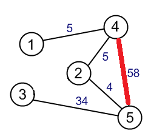

author: accelsao, StudyingFather, thredreams

前置知识：[图论相关概念](../concept.md)

## 基本概念回顾

对于图 $G=(V, E)$，若 $E'\subseteq E$ 且 $E'$ 中任意两条不同的边都没有公共的端点，且 $E'$ 中任意一条边都不是自环，则 $E'$ 是图 $G$ 的一个 **匹配 (Matching)**，也可以叫作 **边独立集 (Independent edge set)**。

如果一个点是匹配中某条边的一个端点，则称这个点是 **被匹配的 (matched)/饱和的 (saturated)**，同时这个点称为 **匹配点**，否则称这个点是 **不被匹配的 (unmatched)**，这个点称为 **未匹配点**。

同理，匹配中的边称为 **匹配边**，反之称为 **未匹配边**。

- 定义匹配 $M$ 的大小为其中边的数量 $|M|$，边数最大的 $M$ 为 **最大匹配 (Maximum-cardinality matching)**。图 $G$ 的最大匹配的大小记作 $\nu(G)$。
- 赋权图中权重之和最大的匹配为 **最大权匹配 (Maximum-weight matching)**。
- 无法再增加匹配边的匹配为 **极大匹配 (Maximal matching)**。
- 如果对于一个匹配这个图中所有点都是被匹配的，那么这个匹配是一个 **完美匹配 (Perfect matching)**，或称为 **完备匹配（Complete matching）**。如果在一个图中只有一个点不被匹配，那么这个匹配是一个 **准完美匹配 (Near-perfect matching)**，或 **准完备匹配**。但并非每个图都存在完美匹配。

求一张普通图或二分图的匹配或完美匹配个数都是 [#P 完全](../../misc/cc-basic.md#p_1) 的。

**易混淆概念区分**：

- 极大匹配

- 最大匹配

- 最大的极大匹配就是最大匹配，任何最大匹配都是极大匹配。

- 完美匹配是最大匹配，更是极大匹配。

- 极大匹配一定是边支配集，但边支配集不一定是匹配。

- 最小极大匹配和最小边支配集大小相等，但最小边支配集不一定是匹配。求最小极大匹配是 NP 困难的。

对于一个匹配 $M$，若一条路径以非匹配点为起点，每相邻两条边的其中一条在匹配中而另一条不在匹配中，则这条路径被称作一条 **交替路径 (Alternating path)**；

一条在非匹配点终止的交替路径，被称作一条 **增广路径 (Augmenting path)**，或 **可扩充路**。

## 贝尔热定理 (Berge theorem)

![\[公式\]](https://www.zhihu.com/equation?tex=G)的匹配![\[公式\]](https://www.zhihu.com/equation?tex=M)是最大匹配当且仅当![\[公式\]](https://www.zhihu.com/equation?tex=G)不包含![\[公式\]](https://www.zhihu.com/equation?tex=M)可扩充路。

这个定理是 **最大匹配判定定理** 并提供了匹配扩充的思路。详见 [增广路定理](./augment.md)

## 托特定理 (Tutte theorem)

$n$ 阶无向图 $G$ 有完美匹配当且仅当对于任意的 $V' \subset V(G)$，$p_{\text{奇}}(G-V')\leq |V'|$，其中 $p_{\text{奇}}$ 表示奇数阶连通分支数。

## 彼得森定理 (Petersen's theorem)

任何无桥的 3 - 正则图都有完美匹配。

Petersen's theorem 是托特定理的推论。

## 二分图匹配

一张二分图上的匹配称作二分匹配。在二分图中求匹配等价于网路流问题。

设 $G$ 为二分图，若在 $G$ 的子图 $M$ 中，任意两条边都没有公共节点，那么称 $M$ 为二分图 $G$ 的一个匹配，且 $M$ 的边数为匹配数。

### X 到 Y 的完美匹配

设 $G=<X,Y,E>$ 为二分图，$|X| \leq |Y|$，$M$ 为 $G$ 中一个最大匹配，且 $|M|=2|X|$，则称 $M$ 为 $X$ 到 $Y$ 的完美匹配，或 X - 完美匹配 (**X-perfect matching**)，X - 饱和匹配 (**X-saturating matching**)。换言之，X - 完美匹配是覆盖 X 中每一个顶点的匹配。

### 霍尔定理 (Hall's marriage theorem)

设二分图 $G=<V_1, V_2, E>, |V_1| \leq |V_2|$，则 $G$ 中存在 $V_1$ 到 $V_2$ 的完美匹配，当且仅当对于任意的 $S \subset V_1$，均有 $|S|\leq|N(S)|$，其中 $N(S)=\bigcup\limits_{v \in S}{N(v)}$，是 $S$ 的邻域。

霍尔定理是二分图中求最大匹配算法（匈牙利算法）的基础

### 柯尼希定理 (Konig theorem)

在二分图中，最大匹配的边数等于最小覆盖的顶点数。

## 算法

图匹配算法是信息学竞赛中常用的算法，总体分为最大匹配以及最大权匹配，先从二分图开始介绍，在进一步提出一般图的作法。
最大匹配是组合优化中的一个基本问题。

### 二分图最大匹配

详见 [二分图最大匹配](./bigraph-match.md) 页面。

在无权二分图中，Hopcroft-Karp 算法可在 $O(\sqrt{V}E)$ 解决。

### 二分图最大权匹配

详见 [二分图最大权匹配](./bigraph-weight-match.md) 页面。

在带权二分图中，可用 Hungarian 算法解决。
如果在最短路搜寻中用 Bellman–Ford 算法，时间复杂度为 $O(V^2E)$，
如果用  Dijkstra 算法或 Fibonacci heap，可用 $O(V^{2}\log {V}+VE)$ 解决。

### 一般图最大匹配

详见 [一般图最大匹配](./general-match.md) 页面。

无权一般图中，Edmonds' blossom 算法可在 $O(V^2E)$ 解决。

### 一般图最大权匹配

详见 [一般图最大权匹配](./general-weight-match.md) 页面。

带权一般图中，Edmonds' blossom 算法可在 $O(V^2E)$ 解决。

## 参考资料

- [1][Wikiwand - Matching (graph theory)](<https://www.wikiwand.com/en/Matching_(graph_theory)>)
- [2][Wikiwand - Blossom algorithm](<https://www.wikiwand.com/en/Blossom_algorithm>)
- [3]2015 年《浅谈图的匹配算法及其应用》- 陈胤伯
- [4][演算法笔记 - Matching](<http://web.ntnu.edu.tw/~algo/Matching.html>)
- [5][the-tourist/algo](<https://github.com/the-tourist/algo>)
- [6][Bill Yang's Blog - 带花树学习笔记](<https://blog.bill.moe/blossom-algorithm-notes/>)
- [7][二分图的最大匹配、完美匹配和匈牙利算法](<https://www.renfei.org/blog/bipartite-matching.html>)
- [8][Wikiwand - Hopcroft–Karp algorithm](<https://www.wikiwand.com/en/Hopcroft%E2%80%93Karp_algorithm>)
