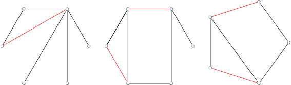
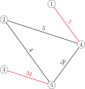

author: accelsao, StudyingFather, t4rf9, wlbksy, yuhuoji

**匹配** 或是 **独立边集** 是一张图中不具有公共端点的边的集合。
在二分图中求匹配等价于网路流问题。

图匹配算法是信息学竞赛中常用的算法，总体分为最大匹配以及最大权匹配，先从二分图开始介绍，再进一步提出一般图的作法。

## 图的匹配

在图论中，假设图 $G=(V,E)$，其中 $V$ 是点集，$E$ 是边集。

一组两两没有公共点的边集 $M(M\in E)$ 称为这张图的 **匹配**。

定义匹配的大小为其中边的数量 $|M|$，其中边数最大的 $M$ 为 **最大匹配**。

当图中的边带权的时候，边权和最大的为 **最大权匹配**。

匹配中的边称为 **匹配边**，反之称为 **未匹配边**。

一个点如果属于 $M$ 且为至多一条边的端点，称为 **匹配点**，反之称为 **未匹配点**。

-   极大匹配（maximal matching）：无法再增加匹配边的匹配。不一定是最大匹配。
-   最大匹配（maximum matching or maximum cardinality matching）：匹配边数量最多的匹配。最大匹配可能有不止一个，但最大匹配的边数是确定的，而且不可能超过图中定点数的一半。
-   最大权匹配（maximum weight matching）：加权图中，权值和最大的匹配。
-   最大权最大匹配（maximum weight maximum cardinality matching）：匹配数最多的前提下，边权和最大的匹配。即所有最大匹配中，边权和最大的匹配。
-   完美匹配（perfect matching）：所有点都属于匹配，同时也符合最大匹配。若图 G 为完全图且顶点数为偶数时，必然存在完美匹配。
-   近完美匹配（near-perfect matching）：发生在图的点数为奇数，刚好只有一个点不在匹配中，扣掉此点以后的图称为 factor-critical graph。

    **极大匹配**

    

    **最大匹配**

    

    **最大权匹配**

    

    **最大权最大匹配**

    

## 二分图匹配

一张二分图上的匹配称作二分匹配

设 $G$ 为二分图，若在 $G$ 的子图 $M$ 中，任意两条边都没有公共节点，那么称 $M$ 为二分图 $G$ 的一个匹配，且 $M$ 的边数为匹配数。

### 完美匹配

设 $G=\langle V_1, V_2, E \rangle$ 为二分图，$|V_1| \leq |V_2|$，$M$ 为 $G$ 中一个最大匹配，且 $|M|=|V_1|$，则称 $M$ 为 $V_1$ 到 $V_2$ 的完美匹配。

### 霍尔定理

设二分图 $G=\langle V_1, V_2, E \rangle, |V_1| \leq |V_2|$，则 $G$ 中存在 $V_1$ 到 $V_2$ 的完美匹配当且仅当对于任意的 $S \subset V_1$，均有 $|S|\leq|N(S)|$，其中 $N(S)=\Cup_{v_i \in S}{N(V_i)}$，是 $S$ 的邻域。

### 最大匹配

寻找二分图边数最大的匹配称为最大匹配问题。

## 算法

组合优化中的一个基本问题是求 **最大匹配（maximum matching）**。

### 二分图最大匹配

详见 [二分图最大匹配](./bigraph-match.md) 页面。

在无权二分图中，Hopcroft–Karp 算法可在 $O(\sqrt{V}E)$ 解决。

### 二分图最大权匹配

详见 [二分图最大权匹配](./bigraph-weight-match.md) 页面。

在带权二分图中，可用 Hungarian 算法解决。
如果在最短路搜寻中用 Bellman–Ford 算法，时间复杂度为 $O(V^2E)$，
如果用  Dijkstra 算法或 Fibonacci heap，可用 $O(V^{2}\log {V}+VE)$ 解决。

### 一般图最大匹配

详见 [一般图最大匹配](./general-match.md) 页面。

无权一般图中，Edmonds' blossom 算法可在 $O(V^2E)$ 解决。

### 一般图最大权匹配

详见 [一般图最大权匹配](./general-weight-match.md) 页面。

带权一般图中，Edmonds' blossom 算法可在 $O(V^2E)$ 解决。

## 匹配算法的转换

### 用最大权最大匹配求最大权匹配

**最大权最大匹配** 允许负边权 $(w(e)<0)$，但是 **最大权匹配** 不会有负边权。

若一张图 $G$ 其所有的边皆为负权，则其 **最大权匹配**  $M=\emptyset$。

#### 调整边的权重

先将图 $G$ 的所有负权边其权重 $w(e)$ 设为 $0$，再进行接下来的步骤。

#### 完全图性质

当图 $G$ 为完全图且没有负边权时，**最大权最大匹配**=**最大权匹配**。

所以把图 $G$ 铺成完全图，铺上的边其权重为 $0$，计算 **最大权最大匹配** 后再把权重为 0 的边去除即可。如下图所示。

### 用最大权匹配求最大权最大匹配

**最大权匹配** 不会有负边权，且零边 $(w(e)=0)$ 可选可不选，但是 **最大权最大匹配** 允许负边权和零边。

#### 调整边的权重

令 $K=\max\{|w(e)|:e\in E, w(e)\leq0\}+1$，若没有负边权和零边则 $K=0$。把图 G 中所有的边其权重 $w(e)$ 加上 $K$ 产生一张新图 $G^{\prime}=(V,E^{\prime})$。得到的新图 $G$ 不存在负边权和零边。

**最大权最大匹配** 不一定等于 **最大权匹配**，但如果把所有边的边权加上一个足够大的数 $P$，**最大权匹配** 的结果就是 **最大权最大匹配**。这样的 $P$ 应该取多大？
令 $P=\sum w(e):e\in E^{\prime}$，把图 G 中所有的边其权重 $w(e)$ 加上 $P$，产生一张新图 $G^{\prime\prime}=(V,E^{\prime\prime})$。

此时对图 G 进行 **最大权匹配**，其结果可以对应原图 $G$ 的 **最大权最大匹配**。如下图所示。

## 参考资料

1.  [Wikiwand - Matching (graph theory)](https://www.wikiwand.com/en/Matching_%28graph_theory%29)
2.  [Wikiwand - Blossom algorithm](https://www.wikiwand.com/en/Blossom_algorithm)
3.  2015 年《浅谈图的匹配算法及其应用》- 陈胤伯
4.  [演算法笔记 - Matching](http://web.ntnu.edu.tw/~algo/Matching.html)
5.  [the-tourist/algo](https://github.com/the-tourist/algo)
6.  [Bill Yang's Blog - 带花树学习笔记](https://blog.bill.moe/blossom-algorithm-notes/)
7.  [二分图的最大匹配、完美匹配和匈牙利算法](https://www.renfei.org/blog/bipartite-matching.html)
8.  [Wikiwand - Hopcroft–Karp algorithm](https://www.wikiwand.com/en/Hopcroft%E2%80%93Karp_algorithm)
