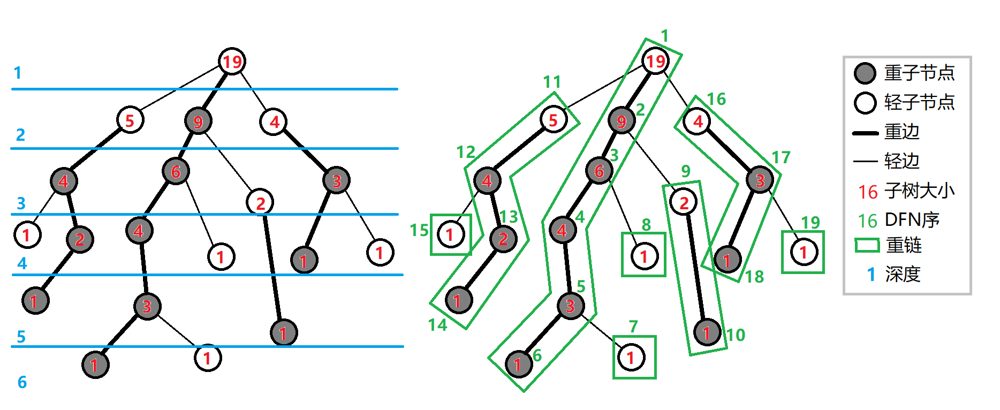

## 树链剖分的思想及能解决的问题

树链剖分用于将树分割成若干条链的形式，以维护树上路径的信息。

具体来说，将整棵树剖分为若干条链，使它组合成线性结构，然后用其他的数据结构维护信息。

 **树链剖分** （树剖/链剖）有多种形式，如 **重链剖分** ， **长链剖分** 和用于 Link/cut Tree 的剖分（有时被称作“实链剖分”），大多数情况下（没有特别说明时），“树链剖分”都指“重链剖分”，本文所讲的也是“重链剖分”。

重链剖分可以将树上的任意一条路径划分成不超过 $\mathcal O(\log n)$ 条连续的链，每条链上的点深度互不相同（即是自底向上的一条链，链上所有点的 $lca$ 为链的一个端点）。

重链剖分还能保证划分出的每条链上的结点 dfs 序连续，因此可以方便地用一些维护序列的数据结构（如线段树）来维护树上路径的信息。

如：

1.  修改 **树上两点之间的路径上** 所有点的值。
2.  查询 **树上两点之间的路径上** 结点权值的 **和/极值/其它（在序列上可以用数据结构维护，便于合并的信息）** 。

除了配合数据结构来维护树上路径信息，树剖还可以用来 $\mathcal O(\log n)$ （且常数较小）地求 $lca$ 。在某些题目中，还可以利用其性质来灵活地运用树剖。

## 重链剖分

我们给出一些定义：

定义 **重子结点** 表示其子结点中子树最大的子结点。如果有相同的，任意取。如果没有子结点，就没有。

定义 **轻子结点** 表示剩余的子结点。

从这个结点到重子结点的边叫 **重边** 。

到其他轻子结点的边叫 **轻边** 。

若干条首尾衔接的重边构成 **重链** 。

把落单的结点也当作重链，那么整棵树就被剖分成若干条重链。

看一张图就明白了



## 实现

树剖的实现分两个 DFS 的过程。伪代码如下：

第一个 DFS 记录每个结点的深度（deep）、子树大小（size）。

    TREE-BUILD-DFS(u,dep)
        u.deep=dep // 记录深度
        u.size=1
        for v is u's son
            u.size+=TREE-BUILD-DFS(v)
        return u.size // 返回该结点对应的子树的大小

第二个 DFS 记录每个结点的重子结点（heavy-son）、重边优先遍历时的 DFN 序、所在链的链顶（top，且应初始化为结点本身）。

    TREE-DECOMPOSITION-DFS(u,top)
        u.top=top // 记录所在重链的链顶
        u.dfn=++tot // 记录结点的DFN序
        for v is u's son //找重儿子
            if(v.size>hvs)hvs=v.size,p=v
        TREE-DECOMPOSITION-DFS(v,top) // 重边优先遍历
        for v is u's son // 遍历轻边时，以自己为链顶
            if(v!=p)TREE-DECOMPOSITION-DFS(v,v)

给一个具体的代码实现吧。

我们先给出一些定义：

-    $fa(x)$ 表示结点 $x$ 在树上的父亲。
-    $dep(x)$ 表示结点 $x$ 在树上的深度。
-    $siz(x)$ 表示结点 $x$ 的子树的结点个数。
-    $son(x)$ 表示结点 $x$ 的 **重儿子** 。
-    $top(x)$ 表示结点 $x$ 所在 **重链** 的顶部结点（深度最小）。
-    $tid(x)$ 表示结点 $x$ 的 **时间戳** ，也是其在线段树中的编号。
-    $rnk(x)$ 表示时间戳所对应的结点编号，有 $rnk(tid(x))=x$ 。

我们进行两遍 DFS 预处理出这些值，其中第一次 DFS 求出 $fa(x),dep(x),siz(x),son(x)$ ，第二次 DFS 求出 $top(x),tid(x),rnk(x)$ 。

给出一种代码实现：

```cpp
void dfs1(int o, int fat) {
  son[o] = -1;
  siz[o] = 1;
  for (int j = h[o]; j; j = nxt[j])
    if (!dep[p[j]]) {
      dep[p[j]] = dep[o] + 1;
      fa[p[j]] = o;
      dfs1(p[j], o);
      siz[o] += siz[p[j]];
      if (son[o] == -1 || siz[p[j]] > siz[son[o]]) son[o] = p[j];
    }
}
void dfs2(int o, int t) {
  top[o] = t;
  cnt++;
  tid[o] = cnt;
  rnk[cnt] = o;
  if (son[o] == -1) return;
  dfs2(son[o], t);  //优先对重儿子进行dfs，可以保证同一条重链上的点时间戳连续
  for (int j = h[o]; j; j = nxt[j])
    if (p[j] != son[o] && p[j] != fa[o]) dfs2(p[j], p[j]);
}
```

## 重链剖分的性质

 **树上每个结点都属于且仅属于一条重链** 。

重链开头的结点不一定是重子结点（因为重边是对于每一个结点都有定义的）

所有的重链将整棵树 **完全剖分** 

重链一定是链状结构；重边不会连成一棵树。

在剖分时 **重边优先遍历** ，最后树的 DFN 序上，重链内的 DFN 序是连续的。按 DFN 排序后的序列即为剖分后的链

一颗子树内的 DFN 序是连续的

可以发现，当我们向下经过一条 **轻边** 时，所在子树的大小至少会除以二。

因此，对于树上的任意一条路径，把它拆分成从 $lca$ 分别向两边往下走，分别最多走 $\mathcal O(\log n)$ 次，因此，树上的每条路径都可以被拆分成不超过 $\mathcal O(\log n)$ 条重链。

## 常见应用

### 路径上维护

用树链剖分求树上两点路径权值和，伪代码如下：

```cpp
TREE - PATH - SUM(u, v) while u,
    v 不在同一条链上 if u 所在链的链顶的深度小于 v 所在链的链顶的深度
    swap(u, v) 将 u 到 u 所在链的链顶 之间的结点权值求和，累加到计数器中
    u = u 所在链链顶的父结点 将 u,
    v 之间的结点的权值求和累加，返回计数器的值
```

链上的 DFN 序是连续的，可以使用线段树，树状数组维护。

每次选择深度较大的链往上跳，直到两点在同一条链上。

同样的跳链结构适用于维护、统计路径上的其他信息。

### 子树维护

有时会要求，维护子树上的信息，譬如将以 x 为根的子树的所有结点的权值增加 v。

在 DFS 搜索的时候，子树中的结点的 DFN 序是连续的。

每一个结点记录 bottom 表示所在子树连续区间末端的结点。

这样就把子树信息转化为连续的一段区间信息。

### 求最近公共祖先

不断向上跳链，当跳到同一条链上时，返回深度较小的结点即为 LCA。

## 例题：[「ZJOI2008」树的统计](https://www.lydsy.com/JudgeOnline/problem.php?id=1036)

### 题目大意

对一棵有 $n$ 个结点，结点带权值的静态树，进行三种操作共 $q$ 次：

1.  修改单个结点的值；
2.  查询 $u$ 到 $v$ 的路径上的最大值；
3.  查询 $u$ 到 $v$ 的路径上的权值和。

题目保证 $1\le n\le 30000,0\le q\le 200000$ 

### 解法

根据题面以及以上的性质，你的线段树需要维护三种操作：

1.  单点修改；
2.  区间查询最大值；
3.  区间查询和。

单点修改很容易实现。

由于子树的 dfs 序连续（无论是否树剖都是如此），修改一个结点的子树只用修改这一段连续的 dfs 序区间。

问题是如何修改/查询两个结点之间的路径。

考虑我们是如何用 **倍增法求解 LCA** 的。首先我们 **将两个结点提到同一高度，然后将两个结点一起向上跳** 。对于树链剖分也可以使用这样的思想。

在向上跳的过程中，如果当前结点在重链上，向上跳到重链顶端，如果当前结点不在重链上，向上跳一个结点。如此直到两结点相同。沿途更新/查询区间信息。

对于每个询问，最多经过 $\mathcal O(\log n)$ 条重链，每条重链上线段树的复杂度为 $\mathcal O(\log n)$ ，因此总时间复杂度为 $\mathcal O(n\log n+q\log^2 n)$ 。实际上重链个数很难达到 $\mathcal O(\log n)$ （可以用完全二叉树卡满），所以树剖在一般情况下常数较小。

给出一种代码实现：

```cpp
// st 是线段树结构体
int querymax(int x, int y) {
  int ret = -inf, fx = top[x], fy = top[y];
  while (fx != fy) {
    if (dep[fx] >= dep[fy])
      ret = max(ret, st.query1(1, 1, n, tid[fx], tid[x])), x = fa[fx];
    else
      ret = max(ret, st.query1(1, 1, n, tid[fy], tid[y])), y = fa[fy];
    fx = top[x];
    fy = top[y];
  }
  if (x != y) {
    if (tid[x] < tid[y])
      ret = max(ret, st.query1(1, 1, n, tid[x], tid[y]));
    else
      ret = max(ret, st.query1(1, 1, n, tid[y], tid[x]));
  } else
    ret = max(ret, st.query1(1, 1, n, tid[x], tid[y]));
  return ret;
}
```

### 完整代码

鉴于树链剖分的题目细节较多，容易打错，给出一种代码实现，以供参考。

??? "树链剖分参考代码"

    ```cpp
    #include <algorithm>
    #include <cstdio>
    #include <cstring>
    #define lc o << 1
    #define rc o << 1 | 1
    const int maxn = 60010;
    const int inf = 2e9;
    int n, a, b, w[maxn], q, u, v;
    int cur, h[maxn], nxt[maxn], p[maxn];
    int siz[maxn], top[maxn], son[maxn], dep[maxn], fa[maxn], tid[maxn], rnk[maxn], cnt;
    char op[10];
    inline void add_edge(int x, int y) {
    	cur++;
    	nxt[cur] = h[x];
    	h[x] = cur;
    	p[cur] = y;
    }
    struct SegTree {
    	int sum[maxn * 4], maxx[maxn * 4];
    	void build(int o, int l, int r) {
    		if (l == r) {
    			sum[o] = maxx[o] = w[rnk[l]];
    			return;
    		}
    		int mid = (l + r) >> 1;
    		build(lc, l, mid);
    		build(rc, mid + 1, r);
    		sum[o] = sum[lc] + sum[rc];
    		maxx[o] = std::max(maxx[lc], maxx[rc]);
    	}
    	int query1(int o, int l, int r, int ql, int qr)  // max
    	{
    		if (l > qr || r < ql) return -inf;
    		if (ql <= l && r <= qr) return maxx[o];
    		int mid = (l + r) >> 1;
    		return std::max(query1(lc, l, mid, ql, qr), query1(rc, mid + 1, r, ql, qr));
    	}
    	int query2(int o, int l, int r, int ql, int qr)  // sum
    	{
    		if (l > qr || r < ql) return 0;
    		if (ql <= l && r <= qr) return sum[o];
    		int mid = (l + r) >> 1;
    		return query2(lc, l, mid, ql, qr) + query2(rc, mid + 1, r, ql, qr);
    	}
    	void update(int o, int l, int r, int x, int t) {
    		if (l == r) {
    			maxx[o] = sum[o] = t;
    			return;
    		}
    		int mid = (l + r) >> 1;
    		if (x <= mid)
    			update(lc, l, mid, x, t);
    		else
    			update(rc, mid + 1, r, x, t);
    		sum[o] = sum[lc] + sum[rc];
    		maxx[o] = std::max(maxx[lc], maxx[rc]);
    	}
    } st;
    void dfs1(int o, int fat) {
    	son[o] = -1;
    	siz[o] = 1;
    	for (int j = h[o]; j; j = nxt[j])
    		if (!dep[p[j]]) {
    			dep[p[j]] = dep[o] + 1;
    			fa[p[j]] = o;
    			dfs1(p[j], o);
    			siz[o] += siz[p[j]];
    			if (son[o] == -1 || siz[p[j]] > siz[son[o]]) son[o] = p[j];
    		}
    }
    void dfs2(int o, int t) {
    	top[o] = t;
    	cnt++;
    	tid[o] = cnt;
    	rnk[cnt] = o;
    	if (son[o] == -1) return;
    	dfs2(son[o], t);
    	for (int j = h[o]; j; j = nxt[j])
    		if (p[j] != son[o] && p[j] != fa[o]) dfs2(p[j], p[j]);
    }
    int querymax(int x, int y) {
    	int ret = -inf, fx = top[x], fy = top[y];
    	while (fx != fy) {
    		if (dep[fx] >= dep[fy])
    			ret = std::max(ret, st.query1(1, 1, n, tid[fx], tid[x])), x = fa[fx];
    		else
    			ret = std::max(ret, st.query1(1, 1, n, tid[fy], tid[y])), y = fa[fy];
    		fx = top[x];
    		fy = top[y];
    	}
    	if (x != y) {
    		if (tid[x] < tid[y])
    			ret = std::max(ret, st.query1(1, 1, n, tid[x], tid[y]));
    		else
    			ret = std::max(ret, st.query1(1, 1, n, tid[y], tid[x]));
    	} else
    		ret = std::max(ret, st.query1(1, 1, n, tid[x], tid[y]));
    	return ret;
    }
    int querysum(int x, int y) {
    	int ret = 0, fx = top[x], fy = top[y];
    	while (fx != fy) {
    		if (dep[fx] >= dep[fy])
    			ret += st.query2(1, 1, n, tid[fx], tid[x]), x = fa[fx];
    		else
    			ret += st.query2(1, 1, n, tid[fy], tid[y]), y = fa[fy];
    		fx = top[x];
    		fy = top[y];
    	}
    	if (x != y) {
    		if (tid[x] < tid[y])
    			ret += st.query2(1, 1, n, tid[x], tid[y]);
    		else
    			ret += st.query2(1, 1, n, tid[y], tid[x]);
    	} else
    		ret += st.query2(1, 1, n, tid[x], tid[y]);
    	return ret;
    }
    int main() {
    	scanf("%d", &n);
    	for (int i = 1; i < n; i++)
    		scanf("%d%d", &a, &b), add_edge(a, b), add_edge(b, a);
    	for (int i = 1; i <= n; i++) scanf("%d", w + i);
    	dep[1] = 1;
    	dfs1(1, -1);
    	dfs2(1, 1);
    	st.build(1, 1, n);
    	scanf("%d", &q);
    	while (q--) {
    		scanf("%s%d%d", op, &u, &v);
    		if (!strcmp(op, "CHANGE")) st.update(1, 1, n, tid[u], v);
    		if (!strcmp(op, "QMAX")) printf("%d\n", querymax(u, v));
    		if (!strcmp(op, "QSUM")) printf("%d\n", querysum(u, v));
    	}
    	return 0;
    }
    ```

## 练习

[「luogu P3379」【模板】最近公共祖先（LCA）](https://www.luogu.org/problemnew/show/P3379)（树剖求 $lca$ 无需数据结构，可以用作练习）

[「JLOI2014」松鼠的新家](https://www.lydsy.com/JudgeOnline/problem.php?id=3631)（当然也可以用树上差分）

[「HAOI2015」树上操作](https://www.lydsy.com/JudgeOnline/problem.php?id=4034)

[「luogu P3384」【模板】树链剖分](https://www.luogu.org/problemnew/show/P3384)

[「NOI2015」软件包管理器](https://www.lydsy.com/JudgeOnline/problem.php?id=4196)

[「SDOI2011」染色](https://www.lydsy.com/JudgeOnline/problem.php?id=2243)

[「SDOI2014」旅行](https://www.lydsy.com/JudgeOnline/problem.php?id=3531)
