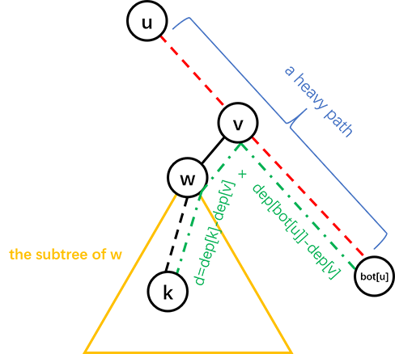

author: Ir1d, TrisolarisHD, ouuan, hsfzLZH1, Xeonacid, greyqz, Chrogeek, ftxj, sshwy, LuoshuiTianyi, hyp1231

## 树链剖分的思想及能解决的问题

树链剖分用于将树分割成若干条链的形式，以维护树上路径的信息。

具体来说，将整棵树剖分为若干条链，使它组合成线性结构，然后用其他的数据结构维护信息。

 **树链剖分** （树剖/链剖）有多种形式，如 **重链剖分** ， **长链剖分** 和用于 Link/cut Tree 的剖分（有时被称作“实链剖分”），大多数情况下（没有特别说明时），“树链剖分”都指“重链剖分”。

重链剖分可以将树上的任意一条路径划分成不超过 $O(\log n)$ 条连续的链，每条链上的点深度互不相同（即是自底向上的一条链，链上所有点的 LCA 为链的一个端点）。

重链剖分还能保证划分出的每条链上的节点 DFS 序连续，因此可以方便地用一些维护序列的数据结构（如线段树）来维护树上路径的信息。

如：

1.  修改 **树上两点之间的路径上** 所有点的值。
2.  查询 **树上两点之间的路径上** 节点权值的 **和/极值/其它（在序列上可以用数据结构维护，便于合并的信息）** 。

除了配合数据结构来维护树上路径信息，树剖还可以用来 $O(\log n)$ （且常数较小）地求 LCA。在某些题目中，还可以利用其性质来灵活地运用树剖。

## 重链剖分

我们给出一些定义：

定义 **重子节点** 表示其子节点中子树最大的子结点。如果有多个子树最大的子结点，取其一。如果没有子节点，就无重子节点。

定义 **轻子节点** 表示剩余的所有子结点。

从这个结点到重子节点的边为 **重边** 。

到其他轻子节点的边为 **轻边** 。

若干条首尾衔接的重边构成 **重链** 。

把落单的结点也当作重链，那么整棵树就被剖分成若干条重链。

如图：


## 实现

树剖的实现分两个 DFS 的过程。伪代码如下：

第一个 DFS 记录每个结点的父节点（father）、深度（deep）、子树大小（size）、重子节点（hson）。

$$
\begin{array}{l}
\text{TREE-BUILD }(u,dep) \\
\begin{array}{ll}
1 & u.hson\gets 0 \\
2 & u.hson.size\gets 0 \\
3 & u.deep\gets dep \\
4 & u.size\gets 1 \\
5 & \textbf{for }\text{each }u\text{'s son }v \\
6 & \qquad u.size\gets u.size + \text{TREE-BUILD }(v,dep+1) \\
7 & \qquad v.father\gets u \\
8 & \qquad \textbf{if }v.size> u.hson.size \\
9 & \qquad \qquad u.hson\gets v \\
10 & \textbf{return } u.size
\end{array}
\end{array}
$$

第二个 DFS 记录所在链的链顶（top，应初始化为结点本身）、重边优先遍历时的 DFS 序（dfn）、DFS 序对应的节点编号（rank）。

$$
\begin{array}{l}
\text{TREE-DECOMPOSITION }(u,top) \\
\begin{array}{ll}
1 & u.top\gets top \\
2 & tot\gets tot+1\\
3 & u.dfn\gets tot \\
4 & rank(tot)\gets u \\
5 & \textbf{if }u.hson\text{ is not }0 \\
6 & \qquad \text{TREE-DECOMPOSITION }(u.hson,top) \\
7 & \qquad \textbf{for }\text{each }u\text{'s son }v \\
8 & \qquad \qquad \textbf{if }v\text{ is not }u.hson \\
9 & \qquad \qquad \qquad \text{TREE-DECOMPOSITION }(v,v) 
\end{array}
\end{array}
$$

以下为代码实现。

我们先给出一些定义：

-    $fa(x)$ 表示节点 $x$ 在树上的父亲。
-    $dep(x)$ 表示节点 $x$ 在树上的深度。
-    $siz(x)$ 表示节点 $x$ 的子树的节点个数。
-    $son(x)$ 表示节点 $x$ 的 **重儿子** 。
-    $top(x)$ 表示节点 $x$ 所在 **重链** 的顶部节点（深度最小）。
-    $dfn(x)$ 表示节点 $x$ 的 **DFS 序** ，也是其在线段树中的编号。
-    $rnk(x)$ 表示 DFS 序所对应的节点编号，有 $rnk(dfn(x))=x$ 。

我们进行两遍 DFS 预处理出这些值，其中第一次 DFS 求出 $fa(x)$ , $dep(x)$ , $siz(x)$ , $son(x)$ ，第二次 DFS 求出 $top(x)$ , $dfn(x)$ , $rnk(x)$ 。

```cpp
void dfs1(int o) {
  son[o] = -1;
  siz[o] = 1;
  for (int j = h[o]; j; j = nxt[j])
    if (!dep[p[j]]) {
      dep[p[j]] = dep[o] + 1;
      fa[p[j]] = o;
      dfs1(p[j]);
      siz[o] += siz[p[j]];
      if (son[o] == -1 || siz[p[j]] > siz[son[o]]) son[o] = p[j];
    }
}
void dfs2(int o, int t) {
  top[o] = t;
  cnt++;
  dfn[o] = cnt;
  rnk[cnt] = o;
  if (son[o] == -1) return;
  dfs2(son[o], t);  // 优先对重儿子进行 DFS，可以保证同一条重链上的点 DFS 序连续
  for (int j = h[o]; j; j = nxt[j])
    if (p[j] != son[o] && p[j] != fa[o]) dfs2(p[j], p[j]);
}
```

## 重链剖分的性质

 **树上每个节点都属于且仅属于一条重链** 。

重链开头的结点不一定是重子节点（因为重边是对于每一个结点都有定义的）。

所有的重链将整棵树 **完全剖分** 。

在剖分时 **优先遍历重儿子** ，最后重链的 DFS 序就会是连续的。

在剖分时 **重边优先遍历** ，最后树的 DFN 序上，重链内的 DFN 序是连续的。按 DFN 排序后的序列即为剖分后的链。

一颗子树内的 DFN 序是连续的。

可以发现，当我们向下经过一条 **轻边** 时，所在子树的大小至少会除以二。

因此，对于树上的任意一条路径，把它拆分成从 $lca$ 分别向两边往下走，分别最多走 $O(\log n)$ 次，因此，树上的每条路径都可以被拆分成不超过 $O(\log n)$ 条重链。

## 常见应用

### 路径上维护

用树链剖分求树上两点路径权值和，伪代码如下：

$$
\begin{array}{l}
\text{TREE-PATH-SUM }(u,v) \\
\begin{array}{ll}
1 & tot\gets 0 \\
2 & \textbf{while }u.top\text{ is not }v.top \\
3 & \qquad \textbf{if }u.top.deep< v.top.deep \\
4 & \qquad \qquad \text{SWAP}(u, v) \\
5 & \qquad tot\gets tot + \text{sum of values between }u\text{ and }u.top \\
6 & \qquad u\gets u.top.father \\
7 & tot\gets tot + \text{sum of values between }u\text{ and }v \\
8 & \textbf{return } tot 
\end{array}
\end{array}
$$

链上的 DFS 序是连续的，可以使用线段树、树状数组维护。

每次选择深度较大的链往上跳，直到两点在同一条链上。

同样的跳链结构适用于维护、统计路径上的其他信息。

### 子树维护

有时会要求，维护子树上的信息，譬如将以 $x$ 为根的子树的所有结点的权值增加 $v$ 。

在 DFS 搜索的时候，子树中的结点的 DFS 序是连续的。

每一个结点记录 bottom 表示所在子树连续区间末端的结点。

这样就把子树信息转化为连续的一段区间信息。

### 求最近公共祖先

不断向上跳重链，当跳到同一条重链上时，深度较小的结点即为 LCA。

向上跳重链时需要先跳所在重链顶端深度较大的那个。

参考代码：

```cpp
int lca(int u, int v) {
  while (top[u] != top[v]) {
    if (dep[top[u]] > dep[top[v]])
      u = fa[top[u]];
    else
      v = fa[top[v]];
  }
  return dep[u] > dep[v] ? v : u;
}
```

??? note "怎么有理有据地卡树剖"

    一般情况下树剖的 $O(\log n)$ 常数不满很难卡，如果要卡只能建立二叉树深度低。

    于是我们可以考虑折中方案。

    我们建立一颗 $\sqrt{n}$ 个节点的二叉树。对于每个节点到其儿子的边，我们将其替换成一条长度为 $\sqrt{n}$ 的链。

    这样子我们可以将随机询问轻重链切换次数卡到平均 $\frac{\log n}{2}$ 次，同时有 $O(\sqrt{n} \log n)$ 的深度。

    加上若干随机叶子看上去可以卡树剖。但是树剖常数小有可能卡不掉。

## 例题

###  [「ZJOI2008」树的统计](https://loj.ac/problem/10138) 

#### 题目大意

对一棵有 $n$ 个节点，节点带权值的静态树，进行三种操作共 $q$ 次：

1.  修改单个节点的权值；
2.  查询 $u$ 到 $v$ 的路径上的最大权值；
3.  查询 $u$ 到 $v$ 的路径上的权值之和。

保证 $1\le n\le 30000$ , $0\le q\le 200000$ 。

#### 解法

根据题面以及以上的性质，你的线段树需要维护三种操作：

1.  单点修改；
2.  区间查询最大值；
3.  区间查询和。

单点修改很容易实现。

由于子树的 DFS 序连续（无论是否树剖都是如此），修改一个节点的子树只用修改这一段连续的 DFS 序区间。

问题是如何修改/查询两个节点之间的路径。

考虑我们是如何用 **倍增法求解 LCA** 的。首先我们 **将两个节点提到同一高度，然后将两个节点一起向上跳** 。对于树链剖分也可以使用这样的思想。

在向上跳的过程中，如果当前节点在重链上，向上跳到重链顶端，如果当前节点不在重链上，向上跳一个节点。如此直到两节点相同。沿途更新/查询区间信息。

对于每个询问，最多经过 $O(\log n)$ 条重链，每条重链上线段树的复杂度为 $O(\log n)$ ，因此总时间复杂度为 $O(n\log n+q\log^2 n)$ 。实际上重链个数很难达到 $O(\log n)$ （可以用完全二叉树卡满），所以树剖在一般情况下常数较小。

给出一种代码实现：

```cpp
// st 是线段树结构体
int querymax(int x, int y) {
  int ret = -inf, fx = top[x], fy = top[y];
  while (fx != fy) {
    if (dep[fx] >= dep[fy])
      ret = max(ret, st.query1(1, 1, n, dfn[fx], dfn[x])), x = fa[fx];
    else
      ret = max(ret, st.query1(1, 1, n, dfn[fy], dfn[y])), y = fa[fy];
    fx = top[x];
    fy = top[y];
  }
  if (dfn[x] < dfn[y])
    ret = max(ret, st.query1(1, 1, n, dfn[x], dfn[y]));
  else
    ret = max(ret, st.query1(1, 1, n, dfn[y], dfn[x]));
  return ret;
}
```

??? "参考代码"
    ```cpp
    #include <algorithm>
    #include <cstdio>
    #include <cstring>
    #define lc o << 1
    #define rc o << 1 | 1
    const int maxn = 60010;
    const int inf = 2e9;
    int n, a, b, w[maxn], q, u, v;
    int cur, h[maxn], nxt[maxn], p[maxn];
    int siz[maxn], top[maxn], son[maxn], dep[maxn], fa[maxn], dfn[maxn], rnk[maxn],
        cnt;
    char op[10];
    inline void add_edge(int x, int y) {
      cur++;
      nxt[cur] = h[x];
      h[x] = cur;
      p[cur] = y;
    }
    struct SegTree {
      int sum[maxn * 4], maxx[maxn * 4];
      void build(int o, int l, int r) {
        if (l == r) {
          sum[o] = maxx[o] = w[rnk[l]];
          return;
        }
        int mid = (l + r) >> 1;
        build(lc, l, mid);
        build(rc, mid + 1, r);
        sum[o] = sum[lc] + sum[rc];
        maxx[o] = std::max(maxx[lc], maxx[rc]);
      }
      int query1(int o, int l, int r, int ql, int qr)  // max
      {
        if (l > qr || r < ql) return -inf;
        if (ql <= l && r <= qr) return maxx[o];
        int mid = (l + r) >> 1;
        return std::max(query1(lc, l, mid, ql, qr), query1(rc, mid + 1, r, ql, qr));
      }
      int query2(int o, int l, int r, int ql, int qr)  // sum
      {
        if (l > qr || r < ql) return 0;
        if (ql <= l && r <= qr) return sum[o];
        int mid = (l + r) >> 1;
        return query2(lc, l, mid, ql, qr) + query2(rc, mid + 1, r, ql, qr);
      }
      void update(int o, int l, int r, int x, int t) {
        if (l == r) {
          maxx[o] = sum[o] = t;
          return;
        }
        int mid = (l + r) >> 1;
        if (x <= mid)
          update(lc, l, mid, x, t);
        else
          update(rc, mid + 1, r, x, t);
        sum[o] = sum[lc] + sum[rc];
        maxx[o] = std::max(maxx[lc], maxx[rc]);
      }
    } st;
    void dfs1(int o) {
      son[o] = -1;
      siz[o] = 1;
      for (int j = h[o]; j; j = nxt[j])
        if (!dep[p[j]]) {
          dep[p[j]] = dep[o] + 1;
          fa[p[j]] = o;
          dfs1(p[j]);
          siz[o] += siz[p[j]];
          if (son[o] == -1 || siz[p[j]] > siz[son[o]]) son[o] = p[j];
        }
    }
    void dfs2(int o, int t) {
      top[o] = t;
      cnt++;
      dfn[o] = cnt;
      rnk[cnt] = o;
      if (son[o] == -1) return;
      dfs2(son[o], t);
      for (int j = h[o]; j; j = nxt[j])
        if (p[j] != son[o] && p[j] != fa[o]) dfs2(p[j], p[j]);
    }
    int querymax(int x, int y) {
      int ret = -inf, fx = top[x], fy = top[y];
      while (fx != fy) {
        if (dep[fx] >= dep[fy])
          ret = std::max(ret, st.query1(1, 1, n, dfn[fx], dfn[x])), x = fa[fx];
        else
          ret = std::max(ret, st.query1(1, 1, n, dfn[fy], dfn[y])), y = fa[fy];
        fx = top[x];
        fy = top[y];
      }
      if (dfn[x] < dfn[y])
        ret = std::max(ret, st.query1(1, 1, n, dfn[x], dfn[y]));
      else
        ret = std::max(ret, st.query1(1, 1, n, dfn[y], dfn[x]));
      return ret;
    }
    int querysum(int x, int y) {
      int ret = 0, fx = top[x], fy = top[y];
      while (fx != fy) {
        if (dep[fx] >= dep[fy])
          ret += st.query2(1, 1, n, dfn[fx], dfn[x]), x = fa[fx];
        else
          ret += st.query2(1, 1, n, dfn[fy], dfn[y]), y = fa[fy];
        fx = top[x];
        fy = top[y];
      }
      if (dfn[x] < dfn[y])
        ret += st.query2(1, 1, n, dfn[x], dfn[y]);
      else
        ret += st.query2(1, 1, n, dfn[y], dfn[x]);
      return ret;
    }
    int main() {
      scanf("%d", &n);
      for (int i = 1; i < n; i++)
        scanf("%d%d", &a, &b), add_edge(a, b), add_edge(b, a);
      for (int i = 1; i <= n; i++) scanf("%d", w + i);
      dep[1] = 1;
      dfs1(1);
      dfs2(1, 1);
      st.build(1, 1, n);
      scanf("%d", &q);
      while (q--) {
        scanf("%s%d%d", op, &u, &v);
        if (!strcmp(op, "CHANGE")) st.update(1, 1, n, dfn[u], v);
        if (!strcmp(op, "QMAX")) printf("%d\n", querymax(u, v));
        if (!strcmp(op, "QSUM")) printf("%d\n", querysum(u, v));
      }
      return 0;
    }
    ```

###  [Nauuo and Binary Tree](https://loj.ac/problem/6669) 

这是一道交互题，也是树剖的非传统应用。

#### 题目大意

有一棵以 $1$ 为根的二叉树，你可以询问任意两点之间的距离，求出每个点的父亲。

节点数不超过 $3000$ ，你最多可以进行 $30000$ 次询问。

#### 解法

首先可以通过 $n-1$ 次询问确定每个节点的深度。

然后考虑按深度从小到大确定每个节点的父亲，这样的话确定一个节点的父亲时其所有祖先一定都是已知的。

确定一个节点的父亲之前，先对树已知的部分进行重链剖分。

假设我们需要在子树 $u$ 中找节点 $k$ 所在的位置，我们可以询问 $k$ 与 $u$ 所在重链的尾端的距离，就可以进一步确定 $k$ 的位置，具体见图：



其中红色虚线是一条重链， $d$ 是询问的结果即 $dis(k, bot[u])$ ， $v$ 的深度为 $(dep[k]+dep[bot[u]]-d)/2$ 。

这样的话，如果 $v$ 只有一个儿子， $k$ 的父亲就是 $v$ ，否则可以递归地在 $w$ 的子树中找 $k$ 的父亲。

时间复杂度 $O(n^2)$ ，询问复杂度 $O(n\log n)$ 。

具体地，设 $T(n)$ 为最坏情况下在一棵大小为 $n$ 的树中找到一个新节点的位置所需的询问次数，可以得到：

$$
T(n)\le
\begin{cases}
0&n=1\\
T\left(\left\lfloor\frac{n-1}2\right\rfloor\right)+1&n\ge2
\end{cases}
$$

 $2999+\sum_{i=1}^{2999}T(i)\le 29940$ ，事实上这个上界是可以通过构造数据达到的，然而只要进行一些随机扰动（如对深度进行排序时使用不稳定的排序算法），询问次数很难超过 $21000$ 次。

??? note "参考代码"
    ```cpp
    #include <algorithm>
    #include <cstdio>
    #include <iostream>
    
    using namespace std;
    
    const int N = 3010;
    
    int n, fa[N], ch[N][2], dep[N], siz[N], son[N], bot[N], id[N];
    
    int query(int u, int v) {
      printf("? %d %d\n", u, v);
      fflush(stdout);
      int d;
      scanf("%d", &d);
      return d;
    }
    
    void setFather(int u, int v) {
      fa[v] = u;
      if (ch[u][0])
        ch[u][1] = v;
      else
        ch[u][0] = v;
    }
    
    void dfs(int u) {
      if (ch[u][0]) dfs(ch[u][0]);
      if (ch[u][1]) dfs(ch[u][1]);
    
      siz[u] = siz[ch[u][0]] + siz[ch[u][1]] + 1;
    
      if (ch[u][1])
        son[u] = int(siz[ch[u][0]] < siz[ch[u][1]]);
      else
        son[u] = 0;
    
      if (ch[u][son[u]])
        bot[u] = bot[ch[u][son[u]]];
      else
        bot[u] = u;
    }
    
    void solve(int u, int k) {
      if (!ch[u][0]) {
        setFather(u, k);
        return;
      }
      int d = query(k, bot[u]);
      int v = bot[u];
      while (dep[v] > (dep[k] + dep[bot[u]] - d) / 2) v = fa[v];
      int w = ch[v][son[v] ^ 1];
      if (w)
        solve(w, k);
      else
        setFather(v, k);
    }
    
    int main() {
      int i;
    
      scanf("%d", &n);
    
      for (i = 2; i <= n; ++i) {
        id[i] = i;
        dep[i] = query(1, i);
      }
    
      sort(id + 2, id + n + 1, [](int x, int y) { return dep[x] < dep[y]; });
    
      for (i = 2; i <= n; ++i) {
        dfs(1);
        solve(1, id[i]);
      }
    
      printf("!");
      for (i = 2; i <= n; ++i) printf(" %d", fa[i]);
      printf("\n");
      fflush(stdout);
    
      return 0;
    }
    ```

## 长链剖分

长链剖分本质上就是另外一种链剖分方式。

定义 **重子节点** 表示其子节点中子树深度最大的子结点。如果有多个子树最大的子结点，取其一。如果没有子节点，就无重子节点。

定义 **轻子节点** 表示剩余的子结点。

从这个结点到重子节点的边为 **重边** 。

到其他轻子节点的边为 **轻边** 。

若干条首尾衔接的重边构成 **重链** 。

把落单的结点也当作重链，那么整棵树就被剖分成若干条重链。

如图（这种剖分方式既可以看成重链剖分也可以看成长链剖分）：


长链剖分实现方式和重链剖分类似，这里就不再展开。

### 常见应用

首先，我们发现长链剖分从一个节点到根的路径的轻边切换条数是 $\sqrt{n}$ 级别的。

??? note "如何构造数据将轻重边切换次数卡满"
    我们可以构造这么一颗二叉树 T：

    假设构造的二叉树参数为 $D$ 。

    若 $D \neq 0$, 则在左儿子构造一颗参数为 $D-1$ 的二叉树，在右儿子构造一个长度为 $2D-1$ 的链。

    若 $D = 0$,则我们可以直接构造一个单独叶节点，并且结束调用。

    这样子构造一定可以将单独叶节点到根的路径全部为轻边且需要 $D^2$ 级别的节点数。

    取 $D=\sqrt{n}$ 即可。

#### 长链剖分优化 DP

一般情况下可以使用长链剖分来优化的 DP 会有一维状态为深度维。

我们可以考虑使用长链剖分优化树上 DP。

具体的，我们每个节点的状态直接继承其重儿子的节点状态，同时将轻儿子的 DP 状态暴力合并。

!!! note "[CF 1009F](http://codeforces.com/contest/1009/problem/F)"
    我们设 $f_{i,j}$ 表示在子树 i 内，和 i 距离为 j 的点数。

    直接暴力转移时间复杂度为 $O(n^2)$

    我们考虑每次转移我们直接继承重儿子的 DP 数组和答案，并且考虑在此基础上进行更新。

    首先我们需要将重儿子的 DP 数组前面插入一个元素 1,这代表着当前节点。

    然后我们将所有轻儿子的 DP 数组暴力和当前节点的 DP 数组合并。

    注意到因为轻儿子的 DP 数组长度为轻儿子所在重链长度，而所有重链长度和为 $n$。

    也就是说，我们直接暴力合并轻儿子的总时间复杂度为 $O(n)$ 。

注意，一般情况下 DP 数组的内存分配为一条重链整体分配内存，链上不同的节点有不同的首位置指针。

DP 数组的长度我们可以根据子树最深节点算出。

例题参考代码：

```cpp
#include <bits/stdc++.h>
using namespace std;
const int N = 1000005;
struct edge {
  int to, next;
} e[N * 2];
int head[N], tot, n;
int d[N], fa[N], mx[N];
int *f[N], g[N], mxp[N];
int dfn[N];
void add(int x, int y) {
  e[++tot] = (edge){y, head[x]};
  head[x] = tot;
}
void dfs1(int x) {
  d[x] = 1;
  for (int i = head[x]; i; i = e[i].next)
    if (e[i].to != fa[x]) {
      fa[e[i].to] = x;
      dfs1(e[i].to);
      d[x] = max(d[x], d[e[i].to] + 1);
      if (d[e[i].to] > d[mx[x]]) mx[x] = e[i].to;
    }
}
void dfs2(int x) {
  dfn[x] = ++*dfn;
  f[x] = g + dfn[x];
  if (mx[x]) dfs2(mx[x]);
  for (int i = head[x]; i; i = e[i].next)
    if (e[i].to != fa[x] && e[i].to != mx[x]) dfs2(e[i].to);
}
void getans(int x) {
  if (mx[x]) {
    getans(mx[x]);
    mxp[x] = mxp[mx[x]] + 1;
  }
  f[x][0] = 1;
  if (f[x][mxp[x]] <= 1) mxp[x] = 0;
  for (int i = head[x]; i; i = e[i].next)
    if (e[i].to != fa[x] && e[i].to != mx[x]) {
      getans(e[i].to);
      int len = d[e[i].to];
      For(j, 0, len - 1) {
        f[x][j + 1] += f[e[i].to][j];
        if (f[x][j + 1] > f[x][mxp[x]]) mxp[x] = j + 1;
        if (f[x][j + 1] == f[x][mxp[x]] && j + 1 < mxp[x]) mxp[x] = j + 1;
      }
    }
}
int main() {
  scanf("%d", &n);
  for (int i = 1; i < n; i++) {
    int x, y;
    scanf("%d%d", &x, &y);
    add(x, y);
    add(y, x);
  }
  dfs1(1);
  dfs2(1);
  getans(1);
  for (int i = 1; i <= n; i++) printf("%d\n", mxp[i]);
}
```

当然长链剖分优化 DP 技巧非常多，包括但是不仅限于打标记等等。这里不再展开。

参考 [租酥雨的博客](https://www.cnblogs.com/zhoushuyu/p/9468669.html) 。

#### 长链剖分求 k 级祖先

即询问一个点向父亲跳 $k$ 次跳到的节点。

首先我们假设我们已经预处理了每一个节点的 $2^i$ 级祖先。

现在我们假设我们找到了询问节点的 $2^i$ 级祖先满足 $2^i < k < 2^{i+1}$ 。

我们考虑求出其所在重链的节点并且按照深度列入表格。假设重链长度为 $d$ 。

同时我们在预处理的时候找到每条重链的根节点的 $1$ 到 $d$ 级祖先，同样放入表格。

根据长链剖分的性质， $k-2^i < 2^i < d$ , 也就是说，我们可以 $O(1)$ 在这条长链的表格上求出的这个节点的 $k$ 级祖先。

预处理需要倍增出 $2^i$ 次级祖先，同时需要预处理每条重链对应的表格。

预处理复杂度 $O(n\log n)$ , 询问复杂度 $O(1)$ 。

## 练习

 [「luogu P3379」【模板】最近公共祖先（LCA）](https://www.luogu.org/problemnew/show/P3379) （树剖求 LCA 无需数据结构，可以用作练习）

 [「JLOI2014」松鼠的新家](https://loj.ac/problem/2236) （当然也可以用树上差分）

 [「HAOI2015」树上操作](https://loj.ac/problem/2125) 

 [「luogu P3384」【模板】树链剖分](https://www.luogu.org/problemnew/show/P3384) 

 [「NOI2015」软件包管理器](https://uoj.ac/problem/128) 

 [「SDOI2011」染色](https://www.luogu.org/problem/P2486) 

 [「SDOI2014」旅行](https://www.lydsy.com/JudgeOnline/problem.php?id=3531) 

 [「POI2014」Hotel 加强版](https://www.lydsy.com/JudgeOnline/problem.php?id=4543) （长链剖分优化 DP)

 [攻略](https://www.lydsy.com/JudgeOnline/problem.php?id=3252) （长链剖分优化贪心）
