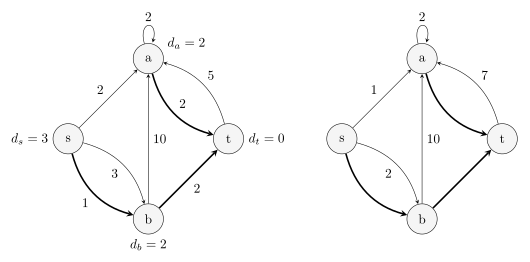
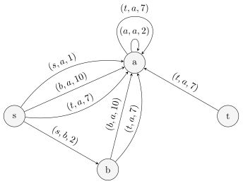

前置知识：[Dijstra 算法](./shortest-path.md#dijkstra-算法)、[A\* 算法](../search/astar.md)、[可持久化可并堆](../ds/persistent-heap.md)

## 问题描述

给定一个有 $n$ 个结点，$m$ 条边的有向图，求从 $s$ 到 $t$ 的所有不同路径中的第 $k$ 短路径的长度．

???+ info "「路径」"
    本文所指的「路径」允许经过同一条边或同一个结点多次，因此严格的名称应为「[途径](./concept.md#路径)」而非「路径」．本文讨论的问题严格地说也是 **第 $k$ 短途径**（$k$ shortest walk）问题．但是，本文依据习惯仍然采用「路径」这一名称，而对于不自交的路径则称为「简单路径」．

## A\* 算法

A\* 算法是一个搜索算法．它为每个当前状态 $x$ 都设置了一个估价函数 $f(x)=g(x)+h(x)$，其中 $g(x)$ 为从初始状态到达当前状态的实际代价，$h(x)$ 为从当前状态到达目标状态的最佳路径的估计代价．搜索时，每次取出 $f(x)$ 最优的状态 $x$，扩展其所有后继状态．可以用 **优先队列** 来维护这个值．

在求解 $k$ 短路问题时，令 $h(x)$ 为从当前结点到达终点 $t$ 的最短路径长度．可以通过在反向图上对结点 $t$ 跑单源最短路预处理出每个结点的这个值．对于每个状态需要记录两个值，即当前到达的结点 $x$ 和已经走过的距离 $g(x)$，将这种状态记为 $(x,g(x))$．开始时，将初始状态 $(s,0)$ 加入优先队列．每次取出估价函数 $f(x)=g(x)+h(x)$ 最小的一个状态，枚举该状态所在结点 $x$ 的所有出边，将对应的后继状态加入优先队列．当访问到一个结点第 $k$ 次时，对应状态的 $g(x)$ 就是从起始结点 $s$ 到该结点的第 $k$ 短路的长度．

这一搜索过程可以优化．由于只需要求出从初始结点到目标结点的第 $k$ 短路，所以已经取出的状态到达一个结点的次数大于 $k$ 次时，可以不扩展其后继状态．这一状态不会影响到最后的答案．这是因为之前 $k$ 次取出该结点时，已经形成了到达该结点的 $k$ 条合法路径，足以构造到达目标结点的前 $k$ 条最短路．

若使用优先队列优化 Dijkstra 算法，由于至多会将所有边加入优先队列 $k$ 次，所以算法的时间复杂度是 $O(km\log km)$ 的，空间复杂度是 $O(km)$ 的．相较于直接搜索，A\* 算法针对目标结点 $t$ 进行了剪枝，但这仅仅改良了常数，而非渐近复杂度．本节所述算法虽然复杂度并不优秀，但是可以在相同的复杂度内求出从起始点 $s$ 到（以 $t$ 为根的最短路树中）每个结点的前 $k$ 短路．

### 实现

??? example "模板题 [Library Checker - K-Shortest Walk](https://judge.yosupo.jp/problem/k_shortest_walk) 参考实现"
    ```cpp
    --8<-- "docs/graph/code/k-shortest-walk/k-shortest-walk-1.cpp"
    ```

## 可持久化可并堆做法

前述算法实际上求出了到达所有结点的 $k$ 短路．如果仅仅是想要求得到达给定目标结点 $t$ 的 $k$ 短路，实际上可以做得更快．本节提供了一种基于可持久化可并堆的 $O(m\log m+k\log k)$ 的做法．

### 最短路树与偏离边

前述算法的瓶颈在于只有到达目标结点 $t$ 时才会更新答案．但是，不同路径之间可能相差并不大．例如，次短路区别于最短路，可能仅仅是在一条边处多绕了一个结点，而路径的其他部分都是相同的；前述算法却可能需要重复搜索一遍这些相同的边才能找到次短路．由于只有绕路部分才是关键的，所以，要得到前 $k$ 条最短的路径，只需要考虑代价最小的 $k$ 种绕路方式即可．这就引出了最短路树的概念．

在反向图上从目标结点 $t$ 开始跑单源最短路，记录每个结点 $x$ 到 $t$ 的最短路长度 $h(x)$，并记录从结点 $x$ 开始的最短路经过的第一条边 $f_x$；如果有多个最优的选择，选择任意一条即可．所有这些边 $f_x$ 及其端点就构成一棵树，且从树上的每个结点 $x$ 到根节点 $t$ 的简单路径都是 $x$ 到 $t$ 的一条最短路径．这就是 **最短路树**  $T$．

求得最短路树 $T$ 后，就可以计算每条不在 $T$ 上的边会多绕多少路．对于边 $e=(u,v)\notin T$，边权为 $w$，可以定义一条新的边，仍然从 $u$ 指向 $v$，且代价为 $\Delta(e)=w + h(v) - h(u)$．本文形象地称这些权值为 $\Delta(e)$ 的边为 **偏离边**（sidetrack），权值 $\Delta(e)$ 则称为偏离成本．如果一条边的端点并非全部在最短路树 $T$ 里，它就不会影响到达结点 $t$ 的 $k$ 短路的计算，可以直接将它们删掉．

下图左侧是有向图 $G$，右侧是它对应的最短路树 $T$（粗边）和相应的偏离边（细边）：



设一条从 $s$ 到 $t$ 的路径经过的边集为 $P$，去掉 $P$ 中与 $T$ 的交集得到 $P'$．那么，将 $P'$ 中的边顺次排列，它相邻的两条边 $e_1=(u_1,v_1)$ 和 $e_2=(u_2,v_2)$ 一定满足

-   条件 $(*)$：后者的起点 $u_2$ 是前者的终点 $v_1$ 在最短路树 $T$ 的祖先（包括其自身）．

这是因为对应的原始路径 $P$ 中，$v_1$ 和 $u_2$ 之间连接了若干条 $T$ 中的树边．反过来，对于一个满足条件 $(*)$ 的边集 $P'$，一定存在唯一一条图 $G$ 中的路径 $P$ 与之对应．这是因为 $v_1$ 和 $u_2$ 在最短路树 $T$ 上的简单路径是唯一的．这样就说明，原图中的任意路径 $P$ 与满足条件 $(*)$ 的偏离边序列 $P'$ 一一对应．而且，路径 $P$ 的长度就等于最短路长度 $h(s)$ 与这些偏离成本的和：

$$
h(s)+\sum_{e\in P'}\Delta(e).
$$

这些讨论说明，寻找 $k$ 短路的任务转化为寻找成本第 $k$ 小且满足条件 $(*)$ 的偏离边序列 $P'$ 的任务．

为处理条件 $(*)$，与其每次查询时在最短路树上寻找祖先，不如直接将每个结点的偏离边集合下传到最短路树上的子孙结点．这相当于建了下面这样的图 $G'$：



在这个图上，条件 $(*)$ 就转化为要求 $P'$ 中的边首尾相接，也就是说，$P'$ 是图 $G'$ 中的一条路径．问题进一步转化为在这个图中寻找从 $s$ 出发的长度第 $k$ 小的 **到达任意结点的** 路径．相对于原始的 $k$ 短路问题，此处不再要求路径一定要结束在目标结点 $t$．

转化后的问题很容易解决．直接从起始结点 $s$ 处出发，求单源最短路．每次从优先队列中取出一个结点时，就相当于找到了一条图 $G'$ 中的路径，也就对应着图 $G$ 中一条到达目标结点 $t$ 的路径．

### 可持久化可并堆优化

算法思路已经明晰．但是，朴素实现这一算法的复杂度过高．由于图 $G'$ 中，单个结点处边的规模可能是 $\Theta(m)$ 的，所以每次求单源最短路时，都可能需要将规模为 $\Theta(m)$ 的边集压入优先队列．实际上，没有必要将所有边都压入优先队列：很多情况下，压入队列的这些边，只有最短的那些可能会在后续计算中弹出队列．也就是说，完全可以将单个结点处的整个边集作为一个存储单元压入优先队列，每次只要能够快速访问边集中的最短边即可．

这启发我们使用小根堆来存储单个结点处的边集．在求单源最短路的优先队列中，只需要存储这些堆，它们的成本就是堆顶元素对应的最短路成本．每次弹出队首时，都需要一并从队首的堆中弹出堆顶边．然后，既要将弹出堆顶后的堆压回优先队列，也需要将堆顶边终点处的偏离边集合对应的堆顶压入优先队列．

使用堆来存储边集也解决了沿最短路树下传边集的问题．因为下传边集相当于需要将当前结点的边集合并到它的子结点，所以，堆还需要支持合并操作；合并到子结点的同时，还不能破坏当前结点处的边集，所以，堆还需要支持可持久化．这正是可持久化可并堆．

由此，就得到算法的完整过程：

1.  从目标结点 $t$ 出发，跑单源最短路，求出最短路树．
2.  为最短路树上的每个结点都构建对应的偏离边集合，存储到可持久化可并堆里．
3.  沿着最短路树的边，从目标结点 $t$ 开始，将每个结点处的堆都合并到子结点的堆里．
4.  从起始结点 $s$ 出发，将该处的堆压入优先队列．
5.  弹出队首的堆，记录答案，再将弹出堆顶后的堆压回优先队列，并将堆顶边的终点处的堆压入优先队列．

一般采用左偏树或随机堆实现可持久化可并堆．此时，最后一步还可以继续优化．这些堆的内部结构都是二叉树．弹出堆顶后，原本是要合并左右两个子结点，再将合并后的堆顶压入优先队列的；但是，本算法中，可以不执行合并操作，直接将两个子结点对应的堆分别压入优先队列．这样就省去了单次合并的 $O(\log m)$ 的复杂度．由于每次弹出队首堆后，至多会将三个新的堆压入优先队列，所以，优先队列的大小是 $O(k)$ 的．这样，单次查询的时间复杂度就降低到 $O(\log k)$．总查询复杂度就是 $O(k\log k)$ 的．

由于构建最短路树和构建可持久化可并堆的复杂度都是 $O(m\log m)$ 的，所以，算法的总时间复杂度为 $O(m\log m+k\log k)$ 的．

### 实现

??? example "模板题 [Library Checker - K-Shortest Walk](https://judge.yosupo.jp/problem/k_shortest_walk) 参考实现"
    ```cpp
    --8<-- "docs/graph/code/k-shortest-walk/k-shortest-walk-2.cpp"
    ```

## 习题

-   [「SDOI2010」魔法猪学院](https://www.luogu.com.cn/problem/P2483)

## 参考资料与注释

-   [\[Tutorial\] k shortest paths and Eppstein's algorithm by meooow - Codeforces](https://codeforces.com/blog/entry/102085)
