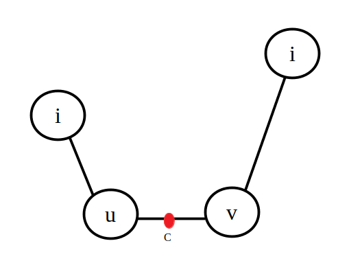

在学习最小直径生成树（Minimum Diameter Spanning Tree）前建议先阅读 [树的直径](./tree-diameter.md) 的内容。

在无向图的所有生成树中，直径最小的那一棵生成树就是最小直径生成树。

## 图的绝对中心

求解直径最小生成树，首先需要找到 **图的绝对中心**，**图的绝对中心** 可以存在于一条边上或某个结点上，该中心到所有点的最短距离的最大值最小。

根据 **图的绝对中心** 的定义可以知道，到绝对中心距离最远的结点至少有两个。

令 $d(i,j)$ 为顶点 $i,j$ 间的最短路径长，通过多源最短路算法求出所有结点的最短路。

$\textit{rk}(i,j)$ 记录点 $i$ 到其他所有结点中第 $j$ 小的那个结点。

图的绝对中心可能在某条边上，枚举每一条边 $w=(u,v)$，并且假设图的绝对中心 $c$ 就在这条边上。那么距离 $u$ 的长度为 $x$（$x \leq w$），距离 $v$ 的长度就是 $w - x$。

对于图中的任意一点 $i$，图的绝对中心 $c$ 到 $i$ 的距离为 $d(c,i)=\min(d(u,i) + x, d(v,i) + (w - x))$。

举例一个结点 $i$，该结点与图的绝对中心的位置关系如下图。



随着图的绝对中心 $c$ 在边上的改变会生成一个距离与 $c$ 位置的函数图像。显然的，当前的 $d(c,i)$ 的函数图像是一个两条斜率相同的线段构成的折线段。


对于图上的任意一结点，图的绝对中心到最远距离结点的函数就写作 $f = \max\{ d(c,i)\},i \in[1,n]$，其函数图像如下。


并且这些折线交点中的最低点，横坐标就是图的绝对中心的位置。

图的绝对中心可能在某个结点上，用距离预选结点最远的那个结点来更新，即 $\textit{ans}\leftarrow \min(\textit{ans},d(i,\textit{rk}(i,n))\times 2)$。

### 算法流程

1. 使用多源最短路算法（[Floyd](shortest-path.md#floyd)，[Johnson](shortest-path.md#johnson) 等），求出 $d$ 数组；

2. 求出 $\textit{rk}(i,j)$，并将其升序排序；

3. 图的绝对中心可能在某个结点上，用距离预选结点最远的那个结点来更新，遍历所有结点并用 $\textit{ans}\leftarrow \min(\textit{ans},d(i,\textit{rk}(i,n)) \times 2)$ 更新最小值。

4. 图的绝对中心可能在某条边上，枚举所有的边。对于一条边 $w(u,v)$ 从距离 $u$ 最远的结点开始更新。当出现 $d(v,\textit{rk}(u,i)) > \max_{j=i+1}^n d(v,\textit{rk}(u,j))$ 的情况时，用 $\textit{ans}\leftarrow  \min(\textit{ans}, d(u,\textit{rk}(u,i))+\max_{j=i+1}^n d(v,\textit{rk}(u,j))+w(u,v))$ 来更新。因为这种情况会使图的绝对中心改变。

??? note "参考实现"
    ```cpp
    bool cmp(int a, int b) { return val[a] < val[b]; }
    
    void Floyd() {
      for (int k = 1; k <= n; k++)
        for (int i = 1; i <= n; i++)
          for (int j = 1; j <= n; j++) d[i][j] = min(d[i][j], d[i][k] + d[k][j]);
    }
    
    void solve() {
      Floyd();
      for (int i = 1; i <= n; i++) {
        for (int j = 1; j <= n; j++) {
          rk[i][j] = j;
          val[j] = d[i][j];
        }
        sort(rk[i] + 1, rk[i] + 1 + n, cmp);
      }
      int ans = INF;
      // 图的绝对中心可能在结点上
      for (int i = 1; i <= n; i++) ans = min(ans, d[i][rk[i][n]] * 2);
      // 图的绝对中心可能在边上
      for (int i = 1; i <= m; i++) {
        int u = a[i].u, v = a[i].v, w = a[i].w;
        for (int p = n, i = n - 1; i >= 1; i--) {
          if (d[v][rk[u][i]] > d[v][rk[u][p]]) {
            ans = min(ans, d[u][rk[u][i]] + d[v][rk[u][p]] + w);
            p = i;
          }
        }
      }
    }
    ```

### 例题

- [CodeForce 266D BerDonalds](https://codeforces.ml/contest/266/problem/D)

## 最小直径生成树

根据图的绝对中心的定义，容易得知图的绝对中心是最小直径生成树的直径的中点。

求解最小直径生成树首先需要找到图的绝对中心。以图的绝对中心为起点，生成一个最短路径树，那么就可以得到最小直径生成树了。

??? note "参考实现"
    ```cpp
    #include <bits/stdc++.h>
    using namespace std;
    const int MAXN = 502;
    typedef long long ll;
    typedef pair<int, int> pii;
    ll d[MAXN][MAXN], dd[MAXN][MAXN], rk[MAXN][MAXN], val[MAXN];
    const ll INF = 1e17;
    int n, m;
    bool cmp(int a, int b) { return val[a] < val[b]; }
    void floyd() {
      for (int k = 1; k <= n; k++)
        for (int i = 1; i <= n; i++)
          for (int j = 1; j <= n; j++) d[i][j] = min(d[i][j], d[i][k] + d[k][j]);
    }
    struct node {
      ll u, v, w;
    } a[MAXN * (MAXN - 1) / 2];
    void solve() {
      //求图的绝对中心
      floyd();
      for (int i = 1; i <= n; i++) {
        for (int j = 1; j <= n; j++) {
          rk[i][j] = j;
          val[j] = d[i][j];
        }
        sort(rk[i] + 1, rk[i] + 1 + n, cmp);
      }
      ll P = 0, ansP = INF;
      //在点上
      for (int i = 1; i <= n; i++) {
        if (d[i][rk[i][n]] * 2 < ansP) {
          ansP = d[i][rk[i][n]] * 2;
          P = i;
        }
      }
      //在边上
      int f1 = 0, f2 = 0;
      ll disu = INT_MIN, disv = INT_MIN, ansL = INF;
      for (int i = 1; i <= m; i++) {
        ll u = a[i].u, v = a[i].v, w = a[i].w;
        for (int p = n, i = n - 1; i >= 1; i--) {
          if (d[v][rk[u][i]] > d[v][rk[u][p]]) {
            if (d[u][rk[u][i]] + d[v][rk[u][p]] + w < ansL) {
              ansL = d[u][rk[u][i]] + d[v][rk[u][p]] + w;
              f1 = u, f2 = v;
              disu = (d[u][rk[u][i]] + d[v][rk[u][p]] + w) / 2 - d[u][rk[u][i]];
              disv = w - disu;
            }
            p = i;
          }
        }
      }
      cout << min(ansP, ansL) / 2 << '\n';
      //最小路径生成树
      vector<pii> pp;
      for (int i = 1; i <= 501; ++i)
        for (int j = 1; j <= 501; ++j) dd[i][j] = INF;
      for (int i = 1; i <= 501; ++i) dd[i][i] = 0;
      if (ansP <= ansL) {
        for (int j = 1; j <= n; j++) {
          for (int i = 1; i <= m; ++i) {
            ll u = a[i].u, v = a[i].v, w = a[i].w;
            if (dd[P][u] + w == d[P][v] && dd[P][u] + w < dd[P][v]) {
              dd[P][v] = dd[P][u] + w;
              pp.push_back({u, v});
            }
            u = a[i].v, v = a[i].u, w = a[i].w;
            if (dd[P][u] + w == d[P][v] && dd[P][u] + w < dd[P][v]) {
              dd[P][v] = dd[P][u] + w;
              pp.push_back({u, v});
            }
          }
        }
        for (auto [x, y] : pp) cout << x << ' ' << y << '\n';
      } else {
        d[n + 1][f1] = disu;
        d[f1][n + 1] = disu;
        d[n + 1][f2] = disv;
        d[f2][n + 1] = disv;
        a[m + 1].u = n + 1, a[m + 1].v = f1, a[m + 1].w = disu;
        a[m + 2].u = n + 1, a[m + 2].v = f2, a[m + 2].w = disv;
        n += 1;
        m += 2;
        floyd();
        P = n;
        for (int j = 1; j <= n; j++) {
          for (int i = 1; i <= m; ++i) {
            ll u = a[i].u, v = a[i].v, w = a[i].w;
            if (dd[P][u] + w == d[P][v] && dd[P][u] + w < dd[P][v]) {
              dd[P][v] = dd[P][u] + w;
              pp.push_back({u, v});
            }
            u = a[i].v, v = a[i].u, w = a[i].w;
            if (dd[P][u] + w == d[P][v] && dd[P][u] + w < dd[P][v]) {
              dd[P][v] = dd[P][u] + w;
              pp.push_back({u, v});
            }
          }
        }
        cout << f1 << ' ' << f2 << '\n';
        for (auto [x, y] : pp)
          if (x != n && y != n) cout << x << ' ' << y << '\n';
      }
    }
    void init() {
      for (int i = 1; i <= 501; ++i)
        for (int j = 1; j <= 501; ++j) d[i][j] = INF;
      for (int i = 1; i <= 501; ++i) d[i][i] = 0;
    }
    int main() {
      init();
      cin >> n >> m;
      for (int i = 1; i <= m; ++i) {
        ll u, v, w;
        cin >> u >> v >> w;
        w *= 2;
        d[u][v] = w, d[v][u] = w;
        a[i].u = u, a[i].v = v, a[i].w = w;
      }
      solve();
      return 0;
    }
    ```

### 例题

[SPOJ MDST](https://www.spoj.com/problems/MDST/)

[timus 1569. Networking the "Iset"](https://acm.timus.ru/problem.aspx?space=1&num=1569)

[SPOJ PT07C - The GbAaY Kingdom](https://www.spoj.com/problems/PT07C)

## 参考文献

[Play with Trees Solutions The GbAaY Kingdom](https://adn.botao.hu/adn-backup/blog/attachments/month_0705/32007531153238.pdf)
