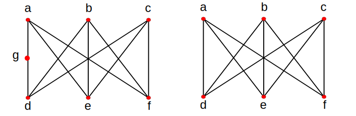
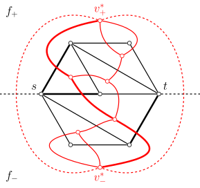

本文介绍（可）平面图及其相关概念．

## 平面图

如果图 $G$ 能画在平面 $S$ 上，即除顶点处外无边相交，则称 $G$ 可嵌入平面 $S$，$G$ 为 **可平面图**（planar graph）．画出的没有边相交的图称为 $G$ 的平面表示或 **平面嵌入**（planar embedding）．可平面图的这个平面嵌入也称为 **平面图**（plane graph）．

???+ info "「平面图」"
    不同中文文本中，「平面图」的含义可能不同．在本文的定义中，可平面图是一个图论对象，它可能以不同的方式嵌入平面中；平面图则是一个几何对象，除了图论结构外，它还需要指定图的绘制方式．同一个可平面图往往对应着多个平面图．因此，本文叙述的结论如果只依赖于图论结构，将使用「可平面图」一词；如果还依赖于图的平面嵌入方式，将使用「平面图」一词．

以下是平面图的简单例子：

（左：蝴蝶图；右：$4$ 阶完全图 $K_4$）

以下是不可平面图的简单例子：

（左：$5$ 阶完全图 $K_5$；右：两部分各 $3$ 个顶点的完全二分图 $K_{3,3}$）

## 性质

本节介绍平面图的性质．

### 面及其次数

设 $G$ 是平面图，由 $G$ 的边将 $G$ 所在的平面划分成若干个区域，每个区域称为 $G$ 的一个 **面**（face）．其中，无界的面称为 **无限面**（unbounded face）或 **外部面**（external face），有界的称为有限面或内部面．每一个平面图有且仅有一个外部面．

包围每个面的所有边组成的回路称为该面的 **边界**（boundary），并称边界中的边与该面 **关联**（incident）．边界的长度称为该面的 **次数**（degree）．计算面的次数时，每条割边都算作两次．平面图中所有面的次数之和等于边数 $|E|$ 的 $2$ 倍．

平面图中，$1$ 次面的边界对应于图的自环，$2$ 次面的边界通常对应于图的一对重边[^face-2]．顶点数 $|V|\ge 3$ 的简单连通平面图中，所有面次数都至少为 $3$．

### 欧拉公式

平面图的一个重要性质是 **欧拉公式**（Euler's formula）．它给出了图的顶点数 $|V|$、边数 $|E|$ 和面数 $|F|$ 之间的关系．

???+ note "欧拉公式"
    对于连通的平面图 $G$，有
    
    $$
    |V| - |E| + |F| = 2.
    $$

??? note "证明"
    对于面数 $|F|$ 应用数学归纳法．归纳起点是 $|F|=1$．此时，平面图有且只有一个外部面，全部边都是割边．所以，图 $G$ 是一棵树，必然有 $|E|=|V|-1$，代入欧拉公式就可以发现它成立．假设欧拉公式对于面数 $|F| = k$ 的平面图成立．对于面数 $|F|=k + 1$ 的平面图 $G$，必然存在非割边 $e$，它是两个不同的面的公共边．将边 $e$ 从图中删除，得到图 $G-e$，它有 $|V|$ 个顶点、$|E|-1$ 条边和 $|F|-1$ 个面．由归纳假设，对图 $G-e$ 成立欧拉公式，即 $|V|-(|E|-1)+(|F|-1)=2$，整理就得到关于图 $G$ 的欧拉公式．所以，根据数学归纳法，欧拉公式对于所有平面图都成立．

???+ note "推论"
    对于有 $k$ 个连通分支的平面图 $G$，有
    
    $$
    |V| - |E| + |F| = k + 1.
    $$

??? note "证明"
    图 $G$ 的每个连通分支都是平面图，但是这些连通分支共用同一个外部面．所以，直接对这些连通分支应用欧拉公式，并累加到一起，总顶点数和总边数都是正确的，但是总面数多了 $(k-1)$，因为唯一的外部面总共计数了 $k$ 次．将这一修正考虑在内，就得到 $|V|-|E|+|F| = 2k - (k-1) = k+1$．

由此，可以推出平面图的边与顶点的数量关系．

???+ note "定理"
    对于有 $k$ 个连通分支的平面图 $G$，如果图 $G$ 的每个面次数都至少为 $l \ge 3$，那么有
    
    $$
    |E| \le \dfrac{l}{l-2}(|V|-k-1).
    $$

??? note "证明"
    因为 $G$ 的各面的次数至少为 $l$，所以所有面的次数和至少为 $l|F|$，亦即 $2|E| \ge l|F|$．代入欧拉公式的推论 $|V| - |E| + |F| = k + 1$，就得到
    
    $$
    2|E| \ge l(k + 1 - |V| + |E|).
    $$
    
    利用 $l \ge 2$ 解出 $|E|$，就得到
    
    $$
    |E| \le \dfrac{l}{l-2}(|V|-k-1).
    $$

???+ note "推论"
    设 $G$ 是简单可平面图，且 $|V|\ge 3$，那么，有
    
    $$
    |E| \le 3|V|-6.
    $$

??? note "证明"
    当 $G$ 连通时，所有面次数都至少是 $3$．在上述定理中，取 $k=1$ 且 $l=3$，就得到 $|E|\le 3|V|-6$．
    
    当 $G$ 不连通时，分为两种情形：
    
    -   如果存在连通分支顶点数至少是 $3$，那么对这些顶点数至少为 $3$ 的连通分支可以分别建立不等式 $|E_i|\le 3|V_i|-6$．因为那些顶点数小于 $3$ 的连通分支一定有 $|E_i|\le |V_i| \le 3|V_i|$．将所有连通分支对应的不等式相加，就得到 $|E|\le 3|V|-6$．
    -   如果所有连通分支顶点数都小于 $3$，那么整体一定有 $|E|\le |V|$．又因为 $|V|\ge 3$ 时，$|V|\le 3|V|-6$，所以 $|E|\le 3|V|-6$ 仍然成立．
    
    综上，命题得证．

这一推论说明，简单可平面图是稀疏图．

### 对偶图

平面图都有相应的（几何）对偶图．

设 $G$ 是平面图，可以绘制图 $G^*$ 如下：

1.  在 $G$ 的每个面 $f_i$ 内部都绘制一个点 $v_i^*$．
2.  对 $G$ 的每条边 $e$，如果 $e$ 在面 $f_i$ 和 $f_j$ 的公共边界上，就绘制一条连接 $v_i^*$ 和 $v_j^*$ 的边 $e^*$，使之与 $e$ 恰相交一次，且不与其他图 $G$ 或图 $G^*$ 的边相交．特别地，当 $e$ 只出现在一个面 $f_i$ 的边界上时，需要绘制一条与 $v_i^*$ 关联的自环，使之与 $e$ 相交．

这样得到的图 $G^*$ 就称作图 $G$ 的 **对偶图**（dual graph）．

???+ note "定理"
    设图 $G^*$ 是平面图 $G$ 的对偶图．那么，图 $G^*$ 是连通的平面图．而且，图 $G^{**}$ 与 $G$ 同构，当且仅当 $G$ 是连通图．

??? note "证明"
    图 $G^*$ 是平面图这一点可以由它的构造过程保证．还需要证明图 $G^*$ 是连通的．对于图 $G^*$ 中任意两个顶点 $v^*_i,v^*_j$，设平面中连接 $v^*_i$ 和 $v^*_j$ 的直线段经过图 $G$ 中的面和边依次为 $f_i,e_{s_1},f_{s_1},\cdots,f_{s_{r-1}},e_{s_r},f_j$，它们分别对应对偶图中的顶点和边 $v_i^*,e_{s_1}^*,v^*_{s_1},\cdots,v^*_{s_{r-1}},e^*_{s_r},v^*_j$．由图 $G^*$ 的构造可知，序列中相邻的顶点和边是相关联的，所以，这描述了图 $G^*$ 中的一条途径．所以，图 $G^*$ 是连通的．
    
    图 $G^{**}$ 是图 $G^*$ 的对偶图，必然是连通的．所以，$G$ 与 $G^{**}$ 同构，必要条件是图 $G$ 连通．接下来，需要证明这一条件也是充分的．为此，只需要证明当图 $G$ 连通时，图 $G$ 满足图 $G^*$ 的对偶图的构造要求．因为图 $G^*$ 的边和图 $G$ 的边天然是对应的，所以，只需要证明图 $G^*$ 的每一个面都恰好包含图 $G$ 的一个顶点．对于图 $G^*$ 的任一个面 $f^*$，设 $e^*$ 是它边界上的一条边，那么图 $G$ 中相对应的边 $e$ 的端点之一必然在面 $f^*$ 之内；因此，面 $f^*$ 中至少存在图 $G$ 的一个顶点．由于图 $G^*$ 和图 $G$ 都是连通的，欧拉公式成立；而图 $G$ 和图 $G^*$ 边数相同，图 $G$ 的面数等于图 $G^*$ 的顶点数，所以图 $G$ 的顶点数就等于图 $G^*$ 的面数．所以，图 $G^*$ 的每个面都恰好只有图 $G$ 的一个顶点．命题得证．

平面图与其对偶图的结构之间有很多对应关系：

-   $G$ 中的面对应 $G^*$ 中的点，$G$ 中的边对应 $G^*$ 中的边，$G$ 中的点对应 $G^*$ 中的面．
-   $G$ 中的自环对应 $G^*$ 中的割边，$G^*$ 中的自环对应 $G$ 中的割边．
-   $G$ 中的边割集对应 $G^*$ 中的回路，$G^*$ 中的回路对应 $G$ 中的边割集．

需要注意的是，对偶图的概念仅对具体的平面图成立，而无法定义在任意可平面图上．事实上，两个同构的平面图的对偶图未必是同构的．也就是说，同一个图的不同平面嵌入的对偶图可能并不相同．

???+ example "例子"
    下图画了两个同构的平面图，它们的对偶图并不同构．
    
    
    
    对偶图不同构的原因是，右图有一次面，它的对偶图有一度顶点，而左图没有．

将平面图的问题转化到对偶图上，有时更容易解决．一个典型的例子是，平面图 [最小割](./flow/min-cut.md) 问题可以转化为对偶图 [最短路](./shortest-path.md) 问题．设 $G$ 是带边权的平面图，$s,t$ 是它的两个顶点，需要求最小的 $s$-$t$ 割．

如图所示，通过选取合适的平面嵌入，总是可以使得 $s,t$ 出现在图 $G$ 外部面边界上．另外，添加自 $s$ 和 $t$ 延伸出去的射线，将外部面分为两部分 $f_{+}$ 和 $f_{-}$．基于该图，建立对偶图，并将边权赋给对偶图中的对应边．那么，对偶图 $G^*$ 中面 $f_{+}$ 和 $f_{-}$ 对应顶点之间的路径（红色粗线）就和图 $G$ 的 $s$-$t$ 割（黑色粗线）之间一一对应，且二者权值相同．这样，求解对偶图中的最短路，就得到了对偶图中的最小 $s$-$t$ 割．

### 更多结果

当然，平面图还有很多著名的结果．本节简单列举它们，但并不做出讨论．

???+ note "四色定理"
    （没有自环的）平面图都是可 $4$‑着色的．

???+ note "Fáry 定理"
    简单可平面图总是存在一种平面嵌入，使得图的所有边都是直线段．

???+ note "定理（Wood）"
    可平面图至多只有 $8|V|-16$ 个极大团．

???+ note "定理（Tutte）"
    $4$‑点连通的可平面图都是哈密顿图．

## 判定

本节讨论给定一个图，判定它是不是可平面图的方法．

### 禁用图

可平面图最经典的刻画方式是利用 **禁用图**（forbidden graph）给出的．

首先，$K_5$ 和 $K_{3,3}$ 不是可平面图．

???+ note "定理"
    $K_5$ 和 $K_{3,3}$ 不是可平面图．

??? note "证明"
    前文说明，$|V|\ge 3$ 的简单连通平面图都需要满足
    
    $$
    |E| \le \dfrac{l}{l-2}(|V|-2).
    $$
    
    其中，$l$ 是面次数的最小值．对于 $K_5$，有 $l=3,~|V|=5,~|E|=10$，所以 $K_5$ 不可能画成平面图．对于 $K_{3,3}$，有 $l=4,~|V|=6,~|E|=9$，所以 $K_{3,3}$ 不可能画成平面图．

事实上，它们就是使得一个图不可平面的最小结构．也就是说，只要图不（以某种方式）包含这两个图为子结构，该图就一定是可平面的．

第一个可平面性判定定理是 Kuratowski 定理．它用到了图同胚的概念：若两个图 $G_1$ 与 $G_2$ 同构，或通过反复插入或消去 $2$ 度顶点后是同构的，则称二者是 **同胚的**（homeomorphic）．由此，可以叙述如下结果：

???+ note "Kuratowski 定理"
    图 $G$ 是可平面图，当且仅当 $G$ 不含与 $K_5$ 或 $K_{3,3}$ 同胚的子图．

另外一个与此相关的定理是 Wagner 定理．它利用收缩操作来刻画可平面图．收缩操作是指，重复多次将图的一条边收缩为一个点．由此，可以叙述如下结果：

???+ note "Wagner 定理"
    图 $G$ 是可平面图，当且仅当 $G$ 中没有可以收缩到 $K_5$ 或 $K_{3,3}$ 的子图．

可平面图不包含这些类型的子图相对显然，所以这两个定理的关键部分都在于相应的禁用图条件的充分性．由于与 $K_5$ 或 $K_{3,3}$ 同胚的子图一定可以收缩到它们，反过来却未必成立，所以 Kuratowski 定理提供了一个更弱的也更容易检验的判定可平面图的条件．

### 平面性判定算法

尽管看起来并不容易，平面性判定问题实际上有很多线性算法．但是，由于这些算法的实现通常都比较复杂，它们几乎从未出现在算法竞赛中．

最早的线性算法是 Hopcroft–Tarjan 算法[^ht74]，但它的实现相当复杂．de Fraysseix–Ossona de Mendez–Rosenstiehl 算法（也称为 LR 平面性算法）[^dor06][^df08][^bra09]进一步改进了 Hopcroft–Tarjan 算法的流程，是目前最优秀的平面性判定算法之一．Python 的 NetworkX 库中就 [实现](https://github.com/networkx/networkx/blob/main/networkx/algorithms/planarity.py) 了这一算法．

另外一个同样优秀的算法是 Boyer–Myrvold 算法[^bm99][^bm04]．它可以在线性时间内判定给定图是否可平面．而且，如果图是可平面的，算法将输出一个平面嵌入；否则，算法将输出一个 Kuratowski 子图（即与 $K_5$ 或 $K_{3,3}$ 同胚的子图）．C++ 的 Boost 库就 [实现](https://www.boost.org/doc/libs/1_67_0/boost/graph/planar_detail/boyer_myrvold_impl.hpp) 了这一算法．

更多相关算法可以参考文末提供的文献．

## 特殊的平面图

本节介绍几类特殊的可平面图．

### 极大平面图

对于简单可平面图 $G$，如果在它的任意不相邻顶点间添加边，所得图都不再是可平面图，就称 $G$ 为 **极大可平面图**（maximal planar graph）．极大可平面图的平面嵌入称为 **极大平面图**．

???+ note "定理"
    极大可平面图 $G$ 必然连通．而且，当顶点数 $|V|\ge 3$ 时，图 $G$ 没有割边．

??? note "证明"
    如果可平面图 $G$ 不连通，那么任选它的一个平面嵌入，都可以选择属于不同连通分支的两个顶点，在外部面内连接起来，得到的图显然仍然是平面图，这说明图 $G$ 不是极大可平面图．所以，图 $G$ 是极大可平面图，就一定连通．
    
    如果可平面图 $G$ 顶点数 $|V|\ge 3$，且 $G$ 有割边 $e=(u,v)$，那么，删去边 $e$ 后的图 $G - e$ 中恰有两个连通分支，且 $u,v$ 属于不同的连通分支．假设 $v$ 所在连通分支至少有两个顶点．那么，可以先将 $u$ 所在连通分支 $G_1$ 画在平面上，并选取图 $G_1$ 中边界含有 $u$ 的任意面 $f$，并将另一个连通分支 $G_2$ 画在面 $f$ 中．由于 $G_2$ 是简单图，它的外部面的边界一定不是一个自环，故而至少还存在另一个顶点 $w\neq u,v$．将 $v,w$ 分别连接到 $u$ 上，就得到包含 $G$ 为子图的平面图．所以，图 $G$ 不是极大可平面图．因此，顶点数 $|V|\ge 3$ 的极大可平面图一定没有割边．

极大平面图的结构可以更准确地描述．

???+ note "定理"
    对于顶点数 $|V|\ge 3$ 的平面图 $G$，它是极大平面图当且仅当它是简单图，且它的每个面次数均为 $3$．

??? note "证明"
    条件的充分性显然．只需要说明必要性，即要证明：顶点数 $|V|\ge 3$ 的极大平面图 $G$ 中，每个面次数都是 $3$．由于图 $G$ 是连通简单平面图且 $|V|\ge 3$，所以全部面的次数都至少是 $3$．所以，假设命题不成立，就一定存在一个面 $f$ 的边界长度至少是 $4$．又因为图 $G$ 不存在割边，该边界只能是一个环．设这个环是 $v_1v_2v_3v_4\cdots v_1$．那么，如果 $v_1$ 与 $v_3$ 不相邻，那么在面 $f$ 内连接 $v_1$ 和 $v_3$ 不会破坏平面性，与 $G$ 的极大性矛盾，所以 $v_1$ 与 $v_3$ 相邻；同理，$v_2$ 与 $v_4$ 相邻．但是，边 $(v_1,v_3)$ 和 $(v_2,v_4)$ 都不会出现在面 $f$ 中．这意味着，两条边必然在面 $f$ 的外部．但这是不可能的：无论如何绘制，这两条边都必然相交．所以，图 $G$ 中不存在高于 $3$ 次的面．原命题得证．

???+ note "推论"
    对于顶点数 $|V|\ge 3$ 的图 $G$，总是有边数 $|E|=3|V|-6$ 且面数 $|F|=2|V|-4$．

由于极大平面图中，每个面都是由三条边围成，所以极大平面图也称为 **平面三角剖分**（plane triangulation）．

### 外平面图

设 $G$ 为可平面图，若 $G$ 存在平面嵌入 $\tilde{G}$，使得 $G$ 中所有顶点都在 $\tilde{G}$ 的一个面的边界上，则称 $G$ 为 **外可平面图**（outerplanar graph）．这一嵌入也称为外平面嵌入或 **外平面图**．通常将边界经过所有顶点的那个面绘制为外部面．

外可平面图都是可平面图，反之未必成立．外可平面图同样可以使用禁用图刻画．

???+ note "定理"
    一个图 $G$ 是外平面图有当且仅当 $G$ 中不含与 $K_4$ 或 $K_{2,3}$ 同胚的子图．

对于外可平面图，同样可以讨论极大外可平面图的概念．对于简单外可平面图 $G$，如果在它的任意不相邻顶点间添加边，所得图都不再是外可平面图，就称 $G$ 为 **极大外可平面图**（maximal outerplanar graph）．极大外可平面图的外平面嵌入称为 **极大外平面图**．极大外平面图其实就是平面上多边形的三角剖分．

???+ note "定理"
    对于顶点数 $|V|\ge 3$ 的极大外平面图 $G$，且所有顶点都在外部面的边界上，那么图 $G$ 恰有 $|V|-2$ 个内部面．

??? note "证明"
    对 $|V|$ 应用数学归纳法．归纳起点是 $|V|=3$．此时，图 $G$ 是三元环，只有 $1$ 个内部面，命题成立．假设命题对于 $|V| = k$ 成立．现在要证明，当 $|V| = k+1$ 时，命题仍然成立．
    
    首先，图 $G$ 一定存在 $2$ 度顶点．否则，除了外部面边界上相邻的顶点外，所有顶点都需要和第三个顶点相连接．不妨将外部面边界上的顶点顺次编号，并对每一个 $i = 1,2,\cdots,k+1$，都定义 $f(i)$ 为与顶点 $i$ 连接且编号不与之相邻的顶点的最小编号．考虑 $f(i)$ 的可能取值．首先，$1 < f(1)$．由于点 $1$ 已经和 $f(1)$ 连接，点 $2$ 与 $f(2)$ 的连线不能越过边 $(1,f(1))$，就必然有 $1 < 2 < f(2) < f(1)$．同理，$2 < 3 < f(3) < f(2)$．由于顶点只有有限多个，这个逐渐缩小的过程必然在有限步后终止．令 $i^*$ 为满足 $1 < \cdots < i-1 < i < f(i) < f(i-1) < \cdots < f(1)$ 的编号 $i$ 最大值．那么，由于点 $i^*$ 和点 $f(i^*)$ 不相邻，必然有 $i^* < i^* + 1 < f(i^*)$．而重复之前的论述，仍应该有 $i^* < i^*+1 < f(i^*+1) < f(i^*)$，这与 $i^*$ 的最大性矛盾．这一矛盾说明，图 $G$ 必然存在 $2$ 度顶点．
    
    设 $v$ 就是一个 $2$ 度顶点．将这一顶点从图 $G$ 中删除，就得到顶点数为 $k$ 的外平面图 $G-v$．它必然是极大外平面图，否则在它上面合法添加边的方法，必然对图 $G$ 也适用．由归纳假设，图 $G-v$ 恰有 $k-2$ 个内部面，而删去顶点 $v$ 时，恰好减少了一个图 $G$ 的内部面．所以，图 $G$ 内部面数目为 $k-1$．命题得证．

???+ note "定理"
    对于顶点数 $|V|\ge 3$ 的外平面图 $G$，且所有顶点都在外部面的边界上，那么图 $G$ 是极大外平面图，当且仅当图 $G$ 的外部面边界是长为 $|V|$ 的环，且所有内部面边界均是长为 $3$ 的环．

??? note "证明"
    充分性显然．事实上，考虑连接外部面边界上的两个不相邻顶点．如果连接发生在外部面中，那么，所有顶点无法都出现在一个面的边界上；否则，它们的连线必然与内部面的边界相交．
    
    接下来，证明必要性．假设图 $G$ 的外部面边界 $v_1v_2v_3\cdots v_nv_1~(n = |V|)$ 不是一个环．那么，它会重复经过一个顶点多次，亦即存在 $i\neq j$ 且 $i-j\neq\pm 1\pmod{n}$ 使得 $v_i=v_j$．不妨设 $1 < i < j < n$．此时，与 $v_{i-1}$ 相关联的边只能出现在回路 $v_jv_{j+1}\cdots v_nv_1\cdots v_{i-1}v_i$ 围成的有界区域内部，与 $v_{i+1}$ 相关联的边只能出现在回路 $v_iv_{i+1}\cdots v_{j-1}v_{j}$ 围成的有界区域内部，所以 $v_{i-1}$ 和 $v_{i+1}$ 无法相邻．可以在外部面内添加一条连接 $v_{i-1}$ 和 $v_{i+1}$ 的边 $e$，得到图 $G+e$．这显然也是平面图，且外部面边界上包含所有顶点．这就与图 $G$ 的极大外平面性矛盾．所以，图 $G$ 的外部面必然是长度为 $|V|$ 的环．而图 $G$ 内部面边界均为长为 $3$ 的环的原因，和极大平面图一致，不再赘述．

???+ note "推论"
    对于顶点数 $|V|\ge 3$ 的极大外平面图 $G$，有：
    
    1.  $|E|=2|V|-3$．
    2.  $G$ 中至少有 $3$ 个顶点度数小于等于 $3$，且至少有 $2$ 个顶点度数为 $2$．
    3.  $G$ 的点连通度为 $2$．

## 习题

-   [Luogu P3209 \[HNOI2010\] 平面图判定](https://www.luogu.com.cn/problem/P3209)
-   [Luogu P3249 \[HNOI2016\] 矿区](https://www.luogu.com.cn/problem/P3249)
-   [Luogu P4001 \[ICPC-Beijing 2006\] 狼抓兔子](https://www.luogu.com.cn/problem/P4001)
-   [Luogu P4073 \[WC2013\] 平面图](https://www.luogu.com.cn/problem/P4073)
-   [Luogu P7295 \[USACO21JAN\] Paint by Letters P](https://www.luogu.com.cn/problem/P7295)

## 参考资料与注释

-   [Planar graph - Wikipedia](https://en.wikipedia.org/wiki/Planar_graph)
-   [Planarity testing - Wikipedia](https://en.wikipedia.org/wiki/Planarity_testing)
-   Bondy, John Adrian, and Uppaluri Siva Ramachandra Murty. Graph theory with applications. Vol. 290. London: Macmillan, 1976.
-   Diestel, Reinhard. Graph theory. Vol. 173. Springer Nature, 2025.
-   Patrignani, Maurizio. "Planarity Testing and Embedding." (2013): 1-42.

[^face-2]: 但这并非唯一的可能．两个嵌套的自环也会形成二次面．另外，有二次面未必意味着图不是简单的，例如，一个只有一条边的图中，唯一的面（即外部面）也是二次的．

[^ht74]: Hopcroft, John, and Robert Tarjan. "Efficient planarity testing." Journal of the ACM (JACM) 21, no. 4 (1974): 549-568.

[^dor06]: De Fraysseix, Hubert, Patrice Ossona De Mendez, and Pierre Rosenstiehl. "Trémaux trees and planarity." International Journal of Foundations of Computer Science 17, no. 05 (2006): 1017-1029.

[^df08]: De Fraysseix, Hubert. "Trémaux trees and planarity." Electronic Notes in Discrete Mathematics 31 (2008): 169-180.

[^bra09]: Brandes, Ulrik. "The left-right planarity test." Manuscript submitted for publication 3 (2009).

[^bm99]: Boyer, John M., and Wendy J. Myrvold. "Stop Minding Your p's and q's: A Simplified O (n) Planar Embedding Algorithm." In SODA, vol. 99, pp. 140-146. 1999.

[^bm04]: Boyer, John M., and Wendy J. Myrvold. "Simplified o (n) planarity by edge addition." Graph Algorithms and Applications 5 (2006): 241.
