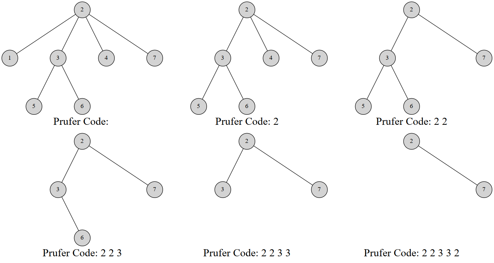

本文翻译自 [e-maxx Prufer Code](https://github.com/e-maxx-eng/e-maxx-eng/blob/master/src/graph/pruefer_code.md) 。另外解释一下，原文的结点是从 $0$ 开始标号的，本文我按照大多数人的习惯改成了从 $1$ 标号。

这篇文章介绍 Prufer 序列 (Prufer code)，这是一种将带标号的树用一个唯一的整数序列表示的方法。

使用 Prufer 序列可以证明凯莱定理 (Cayley's formula)。并且我们也会讲解如何计算在一个图中加边使图连通的方案数。

 **注意** ：我们不考虑含有 $1$ 个结点的树。

## Prufer 序列

Prufer 序列可以将一个带标号 $n$ 个结点的树用 $[1,n]$ 中的 $n-2$ 个整数表示。你也可以把它理解为完全图的生成树与数列之间的双射。

显然你不会想不开拿这玩意儿去维护树结构。这玩意儿常用组合计数问题上。

Heinz Prufer 于 1918 年发明这个序列来证明凯莱定理。

### 对树建立 Prufer 序列

Prufer 是这样建立的：每次选择一个编号最小的叶结点并删掉它，然后在序列中记录下它连接到的那个结点。重复 $n-2$ 次后就只剩下两个结点，算法结束。

显然使用堆可以做到 $O(n\log_2n)$ 的复杂度

```cpp
// 代码摘自原文，结点是从 0 标号的
vector<vector<int>> adj;

vector<int> pruefer_code() {
  int n = adj.size();
  set<int> leafs;
  vector<int> degree(n);
  vector<bool> killed(n, false);
  for (int i = 0; i < n; i++) {
    degree[i] = adj[i].size();
    if (degree[i] == 1) leafs.insert(i);
  }

  vector<int> code(n - 2);
  for (int i = 0; i < n - 2; i++) {
    int leaf = *leafs.begin();
    leafs.erase(leafs.begin());
    killed[leaf] = true;
    int v;
    for (int u : adj[leaf])
      if (!killed[u]) v = u;
    code[i] = v;
    if (--degree[v] == 1) leafs.insert(v);
  }
  return code;
}
```

给一个例子吧，这是一棵 7 个结点的树的 Prufer 序列构建过程：



最终的序列就是 $2,2,3,3,2$ 。

当然，也有一个线性的构造算法。

### 线性构造

线性构造的本质就是维护一个指针指向我们将要删除的结点。首先发现，叶结点数是非严格单调递减的。要么删一个，要么删一个得一个。（翻译到这突然就知道该怎么做了，然后对照原文发现没什么问题，于是自己口糊吧）

于是我们考虑这样一个过程：维护一个指针 $p$ 。初始时 $p$ 指向编号最小的叶结点。同时我们维护每个结点的度数，方便我们知道在删除结点的时侯是否产生新的叶结点。操作如下：

1.  删除 $p$ 指向的结点，并检查是否产生新的叶结点。
2.  如果产生新的叶结点，假设编号为 $x$ ，我们比较 $p,x$ 的大小关系。如果 $x>q$ ，那么不做其他操作；否则就立刻删除 $x$ ，然后检查删除 $x$ 后是否产生新的叶结点，重复 $2$ 步骤，直到未产生新节点或者新节点的编号 $>p$ 。
3.  让指针 $p$ 自增直到遇到一个未被删除叶结点为止；

循环上述操作 $n-2$ 次，就完成了序列的构造。接下来考虑算法的正确性。

 $p$ 是当前编号最小的叶结点，若删除 $p$ 后未产生叶结点，我们就只能去寻找下一个叶结点；若产生了叶结点 $x$ ：

-   如果 $x>p$ ，则反正 $p$ 往后扫描都会扫到它，于是不做操作；
-   如果 $x<p$ ，因为 $p$ 原本就是编号最小的，而 $x$ 比 $p$ 还小，所以 $x$ 就是当前编号最小的叶结点，优先删除。删除 $x$ 继续这样的考虑直到没有更小的叶结点。

算法复杂度分析，发现每条边最多被访问一次（在删度数的时侯），而指针最多遍历每个结点一次，因此复杂度是 $O(n)$ 的。

```cpp
// 从原文摘的代码，同样以 0 为起点
vector<vector<int>> adj;
vector<int> parent;

void dfs(int v) {
  for (int u : adj[v]) {
    if (u != parent[v]) parent[u] = v, dfs(u);
  }
}

vector<int> pruefer_code() {
  int n = adj.size();
  parent.resize(n), parent[n - 1] = -1;
  dfs(n - 1);

  int ptr = -1;
  vector<int> degree(n);
  for (int i = 0; i < n; i++) {
    degree[i] = adj[i].size();
    if (degree[i] == 1 && ptr == -1) ptr = i;
  }

  vector<int> code(n - 2);
  int leaf = ptr;
  for (int i = 0; i < n - 2; i++) {
    int next = parent[leaf];
    code[i] = next;
    if (--degree[next] == 1 && next < ptr) {
      leaf = next;
    } else {
      ptr++;
      while (degree[ptr] != 1) ptr++;
      leaf = ptr;
    }
  }
  return code;
}
```

### Prufer 序列的性质

1.  在构造完 Prufer 序列后原树中会剩下两个结点，其中一个一定是编号最大的点 $n$ 。
2.  每个结点在序列中出现的次数是其度数减 $1$ 。（没有出现的就是叶结点）

### 用 Prufer 序列重建树

重建树的方法是类似的。根据 Prufer 序列的性质，我们可以得到原树上每个点的度数。然后你也可以得到度数最小的叶结点编号，而这个结点一定与 Prufer 序列的第一个数连接。然后我们同时删掉这两个结点的度数。

讲到这里也许你已经知道该怎么做了。每次我们选择一个度数为 $1$ 的最小的结点编号，与当前枚举到的 Prufer 序列的点连接，然后同时减掉两个点的度。到最后我们剩下两个度数为 $1$ 的点，其中一个是结点 $n$ 。就把它们建立连接。使用堆维护这个过程，在减度数的过程中如果发现度数减到 $1$ 就把这个结点添加到堆中，这样做的复杂度是 $O(n\log_2n)$ 的。

```cpp
// 原文摘代码
vector<pair<int, int>> pruefer_decode(vector<int> const& code) {
  int n = code.size() + 2;
  vector<int> degree(n, 1);
  for (int i : code) degree[i]++;

  set<int> leaves;
  for (int i = 0; i < n; i++)
    if (degree[i] == 1) leaves.insert(i);

  vector<pair<int, int>> edges;
  for (int v : code) {
    int leaf = *leaves.begin();
    leaves.erase(leaves.begin());

    edges.emplace_back(leaf, v);
    if (--degree[v] == 1) leaves.insert(v);
  }
  edges.emplace_back(*leaves.begin(), n - 1);
  return edges;
}
```

### 线性时间重建树

同线性构造 Prufer 序列的方法。在删度数的时侯会产生新的叶结点，于是判断这个叶结点与指针 $p$ 的大小关系，如果更小就优先考虑它（原文讲得也很略所以我也不细讲啦）

```cpp
// 原文摘代码
vector<pair<int, int>> pruefer_decode(vector<int> const& code) {
  int n = code.size() + 2;
  vector<int> degree(n, 1);
  for (int i : code) degree[i]++;

  int ptr = 0;
  while (degree[ptr] != 1) ptr++;
  int leaf = ptr;

  vector<pair<int, int>> edges;
  for (int v : code) {
    edges.emplace_back(leaf, v);
    if (--degree[v] == 1 && v < ptr) {
      leaf = v;
    } else {
      ptr++;
      while (degree[ptr] != 1) ptr++;
      leaf = ptr;
    }
  }
  edges.emplace_back(leaf, n - 1);
  return edges;
}
```

通过这些过程其实可以理解，Prufer 序列与带标号无根树建立了双射关系。

## Cayley 定理

凯莱定理描述如下：所有群 $G$ 同构于在 $G$ 上的对称群的子群。

是不是一脸懵逼不知所措

还有另一种表述：完全图 $K_n$ 有 $n^{n-2}$ 棵生成树。

怎么证明？方法很多，但是用 Prufer 序列证是很简单的。任意一个长度为 $n-2$ 的值域 $[1,n]$ 的整数序列都可以通过 Prufer 序列双射对应一个生成树，于是方案数就是 $n^{n-2}$ 。

## 图连通方案数

Prufer 序列可能比你想得还强大。它能创造比凯莱定理更通用的公式。比如以下问题：

> 一个 $n$ 个点 $m$ 条边的带标号无向图有 $k$ 个连通块。我们希望添加 $k-1$ 条边使得整个图连通。求方案数。

设 $s_i$ 表示每个连通块的数量。我们对 $k$ 个连通块构造 Prufer 序列，然后你发现这并不是普通的 Prufer 序列。因为每个连通块的连接方法很多。不能直接淦就设啊。于是设 $d_i$ 为第 $i$ 个连通块的度数。由于度数之和是边数的两倍，于是 $\sum_{i=1}^kd_i=2k-2$ 。则对于给定的 $d$ 序列构造 Prufer 序列的方案数是

$$
\binom{k-2}{d_1-1,d_2-1,\cdots,d_k-1}=\frac{(k-2)!}{(d_1-1)!(d_2-1)!\cdots(d_k-1)!}
$$

对于第 $i$ 个连通块，它的连接方式有 ${s_i}^{d_i}$ 种，因此对于给定 $d$ 序列使图连通的方案数是

$$
\binom{k-2}{d_1-1,d_2-1,\cdots,d_k-1}\cdot \prod_{i=1}^k{s_i}^{d_i}
$$

现在我们要枚举 $d$ 序列，式子变成

$$
\sum_{d_i\ge 1，\sum_{i=1}^kd_i=2k-2}\binom{k-2}{d_1-1,d_2-1,\cdots,d_k-1}\cdot \prod_{i=1}^k{s_i}^{d_i}
$$

好的这是一个非常不喜闻乐见的式子。但是别慌！我们有多元二项式定理：

$$
(x_1 + \dots + x_m)^p = \sum_{\substack{c_i \ge 0 ,\  \sum_{i=1}^m c_i = p}} \binom{p}{c_1, c_2, \cdots ,c_m}\cdot \prod_{i=1}^m{x_i}^{c_i}
$$

那么我们对原式做一下换元，设 $e_i=d_i-1$ ，显然 $\sum_{i=1}^ke_i=k-2$ ，于是原式变成

$$
\sum_{e_i\ge 0，\sum_{i=1}^ke_i=k-2}\binom{k-2}{e_1,e_2,\cdots,e_k}\cdot \prod_{i=1}^k{s_i}^{e_i+1}
$$

化简得到

$$
(s_1+s_2+\cdots+s_k)^{k-2}\cdot \prod_{i=1}^ks_i
$$

即

$$
n^{k-2}\cdot\prod_{i=1}^ks_i
$$

这就是答案啦

## 习题

-    [UVA #10843 - Anne's game](https://uva.onlinejudge.org/index.php?option=com_onlinejudge&Itemid=8&category=20&page=show_problem&problem=1784) 
-    [Timus #1069 - Prufer Code](http://acm.timus.ru/problem.aspx?space=1&num=1069) 
-    [Codeforces - Clues](http://codeforces.com/contest/156/problem/D) 
-    [Topcoder - TheCitiesAndRoadsDivTwo](https://community.topcoder.com/stat?c=problem_statement&pm=10774&rd=14146) 
