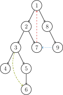

## 简介

在阅读下列内容之前，请务必了解 [图论相关概念](./concept.md) 中的基础部分。

强连通的定义是：有向图 G 强连通是指，G 中任意两个结点连通。

强连通分量（Strongly Connected Components，SCC）的定义是：极大的强连通子图。

这里要介绍的是如何来求强连通分量。

## Tarjan 算法

Robert E. Tarjan（罗伯特·塔扬，1948~），生于美国加州波莫纳，计算机科学家。

Tarjan 发明了很多算法和数据结构。不少他发明的算法都以他的名字命名，以至于有时会让人混淆几种不同的算法。比如求各种连通分量的 Tarjan 算法，求 LCA（Lowest Common Ancestor，最近公共祖先）的 Tarjan 算法。并查集、Splay、Toptree 也是 Tarjan 发明的。

我们这里要介绍的是在有向图中求强连通分量的 Tarjan 算法。

### DFS 生成树

在介绍该算法之前，先来了解 **DFS 生成树**，我们以下面的有向图为例：



有向图的 DFS 生成树主要有 4 种边（不一定全部出现）：

1. 树边（tree edge）：示意图中以黑色边表示，每次搜索找到一个还没有访问过的结点的时候就形成了一条树边。
2. 反祖边（back edge）：示意图中以红色边表示（即 $7 \rightarrow 1$），也被叫做回边，即指向祖先结点的边。
3. 横叉边（cross edge）：示意图中以蓝色边表示（即 $9 \rightarrow 7$），它主要是在搜索的时候遇到了一个已经访问过的结点，但是这个结点 **并不是** 当前结点的祖先。
4. 前向边（forward edge）：示意图中以绿色边表示（即 $3 \rightarrow 6$），它是在搜索的时候遇到子树中的结点的时候形成的。

我们考虑 DFS 生成树与强连通分量之间的关系。

如果结点 $u$ 是某个强连通分量在搜索树中遇到的第一个结点，那么这个强连通分量的其余结点肯定是在搜索树中以 $u$ 为根的子树中。结点 $u$ 被称为这个强连通分量的根。

反证法：假设有个结点 $v$ 在该强连通分量中但是不在以 $u$ 为根的子树中，那么 $u$ 到 $v$ 的路径中肯定有一条离开子树的边。但是这样的边只可能是横叉边或者反祖边，然而这两条边都要求指向的结点已经被访问过了，这就和 $u$ 是第一个访问的结点矛盾了。得证。

### Tarjan 算法求强连通分量

在 Tarjan 算法中为每个结点 $u$ 维护了以下几个变量：

1. $\textit{dfn}_u$：深度优先搜索遍历时结点 $u$ 被搜索的次序。
2. $\textit{low}_u$：在 $u$ 的子树中能够回溯到的最早的已经在栈中的结点。设以 $u$ 为根的子树为 $\textit{Subtree}_u$。$\textit{low}_u$ 定义为以下结点的 $\textit{dfn}$ 的最小值：$\textit{Subtree}_u$ 中的结点；从 $\textit{Subtree}_u$ 通过一条不在搜索树上的边能到达的结点。

一个结点的子树内结点的 dfn 都大于该结点的 dfn。

从根开始的一条路径上的 dfn 严格递增，low 严格非降。

按照深度优先搜索算法搜索的次序对图中所有的结点进行搜索，维护每个结点的 `dfn` 与 `low` 变量，且让搜索到的结点入栈。每当找到一个强连通元素，就按照该元素包含结点数目让栈中元素出栈。在搜索过程中，对于结点 $u$ 和与其相邻的结点 $v$（$v$ 不是 $u$ 的父节点）考虑 3 种情况：

1. $v$ 未被访问：继续对 $v$ 进行深度搜索。在回溯过程中，用 $\textit{low}_v$ 更新 $\textit{low}_u$。因为存在从 $u$ 到 $v$ 的直接路径，所以 $v$ 能够回溯到的已经在栈中的结点，$u$ 也一定能够回溯到。
2. $v$ 被访问过，已经在栈中：根据 low 值的定义，用 $\textit{dfn}_v$ 更新 $\textit{low}_u$。
3. $v$ 被访问过，已不在栈中：说明 $v$ 已搜索完毕，其所在连通分量已被处理，所以不用对其做操作。

将上述算法写成伪代码：

    TARJAN_SEARCH(int u)
        vis[u]=true
        low[u]=dfn[u]=++dfncnt
        push u to the stack
        for each (u,v) then do
            if v hasn't been searched then
                TARJAN_SEARCH(v) // 搜索
                low[u]=min(low[u],low[v]) // 回溯
            else if v has been in the stack then
                low[u]=min(low[u],dfn[v])

对于一个连通分量图，我们很容易想到，在该连通图中有且仅有一个 $u$ 使得 $\textit{dfn}_u=\textit{low}_u$。该结点一定是在深度遍历的过程中，该连通分量中第一个被访问过的结点，因为它的 dfn 和 low 值最小，不会被该连通分量中的其他结点所影响。

因此，在回溯的过程中，判定 $\textit{dfn}_u=\textit{low}_u$ 是否成立，如果成立，则栈中 $u$ 及其上方的结点构成一个 SCC。

### 实现

```cpp
// C++ Version
int dfn[N], low[N], dfncnt, s[N], in_stack[N], tp;
int scc[N], sc;  // 结点 i 所在 SCC 的编号
int sz[N];       // 强连通 i 的大小

void tarjan(int u) {
  low[u] = dfn[u] = ++dfncnt, s[++tp] = u, in_stack[u] = 1;
  for (int i = h[u]; i; i = e[i].nex) {
    const int &v = e[i].t;
    if (!dfn[v]) {
      tarjan(v);
      low[u] = min(low[u], low[v]);
    } else if (in_stack[v]) {
      low[u] = min(low[u], dfn[v]);
    }
  }
  if (dfn[u] == low[u]) {
    ++sc;
    while (s[tp] != u) {
      scc[s[tp]] = sc;
      sz[sc]++;
      in_stack[s[tp]] = 0;
      --tp;
    }
    scc[s[tp]] = sc;
    sz[sc]++;
    in_stack[s[tp]] = 0;
    --tp;
  }
}
```

```python
# Python Version
dfn = [] * N; low = [] * N; dfncnt = 0; s = [] * N; in_stack  = [] * N; tp = 0
scc = [] * N; sc = 0 # 结点 i 所在 SCC 的编号
sz = [] * N # 强连通 i 的大小
def tarjan(u):
    low[u] = dfn[u] = dfncnt; s[tp] = u; in_stack[u] = 1
    dfncnt = dfncnt + 1; tp = tp + 1
    i = h[u]
    while i:
        v = e[i].t
        if dfn[v] == False:
            tarjan(v)
            low[u] = min(low[u], low[v])
        elif in_stack[v]:
            low[u] = min(low[u], dfn[v])
        i = e[i].nex
    if dfn[u] == low[u]:
        sc = sc + 1
        while s[tp] != u:
            scc[s[tp]] = sc
            sz[sc] = sz[sc] + 1
            in_stack[s[tp]] = 0
            tp = tp - 1
        scc[s[tp]] = sc
        sz[sc] = sz[sc] + 1
        in_stack[s[tp]] = 0
        tp = tp - 1
```

时间复杂度 $O(n + m)$。

## Kosaraju 算法

Kosaraju 算法最早在 1978 年由 S. Rao Kosaraju 在一篇未发表的论文上提出，但 Micha Sharir 最早发表了它。

该算法依靠两次简单的 DFS 实现：

第一次 DFS，选取任意顶点作为起点，遍历所有未访问过的顶点，并在回溯之前给顶点编号，也就是后序遍历。

第二次 DFS，对于反向后的图，以标号最大的顶点作为起点开始 DFS。这样遍历到的顶点集合就是一个强连通分量。对于所有未访问过的结点，选取标号最大的，重复上述过程。

两次 DFS 结束后，强连通分量就找出来了，Kosaraju 算法的时间复杂度为 $O(n+m)$。

### 实现

```cpp
// C++ Version
// g 是原图，g2 是反图

void dfs1(int u) {
  vis[u] = true;
  for (int v : g[u])
    if (!vis[v]) dfs1(v);
  s.push_back(u);
}

void dfs2(int u) {
  color[u] = sccCnt;
  for (int v : g2[u])
    if (!color[v]) dfs2(v);
}

void kosaraju() {
  sccCnt = 0;
  for (int i = 1; i <= n; ++i)
    if (!vis[i]) dfs1(i);
  for (int i = n; i >= 1; --i)
    if (!color[s[i]]) {
      ++sccCnt;
      dfs2(s[i]);
    }
}
```

```python
# Python Version
def dfs1(u):
    vis[u] = True
    for v in g[u]:
        if vis[v] == False:
            dfs1(v)
    s.append(u)

def dfs2(u):
    color[u] = sccCnt
    for v in g2[u]:
        if color[v] == False:
            dfs2(v)

def kosaraju(u):
    sccCnt = 0
    for i in range(1, n + 1):
        if vis[i] == False:
            dfs1(i)
    for i in range(n, 0, -1):
        if color[s[i]] == False:
            sccCnt = sccCnt + 1
            dfs2(s[i])
```

## Garbow 算法

Garbow 算法是 Tarjan 算法的另一种实现，Tarjan 算法是用 dfn 和 low 来计算强连通分量的根，Garbow 维护一个节点栈，并用第二个栈来确定何时从第一个栈中弹出属于同一个强连通分量的节点。从节点 $w$ 开始的 DFS 过程中，当一条路径显示这组节点都属于同一个强连通分量时，只要栈顶节点的访问时间大于根节点 $w$ 的访问时间，就从第二个栈中弹出这个节点，那么最后只留下根节点 $w$。在这个过程中每一个被弹出的节点都属于同一个强连通分量。

当回溯到某一个节点 $w$ 时，如果这个节点在第二个栈的顶部，就说明这个节点是强连通分量的起始节点，在这个节点之后搜索到的那些节点都属于同一个强连通分量，于是从第一个栈中弹出那些节点，构成强连通分量。

### 实现

```cpp
// C++ Version
int garbow(int u) {
  stack1[++p1] = u;
  stack2[++p2] = u;
  low[u] = ++dfs_clock;
  for (int i = head[u]; i; i = e[i].next) {
    int v = e[i].to;
    if (!low[v])
      garbow(v);
    else if (!sccno[v])
      while (low[stack2[p2]] > low[v]) p2--;
  }
  if (stack2[p2] == u) {
    p2--;
    scc_cnt++;
    do {
      sccno[stack1[p1]] = scc_cnt;
      // all_scc[scc_cnt] ++;
    } while (stack1[p1--] != u);
  }
  return 0;
}

void find_scc(int n) {
  dfs_clock = scc_cnt = 0;
  p1 = p2 = 0;
  memset(sccno, 0, sizeof(sccno));
  memset(low, 0, sizeof(low));
  for (int i = 1; i <= n; i++)
    if (!low[i]) garbow(i);
}
```

```python
# Python Version
def garbow(u):
    stack1[p1] = u
    stack2[p2] = u
    p1 = p1 + 1; p2 = p2 + 1
    low[u] = dfs_clock
    dfs_clock = dfs_clock + 1
    i = head[u]
    while i:
        v = e[i].to
        if low[v] == False:
            garbow(v)
        elif sccno[v] == False:
            while low[stack2[p2]] > low[v]:
                p2 = p2 - 1
    if stack2[p2] == u:
        p2 = p2 - 1
        scc_cnt = scc_cnt + 1
        while stack1[p1] != u:
            p1 = p1 - 1
            sccno[stack1[p1]] = scc_cnt

def find_scc(n):
    dfs_clock = scc_cnt = 0
    p1 = p2 = 0
    sccno = []; low = []
    for i in range(1, n + 1):
        if low[i] == False:
            garbow(i)
```

## 应用

我们可以将一张图的每个强连通分量都缩成一个点。

然后这张图会变成一个 DAG，可以进行拓扑排序以及更多其他操作。

举个简单的例子，求一条路径，可以经过重复结点，要求经过的不同结点数量最多。

## 习题

[USACO Fall/HAOI 2006 受欢迎的牛](https://loj.ac/problem/10091)

[POJ1236 Network of Schools](http://poj.org/problem?id=1236)
